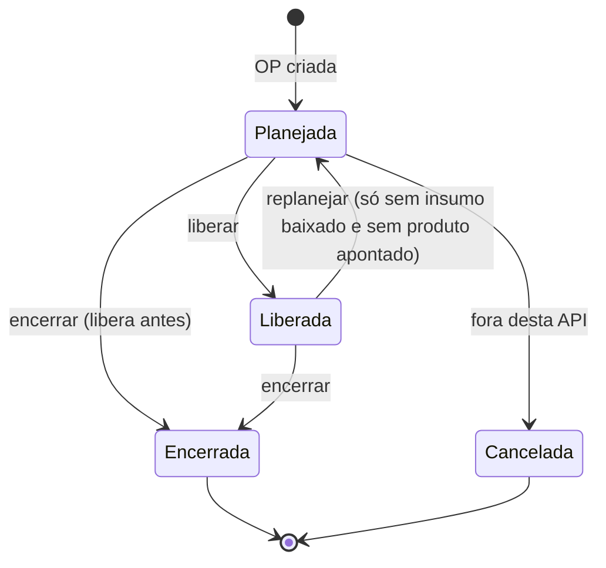
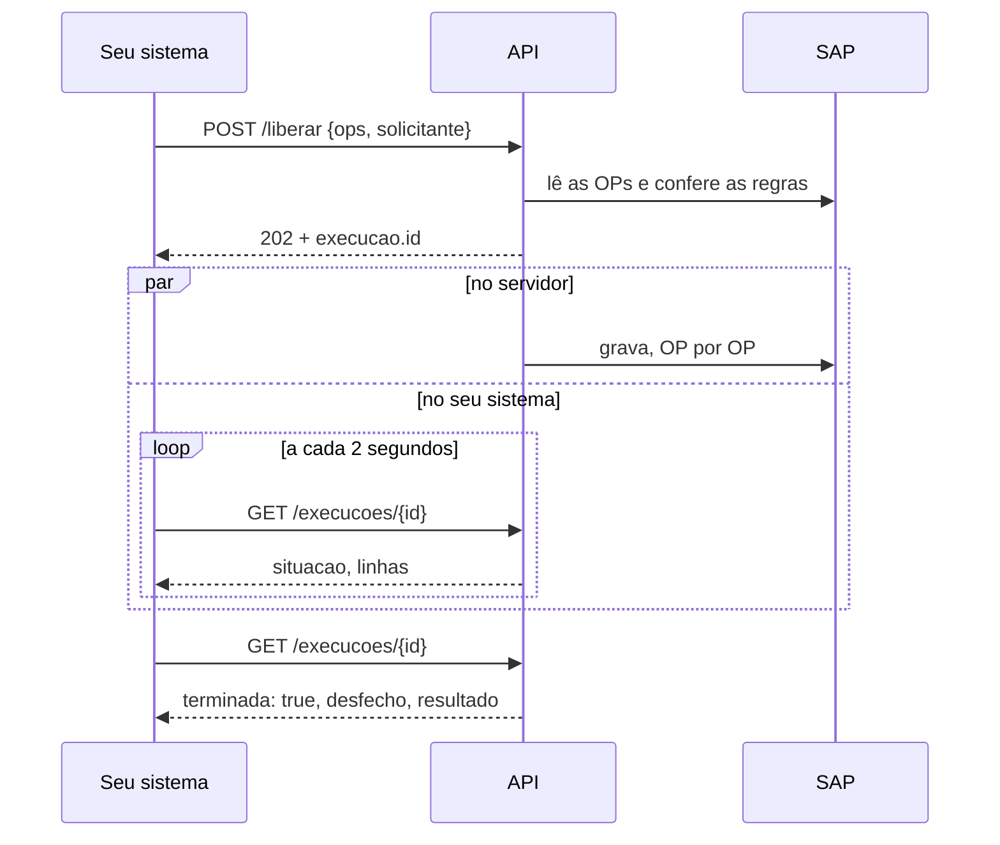

# API da Manutenção de OP — guia de uso

Guia para quem vai ligar um sistema, um script ou uma ferramenta interna à **Manutenção de OP**
do Controle de Produção. Com ela você:

- **busca** as Ordens de Produção (OPs) de um pedido de venda;
- **libera** OPs (Planejada → Liberada);
- **replaneja** OPs (Liberada → Planejada);
- **encerra** OPs **com movimentação de estoque** (saída dos insumos + entrada do produto);
- **acompanha** e **interrompe** o que mandou fazer.

**Quem pode usar:** qualquer pessoa ou sistema que tenha a **chave da API**, de dentro da rede
da empresa. Não é preciso cadastro: com a chave, é só chamar.

**De onde vêm as regras:** a API não tem regra própria. Ela chama as **mesmas funções da tela**
Manutenção de OP, com as mesmas recusas e as **mesmas mensagens** — o que a tela recusa, a API
recusa com a mesma frase.

> ⚠️ **Tudo o que a API grava vai direto para o SAP de produção.** Não existe ambiente de teste.
> Antes de gravar qualquer coisa, leia a [seção 9 — Como testar sem estragar nada](#9-como-testar-sem-estragar-nada).

---

## Sumário

1. [O que você precisa](#1-o-que-você-precisa)
2. [Primeiros passos: sua primeira chamada](#2-primeiros-passos-sua-primeira-chamada)
3. [Conceitos que você precisa conhecer](#3-conceitos-que-você-precisa-conhecer)
4. [Chave, solicitante e chamadas pelo navegador](#4-chave-solicitante-e-chamadas-pelo-navegador)
5. [Receitas passo a passo](#5-receitas-passo-a-passo) —
   [liberar](#51-liberar-ops) · [replanejar](#52-replanejar-ops) · [encerrar](#53-encerrar-ops) ·
   [acompanhar](#54-acompanhar-uma-execução) · [interromper](#55-interromper-uma-execução)
6. [Quando dá errado: erros e como tratar](#6-quando-dá-errado-erros-e-como-tratar)
7. [Referência rápida](#7-referência-rápida)
8. [Exemplos completos de código](#8-exemplos-completos-de-código) — Python, PowerShell, JavaScript
9. [Como testar sem estragar nada](#9-como-testar-sem-estragar-nada)
10. [Boas práticas](#10-boas-práticas)
11. [Perguntas frequentes](#11-perguntas-frequentes)
12. [E a API da porta 8077?](#12-e-a-api-da-porta-8077)
13. [Suporte e histórico deste documento](#13-suporte-e-histórico-deste-documento)

---

## 1. O que você precisa

| O quê | Detalhe |
| --- | --- |
| **Endereço** | `http://192.168.7.11:8080/api/manutencao-op` |
| **Rede** | Só funciona **de dentro da rede da empresa**. De fora, a conexão é recusada. |
| **Chave** | Peça ao Marcelo (TI). Ela vai no cabeçalho `X-API-Key` de toda chamada. |
| **Formato** | JSON na ida e na volta, em UTF-8. |
| **Ferramenta** | Qualquer uma que faça HTTP: `curl`, PowerShell, Python, JavaScript, Postman… |

Neste guia, `SUA_CHAVE` é onde vai a chave de verdade.

---

## 2. Primeiros passos: sua primeira chamada

Três chamadas que **não gravam nada**. Faça nesta ordem.

### Passo 1 — o servidor está no ar?

Esta é a única rota que funciona sem chave.

```bash
curl http://192.168.7.11:8080/health
```

```powershell
Invoke-RestMethod http://192.168.7.11:8080/health
```

Resposta:

```json
{
  "ok": true,
  "servico": "controleproducao",
  "producao": true,
  "company_db": "SBOALTAMIRAPROD",
  "tarefas_ativas": 0,
  "gravacoes_pendentes": 0,
  "ocupado": false,
  "chave_configurada": true,
  "historico": "supabase"
}
```

`"ok": true` quer dizer que o servidor está no ar. `"producao": true` lembra que ele grava no
SAP de produção. `"ocupado": true` quer dizer que há uma execução rodando agora no Controle de
Produção.

Se não houver resposta, você está fora da rede da empresa ou o servidor está parado.

### Passo 2 — buscar as OPs de um pedido

Troque `83955` pelo número de um pedido de venda de verdade (o número que aparece no SAP).

```bash
curl "http://192.168.7.11:8080/api/manutencao-op/pedidos/83955/ops" -H "X-API-Key: SUA_CHAVE"
```

```powershell
$headers = @{ 'X-API-Key' = 'SUA_CHAVE' }
Invoke-RestMethod 'http://192.168.7.11:8080/api/manutencao-op/pedidos/83955/ops' -Headers $headers
```

Resposta (dados fictícios):

```json
{
  "ok": true,
  "pedido": 83955,
  "total": 4,
  "ops": [
    {
      "op": 129852,
      "status": "R",
      "status_desc": "Liberada",
      "item": "PPLCOLGALVA3000000#0#0#0",
      "produto": "COLUNA GALVANIZADA 3000",
      "planejada": 8,
      "apontada": 3,
      "restante": 5,
      "baixada": 6.5,
      "data_pedido": "2026-09-22",
      "data_inicio": "2026-09-23",
      "data_vencimento": "2026-10-06",
      "cliente_codigo": "C000123",
      "cliente": "CLIENTE EXEMPLO LTDA",
      "acoes_possiveis": ["encerrar"]
    },
    {
      "op": 129851,
      "status": "R",
      "status_desc": "Liberada",
      "item": "PPLLONGGALVA2000000#0#0#800",
      "produto": "LONGARINA GALVANIZADA 2000",
      "planejada": 24,
      "apontada": 0,
      "restante": 24,
      "baixada": 0,
      "data_pedido": "2026-09-22",
      "data_inicio": "2026-09-23",
      "data_vencimento": "2026-10-06",
      "cliente_codigo": "C000123",
      "cliente": "CLIENTE EXEMPLO LTDA",
      "acoes_possiveis": ["replanejar", "encerrar"]
    },
    {
      "op": 129850,
      "status": "P",
      "status_desc": "Planejada",
      "item": "PPLPRTGALVA175000000#0#0#1050",
      "produto": "PORTA PALETE GALVANIZADO 1750",
      "planejada": 12,
      "apontada": 0,
      "restante": 12,
      "baixada": 0,
      "data_pedido": "2026-09-22",
      "data_inicio": "2026-09-23",
      "data_vencimento": "2026-10-06",
      "cliente_codigo": "C000123",
      "cliente": "CLIENTE EXEMPLO LTDA",
      "acoes_possiveis": ["liberar", "encerrar"]
    },
    {
      "op": 129849,
      "status": "L",
      "status_desc": "Encerrada",
      "item": "PPLCALCO10000000#0#0#0",
      "produto": "CALCO DE PROTECAO 100",
      "planejada": 4,
      "apontada": 4,
      "restante": 0,
      "baixada": 4,
      "data_pedido": "2026-09-22",
      "data_inicio": "2026-09-23",
      "data_vencimento": "2026-10-06",
      "cliente_codigo": "C000123",
      "cliente": "CLIENTE EXEMPLO LTDA",
      "acoes_possiveis": []
    }
  ]
}
```

O que cada campo quer dizer:

| Campo | O que é |
| --- | --- |
| `op` | O número da OP no SAP (DocNum) — é o que você manda nas outras chamadas |
| `status`, `status_desc` | `P` Planejada · `R` Liberada · `L` Encerrada (seção 3) |
| `item`, `produto` | O código e o nome do que a OP produz |
| `planejada` | Quanto a OP deve produzir |
| `apontada` | Quanto já entrou no estoque como produto pronto |
| `restante` | `planejada − apontada` |
| `baixada` | Quanto de insumo já saiu do estoque para esta OP |
| `data_pedido`, `data_inicio`, `data_vencimento` | Datas (AAAA-MM-DD) |
| `cliente_codigo`, `cliente` | O cliente do pedido |
| `acoes_possiveis` | **O que dá para fazer com esta OP agora** — veja o passo 3 |

As OPs vêm da maior para a menor. OPs **Canceladas não aparecem** na busca.

### Passo 3 — ler `acoes_possiveis`

É o campo mais útil da API. Ele já vem calculado com as mesmas regras que as ações aplicam,
então você não precisa reimplementar nada — use-o para mostrar ou esconder botões:

| Situação da OP | `acoes_possiveis` | No exemplo acima |
| --- | --- | --- |
| Planejada, com produção a fazer | `["liberar", "encerrar"]` | 129850 |
| Planejada, já toda apontada | `["liberar"]` | — |
| Liberada, sem insumo baixado e sem produto apontado | `["replanejar", "encerrar"]` | 129851 |
| Liberada, com insumo baixado ou produto apontado | `["encerrar"]` (ou `[]` se já toda apontada) | 129852 |
| Encerrada | `[]` | 129849 |

Pronto: você já sabe ler o estado das OPs. As próximas seções explicam o que acontece quando
você manda fazer alguma coisa.

---

## 3. Conceitos que você precisa conhecer

### Pedido e OP

Um **pedido de venda** gera uma ou mais **Ordens de Produção** (OPs) — uma para cada coisa a
fabricar. Uma OP pode precisar do produto de outra: a OP de um porta-palete consome as
longarinas que outra OP fabrica. Aqui, a que fornece é a **filha**, e a que consome é a **mãe**.

### DocNum × DocEntry — dois números para a mesma OP

O SAP guarda dois números para cada documento:

| | O que é | Exemplo |
| --- | --- | --- |
| **DocNum** | O número que aparece na tela do SAP. É o que as pessoas falam. | OP `129850` |
| **DocEntry** | A chave interna do banco. | `131431` |

**Esta API só aceita DocNum**, tanto de OP quanto de pedido. O DocEntry aparece em algumas
respostas só para conferência.

### A vida de uma OP



| Status | Letra | O que quer dizer |
| --- | --- | --- |
| Planejada | `P` | A OP existe, mas a fábrica ainda não pode apontar produção nela |
| Liberada | `R` | Liberada para produzir: pode ter insumo baixado e produto apontado |
| Encerrada | `L` | Terminou. Não muda mais |
| Cancelada | `C` | Cancelada. Não muda mais e não aparece na busca |

Encerrada e Cancelada são **finais**: nenhuma ação da API mexe nelas.

### Saída de insumo e entrada de produto

- **Saída de insumo** (`baixada`): a matéria-prima que saiu do estoque para a OP.
- **Entrada de produto** (`apontada`): o produto pronto que entrou no estoque pela OP.

Esses dois lançamentos movimentam **estoque de verdade**. Por isso uma OP que já tem qualquer
um deles não volta para Planejada: o estoque ficaria movimentado numa OP que "ainda não começou".
O lançamento precisa ser cancelado no SAP antes.

### Execução em segundo plano

Liberar, Replanejar e Encerrar **não respondem com o resultado**. Eles respondem na hora com um
**id de execução** (HTTP `202`) e continuam trabalhando no servidor. Você consulta o andamento
por esse id até a execução terminar.



Por que assim: encerrar dezenas de OPs leva **minutos** (cerca de quatro chamadas ao SAP por
OP). Nenhuma conexão HTTP deveria ficar aberta esse tempo todo.

### Uma execução por vez

O módulo Manutenção de OP roda **uma execução por vez — somando a tela e a API**. Se alguém
estiver liberando OPs pela tela, a sua chamada é recusada com `409 ocupado`, e a resposta diz
qual execução está rodando. Duas execuções ao mesmo tempo disputariam as mesmas OPs.

### Solicitante

Toda chamada que grava pede o campo `solicitante`: **quem pediu** a operação. Ele aparece no
histórico da tela **Execuções** ("por joao.silva · API") e no log do servidor. Detalhes na
[seção 4](#4-chave-solicitante-e-chamadas-pelo-navegador).

### O plano e o token do Encerrar

Encerrar é **irreversível**, então tem duas etapas:

1. **conferir** — a API calcula o que vai acontecer com cada OP, em que ordem, e devolve esse
   **plano** com um **token**. Nada é gravado.
2. **executar** — você manda o token, e a API faz exatamente o que o plano disse.

O token vale **10 minutos** e **uma vez só**. Entre as duas etapas, uma pessoa deve ver o plano.

---

## 4. Chave, solicitante e chamadas pelo navegador

### A chave

Toda chamada (menos o `/health`) leva o cabeçalho:

```
X-API-Key: SUA_CHAVE
```

- **Só o cabeçalho vale.** Chave na URL (`?key=...`) é recusada: ela iria parar em logs.
- Sem chave, ou com a chave errada: `401 sem_chave`.
- **Trate a chave como uma senha.** Ela é a mesma que abre as telas do Controle de Produção,
  o painel WBC e a API da porta 8077. Nunca a coloque no código-fonte, num repositório, numa
  planilha compartilhada ou numa mensagem de grupo. Guarde em variável de ambiente ou num cofre
  de senhas.

### O solicitante

Obrigatório em toda chamada que grava (Liberar, Replanejar, Encerrar) e no Interromper:

```json
{"ops": [129850], "solicitante": "joao.silva"}
```

- **É a pessoa, não o sistema.** Mande quem apertou o botão no seu sistema. É o que aparece
  quando alguém perguntar "quem encerrou esta OP?".
- De 1 a 80 caracteres, sem quebra de linha. Acentos podem.
- O servidor não tem como conferir (a chave é uma só): é o que você declara. Não mande senha,
  e-mail pessoal nem nada que não possa aparecer num log.

### Chamando pelo navegador

A API aceita chamadas de páginas web de **qualquer origem** (CORS aberto, sem cookies). Uma
página em outro servidor da rede pode chamar a API com `fetch` normalmente.

⚠️ **Mas, numa página, a chave fica visível** para quem abrir as ferramentas do navegador. Só
faça isso numa ferramenta interna usada por quem já poderia ter a chave. Para um sistema usado
por muita gente, o certo é o **seu servidor** chamar a API e guardar a chave.

---

## 5. Receitas passo a passo

As receitas usam o pedido fictício da [seção 2](#passo-2--buscar-as-ops-de-um-pedido).

### 5.1 Liberar OPs

**Objetivo:** passar OPs de Planejada para Liberada, para a fábrica poder produzir.

**1. Descubra quais OPs podem ser liberadas** — as que têm `"liberar"` em `acoes_possiveis`:

```bash
curl "http://192.168.7.11:8080/api/manutencao-op/pedidos/83955/ops" -H "X-API-Key: SUA_CHAVE"
```

No exemplo, só a 129850.

**2. Mande liberar:**

```bash
curl -X POST "http://192.168.7.11:8080/api/manutencao-op/liberar" \
     -H "X-API-Key: SUA_CHAVE" -H "Content-Type: application/json" \
     -d '{"ops": [129850, 129851], "solicitante": "joao.silva"}'
```

| Campo | Obrigatório | O que é |
| --- | --- | --- |
| `ops` | sim | Lista de números de OP (DocNum). Número ou texto só com dígitos |
| `solicitante` | sim | Quem pediu |

Aqui mandamos também a 129851, que já está Liberada, para você ver o que acontece com ela.

**3. A resposta chega na hora — `202`, a execução começou:**

```json
{
  "ok": true,
  "execucao": {
    "id": "8a83805e6ea4",
    "nome": "Liberar OPs",
    "descricao": "129850, 129851",
    "situacao": "na fila",
    "terminada": false,
    "com_falhas": false,
    "desfecho": "fila",
    "passo": "",
    "passos_feitos": 0,
    "passos_total": 0,
    "percentual": null,
    "criada_em": "2026-09-29T14:57:49",
    "duracao_segundos": null,
    "linhas": [],
    "resultado": null,
    "erro": null,
    "solicitante": "joao.silva",
    "origem": "api",
    "parada_pedida": false,
    "estado": "/api/manutencao-op/execucoes/8a83805e6ea4"
  }
}
```

Guarde o `estado`: é o endereço para acompanhar.

**4. Acompanhe até `terminada` ser `true`** (a cada 2 segundos):

```bash
curl "http://192.168.7.11:8080/api/manutencao-op/execucoes/8a83805e6ea4" -H "X-API-Key: SUA_CHAVE"
```

**5. Leia o resultado:**

```json
{
  "ok": true,
  "execucao": {
    "id": "8a83805e6ea4",
    "nome": "Liberar OPs",
    "descricao": "129850, 129851",
    "situacao": "concluída",
    "terminada": true,
    "com_falhas": false,
    "desfecho": "ok",
    "passo": "1 alterada(s), 0 com erro, 1 ignorada(s).",
    "passos_feitos": 2,
    "passos_total": 2,
    "percentual": 100,
    "criada_em": "2026-09-29T14:57:49",
    "duracao_segundos": 1.2,
    "linhas": [
      "14:57:49  Liberar OPs: 2 OP(s)…",
      "14:57:49    OP 129850 (item PPLPRTGALVA175000000#0#0#1050): Planejada -> Liberada.",
      "14:57:49    OP 129851 já estava Liberada — nada a fazer.",
      "14:57:50  1 alterada(s), 0 com erro, 1 ignorada(s)."
    ],
    "resultado": {
      "alteradas": [
        {"doc_entry": 131431, "doc_num": 129850, "status": "P", "item_code": "PPLPRTGALVA175000000#0#0#1050",
         "planejada": 12.0, "apontada": 0.0, "pedido": 83955, "baixada": 0.0}
      ],
      "com_erro": [],
      "ignoradas": [
        {"doc_entry": 131432, "doc_num": 129851, "status": "R", "item_code": "PPLLONGGALVA2000000#0#0#800",
         "planejada": 24.0, "apontada": 0.0, "pedido": 83955, "baixada": 0.0,
         "motivo": "OP 129851 já estava Liberada — nada a fazer."}
      ],
      "destino": {"sl": "boposReleased", "owor": "R", "nome": "Liberada"}
    },
    "erro": null,
    "solicitante": "joao.silva",
    "origem": "api",
    "parada_pedida": false,
    "estado": "/api/manutencao-op/execucoes/8a83805e6ea4"
  }
}
```

| Lista do `resultado` | O que tem |
| --- | --- |
| `alteradas` | OPs que mudaram de status |
| `ignoradas` | OPs que não precisavam de nada, com o `motivo` |
| `com_erro` | OPs que o SAP recusou, com o `motivo`. As outras seguem normalmente |
| `destino` | Para onde as OPs foram (`nome` é o que interessa) |

Em cada OP, `status` é o que ela tinha **antes** da execução.

**Regras do Liberar:**

- **Repetir é seguro.** OP que já está Liberada vai para `ignoradas` e não é regravada.
- **Um número errado recusa tudo.** Se algum número não existir no SAP, nada é feito
  (`404 nao_encontrada`, com os números em `detalhes`) — um erro de digitação não some no meio
  das outras.
- **Uma OP final recusa tudo.** Se alguma OP estiver Encerrada ou Cancelada, nada é feito
  (`409 status_terminal`). Isso quer dizer que a lista mudou desde a sua busca: busque de novo.
- Para liberar **todas** as OPs de um pedido: busque e mande os números com `"liberar"`.

### 5.2 Replanejar OPs

**Objetivo:** voltar OPs de Liberada para Planejada — por exemplo, quando foram liberadas cedo
demais.

**A regra que importa:** só volta a OP que **não tem insumo baixado nem produto apontado**. É
exatamente quando `acoes_possiveis` traz `"replanejar"`. No exemplo, só a 129851.

```bash
curl -X POST "http://192.168.7.11:8080/api/manutencao-op/replanejar" \
     -H "X-API-Key: SUA_CHAVE" -H "Content-Type: application/json" \
     -d '{"ops": [129851], "solicitante": "joao.silva"}'
```

Mesmo corpo, mesma resposta (`202`) e mesmo acompanhamento do Liberar. No fim:

```jsonc
// trecho do estado final
"passo": "1 alterada(s), 0 com erro.",
"linhas": [
  "14:57:49  Replanejar OPs: 1 OP(s)…",
  "14:57:49    OP 129851 (item PPLLONGGALVA2000000#0#0#800): Liberada -> Planejada.",
  "14:57:49  1 alterada(s), 0 com erro."
],
"resultado": {
  "alteradas": [{"doc_num": 129851, "status": "R" /* …os mesmos campos do Liberar */}],
  "com_erro": [],
  "ignoradas": [],
  "destino": {"sl": "boposPlanned", "owor": "P", "nome": "Planejada"}
}
```

**Se alguma OP tiver insumo baixado, nada é feito** — o lote inteiro é recusado antes de
chegar ao SAP:

```bash
curl -X POST "http://192.168.7.11:8080/api/manutencao-op/replanejar" \
     -H "X-API-Key: SUA_CHAVE" -H "Content-Type: application/json" \
     -d '{"ops": [129851, 129852], "solicitante": "joao.silva"}'
```

```json
{
  "ok": false,
  "tipo": "saida_lancada",
  "motivo": "1 OP(s) já têm saída de insumo lançada e não podem voltar para Planejada — a saída precisa ser cancelada no SAP antes. Nenhuma OP foi alterada.",
  "detalhes": [{"op": 129852, "item": "PPLCOLGALVA3000000#0#0#0", "baixado": 6.5}]
}
```

**Com produto apontado, a mesma coisa**, com outro `tipo`:

```json
{
  "ok": false,
  "tipo": "entrada_lancada",
  "motivo": "1 OP(s) já têm produto apontado (entrada lançada) e não podem voltar para Planejada — a entrada precisa ser cancelada no SAP antes. Nenhuma OP foi alterada.",
  "detalhes": [{"op": 129854, "item": "PPLTRAVGALVA1000000#0#0#0", "apontado": 2.0}]
}
```

O insumo é conferido primeiro: uma OP com os dois lançamentos vem em `saida_lancada`. Se o
servidor não conseguir saber quanto foi baixado, a OP também é recusada
(`"baixado": "desconhecido"`) — na dúvida, não grava.

**Regras do Replanejar:** as mesmas do Liberar (repetir é seguro, número errado ou OP final
recusam tudo), mais a do estoque acima. Desde 29/09/2026 o Replanejar também está na tela
Manutenção de OP, com a mesma regra e a mesma trava de uma execução por vez.

### 5.3 Encerrar OPs

**Objetivo:** fechar OPs **lançando o estoque**: para cada OP, a API faz a **saída dos
insumos**, a **entrada do produto** e encerra.

> ⚠️ **Irreversível.** Desfazer é cancelar a entrada e a saída no SAP, à mão.
> **Não use para "fechar só o status"** de OPs cuja produção não passou pelo SAP: o Encerrar
> baixaria insumo e daria entrada de produto com a data de hoje.

#### Etapa 1 — conferir (não grava nada)

Mande **o pedido** (todas as OPs dele) **ou** uma lista de **OPs** — um dos dois, nunca ambos:

```bash
# todas as OPs de um pedido
curl -X POST "http://192.168.7.11:8080/api/manutencao-op/encerrar/conferir" \
     -H "X-API-Key: SUA_CHAVE" -H "Content-Type: application/json" \
     -d '{"pedido": 83955}'

# só algumas OPs
curl -X POST "http://192.168.7.11:8080/api/manutencao-op/encerrar/conferir" \
     -H "X-API-Key: SUA_CHAVE" -H "Content-Type: application/json" \
     -d '{"ops": [129850, 129851]}'
```

A conferência não pede `solicitante`: ela não grava.

Resposta — o **plano** do pedido 83955:

```json
{
  "ok": true,
  "plano": {
    "token": "ewrCGWlH_UeIvDyhsMqn87X9YUUuFTHI",
    "operacao": "Encerrar OPs do pedido 83955",
    "valido_ate": "2026-09-29T15:08:14",
    "resumo": {"a_encerrar": 3, "a_liberar_antes": 1, "listadas": 4},
    "itens": [
      {"ordem": 1, "op": 129849, "doc_entry": 131430, "item": "PPLCALCO10000000#0#0#0",
       "planejada": 4, "apontada": 4, "status": "L", "status_atual": "Encerrada",
       "acao": "já encerrada — ignorada", "processar": false},
      {"ordem": 2, "op": 129851, "doc_entry": 131432, "item": "PPLLONGGALVA2000000#0#0#800",
       "planejada": 24, "apontada": 0, "status": "R", "status_atual": "Liberada",
       "acao": "saída + entrada + encerrar", "processar": true},
      {"ordem": 3, "op": 129852, "doc_entry": 131433, "item": "PPLCOLGALVA3000000#0#0#0",
       "planejada": 8, "apontada": 3, "status": "R", "status_atual": "Liberada",
       "acao": "saída + entrada + encerrar", "processar": true},
      {"ordem": 4, "op": 129850, "doc_entry": 131431, "item": "PPLPRTGALVA175000000#0#0#1050",
       "planejada": 12, "apontada": 0, "status": "P", "status_atual": "Planejada",
       "acao": "LIBERAR + saída + entrada + encerrar", "processar": true}
    ]
  }
}
```

Como ler o plano:

- **`resumo`**: 3 OPs serão encerradas; 1 delas está Planejada e será **liberada antes**; 4 foram
  listadas (inclui a ignorada).
- **`ordem`** é a ordem em que a execução vai trabalhar. Ela é **calculada, não escolhida**:
  a filha antes da mãe. A 129850 (porta-palete) consome a longarina que a 129851 fabrica, então
  a 129851 vem antes — senão a saída de insumo da mãe não acharia o produto da filha no estoque.
- **`acao`** diz o que acontece com cada OP, e **`processar`** diz se ela entra na execução:

  | Situação da OP | `acao` | `processar` |
  | --- | --- | --- |
  | Planejada, com produção a fazer | `LIBERAR + saída + entrada + encerrar` | `true` |
  | Liberada, com produção a fazer | `saída + entrada + encerrar` | `true` |
  | Já toda apontada | `ignorada (apontada = planejada)` | `false` |
  | Encerrada | `já encerrada — ignorada` | `false` |
  | Cancelada | `cancelada — não pode ser encerrada` | `false` |

  A OP Planejada é liberada antes porque o SAP só aceita apontar produção em OP Liberada.

#### Etapa 2 — mostrar o plano a uma pessoa

**É para isso que o plano existe.** Mostre a lista, a ordem e a `acao` de cada OP, e só siga
se a pessoa confirmar. Para desistir, não faça nada: o token vence sozinho em 10 minutos.

#### Etapa 3 — executar

```bash
curl -X POST "http://192.168.7.11:8080/api/manutencao-op/encerrar/executar" \
     -H "X-API-Key: SUA_CHAVE" -H "Content-Type: application/json" \
     -d '{"token": "ewrCGWlH_UeIvDyhsMqn87X9YUUuFTHI", "solicitante": "pcp.ana"}'
```

Resposta `202`, igual à do Liberar, com `"nome": "Encerrar OPs do pedido 83955"`. Só entram
as OPs com `processar: true`, **na ordem do plano**. Acompanhe pelo `estado`.

**Quando tudo dá certo:**

```json
{
  "ok": true,
  "execucao": {
    "id": "0277b20f5bfc",
    "nome": "Encerrar OPs do pedido 83955",
    "descricao": "3 OP(s)",
    "situacao": "concluída",
    "terminada": true,
    "com_falhas": false,
    "desfecho": "ok",
    "passo": "3 encerrada(s), 0 com erro, 0 pulada(s).",
    "passos_feitos": 3,
    "passos_total": 3,
    "percentual": 100,
    "criada_em": "2026-09-29T14:58:14",
    "duracao_segundos": 14.8,
    "linhas": [
      "14:58:14  Encerrando 3 OP(s), filha antes da mãe…",
      "14:58:18    OP 129851 (item PPLLONGGALVA2000000#0#0#800): Liberada -> Encerrada.",
      "14:58:18    OP 129851 encerrada com movimentação de estoque.",
      "14:58:23    OP 129852 (item PPLCOLGALVA3000000#0#0#0): Liberada -> Encerrada.",
      "14:58:23    OP 129852 encerrada com movimentação de estoque.",
      "14:58:28    OP 129850 (item PPLPRTGALVA175000000#0#0#1050): Liberada -> Encerrada.",
      "14:58:28    OP 129850 encerrada com movimentação de estoque.",
      "14:58:28  OP 129851: saída=90412, entrada=70233",
      "14:58:28  OP 129852: saída=90413, entrada=70234",
      "14:58:28  OP 129850: saída=90414, entrada=70235 (liberada antes)",
      "14:58:28  3 encerrada(s), 0 com erro, 0 pulada(s)."
    ],
    "resultado": {
      "finalizadas": [
        {"doc_entry": 131432, "doc_num": 129851, "status": "R", "item_code": "PPLLONGGALVA2000000#0#0#800",
         "planejada": 24.0, "apontada": 0.0, "pedido": 83955, "baixada": 0.0,
         "foi_liberada": false, "saida_docentry": 90412, "entrada_docentry": 70233},
        {"doc_entry": 131433, "doc_num": 129852, "status": "R", "item_code": "PPLCOLGALVA3000000#0#0#0",
         "planejada": 8.0, "apontada": 3.0, "pedido": 83955, "baixada": 6.5,
         "foi_liberada": false, "saida_docentry": 90413, "entrada_docentry": 70234},
        {"doc_entry": 131431, "doc_num": 129850, "status": "R", "item_code": "PPLPRTGALVA175000000#0#0#1050",
         "planejada": 12.0, "apontada": 0.0, "pedido": 83955, "baixada": 0.0,
         "foi_liberada": true, "saida_docentry": 90414, "entrada_docentry": 70235}
      ],
      "com_erro": [],
      "ignoradas": [],
      "puladas": [],
      "interrompidas": []
    },
    "erro": null,
    "solicitante": "pcp.ana",
    "origem": "api",
    "parada_pedida": false,
    "estado": "/api/manutencao-op/execucoes/0277b20f5bfc"
  }
}
```

**Quando uma OP falha** (aqui, faltou longarina no estoque para a 129850):

```jsonc
// trecho do estado final
"situacao": "concluída",
"com_falhas": true,
"desfecho": "falhas",
"passo": "1 encerrada(s), 1 com erro, 0 pulada(s).",
"linhas": [
  "14:58:14  Encerrando 2 OP(s), filha antes da mãe…",
  "14:58:18    OP 129851 (item PPLLONGGALVA2000000#0#0#800): Liberada -> Encerrada.",
  "14:58:18    OP 129851 encerrada com movimentação de estoque.",
  "14:58:19    OP 129850 devolvida para Planejada (nada foi lançado).",
  "14:58:19    OP 129850 falhou em 'saída de insumo': Quantidade insuficiente para o item 'PPLLONGGALVA2000000#0#0#800' no depósito 01",
  "14:58:19  OP 129851: saída=90420, entrada=70240",
  "14:58:19  OP 129850: ERRO em 'saída de insumo' — Quantidade insuficiente para o item 'PPLLONGGALVA2000000#0#0#800' no depósito 01",
  "14:58:19  1 encerrada(s), 1 com erro, 0 pulada(s)."
],
"resultado": {
  "finalizadas": [{"doc_num": 129851, "saida_docentry": 90420, "entrada_docentry": 70240 /* … */}],
  "com_erro": [
    {"doc_num": 129850, "foi_liberada": true, "etapa": "saída de insumo",
     "motivo": "Quantidade insuficiente para o item 'PPLLONGGALVA2000000#0#0#800' no depósito 01",
     "liberacao": "desfeita" /* … */}
  ],
  "ignoradas": [], "puladas": [], "interrompidas": []
}
```

Repare: `situacao` diz `concluída`, mas `desfecho` diz `falhas`. **Leia sempre o `desfecho`**
([seção 5.4](#54-acompanhar-uma-execução)).

O que vem no `resultado` do Encerrar:

| Lista | O que tem |
| --- | --- |
| `finalizadas` | OPs encerradas. `saida_docentry` e `entrada_docentry` são os documentos de estoque criados no SAP (`saida_docentry` vem `null` quando não havia insumo a baixar); `foi_liberada` diz se a OP estava Planejada e foi liberada antes |
| `com_erro` | OPs que falharam: `etapa` (onde parou), `motivo` e, se a OP tinha sido liberada pela execução, `liberacao` |
| `puladas` | OPs que **dependiam** de uma que falhou. Não foram tentadas: faltaria o insumo que a outra produziria |
| `ignoradas` | OPs sem nada a fazer, com o `motivo` |
| `interrompidas` | OPs que **não começaram** porque alguém interrompeu ([seção 5.5](#55-interromper-uma-execução)) |

No Encerrar, o `status` de cada OP é o do meio da cadeia (uma OP liberada pela execução aparece
`R`). Para saber o que ela era antes, use `foi_liberada`.

`liberacao` numa OP com erro diz em que estado ela ficou:

| `liberacao` | Quer dizer | O que fazer |
| --- | --- | --- |
| `"desfeita"` | Nada foi lançado e a OP voltou para Planejada | Resolver a causa (ex.: estoque) e conferir de novo |
| `"mantida (saída já lançada)"` | ⚠️ **A saída de insumo já foi lançada** e a OP ficou Liberada | A saída precisa ser **cancelada no SAP** antes de qualquer outra coisa nessa OP |
| `"falhou (...)"` | Nada foi lançado, mas a OP ficou Liberada (a volta para Planejada falhou) | Replanejar a OP, se for o caso |

**Regras do token:**

- Vale **10 minutos** e **uma vez só**. Reiniciar o servidor também o invalida.
- Só é gasto **quando a execução começa**. Se a chamada for recusada por `409 ocupado`, por
  faltar `solicitante` (`400`) ou por escrita desligada (`503`), o token continua valendo.
- Token vencido, já usado ou desconhecido: `409 confirmacao_invalida` — confira de novo.
- Repetir o Encerrar com o mesmo token **não é possível**, de propósito.

### 5.4 Acompanhar uma execução

```bash
curl "http://192.168.7.11:8080/api/manutencao-op/execucoes/8a83805e6ea4" -H "X-API-Key: SUA_CHAVE"
```

Consulte **a cada 2 segundos** e pare quando `terminada` for `true`. Mais rápido que isso não
adianta.

| Campo | O que é |
| --- | --- |
| `id`, `nome`, `descricao` | A execução |
| `terminada` | `true` quando acabou, de qualquer jeito |
| `desfecho` | **O campo a ler** para saber como terminou (tabela abaixo) |
| `situacao` | `na fila` · `executando` · `concluída` · `erro` · `cancelada` |
| `com_falhas` | Terminou, mas alguma OP está em `resultado.com_erro` |
| `passo` | Uma frase sobre o que está fazendo (ou o resumo final) |
| `linhas` | O log da execução, uma linha por passo (até 500). **É o melhor andamento em tempo real.** É texto para pessoas: mostre, não interprete no código |
| `passos_feitos`, `passos_total`, `percentual` | Progresso. Nestas operações ele só muda no fim; use `linhas` |
| `resultado` | O que foi feito ([5.1](#51-liberar-ops), [5.2](#52-replanejar-ops), [5.3](#53-encerrar-ops)). `null` enquanto roda |
| `erro` | A mensagem, quando `desfecho` é `erro` |
| `criada_em`, `duracao_segundos` | Quando começou (hora de Brasília, sem fuso) e quanto durou |
| `solicitante`, `origem` | Quem pediu, e `api` ou `tela` |
| `parada_pedida` | `true` depois de um pedido de interrupção, enquanto a OP em curso termina |
| `estado` | O endereço desta mesma consulta |

**Como ler o `desfecho`:**

| `desfecho` | Quer dizer | O que fazer |
| --- | --- | --- |
| `fila` | Ainda não começou | Esperar |
| `rodando` | Trabalhando | Esperar |
| `ok` | Terminou e deu tudo certo | Seguir |
| `falhas` | Terminou, mas alguma OP falhou | Mostrar `resultado.com_erro` |
| `erro` | A execução quebrou no meio | Mostrar `erro` e as `linhas`; avisar o TI se repetir |
| `cancelada` | Alguém interrompeu | Ver `resultado` (o que chegou a ser feito) |

⚠️ **`situacao: "concluída"` não quer dizer que deu tudo certo** — só que a execução não quebrou.
Por isso o campo a ler é o `desfecho`.

Depois de terminar, a execução continua consultável: o servidor guarda **as 30 mais recentes**,
e elas sobrevivem a um reinício. Mais antiga que isso: `404`. Esta rota só enxerga execuções da
Manutenção de OP.

### 5.5 Interromper uma execução

```bash
curl -X POST "http://192.168.7.11:8080/api/manutencao-op/execucoes/0277b20f5bfc/cancelar" \
     -H "X-API-Key: SUA_CHAVE" -H "Content-Type: application/json" \
     -d '{"solicitante": "pcp.ana"}'
```

Resposta:

```json
{"ok": true, "cancelada": true, "entre_etapas": true}
```

`cancelada` é `false` se a execução já tinha terminado. `entre_etapas` diz como ela vai parar:

- **Encerrar** (`entre_etapas: true`): **a OP em curso termina** a cadeia inteira (saída →
  entrada → encerra) e as próximas **não começam**. Elas aparecem em `resultado.interrompidas`,
  e a execução termina com `desfecho: "cancelada"`. Assim nunca sobra uma OP com o insumo
  baixado e o produto sem entrada. Se uma chamada ao SAP travar, a parada espera o tempo limite
  (até 60 segundos). Se o pedido chegar com a última OP já em andamento, nada fica de fora e a
  execução termina `ok`.
- **Liberar e Replanejar** (`entre_etapas: false`): param entre uma OP e outra.

⚠️ **Interromper não desfaz nada.** O que já foi gravado no SAP continua lá.

---

## 6. Quando dá errado: erros e como tratar

Todo erro vem no mesmo formato:

```json
{
  "ok": false,
  "tipo": "status_terminal",
  "motivo": "1 OP(s) selecionada(s) estão em status terminal (Encerrada ou Cancelada) e não admitem mudança. Nenhuma OP foi alterada — refaça a busca, porque a lista mudou desde que a tela foi carregada.",
  "detalhes": [{"op": 129849, "item": "PPLCALCO10000000#0#0#0", "status": "Encerrada"}]
}
```

- **`tipo`** — um código fixo. **Decida por ele** no seu código.
- **`motivo`** — uma frase pronta para mostrar ao usuário (a mesma da tela). O texto pode
  mudar; não compare texto.
- **`detalhes`** — quando existe, as OPs que causaram a recusa.

**Quando uma chamada que grava é recusada, nada foi gravado.** A recusa acontece antes de
chegar ao SAP, para o lote inteiro.

### Todos os códigos

| HTTP | `tipo` | O que aconteceu | O que fazer |
| --- | --- | --- | --- |
| `200` | — | Leitura, plano ou interrupção | Seguir |
| `202` | — | A execução começou | Acompanhar pelo `estado` |
| `400` | `invalido` | Corpo, número ou filtro inválido; `solicitante` ou `token` faltando; `ops` e `pedido` juntos | Corrigir a chamada (o `motivo` diz o quê) |
| `401` | `sem_chave` | `X-API-Key` faltando ou errada | Conferir a chave |
| `404` | `nao_encontrada` | Alguma OP não existe (números em `detalhes`); pedido sem OP; execução inexistente; rota errada | Conferir o número |
| `405` | `metodo_invalido` | `GET` onde é `POST`, ou o contrário | Corrigir a chamada |
| `409` | `status_terminal` | Liberar ou Replanejar com OP Encerrada ou Cancelada | Buscar de novo e mandar sem ela |
| `409` | `saida_lancada` | Replanejar com OP que tem insumo baixado (`detalhes` com o `baixado`) | Cancelar a saída no SAP, ou mandar sem ela |
| `409` | `entrada_lancada` | Replanejar com OP que tem produto apontado (`detalhes` com o `apontado`) | Cancelar a entrada no SAP, ou mandar sem ela |
| `409` | `ciclo` | Encerrar: OPs que dependem umas das outras em círculo | Encerrar uma a uma, ou corrigir a estrutura no SAP |
| `409` | `nada_a_encerrar` | Nenhuma OP em condição de encerrar (vem com os `itens` do plano) | Nada a fazer |
| `409` | `confirmacao_invalida` | Token vencido, já usado ou desconhecido | Conferir de novo |
| `409` | `ocupado` | Já há uma execução no módulo, da tela ou da API | Acompanhar essa; tentar depois |
| `502` | `sap_indisponivel` | O SAP não respondeu à leitura | Tentar de novo em instantes |
| `503` | `escrita_desabilitada` | A escrita está desligada no servidor | Avisar o TI |
| `503` | `historico_indisponivel` | O histórico de execuções não respondeu | Tentar de novo em instantes |

### Os erros mais comuns, com exemplo

**Esqueceu o `solicitante`** — `400`:

```json
{"ok": false, "tipo": "invalido", "motivo": "Informe 'solicitante': quem pediu a operação (nome ou login), até 80 caracteres. Ele vai para o log e para o histórico de Execuções."}
```

**Chave faltando ou errada** — `401`:

```json
{"ok": false, "tipo": "sem_chave", "motivo": "X-API-Key ausente ou incorreta."}
```

**Número de OP que não existe** — `404`, e nenhuma OP da lista foi tocada:

```json
{"ok": false, "tipo": "nao_encontrada", "motivo": "1 OP(s) informada(s) não existem no SAP: 999999. Nada foi feito — confira os números (DocNum).", "detalhes": [{"op": 999999}]}
```

**Alguém já está usando o módulo** — `409`, com a execução que está rodando:

```json
{
  "ok": false,
  "tipo": "ocupado",
  "motivo": "O módulo 'manutencao_op' já tem uma execução em andamento (Liberar OPs, iniciada às 12:05:54). Duas execuções simultâneas no mesmo módulo disputariam os mesmos pedidos e OPs.",
  "execucao_em_andamento": {
    "id": "2b5bcade16ec", "nome": "Liberar OPs", "descricao": "129850",
    "origem": "tela", "solicitante": null, "criada_em": "2026-09-29T12:05:54",
    "estado": "/api/manutencao-op/execucoes/2b5bcade16ec"
  }
}
```

Não tente de novo em laço: acompanhe a execução do `estado` e tente quando ela terminar.

**Token que já foi usado ou venceu** — `409`:

```json
{"ok": false, "tipo": "confirmacao_invalida", "motivo": "Confirmação inválida ou já utilizada. Refaça a conferência antes de executar — o que seria feito precisa ser recalculado."}
```

**Pedido e OPs juntos no conferir** — `400`:

```json
{"ok": false, "tipo": "invalido", "motivo": "Selecione OPs na lista OU informe um pedido — não os dois."}
```

⚠️ Algumas mensagens de filtro citam os nomes da linha de comando (`--op-de`, `--status-ate`),
porque são as mesmas da tela e da CLI. Aqui os parâmetros são `op_de`, `status_ate`.

---

## 7. Referência rápida

Base: `http://192.168.7.11:8080/api/manutencao-op` · cabeçalho `X-API-Key` em todas.

| Rota | O que faz | Corpo | Resposta | Grava no SAP? |
| --- | --- | --- | --- | --- |
| `GET /pedidos/{pedido}/ops` | OPs de um pedido | — (filtros na URL) | `200` | não |
| `POST /liberar` | Planejada → Liberada | `{"ops", "solicitante"}` | `202` | **sim** |
| `POST /replanejar` | Liberada → Planejada | `{"ops", "solicitante"}` | `202` | **sim** |
| `POST /encerrar/conferir` | Monta o plano e o token | `{"pedido"}` ou `{"ops"}` | `200` | não |
| `POST /encerrar/executar` | Executa o plano | `{"token", "solicitante"}` | `202` | **sim — irreversível** |
| `GET /execucoes/{id}` | Estado de uma execução | — | `200` | não |
| `POST /execucoes/{id}/cancelar` | Interrompe | `{"solicitante"}` | `200` | não (e não desfaz) |

Fora da base: `GET http://192.168.7.11:8080/health` — aberto, sem chave.

### Filtros da busca

Todos opcionais, na URL (`?op_de=129850&op_ate=129860`):

| Parâmetro | Valores | Como funciona |
| --- | --- | --- |
| `op_de` | número de OP | Sozinho: **só essa** OP. Com `op_ate`: a faixa |
| `op_ate` | número de OP | Precisa de `op_de` (sozinho → `400`) |
| `status_de` | `P`, `R`, `L` ou `C` | Sozinho: só esse status. Com `status_ate`: a faixa |
| `status_ate` | `P`, `R`, `L` ou `C` | Precisa de `status_de` |

⚠️ A faixa de status segue a **ordem alfabética** (`C < L < P < R`), não a ordem da vida da OP.
"De `P` até `L`" está invertida e volta `400` explicando como inverter. Para todos os status,
não mande nenhum dos dois. Exemplos:

| Quero | Filtro |
| --- | --- |
| Só as Planejadas | `?status_de=P` |
| Planejadas e Liberadas | `?status_de=P&status_ate=R` |
| Só a OP 129850 | `?op_de=129850` |
| As OPs de 129850 a 129860 | `?op_de=129850&op_ate=129860` |

### Números e datas

- Números podem vir inteiros (`12`) ou com casa decimal (`12.0`, `6.5`). Trate como número.
- Datas vêm como `AAAA-MM-DD`; horários como `AAAA-MM-DDTHH:MM:SS`, hora de Brasília, sem fuso.

---

## 8. Exemplos completos de código

Os três exemplos fazem a mesma coisa: pedem o número do pedido e o seu login (o
`solicitante`), buscam as OPs, liberam as que estiverem Planejadas e acompanham até o fim,
tratando os erros. O de Python também encerra o pedido. **Todos mostram o que vão fazer e só
gravam depois de você confirmar** — lembre que é o SAP de produção.

A chave vem da variável de ambiente `MANUTENCAO_OP_CHAVE`, nunca do código. Para criar a
variável só na sessão atual:

```powershell
$env:MANUTENCAO_OP_CHAVE = 'SUA_CHAVE'
```

```bash
export MANUTENCAO_OP_CHAVE='SUA_CHAVE'
```

### Python

Precisa do `requests` (`pip install requests`).

```python
"""Cliente mínimo da API da Manutenção de OP."""
import os
import time

import requests

SERVIDOR = "http://192.168.7.11:8080"
BASE = f"{SERVIDOR}/api/manutencao-op"
HEADERS = {"X-API-Key": os.environ["MANUTENCAO_OP_CHAVE"]}
TIMEOUT = (5, 60)   # segundos: (conectar, ler). Conferir um pedido grande lê bastante do SAP


class RecusaDaApi(Exception):
    """A API disse não. str(recusa) é a frase pronta para mostrar ao usuário."""

    def __init__(self, resposta):
        corpo = resposta.json()
        super().__init__(corpo["motivo"])
        self.http = resposta.status_code
        self.tipo = corpo["tipo"]
        self.corpo = corpo


def _json(resposta):
    if not resposta.ok:
        raise RecusaDaApi(resposta)
    return resposta.json()


def _get(url, **params):
    return _json(requests.get(url, headers=HEADERS, params=params, timeout=TIMEOUT))


def _post(rota, corpo):
    return _json(requests.post(f"{BASE}/{rota}", headers=HEADERS, json=corpo, timeout=TIMEOUT))


def ops_do_pedido(pedido, **filtros):
    """OPs do pedido. Filtros opcionais: op_de, op_ate, status_de, status_ate."""
    return _get(f"{BASE}/pedidos/{pedido}/ops", **filtros)["ops"]


def acompanhar(execucao, a_cada=2):
    """Consulta o estado até a execução terminar e devolve o estado final."""
    while not execucao["terminada"]:
        time.sleep(a_cada)
        execucao = _get(SERVIDOR + execucao["estado"])["execucao"]
    return execucao


def liberar(ops, solicitante):
    return acompanhar(_post("liberar", {"ops": ops, "solicitante": solicitante})["execucao"])


def replanejar(ops, solicitante):
    return acompanhar(_post("replanejar", {"ops": ops, "solicitante": solicitante})["execucao"])


def conferir_encerramento(*, pedido=None, ops=None):
    corpo = {"pedido": pedido} if pedido is not None else {"ops": ops}
    return _post("encerrar/conferir", corpo)["plano"]


def executar_encerramento(plano, solicitante):
    corpo = {"token": plano["token"], "solicitante": solicitante}
    return acompanhar(_post("encerrar/executar", corpo)["execucao"])


def interromper(execucao_id, solicitante):
    return _post(f"execucoes/{execucao_id}/cancelar", {"solicitante": solicitante})


def resumo(final):
    """Uma linha para o usuário: o desfecho e, se algo falhou, por quê."""
    if final["desfecho"] == "ok":
        return f"OK: {final['passo']}"
    if final["desfecho"] == "erro":
        return f"ERRO: {final['erro']}"
    falhas = (final["resultado"] or {}).get("com_erro", [])
    motivos = "; ".join(f"OP {f['doc_num']}: {f['motivo']}" for f in falhas)
    return f"{final['desfecho'].upper()}: {final['passo']} {motivos}".strip()


def confirma(pergunta):
    return input(f"{pergunta} (s/N) ").strip().lower() == "s"


if __name__ == "__main__":
    pedido = input("Número do pedido: ").strip()
    quem = input("Seu login (solicitante): ").strip()
    try:
        # 1. Liberar o que estiver Planejada no pedido
        planejadas = [op["op"] for op in ops_do_pedido(pedido) if "liberar" in op["acoes_possiveis"]]
        print("Podem ser liberadas:", planejadas or "nenhuma")
        if planejadas and confirma(f"Liberar {len(planejadas)} OP(s) no SAP de produção?"):
            print(resumo(liberar(planejadas, solicitante=quem)))

        # 2. Encerrar o pedido inteiro, só depois de uma pessoa ver o plano
        plano = conferir_encerramento(pedido=pedido)
        for item in plano["itens"]:
            print(f"{item['ordem']:>3}. OP {item['op']}  {item['status_atual']:<10} {item['acao']}")
        if confirma("Encerrar? Lança estoque e não tem volta."):
            print(resumo(executar_encerramento(plano, solicitante=quem)))
    except RecusaDaApi as recusa:
        if recusa.tipo == "ocupado":
            print("Já há uma execução rodando:", recusa.corpo["execucao_em_andamento"]["id"])
        else:
            print(f"[{recusa.http} {recusa.tipo}] {recusa}")
    except requests.ConnectionError:
        print("Sem conexão com o servidor: você está na rede da empresa?")
```

### PowerShell

Funciona no Windows PowerShell 5.1 e no PowerShell 7. Salve como `Liberar-Pedido.ps1` e rode
`.\Liberar-Pedido.ps1 -Pedido 83955 -Solicitante joao.silva`.

```powershell
param(
    [Parameter(Mandatory)] [long]$Pedido,
    [Parameter(Mandatory)] [string]$Solicitante
)

$Servidor = 'http://192.168.7.11:8080'
$Base     = "$Servidor/api/manutencao-op"
$Headers  = @{ 'X-API-Key' = $env:MANUTENCAO_OP_CHAVE }

function Invoke-ManutencaoOp {
    param([string]$Url, [string]$Metodo = 'GET', $Corpo)
    $parametros = @{ Uri = $Url; Method = $Metodo; Headers = $Headers }
    if ($null -ne $Corpo) {
        # Bytes em UTF-8: o PowerShell 5.1 mandaria os acentos do solicitante em outra codificação
        $parametros.Body = [Text.Encoding]::UTF8.GetBytes(($Corpo | ConvertTo-Json -Depth 5))
        $parametros.ContentType = 'application/json; charset=utf-8'
    }
    try {
        Invoke-RestMethod @parametros
    } catch {
        if (-not $_.ErrorDetails.Message) { throw }          # sem resposta: rede, servidor parado
        $erro = $_.ErrorDetails.Message | ConvertFrom-Json
        throw "[$($erro.tipo)] $($erro.motivo)"
    }
}

function Wait-Execucao($Execucao) {
    while (-not $Execucao.terminada) {
        Start-Sleep -Seconds 2
        $Execucao = (Invoke-ManutencaoOp -Url ($Servidor + $Execucao.estado)).execucao
    }
    $Execucao
}

# 1. Buscar e escolher as OPs que podem ser liberadas
$ops = (Invoke-ManutencaoOp -Url "$Base/pedidos/$Pedido/ops").ops
$planejadas = @($ops | Where-Object { $_.acoes_possiveis -contains 'liberar' } | ForEach-Object { $_.op })
if ($planejadas.Count -eq 0) { 'Nada a liberar.'; return }
"Podem ser liberadas: $($planejadas -join ', ')"
if ((Read-Host "Liberar $($planejadas.Count) OP(s) no SAP de produção? (s/N)") -ne 's') { return }

# 2. Liberar e acompanhar
$inicio = Invoke-ManutencaoOp -Url "$Base/liberar" -Metodo Post -Corpo @{ ops = $planejadas; solicitante = $Solicitante }
$final = Wait-Execucao $inicio.execucao

# 3. Mostrar o desfecho
"$($final.desfecho): $($final.passo)"
foreach ($falha in $final.resultado.com_erro) { "  OP $($falha.doc_num): $($falha.motivo)" }
```

### JavaScript

Node 18 ou mais novo (o `fetch` já vem embutido). Salve como `liberar-pedido.mjs` e rode
`node liberar-pedido.mjs 83955 joao.silva`. Numa página web, `chamar` e `acompanhar` são as
mesmas; troque os argumentos e a confirmação por campos da página — e leia antes o aviso da
[seção 4](#chamando-pelo-navegador) sobre a chave.

```javascript
import { createInterface } from "node:readline/promises";

const SERVIDOR = "http://192.168.7.11:8080";
const BASE = `${SERVIDOR}/api/manutencao-op`;
const CHAVE = process.env.MANUTENCAO_OP_CHAVE;

class RecusaDaApi extends Error {
  constructor(http, corpo) {
    super(corpo.motivo); // frase pronta para mostrar ao usuário
    this.http = http;
    this.tipo = corpo.tipo;
    this.corpo = corpo;
  }
}

async function chamar(url, metodo = "GET", corpo = undefined) {
  const resposta = await fetch(url, {
    method: metodo,
    headers: { "X-API-Key": CHAVE, ...(corpo ? { "Content-Type": "application/json" } : {}) },
    body: corpo ? JSON.stringify(corpo) : undefined,
  });
  const json = await resposta.json();
  if (!resposta.ok) throw new RecusaDaApi(resposta.status, json);
  return json;
}

const esperar = (ms) => new Promise((resolve) => setTimeout(resolve, ms));

async function acompanhar(execucao) {
  while (!execucao.terminada) {
    await esperar(2000);
    execucao = (await chamar(SERVIDOR + execucao.estado)).execucao;
  }
  return execucao;
}

async function confirma(pergunta) {
  const terminal = createInterface({ input: process.stdin, output: process.stdout });
  const resposta = await terminal.question(`${pergunta} (s/N) `);
  terminal.close();
  return resposta.trim().toLowerCase() === "s";
}

const [pedido, solicitante] = process.argv.slice(2);
if (!pedido || !solicitante) {
  console.log("Uso: node liberar-pedido.mjs <pedido> <solicitante>");
  process.exit(1);
}

try {
  const { ops } = await chamar(`${BASE}/pedidos/${pedido}/ops`);
  const planejadas = ops.filter((op) => op.acoes_possiveis.includes("liberar")).map((op) => op.op);
  if (planejadas.length === 0) {
    console.log("Nada a liberar.");
  } else if (await confirma(`Liberar ${planejadas.length} OP(s) no SAP de produção? (${planejadas.join(", ")})`)) {
    const { execucao } = await chamar(`${BASE}/liberar`, "POST", { ops: planejadas, solicitante });
    const final = await acompanhar(execucao);
    console.log(`${final.desfecho}: ${final.passo}`);
    for (const falha of final.resultado?.com_erro ?? []) console.log(`  OP ${falha.doc_num}: ${falha.motivo}`);
  }
} catch (erro) {
  if (erro instanceof RecusaDaApi && erro.tipo === "ocupado") {
    console.log("Já há uma execução rodando:", erro.corpo.execucao_em_andamento.id);
  } else if (erro instanceof RecusaDaApi) {
    console.log(`[${erro.http} ${erro.tipo}] ${erro.message}`);
  } else {
    console.log("Sem conexão com o servidor: você está na rede da empresa?", erro.message);
  }
}
```

---

## 9. Como testar sem estragar nada

**Não existe ambiente de teste: esta API grava no SAP de produção.** Mas dá para testar quase
tudo sem gravar nada.

**Pode chamar à vontade** — nada é gravado:

| Chamada | Para testar |
| --- | --- |
| `GET /health` | Se você alcança o servidor |
| `GET /pedidos/{pedido}/ops` | A chave, a busca, os filtros, a leitura dos campos |
| `POST /encerrar/conferir` | O plano do Encerrar. O token vence sozinho em 10 minutos |
| `GET /execucoes/{id}` | O acompanhamento, com o id de uma execução antiga |
| Qualquer chamada **sem chave**, **sem `solicitante`** ou com um número de OP que **não existe** (ex.: `999999`) | O tratamento de erro (`401`, `400`, `404`) — a recusa vem antes de qualquer gravação |

**Liberar e Replanejar:** só numa OP **combinada antes com o PCP**. Liberar e depois replanejar
a mesma OP a devolve ao estado inicial (se nada for lançado nela no meio-tempo).

**Encerrar:** nunca "para testar". Ele lança estoque e não tem volta.

Tudo o que você grava aparece na tela **Execuções** do Controle de Produção, com o seu
`solicitante` — use um nome que deixe claro quem fez.

---

## 10. Boas práticas

1. **Busque antes de agir** e use `acoes_possiveis` para mostrar os botões. Deixar o usuário
   descobrir pelo erro é pior.
2. **Encerrar: conferir → mostrar o plano → executar.** Ninguém deveria confirmar sem ver.
3. **Leia o `desfecho`, não só a `situacao`.** `concluída` com OPs em `com_erro` é `falhas`.
4. **Consulte o estado a cada 2 segundos** e pare em `terminada: true`.
5. **Repetir Liberar ou Replanejar é seguro** (OP já no destino é ignorada sem gravar).
   Repetir Encerrar não é possível, de propósito.
6. **`409 ocupado`: acompanhe a execução que veio na resposta**, em vez de tentar em laço.
7. **`solicitante` é a pessoa**, não o sistema.
8. **Decida pelo `tipo`**, mostre o `motivo`.
9. **A chave fora do código**: variável de ambiente ou cofre de senhas.
10. **Não use Encerrar para limpar status.** Ele movimenta estoque.

---

## 11. Perguntas frequentes

**Posso testar sem gravar nada?**
Sim — veja a [seção 9](#9-como-testar-sem-estragar-nada). Buscar, conferir e acompanhar não gravam.

**Mandei liberar e a resposta não trouxe o resultado. Deu certo?**
Ainda não se sabe: `202` quer dizer que a execução **começou**. Acompanhe pelo `estado` até
`terminada: true` e leia o `desfecho` ([5.4](#54-acompanhar-uma-execução)).

**Posso mandar a mesma lista de novo?**
Liberar e Replanejar, sim: OP que já está no destino é ignorada, sem gravar de novo. Encerrar,
não: o token é de uso único, e é de propósito.

**Mandei 10 OPs e uma estava errada. As outras 9 foram?**
Não. Número inexistente, OP Encerrada/Cancelada ou (no Replanejar) OP com estoque lançado
recusam **o lote inteiro** antes de gravar. Corrija a lista e mande de novo.

**Por que recebi `409 ocupado` se não estou rodando nada?**
Alguém está — pela tela ou por outro sistema. A resposta traz quem (`solicitante`, `origem`) e
o `estado` para acompanhar.

**Por que o Replanejar recusou uma OP Liberada?**
Porque ela já tem insumo baixado (`saida_lancada`) ou produto apontado (`entrada_lancada`).
Quem cancela esses lançamentos é o SAP, não a API. Use `acoes_possiveis` para não oferecer o
Replanejar nesses casos.

**O token do Encerrar venceu. E agora?**
Confira de novo. O plano é recalculado com o estado atual das OPs — que pode ter mudado.

**A execução terminou `concluída`, mas uma OP não foi encerrada.**
Leia o `desfecho`: deve estar `falhas`. As OPs que falharam estão em `resultado.com_erro`, com a
`etapa` e o `motivo`.

**Interrompi um Encerrar. O que foi feito é desfeito?**
Não. O que já foi gravado continua. A OP que estava em curso termina a cadeia inteira; as
seguintes ficam em `resultado.interrompidas`.

**Quero só fechar o status de OPs antigas, sem mexer no estoque.**
Esta API não faz isso: o Encerrar sempre lança estoque. Fale com o PCP e o TI.

**Posso chamar a API de fora da empresa?**
Não. Ela só é alcançável pela rede interna.

**Posso chamar direto do navegador?**
Pode (CORS aberto), mas a chave fica visível na página. Veja a
[seção 4](#chamando-pelo-navegador).

**Onde vejo o que já foi feito?**
Na tela **Execuções** do Controle de Produção (as 30 mais recentes, com quem pediu), ou em
`GET /execucoes/{id}`.

---

## 12. E a API da porta 8077?

A API do Servidor de Integração na porta 8077 (`API_ORDENS_PRODUCAO.md`) também consulta e
libera **uma** OP. Diferenças:

| | 8077 `/ordens-producao/{n}` | 8080 `/api/manutencao-op` (esta) |
| --- | --- | --- |
| Consultar uma OP pelo número | ✅ | pela busca do pedido |
| Liberar | ✅ uma por chamada, na hora | ✅ em lote, em segundo plano |
| Replanejar (voltar para Planejada) | ⛔ | ✅ em lote, recusando OP com estoque lançado |
| Encerrar | ⛔ `400` desde 28/09/2026 | ✅ **com** saída e entrada de estoque |
| Uma execução por vez, histórico de Execuções | não | sim |
| Registra quem pediu | não | sim (`solicitante`) |

Para integração nova, use **esta** API. O futuro da rota de escrita da 8077 ainda vai ser
decidido; quem a usa será avisado antes de qualquer mudança.

---

## 13. Suporte e histórico deste documento

- **O servidor está no ar?** `GET http://192.168.7.11:8080/health` (sem chave).
- **Chave, dúvida, campo faltando, `502`/`503`:** falar com o Marcelo (TI).
- **Uma mensagem de erro não está clara** para mostrar ao usuário final: avise. Ela é a mesma da
  tela e melhora nos dois lugares ao mesmo tempo.

Os exemplos de resposta deste documento saíram da própria API, com o SAP simulado e dados
fictícios; só os horários e as durações foram ajustados. No SAP de verdade, as `linhas` podem
trazer mais passos.

| Data | O que mudou |
| --- | --- |
| 29/09/2026 | Primeira versão: buscar, liberar, encerrar, acompanhar e interromper |
| 29/09/2026 | Replanejar (`POST /replanejar`, recusa por `saida_lancada`); Interromper do Encerrar passa a parar entre uma OP e outra |
| 29/09/2026 | Replanejar recusa também OP com produto apontado (`entrada_lancada`) |
| 29/09/2026 | Aberta a qualquer um com a chave, inclusive páginas web de outra origem (CORS); respostas declaram `charset=utf-8` (acentos corretos no PowerShell 5.1); documento reescrito como guia, com receitas e exemplos |
