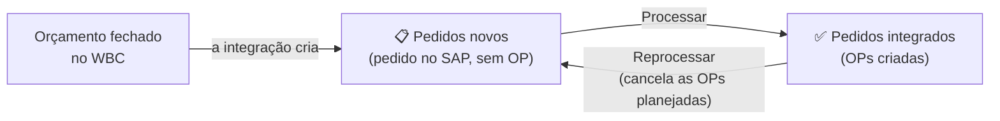
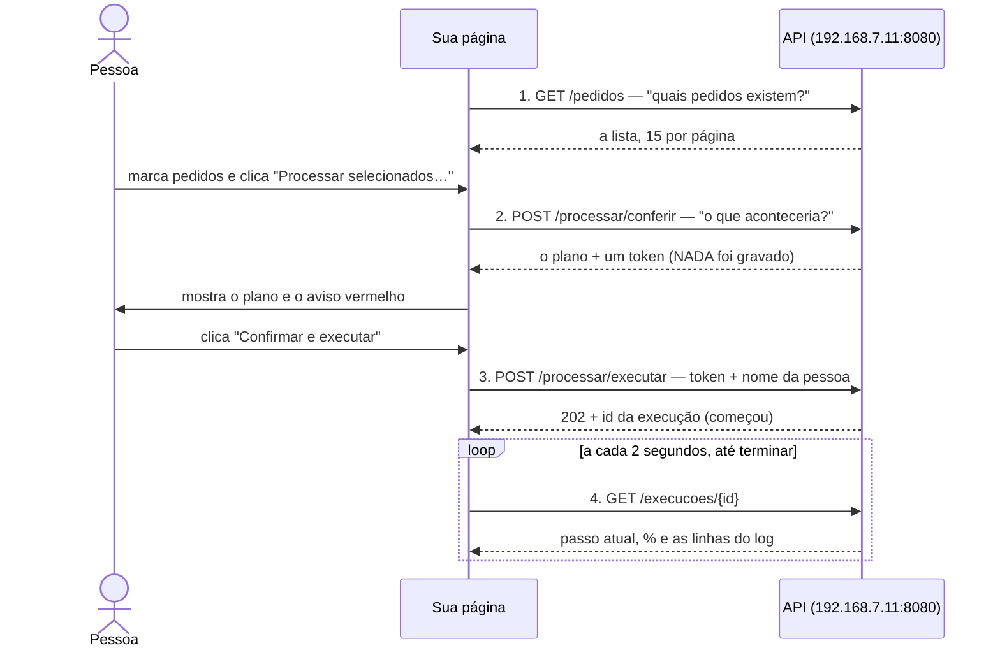
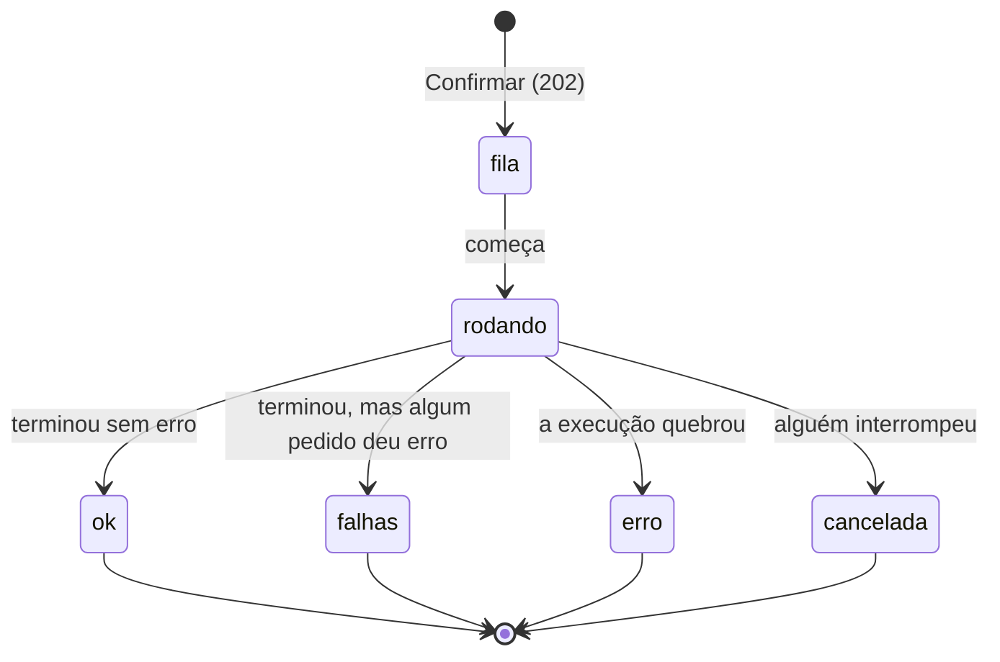
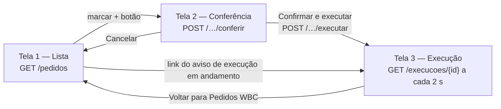

# API dos Pedidos WBC — guia para clonar a tela *Integração de Pedidos (WBC)*

Este guia é para a equipe que vai construir, no próprio sistema, uma página **igual** à tela
**Integração de Pedidos (WBC)** do Controle de Produção (`http://192.168.7.11:8080/pedidos-wbc`):
a mesma lista, os mesmos botões, a mesma conferência, o mesmo acompanhamento e **o mesmo
resultado no SAP**.

> ⚠️ **Tudo o que esta API grava vai direto para o SAP de produção** (`SBOALTAMIRAPROD`):
> Processar **cria Ordens de Produção**, Reprocessar **cancela** Ordens de Produção. Não existe
> ambiente de teste. Listar e conferir **não gravam nada** — dá para construir e testar quase a
> página inteira sem risco ([seção 11](#11-como-testar-sem-estragar-nada)).

### Como ler este guia

| Você quer… | Vá para |
| --- | --- |
| Entender **do que se trata** antes de tudo | [1. A ideia em um minuto](#1-a-ideia-em-um-minuto) |
| **Só usar** uma página pronta, sem programar | [3. A página pronta](#3-o-caminho-mais-curto-a-página-pronta) |
| **Construir a sua** página, passo a passo | [4. Tutorial: sua página em 5 etapas](#4-tutorial-sua-página-em-5-etapas) |
| Saber **o que um campo ou uma rota faz** | [6. Referência das rotas](#6-referência-das-rotas) |
| Deixar a página **com a mesma cara** da original | [7. Clonar a tela](#7-clonar-a-tela-peça-por-peça) e [8. Tema](#8-tema-cores-letras-medidas-e-ícones) |
| Saber **o que fazer quando dá erro** | [9. Erros](#9-quando-dá-errado-todos-os-erros) |
| Conferir se está **pronto para usar de verdade** | [12. Lista de verificação](#12-lista-de-verificação-antes-de-pôr-no-ar) |

---

## Sumário

1. [A ideia em um minuto](#1-a-ideia-em-um-minuto)
2. [O que você precisa](#2-o-que-você-precisa)
3. [O caminho mais curto: a página pronta](#3-o-caminho-mais-curto-a-página-pronta)
4. [Tutorial: sua página em 5 etapas](#4-tutorial-sua-página-em-5-etapas)
5. [Conceitos que você precisa conhecer](#5-conceitos-que-você-precisa-conhecer)
6. [Referência das rotas](#6-referência-das-rotas) —
   [lista](#61-get-pedidos--a-lista) · [conferir](#62-post-processarconferir-e-reprocessarconferir) ·
   [executar](#63-post-processarexecutar-e-reprocessarexecutar) ·
   [acompanhar](#64-get-execucoesid--acompanhar) · [interromper](#65-post-execucoesidcancelar--interromper)
7. [Clonar a tela, peça por peça](#7-clonar-a-tela-peça-por-peça)
8. [Tema: cores, letras, medidas e ícones](#8-tema-cores-letras-medidas-e-ícones)
9. [Quando dá errado: todos os erros](#9-quando-dá-errado-todos-os-erros)
10. [Exemplos completos de código](#10-exemplos-completos-de-código) — JavaScript, Python, PowerShell
11. [Como testar sem estragar nada](#11-como-testar-sem-estragar-nada)
12. [Lista de verificação antes de pôr no ar](#12-lista-de-verificação-antes-de-pôr-no-ar)
13. [Boas práticas](#13-boas-práticas)
14. [Perguntas frequentes](#14-perguntas-frequentes)
15. [Suporte e histórico deste documento](#15-suporte-e-histórico-deste-documento)

---

## 1. A ideia em um minuto

### O caminho de um pedido

Um orçamento é fechado no **WBC**. A integração cria o **pedido de venda no SAP**. A partir daí
ele aparece nesta tela, em **Pedidos novos**, esperando alguém **processar** — é o processamento
que cria as **Ordens de Produção (OPs)** que a fábrica vai fabricar. Processado, o pedido passa
para **Pedidos integrados**. Se algo saiu errado, ele pode ser **reprocessado**: as OPs planejadas
são canceladas e o pedido volta para "Pedidos novos", para ser processado de novo.



### O que a sua página faz

A página é uma conversa de quatro chamadas com a API — sempre nesta ordem, e **sempre com uma
pessoa confirmando no meio**:



### Por que é fácil clonar

A API **não tem regra própria**: ela chama **as mesmas funções da tela**. E tudo o que a tela
mostra e que depende do servidor — o rótulo do botão, o aviso vermelho, a mensagem de recusa, as
linhas do acompanhamento — chega **pronto** na resposta. A sua página só **desenha** o que recebe.
Quando uma regra muda na tela, muda na sua página junto, sem você mexer em nada.

---

## 2. O que você precisa

| O quê | Detalhe |
| --- | --- |
| **Endereço** | `http://192.168.7.11:8080/api/pedidos-wbc` |
| **Rede** | Só funciona **de dentro da rede da empresa**. De fora, a conexão é recusada. |
| **Chave** | Peça ao Marcelo (TI). Vai no cabeçalho `X-API-Key` de **toda** chamada. |
| **Nome de quem opera** | Toda gravação leva `solicitante` — o nome (ou login) da **pessoa** que pediu. |
| **Formato** | JSON na ida e na volta, em UTF-8. |
| **Navegador** | Pode chamar direto de uma página de outro servidor (CORS liberado) — mas leia a [seção 13](#13-boas-práticas) sobre a chave. |

Neste guia, `SUA_CHAVE` é onde vai a chave de verdade.

---

## 3. O caminho mais curto: a página pronta

[`docs/exemplos/pedidos_wbc_clone.html`](docs/exemplos/pedidos_wbc_clone.html) é o clone
completo da tela, feito **só com esta API**:

- as três telas — lista, conferência, execução — com os mesmos textos;
- o tema claro e escuro, as cores, as letras, os ícones e o "relevo" dos botões da tela original;
- o comportamento: botão que só habilita com pedido marcado e conta "(n)", paginação, aviso de
  execução em andamento, acompanhamento a cada 2 s, linhas de erro em vermelho, Interromper;
- **um arquivo só**, sem biblioteca e sem CDN (roda na rede interna sem internet).

**Para usar:**

1. Copie o arquivo para o seu servidor (ou abra direto no navegador).
2. Se precisar, troque o endereço na linha `const API_BASE = "http://192.168.7.11:8080";`.
3. Abra a página: ela pede **a chave** e **o seu nome** na primeira vez. Os dois ficam só naquela
   aba do navegador (`sessionStorage`) — fechou a aba, some. Nada vai para o código nem para a URL.

Ela foi conferida contra a própria API (com o SAP simulado): lista, paginação, conferência,
execução concluída, execução com falha, os dois temas e a largura de celular.

Se o seu sistema tem outro visual (React, Angular, Blazor…), use a página como **referência
executável**: o código está dividido nas mesmas três telas deste guia (`telaDaLista`,
`telaDaConferencia`, `telaDaExecucao`) e cada trecho está comentado.

---

## 4. Tutorial: sua página em 5 etapas

Cada etapa acrescenta **uma** coisa à página e termina com um **✔ ponto de conferência** — só siga
para a próxima quando ele bater. As etapas 1 a 4 **não gravam nada** no SAP; só a 5 grava.

Os exemplos são em JavaScript de navegador, sem biblioteca. A lógica é a mesma em qualquer
linguagem (veja a [seção 10](#10-exemplos-completos-de-código) para Python e PowerShell).

### Etapa 1 — Falar com a API

Uma função só faz todas as chamadas: põe a chave, manda JSON e transforma erro em exceção.

```javascript
const BASE = "http://192.168.7.11:8080";
const CHAVE = sessionStorage.getItem("chave");          // peça à pessoa; nunca escreva no código

async function api(metodo, caminho, corpo) {
  const r = await fetch(BASE + caminho, {
    method: metodo,
    headers: { "X-API-Key": CHAVE, ...(corpo ? { "Content-Type": "application/json" } : {}) },
    body: corpo ? JSON.stringify(corpo) : undefined,
  });
  const dados = await r.json();
  if (!dados.ok) throw Object.assign(new Error(dados.motivo), { status: r.status, tipo: dados.tipo, dados });
  return dados;
}

const lista = await api("GET", "/api/pedidos-wbc/pedidos?modo=novos");
console.log(lista.kpi, lista.pedidos);
```

**✔ Ponto de conferência:** no console aparece algo como `{valor: 2, rotulo: "Novos"}` e a lista
de pedidos — os mesmos que a tela original mostra em "Pedidos novos".

**Se der errado:** `401 sem_chave` → chave errada ou ausente. Erro de rede → você está fora da rede
da empresa, ou o servidor está fora (`GET /health`, sem chave, responde?).

### Etapa 2 — Desenhar a lista

Tudo de que a tela precisa veio na resposta. Repare que **nenhum texto é inventado**: o rótulo do
KPI, o texto da linha vazia e a contagem vêm da API.

```javascript
const moeda = (v) => v.toLocaleString("pt-BR", { minimumFractionDigits: 2, maximumFractionDigits: 2 });

function desenhaLista(d) {
  kpiValor.textContent = d.kpi.valor;                       // "2"
  kpiRotulo.textContent = d.kpi.rotulo;                     // "Novos" ou "Integrados"
  paginaKpi.textContent = `${d.pagina}/${d.paginas}`;       // "1/7"
  corpoTabela.replaceChildren(...d.pedidos.map((p) => linha([
    caixa(p.oportunidade),                                  // o VALOR da caixa é a oportunidade
    negrito(p.pedido), p.oportunidade, etiqueta(p.wbc), p.cliente, moeda(p.total), p.criado,
  ])));
  if (!d.pedidos.length) corpoTabela.replaceChildren(linhaVazia(d.vazio));
  contagem.textContent = d.total ? `${d.primeiro}–${d.ultimo} de ${d.total} pedido(s)` : "";
}
```

(`linha`, `caixa`, `negrito`, `etiqueta` e `linhaVazia` são funções suas que criam os elementos —
sempre com `textContent`, nunca `innerHTML`: nome de cliente vem do SAP e pode ter `<` ou `&`.)

**✔ Ponto de conferência:** abra a sua página e a original lado a lado. Mesmos pedidos, mesma
ordem (o mais recente primeiro), mesmos totais, mesmo "1–15 de 94 pedido(s)" em "integrados".

**Detalhes que fazem diferença:** escolher o modo **já carrega** a lista (não há botão "Buscar");
enquanto carrega, mostre "Carregando…" e trave os rádios; mudar de página **perde a seleção**
([7.2](#72-tela-1--a-lista)).

### Etapa 3 — Selecionar pedidos

O botão começa **desabilitado** e conta quantos pedidos estão marcados. O texto vem pronto em
`acao.botao` e `acao.verbo`:

```javascript
function atualizaBotao(d) {
  const marcados = caixas.filter((c) => c.checked).length;
  botao.disabled = marcados === 0;
  botao.textContent = marcados ? `${d.acao.verbo} selecionados (${marcados})…` : d.acao.botao;
  dica.hidden = marcados > 0;                               // "Marque ao menos um pedido."
}
```

Em "Pedidos integrados", `acao.aviso` traz o aviso amarelo que vai **embaixo do botão** — mostre-o
sempre, antes de qualquer clique: Reprocessar cancela OPs.

**✔ Ponto de conferência:** marcar 2 pedidos mostra "Processar selecionados (2)…"; desmarcar todos
volta a "Processar selecionados…" desabilitado.

### Etapa 4 — Conferir (ainda sem gravar)

O botão **não executa**: ele pede o **plano**. O servidor relê a lista no SAP, confere que os
pedidos ainda estão lá e devolve o que seria feito, com um `token` de 10 minutos.

```javascript
botao.onclick = async () => {
  const oportunidades = caixas.filter((c) => c.checked).map((c) => Number(c.value));
  try {
    const { plano } = await api("POST", lista.acao.conferir, { oportunidades });
    mostraConferencia(plano);      // título, aviso vermelho, resumo, tabela, validade, 2 botões
  } catch (e) {
    if (e.tipo === "fora_da_lista") recarregaLista(e.message);   // alguém processou antes de você
    else mostraErro(e.message);
  }
};
```

A tela de conferência usa só o que está no `plano` ([7.3](#73-tela-2--a-conferência)): título
"Confirmar: `{operacao}`", a faixa vermelha com `aviso.destaque` em negrito + `aviso.texto`, as
linhas de `resumo_tela`, a tabela de `itens` e "Esta conferência vale até `{valido_ate}`".

**✔ Ponto de conferência:** a sua conferência mostra o mesmo texto e a mesma tabela da original para
o mesmo pedido. **Nada foi gravado** — o token simplesmente vence se ninguém confirmar.

### Etapa 5 — Executar e acompanhar (grava no SAP)

> ⚠️ A partir daqui grava de verdade. Faça o primeiro teste **só num pedido combinado com o PCP**.

```javascript
confirmar.onclick = async () => {
  confirmar.disabled = true;                                // UM clique: o token vale uma vez
  try {
    const { execucao } = await api("POST", plano.executar,
      { token: plano.token, solicitante: sessionStorage.getItem("nome") });
    acompanha(execucao.id);
  } catch (e) {
    if (e.tipo === "ocupado") mostraErro(e.message, e.dados.execucao_em_andamento);  // link para a que está rodando
    else mostraErro(e.message);
  }
};

async function acompanha(id) {
  const { execucao: x } = await api("GET", `/api/pedidos-wbc/execucoes/${id}`);
  desenhaExecucao(x);              // pílula pelo desfecho, barra pelo percentual, passo, linhas
  if (!x.terminada) setTimeout(() => acompanha(id), 2000);
}
```

O que pintar a cada consulta ([7.4](#74-tela-3--a-execução)):

| Da API | Na tela |
| --- | --- |
| `situacao` + `desfecho` | a pílula: "executando" laranja, "concluída" verde, "concluída com falhas" amarela, "erro" vermelha |
| `percentual` | a largura da barra (0 a 100 %) |
| `passo` | a frase em negrito embaixo da barra |
| `linhas` | o log; as que têm `⚠` em **vermelho** |
| `resultado` | quando `terminada: true`, o resumo (o que foi processado, o que deu erro) |

**✔ Ponto de conferência:** a execução aparece também na tela **Execuções** do Controle de Produção,
com o seu nome e "API". O desfecho e as linhas são os mesmos nas duas.

Pronto: a página faz tudo o que a original faz. Antes de entregar, passe pela
[lista de verificação](#12-lista-de-verificação-antes-de-pôr-no-ar).

---

## 5. Conceitos que você precisa conhecer

### Glossário

| Palavra | O que quer dizer aqui |
| --- | --- |
| **Pedido** | O pedido de venda no SAP (o número que aparece no SAP, ex.: `84445`). |
| **Oportunidade** | A oportunidade de venda no SAP ligada ao pedido. É por ela que a seleção é feita. |
| **Orçamento WBC** | O orçamento no WBC que deu origem ao pedido (8 dígitos, ex.: `00124882`). |
| **OP** | Ordem de Produção: o que a fábrica fabrica. O Processar cria; o Reprocessar cancela as planejadas. |
| **Semiacabado** | Peça intermediária com OP própria (ex.: a longarina de um porta-paletes). |
| **Recurso de rateio** | Linha de custo (transporte, embalagem, montagem) que entra na OP, com código `GGF_…`. |
| **Processar** | Transformar um pedido novo em OPs. Grava no SAP. |
| **Reprocessar** | Desfazer as OPs planejadas de um pedido integrado e devolvê-lo a "novos". Grava no SAP. |
| **Plano** | O que o servidor **faria**, calculado na conferência. Não grava nada. |
| **Token** | O "comprovante" do plano conferido: vale 10 minutos, uma vez, para uma operação. |
| **Execução** | O trabalho rodando no servidor depois do Confirmar. Tem um `id` para acompanhar. |
| **Solicitante** | O nome da pessoa que mandou executar. Fica no histórico. |
| **Desfecho** | Como a execução terminou: `ok`, `falhas`, `erro` ou `cancelada` (ver abaixo). |
| **Peso da linha** | O peso de uma linha do pedido no SAP: árvore do WBC + 10%, para a linha inteira. |

### A vida de uma execução



O `desfecho` é o nome do estado. **`falhas` não é `ok`**: a execução chegou ao fim, mas pelo menos
um pedido está em `resultado.com_erro` — mostre isso em amarelo, não em verde.

### Três números para o mesmo pedido

Cada linha da tela mostra três números, e cada um serve a uma coisa:

| Campo | Exemplo | O que é | Para que serve |
| --- | --- | --- | --- |
| `pedido` | `84445` | Nº do **pedido de venda no SAP** (DocNum) | É o que a pessoa procura no SAP. É o que a tela destaca em negrito. |
| `oportunidade` | `14232` | Nº da **oportunidade de venda no SAP** | É o que você **manda** para selecionar (`oportunidades`). É o valor da caixa de seleção da tela. |
| `wbc` | `00124882` | Nº do **orçamento no WBC** (8 dígitos) | É o que o processamento usa por dentro. Aparece como etiqueta laranja. |

Não troque um pelo outro: a seleção é **sempre** pela `oportunidade`.

### Pedidos novos × Pedidos integrados

| Modo | Quem aparece | O botão faz |
| --- | --- | --- |
| **Pedidos novos** (`novos`) | Pedidos vindos do WBC que **ainda não** foram processados | **Processar** |
| **Pedidos integrados** (`integrados`) | Pedidos **já** processados | **Reprocessar** |

Os dois mostram o **mais recente primeiro**, 15 por página.

### O que Processar grava (de verdade)

Para cada pedido: monta a tabela do orçamento, garante os itens cadastrados, cria os recursos
de rateio e **cria a cascata de Ordens de Produção** (uma por grupo de produção, com os
semiacabados). Antes da primeira OP, marca o pedido como **processado**.

⚠️ **Não há desfazer automático.** Se a execução cair no meio, o pedido pode ficar marcado
como processado com OPs faltando — o resultado da execução diz o que aconteceu, pedido a pedido.

### O que Reprocessar grava (de verdade)

Para cada pedido: grava uma tabela nova do orçamento, marca o pedido como **NÃO processado**,
revincula a oportunidade e **CANCELA todas as OPs PLANEJADAS** do pedido — de qualquer origem,
inclusive as criadas pelo addon do SAP. **Não recria as OPs**: o pedido volta para "Pedidos
novos" e precisa ser processado de novo. OP liberada ou encerrada não é tocada; OP cancelada
não volta.

### Conferir, depois executar (o plano e o token)

Nada grava "direto do botão". É sempre em duas etapas, como na tela:

1. **Conferir** — o servidor **relê a lista no SAP** (não confia no que a página mostrou),
   monta o plano e devolve um `token`;
2. **Executar** — você manda o `token`, e só o que foi conferido é executado.

O token vale **10 minutos**, **uma vez**, e só para **a mesma operação** (o de Processar não
executa Reprocessar). Vencido ou usado → confira de novo.

### Execução em segundo plano

Executar responde na hora (`202`) com o `id` da execução — **ainda não** com o resultado. Um
pedido médio leva uns 7 segundos; um grande passa de um minuto. Acompanhe pelo `estado` a cada
2 segundos até `terminada: true`.

### Uma execução por vez

O módulo Pedidos WBC roda **uma execução de cada vez** — e isso vale junto para a tela e para
a API (duas ao mesmo tempo disputariam os mesmos pedidos e OPs). Se outra estiver rodando, você
recebe `409 ocupado` com a execução que está em andamento.

### Solicitante

Toda gravação (e o Interromper) leva `solicitante`: **o nome da pessoa** que pediu. Vai para o
log do servidor e para o histórico da tela **Execuções**. Até 80 caracteres, sem quebra de linha.

### Não existe "forçar"

A tela tem uma opção "forçar (ignora as checagens de reprocessamento)". **Ela não existe nesta
API**, de propósito: ela duplica OP. Mandar `force` (ou `forcar`) em qualquer chamada dá `400`.

---

## 6. Referência das rotas

Todas exigem `X-API-Key`. Respostas de sucesso trazem `"ok": true`; erros trazem
`{"ok": false, "tipo": "...", "motivo": "..."}` ([seção 9](#9-quando-dá-errado-todos-os-erros)).

| Na tela | Na API |
| --- | --- |
| Escolher "Pedidos novos"/"integrados", mudar de página | `GET /api/pedidos-wbc/pedidos?modo=novos&pagina=1` |
| "Processar selecionados…" | `POST /api/pedidos-wbc/processar/conferir` |
| "Confirmar e executar" | `POST /api/pedidos-wbc/processar/executar` |
| "Reprocessar selecionados…" | `POST /api/pedidos-wbc/reprocessar/conferir` |
| "Confirmar e executar" (do Reprocessar) | `POST /api/pedidos-wbc/reprocessar/executar` |
| A tela de execução, que se atualiza sozinha | `GET /api/pedidos-wbc/execucoes/{id}` |
| "Interromper" | `POST /api/pedidos-wbc/execucoes/{id}/cancelar` |

### 6.1 `GET /pedidos` — a lista

| Parâmetro | Valores | Padrão |
| --- | --- | --- |
| `modo` | `novos` ou `integrados` | `novos` |
| `pagina` | inteiro a partir de 1 | `1` |

Página além do fim vira a última (como na tela: a lista encolhe conforme os pedidos são
processados, e o número da página pode estar velho).

```http
GET /api/pedidos-wbc/pedidos?modo=novos
X-API-Key: SUA_CHAVE
```

```json
{
  "ok": true,
  "modo": "novos",
  "kpi": { "valor": 1, "rotulo": "Novos" },
  "total": 1,
  "pagina": 1,
  "paginas": 1,
  "por_pagina": 15,
  "primeiro": 1,
  "ultimo": 1,
  "pedidos": [
    {
      "pedido": 84445,
      "oportunidade": 14232,
      "wbc": "00124882",
      "cliente_codigo": "C006973",
      "cliente_nome": "XCMG BRASIL INDUSTRIA LTDA",
      "cliente": "C006973 — XCMG BRASIL INDUSTRIA LTDA",
      "total": 867100,
      "criado": "2026-09-29"
    }
  ],
  "vazio": null,
  "acao": {
    "tipo": "processar",
    "verbo": "Processar",
    "botao": "Processar selecionados…",
    "conferir": "/api/pedidos-wbc/processar/conferir",
    "aviso": null
  },
  "execucao_em_andamento": null
}
```

Em `modo=integrados` muda o rótulo do KPI e a ação, que passa a trazer o aviso que a tela mostra
embaixo da lista:

```json
{
  "kpi": { "valor": 93, "rotulo": "Integrados" },
  "pagina": 2, "paginas": 7, "primeiro": 16, "ultimo": 30,
  "acao": {
    "tipo": "reprocessar",
    "verbo": "Reprocessar",
    "botao": "Reprocessar selecionados…",
    "conferir": "/api/pedidos-wbc/reprocessar/conferir",
    "aviso": "Reprocessar cancela todas as OPs planejadas do pedido — de qualquer origem, inclusive as do addon — e não recria: o pedido volta para \"Pedidos novos\" e precisa ser processado de novo."
  }
}
```

| Campo | O que fazer com ele |
| --- | --- |
| `kpi` | O 1º cartão: número grande + rótulo em caixa alta. |
| `pagina`/`paginas` | O 2º cartão ("2/7", rótulo "Página") e a paginação. |
| `primeiro`/`ultimo`/`total` | "16–30 de 93 pedido(s)". |
| `pedidos[]` | As linhas da tabela. `total` é número: formate em reais ([7.5](#75-formatação)). |
| `vazio` | Com a lista vazia: o texto da linha única da tabela ("Nenhum pedido neste modo."). |
| `acao.botao` / `acao.verbo` | O rótulo do botão; com seleção vira "`{verbo}` selecionados (`n`)…". |
| `acao.conferir` | Para onde mandar a seleção. |
| `acao.aviso` | Só em integrados: o aviso amarelo embaixo do botão. |
| `execucao_em_andamento` | Não-nulo = há execução rodando: mostre o aviso com o link ([7.2](#72-tela-1--a-lista)). |

### 6.2 `POST /processar/conferir` e `/reprocessar/conferir`

**Não grava nada.** Relê a lista no SAP, monta o plano e devolve o token.

```http
POST /api/pedidos-wbc/processar/conferir
X-API-Key: SUA_CHAVE
Content-Type: application/json

{ "oportunidades": [14232] }
```

```json
{
  "ok": true,
  "plano": {
    "token": "0qiZJG20DUbqEOCsKkmhcNSti5SQTURI",
    "tipo": "processar",
    "operacao": "Processar pedidos novos",
    "valido_ate": "2026-10-01T14:29:59",
    "resumo": { "pedidos": 1 },
    "resumo_tela": [ { "valor": 1, "rotulo": "pedido(s) selecionado(s)" } ],
    "aviso": {
      "destaque": "Cria Ordens de Produção",
      "texto": ", itens e recursos no SAP, e marca o pedido como processado. Não há desfazer automático."
    },
    "executar": "/api/pedidos-wbc/processar/executar",
    "itens": [
      {
        "pedido": 84445,
        "oportunidade": 14232,
        "wbc": "00124882",
        "cliente_codigo": "C006973",
        "cliente_nome": "XCMG BRASIL INDUSTRIA LTDA",
        "cliente": "C006973 — XCMG BRASIL INDUSTRIA LTDA",
        "total": 867100,
        "total_texto": "867.100,00"
      }
    ]
  }
}
```

No Reprocessar, `aviso.destaque` vem vazio e `aviso.texto` é o aviso completo:

```json
"aviso": {
  "destaque": "",
  "texto": "Para cada pedido: grava uma tabela nova do orçamento (OrcDetalhe), marca o pedido como NÃO processado e zera o U_INO_OP das linhas, revincula a Oportunidade e CANCELA todas as OPs PLANEJADAS do pedido — de qualquer origem, inclusive as do addon. NÃO recria as OPs: o pedido volta para \"Pedidos novos\" e precisa ser processado de novo. OP liberada ou encerrada não é tocada; OP cancelada não volta."
}
```

| Campo | O que fazer com ele |
| --- | --- |
| `operacao` | O título: "Confirmar: `{operacao}`". |
| `aviso` | A faixa vermelha: `destaque` em **negrito**, seguido de `texto` (sem espaço entre os dois — o texto já começa com a vírgula). |
| `resumo_tela` | As linhas do resumo: `valor` em negrito + `rotulo`. |
| `itens` | A tabela: Pedido, Oportunidade, WBC, Cliente, Total (use `total_texto`, já formatado). |
| `valido_ate` | "Esta conferência vale até **2026-10-01 14:29:59**" (troque o `T` por espaço). |
| `token` + `executar` | O que o botão "Confirmar e executar" manda, e para onde. |

Recusas: lista vazia → `400`; número que não é de oportunidade → `400`; pedido que **não está
mais na lista** (processado por outra pessoa enquanto a página estava aberta) → `409
fora_da_lista`, com os números em `fora`. Nesse caso a página deve **recarregar a lista**.

### 6.3 `POST /processar/executar` e `/reprocessar/executar`

**Grava no SAP.** Manda o token da conferência e quem pediu.

```http
POST /api/pedidos-wbc/processar/executar
X-API-Key: SUA_CHAVE
Content-Type: application/json

{ "token": "0qiZJG20DUbqEOCsKkmhcNSti5SQTURI", "solicitante": "Ana Souza" }
```

Resposta **`202`** — a execução **começou**:

```json
{
  "ok": true,
  "execucao": {
    "id": "0776d866c322",
    "nome": "Processar pedidos novos",
    "descricao": "1 pedido(s): 84445",
    "situacao": "na fila",
    "terminada": false,
    "com_falhas": false,
    "desfecho": "fila",
    "passo": "",
    "passos_feitos": 0,
    "passos_total": 0,
    "percentual": null,
    "criada_em": "2026-10-01T14:20:00",
    "duracao_segundos": null,
    "linhas": [],
    "resultado": null,
    "erro": null,
    "solicitante": "Ana Souza",
    "origem": "api",
    "parada_pedida": false,
    "parada_combinada": true,
    "estado": "/api/pedidos-wbc/execucoes/0776d866c322"
  }
}
```

A ordem das checagens protege o token: **sem `solicitante`**, **escrita desligada** (`503`) ou
**módulo ocupado** (`409`) recusam **sem gastar o token** — dá para tentar de novo com o mesmo.
Token vencido, usado ou de outra operação → `409 confirmacao_invalida`: confira de novo.

### 6.4 `GET /execucoes/{id}` — acompanhar

O mesmo estado que a tela de execução consulta a cada 2 segundos. Rodando:

```json
{
  "ok": true,
  "execucao": {
    "id": "0776d866c322",
    "nome": "Processar pedidos novos",
    "descricao": "1 pedido(s): 84445",
    "situacao": "executando",
    "terminada": false,
    "desfecho": "rodando",
    "passo": "Pedido 84445 (WBC 00124882) (1/1)…",
    "passos_feitos": 0,
    "passos_total": 1,
    "percentual": 0,
    "duracao_segundos": 1.2,
    "linhas": [
      "14:20:00  Conectando à Service Layer (SBOALTAMIRAPROD)…",
      "14:20:00  Pedido 84445 (WBC 00124882) (1/1)…",
      "14:20:00  Pedido 00124882: montando a tabela do orçamento...",
      "14:20:01  Pedido 00124882: lendo a estrutura de produto no WBC..."
    ],
    "resultado": null,
    "solicitante": "Ana Souza",
    "origem": "api",
    "parada_combinada": true,
    "estado": "/api/pedidos-wbc/execucoes/0776d866c322"
  }
}
```

Terminada, sem problema:

```json
{
  "situacao": "concluída",
  "terminada": true,
  "com_falhas": false,
  "desfecho": "ok",
  "passo": "Pedido 84445 (WBC 00124882): concluído.",
  "passos_feitos": 1, "passos_total": 1, "percentual": 100,
  "duracao_segundos": 4.9,
  "resultado": {
    "processados": [ { "doc_num": "84445", "orc_num": "00124882" } ],
    "com_erro": [],
    "sem_op": [],
    "sem_rateio": [],
    "pesos_diferentes": []
  }
}
```

Terminada **com falhas** (a execução não quebrou, mas um pedido deu erro):

```json
{
  "situacao": "concluída",
  "terminada": true,
  "com_falhas": true,
  "desfecho": "falhas",
  "passo": "Pedido 84449 (WBC 00125640): ERRO — AddPedidoOportunidade retornou status != 0",
  "linhas": [
    "14:20:05  Conectando à Service Layer (SBOALTAMIRAPROD)…",
    "14:20:05  Pedido 84449 (WBC 00125640) (1/1)…",
    "14:20:05  Orçamento 00125640: lendo os itens no WBC...",
    "14:20:06  ⚠ Pedido 84449 (WBC 00125640): ERRO — AddPedidoOportunidade retornou status != 0"
  ],
  "resultado": {
    "atualizados": [],
    "com_erro": [
      { "orc_num": "00125640", "motivo": "AddPedidoOportunidade retornou status != 0", "doc_num": "84449" }
    ]
  }
}
```

**Leia o `desfecho`, não só a `situacao`.** "concluída" quer dizer que a execução não quebrou;
pedidos com erro aparecem em `resultado.com_erro` e fazem o desfecho virar `falhas`.

| `desfecho` | Quando | Pílula | Barra |
| --- | --- | --- | --- |
| `fila` | Ainda não começou | cinza | acento |
| `rodando` | Executando | laranja (acento) | acento |
| `ok` | Concluída, sem erro | verde | verde |
| `falhas` | Concluída, com pedido em `com_erro` | amarela ("concluída com falhas") | amarela |
| `cancelada` | Interrompida | amarela | vermelha |
| `erro` | A execução quebrou (`erro` traz o motivo) | vermelha | vermelha |

O que pode vir em `resultado`:

| Chave | Operação | O que é |
| --- | --- | --- |
| `processados` | Processar | Pedidos processados inteiros (`doc_num`, `orc_num`). |
| `atualizados` | Reprocessar | Pedidos reprocessados (OPs planejadas canceladas). |
| `com_erro` | as duas | Pedidos que falharam, com `motivo`. |
| `sem_op` | Processar | Grupos do pedido que **não geraram OP**, com `motivo` — o pedido "passou", mas parte dele não produziu nada. |
| `sem_rateio` | Processar | OPs criadas **sem a linha de rateio** (recurso recusado pelo SAP). |
| `nao_iniciados` | as duas | Pedidos que **não começaram** porque alguém interrompeu. |
| `pesos_diferentes` | Processar | Linhas do pedido com o **peso no SAP diferente** da árvore do WBC + 10%, com a **causa** — quem mudou a linha no SAP ([6.4.1](#641-peso-diferente-e-a-causa)). |

**Linhas com `⚠`** são erro ou atenção: pinte-as de vermelho (é o que a tela faz).

#### 6.4.1 Peso diferente e a causa

Ao processar, o servidor confere o peso de cada linha do pedido no SAP contra a regra da
integração: **nível 1 da árvore do WBC + 10%**, para a linha inteira, qualquer que seja a
quantidade. Acima de 1% de diferença, a linha entra em `resultado.pesos_diferentes` — e o
servidor lê o **histórico de alterações do SAP** para dizer quem mudou a linha.

O caso que motivou isto (pedido 84453, 01/10/2026): a integração criou a linha com quantidade 2
e 176,90 kg; depois uma pessoa mudou a quantidade para 1 no SAP, e **o SAP refaz o peso na mesma
proporção** — ficou 88,45 kg. Não é defeito da integração, e a resposta deixa isso explícito:

```json
"pesos_diferentes": [
  {
    "orc_num": "00125348",
    "doc_num": "84453",
    "linha": 0,
    "item": "I000003",
    "quantidade": 1.0,
    "peso_sap": 88.45,
    "peso_esperado": 176.9,
    "arvore_wbc": 160.82,
    "causa": {
      "tipo": "quantidade_mudada_no_sap",
      "usuario": "Adriano Fonseca",
      "momento": "2026-10-01T14:00:06",
      "quantidade_antes": 2.0,
      "quantidade_depois": 1.0,
      "peso_antes": 176.9,
      "peso_depois": 88.45,
      "integracao_gravou_certo": true,
      "texto": "CAUSA: Adriano Fonseca mudou a quantidade da linha 0 de 2 para 1 no SAP em 01/10/2026 às 14:00, e o SAP refez o peso na mesma proporção (176,90 → 88,45 kg). A integração tinha gravado o peso certo (176,90 kg) ao criar o pedido."
    }
  }
]
```

| Campo | O que é |
| --- | --- |
| `linha`, `item`, `quantidade` | A linha do pedido no SAP (`LineNum`), o item e a quantidade **atual**. |
| `peso_sap` | O peso que está no SAP agora. |
| `peso_esperado` | O que a regra dá: `arvore_wbc` × 1,10, 2 casas. |
| `causa` | `null` quando o histórico do SAP não mostra a mudança (ou não pôde ser lido). |
| `causa.tipo` | `quantidade_mudada_no_sap` (alguém mudou a quantidade e o SAP reescalou o peso) ou `peso_mudado_no_sap` (alguém digitou outro peso). |
| `causa.usuario` / `causa.momento` | Quem salvou a mudança no SAP, e quando (hora de Brasília). |
| `causa.*_antes` / `causa.*_depois` | Quantidade e peso antes e depois daquela mudança. |
| `causa.integracao_gravou_certo` | `true` = o pedido nasceu com o peso certo; a diferença veio depois. |
| `causa.texto` | A mesma frase que a tela mostra no acompanhamento — use-a para exibir. |

- **Não é erro**: o processamento segue, o `desfecho` continua `ok`; o pedido fecha com
  "**ATENÇÃO** — N linha(s) com peso diferente da árvore do WBC (veja a CAUSA acima)" no `passo` e
  nas `linhas`, com as linhas `⚠` do aviso e da CAUSA.
- **O peso não é corrigido sozinho.** Para acertar, o TI roda na .11
  `python -m wbcpython pesos --pedido 84453` (com `--simular` antes). Para não acontecer: não mude a
  quantidade da linha no SAP — ou avise que o peso precisa ser refeito.

### 6.5 `POST /execucoes/{id}/cancelar` — interromper

```http
POST /api/pedidos-wbc/execucoes/0776d866c322/cancelar
X-API-Key: SUA_CHAVE
Content-Type: application/json

{ "solicitante": "Ana Souza" }
```

```json
{ "ok": true, "cancelada": true, "entre_etapas": true }
```

A execução para **depois do pedido em curso**: ele termina inteiro, os seguintes não começam
(ficam em `resultado.nao_iniciados`). **Nada do que já foi gravado é desfeito.**
`"cancelada": false` = não havia o que interromper (já tinha terminado).

---

## 7. Clonar a tela, peça por peça

### 7.1 O fluxo



Todas as telas abrem com o mesmo **título de página**: um quadrado de 52 px com o ícone, o
título (h1) e uma linha de subtítulo ([8.4](#84-componentes)).

### 7.2 Tela 1 — a lista

```
┌──────┐ Integração de Pedidos (WBC)
│  🛍  │ Cria itens, recursos de rateio e a cascata de Ordens de Produção
└──────┘
┌─────────────────────────────────────┐ ┏━━━━━━━━━━━━━━━━━━┓ ┏━━━━━━━━━━━━━━━━━━┓
│ (●) Pedidos novos  ( ) Pedidos integ.│ ┃ 1                ┃ ┃ 1/1              ┃
│                                     │ ┃ NOVOS            ┃ ┃ PÁGINA           ┃
└─────────────────────────────────────┘ ┗━━━━━━━━━━━━━━━━━━┛ ┗━━━━━━━━━━━━━━━━━━┛
┌────┬────────┬─────────────┬───────────┬──────────────────────────────┬────────────┬────────────┐
│ ☐  │ PEDIDO │ OPORTUNIDADE│ WBC       │ CLIENTE                      │      TOTAL │ CRIADO     │
├────┼────────┼─────────────┼───────────┼──────────────────────────────┼────────────┼────────────┤
│ ☐  │  84445 │       14232 │ ●00124882 │ C006973 — XCMG BRASIL IND…   │ 867.100,00 │ 2026-09-29 │
└────┴────────┴─────────────┴───────────┴──────────────────────────────┴────────────┴────────────┘
1–1 de 1 pedido(s)
[ ▷ Processar selecionados… ]  Marque ao menos um pedido.
```

**Topo (uma linha, três cartões):** o cartão da escolha do modo (largura automática) e dois
KPIs que dividem o resto. No celular, um embaixo do outro.

- Escolher um modo **já carrega** a lista (não há botão "Buscar"). Enquanto carrega: mostre
  "Carregando…" e **desabilite** os rádios (a leitura no SAP leva uns segundos).
- Ao abrir a página: carregue "Pedidos novos" direto.
- KPI 1: borda esquerda de 4 px na cor do **acento**; número = `kpi.valor`, rótulo = `kpi.rotulo`.
- KPI 2: borda esquerda na cor **info** (`#0dcaf0`); número = "`pagina`/`paginas`", rótulo "Página".
- Os KPIs só aparecem **depois** que a lista carregou.

**Tabela** — colunas e formato:

| Coluna | Campo | Formato |
| --- | --- | --- |
| (caixa) | `oportunidade` | caixa de seleção de 20×20 px, `aria-label` "Selecionar o pedido `{pedido}`" |
| Pedido | `pedido` | à direita, **negrito**, algarismos alinhados |
| Oportunidade | `oportunidade` | à direita |
| WBC | `wbc` | pílula laranja (acento) |
| Cliente | `cliente` | texto |
| Total | `total` | à direita, `867.100,00` |
| Criado | `criado` | `2026-09-29`, cor apagada, **sem quebrar** |

- Lista vazia: uma linha só, ocupando as 7 colunas, com o texto de `vazio` em cor apagada.
- Linhas pares com fundo levemente mais escuro; passar o mouse destaca a linha.
- A tabela **rola dentro do cartão** quando não cabe — a página nunca rola para o lado.

**Paginação** (só com `total` > 0): "**1–15** de **93** pedido(s)". Com mais de uma página:
"‹ anterior" (se `pagina` > 1), "página **1** de **7**", "próxima ›" (se `pagina` < `paginas`) e
a nota "A seleção vale só para esta página — mudar de página a perde."

**Botão de ação:**

| Estado | Rótulo | Habilitado | Dica ao lado |
| --- | --- | --- | --- |
| Nada marcado | `acao.botao` ("Processar selecionados…") | não | "Marque ao menos um pedido." |
| `n` marcados | "Processar selecionados (`n`)…" | sim | (some) |
| Lista vazia | `acao.botao` | não | "Nenhum pedido para processar." |

- Cor **vermelha** (botão de perigo), ícone ▷ (play) em Processar e ⚡ (raio) em Reprocessar.
- As reticências "…" são de propósito: o botão leva à conferência, não executa.
- Clique → `POST acao.conferir` com `{"oportunidades": [...]}` → Tela 2.
- Em integrados, embaixo do botão: o `acao.aviso` numa faixa **amarela** com ícone ⚠. A tela
  original põe em negrito "**Reprocessar**", "**planejadas**" e "**não recria**".

**Execução em andamento** (`execucao_em_andamento` não-nulo), acima da tabela, faixa laranja com
ícone de relógio: "Há uma execução em andamento neste módulo: [`nome`](link para a Tela 3). Uma
nova só é aceita depois que ela terminar — duas ao mesmo tempo disputariam os mesmos pedidos e OPs."

**A lista não carregou** (`502`): faixa amarela "Não foi possível carregar os pedidos agora —
recarregue a página (F5) para tentar de novo." — a página abre mesmo assim.

**Recusa na conferência** (`409 fora_da_lista`, etc.): recarregue a lista e mostre o `motivo`
numa faixa vermelha.

### 7.3 Tela 2 — a conferência

```
┌──────┐ Confirmar: Processar pedidos novos
│  🛡  │ Nada foi gravado ainda — confira e confirme
└──────┘   (ícone de escudo, quadrado VERMELHO)
┌─ cartão com borda vermelha ─────────────────────────────────────────────┐
│ ┌ faixa vermelha ─────────────────────────────────────────────────────┐ │
│ │ ⚠ **Cria Ordens de Produção**, itens e recursos no SAP, e marca …   │ │
│ └─────────────────────────────────────────────────────────────────────┘ │
│ **1** pedido(s) selecionado(s)                                          │
│ O que será feito, exatamente — confira antes de confirmar:              │
│ ┌ PEDIDO │ OPORTUNIDADE │ WBC │ CLIENTE │ TOTAL ┐                        │
│ └ 84445  │ 14232        │ 00124882 │ C006973 — XCMG … │ 867.100,00 ┘     │
│ Esta conferência vale até **2026-10-01 14:29:59**. Depois disso é        │
│ preciso refazê-la — o que seria feito é recalculado sobre o estado      │
│ atual do SAP.                                                           │
│ [ ▷ Confirmar e executar ] (verde)   [ Cancelar ] (vermelho)            │
└─────────────────────────────────────────────────────────────────────────┘
```

- Título "Confirmar: `{operacao}`"; subtítulo fixo "Nada foi gravado ainda — confira e confirme";
  ícone **escudo** no quadrado na variante **perigo** (vermelha).
- Faixa vermelha: ícone ⚠ + `aviso.destaque` em negrito + `aviso.texto`.
- Resumo: cada item de `resumo_tela` numa linha — `valor` em negrito maior + `rotulo`.
- Tabela: colunas Pedido, Oportunidade, WBC, Cliente, Total — aqui **todas à esquerda** e o Total
  já vem pronto em `total_texto`.
- **Confirmar e executar** (verde, ícone ▷): `POST plano.executar` com `token` e `solicitante`.
  **Um clique só** — desabilite o botão ao clicar (o token vale uma vez; um duplo clique mostraria
  "confirmação já utilizada" com a execução rodando).
- **Cancelar** (vermelho): volta para a lista sem chamar nada.
- `409 ocupado`: mostre o `motivo` e um link "Acompanhar a execução em andamento" para
  `execucao_em_andamento`.

### 7.4 Tela 3 — a execução

```
┌──────┐ Processar pedidos novos                       [ ← Voltar para Pedidos WBC ]
│  🕑  │ 1 pedido(s): 84445 · por Ana Souza · API
└──────┘
┌─────────────────────────────────────────────────────────────────────────┐
│ (● CONCLUÍDA) — 1/1 — 4.9 s · 01/10/2026 14:20:00                        │
│ ████████████████████████████████████████████████████████  (barra verde)  │
│ **Pedido 84445 (WBC 00124882): concluído.**                              │
│ ┌ log (fonte monoespaçada) ───────────────────────────────────────────┐ │
│ │ 14:20:00  Conectando à Service Layer (SBOALTAMIRAPROD)…             │ │
│ │ 14:20:05  Pedido 84445 (WBC 00124882): concluído.                   │ │
│ └─────────────────────────────────────────────────────────────────────┘ │
│ [ ■ Interromper ]  Para depois do pedido em curso — …                   │
│ ■ RESULTADO                                                             │
│ { "processados": [ … ] }                                                │
└─────────────────────────────────────────────────────────────────────────┘
```

- Título = `nome`; subtítulo = `descricao` + (se `origem` = `api`) " · por `solicitante` · API".
- Botão "← Voltar para Pedidos WBC" (sólido, cor do acento) alinhado à direita do título.
- Linha de estado: pílula (texto = `situacao`, ou "`situacao` com falhas" se `desfecho` =
  `falhas`; cor pela tabela da [6.4](#64-get-execucoesid--acompanhar)), " — `passos_feitos`/`passos_total`"
  (se `passos_total` > 0), " — `duracao_segundos` s" (se houver) e "· `criada_em`" em
  `dd/mm/aaaa hh:mm:ss`.
- Barra de 6 px: largura = `percentual` % (0 se nulo); cor pelo `desfecho`.
- `passo` em negrito embaixo da barra.
- Log: as `linhas`, uma por linha; as que contêm `⚠` em **vermelho e negrito**. Mantenha a
  rolagem **colada no fim** — mas se a pessoa rolou para cima para ler, não puxe de volta.
- `erro` não-nulo: faixa vermelha com o texto.
- **Interromper** (botão fantasma, ícone ■) + nota: "Para depois do pedido em curso — ele
  termina inteiro; os próximos não começam. **Não desfaz** o que já foi gravado no SAP."
  Depois do clique, mostre: "Interrupção pedida — o que está em curso termina inteiro e o próximo
  não começa. O que já foi gravado no SAP fica." (ou "Não havia execução em andamento para
  interromper." se `cancelada` = false).
- Terminada: esconda o Interromper; se houver `resultado`, mostre a seção "RESULTADO" com o JSON
  formatado (2 espaços) no mesmo estilo do log.
- **Consulta a cada 2 s** até `terminada: true`. `404`: pare e mostre o `motivo`. `503`: mostre
  o `motivo` + "Nova tentativa em 15 s." e tente em 15 s. Falha de rede: tente de novo em 5 s —
  **a execução continua no servidor** mesmo que a página perca a conexão.

### 7.5 Formatação

| Valor | Da API | Na tela | JavaScript |
| --- | --- | --- | --- |
| Total (lista) | `867100` | `867.100,00` | `v.toLocaleString("pt-BR", {minimumFractionDigits: 2, maximumFractionDigits: 2})` |
| Total (conferência) | `total_texto` | `867.100,00` | já vem pronto |
| Criado | `"2026-09-29"` | `2026-09-29` | como veio |
| Validade | `"2026-10-01T14:29:59"` | `2026-10-01 14:29:59` | `s.replace("T", " ")` |
| Início da execução | `"2026-10-01T14:20:00"` | `01/10/2026 14:20:00` | separar data e hora e inverter a data |
| Duração | `4.9` | `4.9 s` | como veio |

**Todo texto que vem da API é texto, não HTML.** Nome de cliente vem do SAP e pode ter `<`, `&`:
use `textContent` (ou o equivalente do seu framework), nunca `innerHTML` com valor da API.

---

## 8. Tema: cores, letras, medidas e ícones

A tela segue o padrão visual da "Central Integração SAP" (`casa/static/casa.css` +
`controleproducao/static/style.css`). **Escuro é o padrão**; claro é a alternativa.

### 8.1 Cores

| Token | Uso | Escuro (padrão) | Claro |
| --- | --- | --- | --- |
| `--pagina` | Fundo da página | `#1a1a1a` | `#eef1f5` |
| `--painel` | Fundo do log | `#242424` | `#ffffff` |
| `--cartao` | Cartões, tabela, botão fantasma | `#2d2d2d` | `#ffffff` |
| `--superficie` | Cabeçalho da tabela, fundo da barra | `#3a3a3a` | `#ebeff5` |
| `--borda` | Bordas de cartão e réguas | `#404040` | `#cbd5e1` |
| `--borda-forte` | Contorno de campo de texto | `#9ca3af` | `#64748b` |
| `--texto` | Texto principal | `#ffffff` | `#1f2733` |
| `--texto-2` | Texto apagado, rótulos | `#9ca3af` | `#5a6675` |
| `--acento` | O coral da casa: preenchimento e borda | `#da7756` | `#c45a3a` |
| `--acento-texto` | O coral como **texto/ícone** (contraste) | `#e8956e` | `#a94a2e` |
| `--perigo` | Ícone do escudo da conferência | `#f2726a` | `#b42318` |
| Linha `⚠` do log | | `#ff8a80` | `#b42318` |

Cores semânticas, **iguais nos dois temas**: sucesso `#28a745` (botão Confirmar, pílula/barra
"ok"), erro `#dc3545` (botão de ação da lista, Cancelar, faixa vermelha, pílula "erro"), aviso
`#ffc107` (faixa amarela, "com falhas"), info `#0dcaf0` (borda do KPI "Página").

Transparências do acento (fundo do quadrado do título, destaque da linha): 8 %, 13 %, 20 % e
40 % do `--acento` (`rgb(218 119 86 / .13)` no escuro, `rgb(196 90 58 / .12)` no claro).

**Uma cor de acento por tela**, com parcimônia — nunca fundo de área grande. O que grava no SAP
usa o **vermelho semântico**, não um segundo acento.

### 8.2 Letras

- Família: `"Inter", "Segoe UI", system-ui, -apple-system, Roboto, "Helvetica Neue", Arial, sans-serif`.
- Log e JSON: `ui-monospace, SFMono-Regular, Menlo, Consolas, monospace`.
- Tamanhos: texto `0.9375rem`; h1 do título `1.875rem` peso 700 (`1.5rem` no celular);
  subtítulo `0.875rem`; número do KPI `1.875rem` peso 700; rótulos em caixa alta `0.75rem` com
  espaçamento `.06em`–`.07em`; notas `0.8125rem`; nota ao lado do botão `0.75rem`.
- Números em colunas: `font-variant-numeric: tabular-nums`.
- A página inteira é ampliada **12,5 %** (`zoom: 1.125` no contêiner, máximo de 1600 px); no
  celular (≤ 760 px) fica em `zoom: .9`.

### 8.3 Medidas

| | |
| --- | --- |
| Raio de cartão | 14 px |
| Raio de item (KPI dentro de lista, faixa, botão, log) | 10 px |
| Raio de campo | 9 px |
| Pílula | 999 px |
| Espaçamento base | 4 · 8 · 12 · 16 · 20 · 24 · 32 · 48 px |
| Sombra de cartão (escuro) | `0 4px 10px rgb(0 0 0 / .30), 0 1px 3px rgb(0 0 0 / .22)` |
| Sombra de cartão (claro) | `0 1px 2px rgb(0 0 0 / .05), 0 6px 20px rgb(0 0 0 / .05)` |
| Foco do teclado | contorno 2 px `--acento-texto`, afastado 2 px |

### 8.4 Componentes

- **Título de página:** quadrado 52×52 px, raio 14, fundo acento 13 %, contorno interno acento
  40 %, ícone 26 px na cor `--acento-texto`. Variante perigo (conferência): fundo/contorno/ícone
  em `--perigo`.
- **Cartão:** fundo `--cartao`, borda 1 px `--borda`, raio 14, sombra; padding 20×22 px.
- **KPI:** cartão com borda esquerda de 4 px colorida; número grande + rótulo em caixa alta.
- **Tabela:** cabeçalho em `--superficie`, caixa alta 0.75rem `.07em`, cor apagada; células com
  padding 11×14 px; régua 1 px; linhas pares 45 % mais escuras; hover = acento 8 %.
- **Pílula:** caixa alta 0.75rem peso 600, raio 999, com uma bolinha de 6 px antes; texto na cor,
  fundo = 14 % da cor, borda = 40 % da cor.
- **Botão sólido** (o "relevo" da casa): gradiente vertical de **três paradas** — cor clareada
  76 % com branco (0 %), a cor (40 %), cor escurecida 80 % com preto (100 %) —, sem borda, texto
  branco com sombra `0 1px 2px rgb(0 0 0 / .30)`, sombra `0 3px 8px` da própria cor a 35 % +
  brilho interno `inset 0 1px 0 rgb(255 255 255 / .25)`. Hover sobe 2 px (só com mouse);
  clique desce 1 px; desabilitado = 55 % de opacidade, sem sombra.
- **Botão fantasma** (Interromper): fundo `--cartao`, borda `--borda`, hover com texto e borda
  no acento.
- **Faixa de aviso:** ícone 16 px + texto; fundo 12 % e borda 35 % da cor (vermelho, amarelo ou
  acento); o texto fica na cor normal, só o ícone e a borda levam a cor.
- **Barra de progresso:** trilho de 6 px em `--superficie`; preenchimento animado (`.35s`).
- **Log:** fundo `--painel`, borda, raio 10, padding 14×16, altura máxima 24rem com rolagem,
  `white-space: pre-wrap`, entrelinha 1.65.

> Navegadores antigos (Chrome/Edge < 111) não conhecem `color-mix()`: sem um plano B, os botões
> saem **sem fundo**. A página pronta tem o bloco `@supports not (color: color-mix(...))` que
> resolve isso — copie-o se usar `color-mix`.

### 8.5 Ícones

SVG inline, traço de 2 px, pontas arredondadas, `fill="none"`, `stroke="currentColor"`,
`viewBox="0 0 24 24"` — herdam a cor do contexto. Sem biblioteca e sem CDN.

| Nome | Onde | Desenho (`<path>`) |
| --- | --- | --- |
| pedidos | Título da lista | `M6 2 3 6v14a2 2 0 0 0 2 2h14a2 2 0 0 0 2-2V6l-3-4z` · `M3 6h18` · `M16 10a4 4 0 0 1-8 0` |
| escudo | Título da conferência | `M12 22s8-4 8-10V5l-8-3-8 3v7c0 6 8 10 8 10z` |
| execucoes | Título da execução, aviso de execução em andamento | `<circle cx="12" cy="12" r="9"/>` · `M12 7v5l3 2` |
| alerta | Faixas de aviso | `M12 9v4M12 17h.01` · `M10.3 3.9 1.8 18a2 2 0 0 0 1.7 3h17a2 2 0 0 0 1.7-3L13.7 3.9a2 2 0 0 0-3.4 0z` |
| play | Processar, Confirmar | `m5 3 14 9-14 9V3z` |
| raio | Reprocessar | `M13 2 3 14h9l-1 8 10-12h-9l1-8z` |
| parar | Interromper | `<rect x="5" y="5" width="14" height="14" rx="2"/>` |
| voltar | Voltar | `M19 12H5M12 19l-7-7 7-7` |

---

## 9. Quando dá errado: todos os erros

Todo erro tem o mesmo formato:

```json
{ "ok": false, "tipo": "fora_da_lista", "motivo": "Estes pedidos não estão mais na lista elegível e foram recusados: 99999. Refaça a busca — o estado no SAP mudou desde que a tela foi carregada.", "fora": ["99999"] }
```

**Decida pelo `tipo`; mostre o `motivo`** — ele é a frase da tela, escrita para a pessoa.

| HTTP | `tipo` | Quando | O que fazer |
| --- | --- | --- | --- |
| 400 | `invalido` | Corpo não é JSON; lista vazia ("Nenhum pedido selecionado."); número inválido; `modo`/`pagina` inválidos; sem `token`; sem `solicitante`; `force` enviado | Corrigir a chamada |
| 401 | `sem_chave` | Sem `X-API-Key` ou chave errada | Pedir a chave de novo |
| 404 | `nao_encontrada` | Execução que não existe (ou saiu do histórico das 30 mais recentes); rota errada | Parar de consultar |
| 405 | `metodo_invalido` | GET onde é POST (ou o contrário) | Corrigir a chamada |
| 409 | `fora_da_lista` | Pedido conferido não está mais na lista (alguém processou) | Recarregar a lista |
| 409 | `confirmacao_invalida` | Token vencido (10 min), já usado ou de outra operação | Conferir de novo |
| 409 | `ocupado` | Já há uma execução no módulo (pela tela ou pela API) | Acompanhar a de `execucao_em_andamento`; não tentar em laço |
| 502 | `sap_indisponivel` | O SAP não respondeu à leitura | Tentar de novo em instantes |
| 503 | `escrita_desabilitada` | Escrita desligada no servidor | Avisar o TI |
| 503 | `historico_indisponivel` | O histórico de execuções não respondeu | Tentar de novo em 15 s |

As mensagens de token:

| Caso | `motivo` |
| --- | --- |
| Vencido | "A confirmação venceu. O plano foi calculado sobre o estado do SAP de alguns minutos atrás e pode não valer mais; refaça a conferência." |
| Usado ou inexistente | "Confirmação inválida ou já utilizada. Refaça a conferência antes de executar — o que seria feito precisa ser recalculado." |
| De outra operação | "Esta confirmação é de outra operação e não vale aqui. Refaça a conferência da operação que quer executar." |

---

## 10. Exemplos completos de código

Os três fazem o mesmo: listam os pedidos novos, conferem um, **mostram o plano e pedem
confirmação a uma pessoa**, executam e acompanham até o fim.

### JavaScript (navegador ou Node 18+)

No Node, salve como `.mjs` (usa `await` fora de função).

```javascript
const API = "http://192.168.7.11:8080/api/pedidos-wbc";
const CHAVE = process.env.SIS_API_KEY;        // no navegador: peça à pessoa, não escreva no código
const SOLICITANTE = "Ana Souza";

async function chama(metodo, caminho, corpo) {
  const r = await fetch(caminho.startsWith("/api/") ? "http://192.168.7.11:8080" + caminho : API + caminho, {
    method: metodo,
    headers: { "X-API-Key": CHAVE, ...(corpo ? { "Content-Type": "application/json" } : {}) },
    body: corpo ? JSON.stringify(corpo) : undefined,
  });
  const dados = await r.json();
  if (!dados.ok) throw Object.assign(new Error(dados.motivo), { tipo: dados.tipo, dados });
  return dados;
}

const lista = await chama("GET", "/pedidos?modo=novos");
console.log(`${lista.kpi.valor} ${lista.kpi.rotulo}`);
const alvo = lista.pedidos[0];

const { plano } = await chama("POST", "/processar/conferir", { oportunidades: [alvo.oportunidade] });
console.log(`Confirmar: ${plano.operacao}\n${plano.aviso.destaque}${plano.aviso.texto}`);
for (const i of plano.itens) console.log(`  ${i.pedido}  ${i.wbc}  ${i.cliente}  ${i.total_texto}`);
// >>> Aqui uma PESSOA confirma. Sem confirmação, não chame o executar. <<<

const { execucao } = await chama("POST", plano.executar, { token: plano.token, solicitante: SOLICITANTE });
let estado = execucao;
while (!estado.terminada) {
  await new Promise((ok) => setTimeout(ok, 2000));
  estado = (await chama("GET", `/execucoes/${execucao.id}`)).execucao;
  console.log(estado.passo);
}
console.log(`Desfecho: ${estado.desfecho}`, estado.resultado);
```

### Python

```python
import os
import time

import requests  # pip install requests

BASE = "http://192.168.7.11:8080"
API = f"{BASE}/api/pedidos-wbc"
CABECALHO = {"X-API-Key": os.environ["SIS_API_KEY"]}
SOLICITANTE = "Ana Souza"


def chama(metodo: str, caminho: str, corpo: dict | None = None) -> dict:
    url = BASE + caminho if caminho.startswith("/api/") else API + caminho
    r = requests.request(metodo, url, headers=CABECALHO, json=corpo, timeout=60)
    dados = r.json()
    if not dados.get("ok"):
        raise RuntimeError(f"{r.status_code} {dados['tipo']}: {dados['motivo']}")
    return dados


lista = chama("GET", "/pedidos?modo=novos")
print(lista["kpi"]["valor"], lista["kpi"]["rotulo"])
alvo = lista["pedidos"][0]

plano = chama("POST", "/processar/conferir", {"oportunidades": [alvo["oportunidade"]]})["plano"]
print(f"Confirmar: {plano['operacao']}")
print(plano["aviso"]["destaque"] + plano["aviso"]["texto"])
for i in plano["itens"]:
    print(f"  {i['pedido']}  {i['wbc']}  {i['cliente']}  {i['total_texto']}")
if input("Digite SIM para executar: ").strip() != "SIM":
    raise SystemExit("Nada foi gravado.")

execucao = chama("POST", plano["executar"], {"token": plano["token"], "solicitante": SOLICITANTE})["execucao"]
while not execucao["terminada"]:
    time.sleep(2)
    execucao = chama("GET", f"/execucoes/{execucao['id']}")["execucao"]
    print(execucao["passo"])
print("Desfecho:", execucao["desfecho"], execucao["resultado"])
```

### PowerShell (Windows PowerShell 5.1)

```powershell
[Console]::OutputEncoding = [Text.Encoding]::UTF8
$Base = "http://192.168.7.11:8080"
$Api = "$Base/api/pedidos-wbc"
$Cab = @{ "X-API-Key" = $env:SIS_API_KEY }
$Solicitante = "Ana Souza"

function Chama($Metodo, $Url, $Corpo) {
    $p = @{ Method = $Metodo; Uri = $Url; Headers = $Cab }   # nao use $args: e variavel automatica
    if ($Corpo) {
        # PowerShell 5.1 manda o corpo em ANSI: converta para UTF-8 (nomes com acento)
        $p.Body = [Text.Encoding]::UTF8.GetBytes(($Corpo | ConvertTo-Json -Depth 5))
        $p.ContentType = "application/json; charset=utf-8"
    }
    try { Invoke-RestMethod @p }
    catch { $e = $_.ErrorDetails.Message | ConvertFrom-Json; throw "$($e.tipo): $($e.motivo)" }
}

$lista = Chama GET "$Api/pedidos?modo=novos"
"$($lista.kpi.valor) $($lista.kpi.rotulo)"
$alvo = $lista.pedidos[0]

$plano = (Chama POST "$Api/processar/conferir" @{ oportunidades = @($alvo.oportunidade) }).plano
"Confirmar: $($plano.operacao)"
"$($plano.aviso.destaque)$($plano.aviso.texto)"
$plano.itens | Format-Table pedido, wbc, cliente, total_texto
if ((Read-Host "Digite SIM para executar") -ne "SIM") { "Nada foi gravado."; return }

$ex = (Chama POST "$Base$($plano.executar)" @{ token = $plano.token; solicitante = $Solicitante }).execucao
while (-not $ex.terminada) {
    Start-Sleep -Seconds 2
    $ex = (Chama GET "$Api/execucoes/$($ex.id)").execucao
    $ex.passo
}
"Desfecho: $($ex.desfecho)"
```

---

## 11. Como testar sem estragar nada

**Não existe ambiente de teste: esta API grava no SAP de produção.** Mas quase tudo dá para
testar sem gravar.

**Pode chamar à vontade** — nada é gravado:

| Chamada | Para testar |
| --- | --- |
| `GET /health` | Se você alcança o servidor |
| `GET /pedidos` (os dois modos, várias páginas) | A chave, a lista, a paginação, o desenho da tabela |
| `POST /processar/conferir` e `/reprocessar/conferir` | A conferência inteira. O token vence sozinho em 10 minutos |
| `GET /execucoes/{id}` | O acompanhamento, com o `id` de uma execução antiga (ou um inventado → `404`) |
| `POST /processar/executar` **sem `solicitante`** | O tratamento de erro (`400`) — recusa antes de gravar, e o token continua valendo |
| `POST /processar/conferir` com `{"oportunidades": [99999]}` | A recusa `409 fora_da_lista` |

**Executar** (Processar ou Reprocessar): só num pedido **combinado antes com o PCP**. Processar
de verdade cria OPs; Reprocessar de verdade cancela OPs. Nenhum dos dois é "para testar".

A [página pronta](#3-o-caminho-mais-curto-a-página-pronta) é um bom jeito de ver tudo funcionando
antes de escrever a sua: abra, navegue, confira — só não confirme.

Tudo o que você grava aparece na tela **Execuções** do Controle de Produção, com o seu
`solicitante`.

---

## 12. Lista de verificação antes de pôr no ar

Passe por cada item antes de liberar a página para as pessoas usarem.

**Segurança**

- [ ] A chave **não** está no código-fonte nem na URL (variável de ambiente, cofre, ou pedida à pessoa e guardada só na aba).
- [ ] Todo texto que vem da API é exibido como **texto** (`textContent`), nunca como HTML.
- [ ] O `solicitante` é o **nome da pessoa** que está operando, não o nome do sistema.

**Comportamento igual ao da tela**

- [ ] Escolher o modo já carrega a lista; os rádios ficam travados enquanto carrega.
- [ ] O botão começa desabilitado e mostra "(n)" com a quantidade marcada.
- [ ] Em "Pedidos integrados", o aviso amarelo do Reprocessar aparece **antes** de qualquer clique.
- [ ] A conferência mostra o **aviso vermelho inteiro** (`aviso.destaque` + `aviso.texto`) e a validade.
- [ ] "Confirmar e executar" aceita **um clique só**.
- [ ] O acompanhamento consulta a cada 2 s e **para** em `terminada: true`.
- [ ] A pílula segue o **`desfecho`** (não só a `situacao`): `falhas` aparece amarelo.
- [ ] Linhas com `⚠` aparecem em vermelho; o `resultado` aparece no fim.

**Quando dá errado**

- [ ] `401` → pede a chave de novo.
- [ ] `409 fora_da_lista` → recarrega a lista e mostra o motivo.
- [ ] `409 ocupado` → mostra o link para a execução em andamento (não tenta em laço).
- [ ] `409 confirmacao_invalida` → volta para a lista para conferir de novo.
- [ ] `502`/`503` → mostra o `motivo` e deixa tentar de novo.
- [ ] Falha de rede durante o acompanhamento → continua tentando (a execução segue no servidor).

**Teste**

- [ ] Lista e conferência comparadas com a tela original, nos dois modos ([11](#11-como-testar-sem-estragar-nada)).
- [ ] Primeira execução real **num pedido combinado com o PCP**, acompanhada até o fim.

---

## 13. Boas práticas

1. **Conferir → mostrar o plano a uma pessoa → executar.** O plano existe para alguém ler.
   Executar sem mostrar é jogar fora a proteção.
2. **Mostre o `aviso` da conferência inteiro**, em vermelho. É ele que diz o que não tem volta.
3. **Use os textos que vêm da API** (`acao.botao`, `kpi.rotulo`, `aviso`, `motivo`, `vazio`) em
   vez de escrever os seus: quando a tela muda uma frase, o seu clone muda junto.
4. **Leia o `desfecho`**, não só a `situacao`: "concluída" com pedido em `com_erro` é `falhas`.
5. **Consulte o estado a cada 2 segundos** e pare em `terminada: true`.
6. **`409 ocupado`: acompanhe a execução que veio na resposta**, em vez de tentar em laço.
7. **`409 fora_da_lista`: recarregue a lista.** Alguém processou o pedido enquanto a página
   estava aberta.
8. **`solicitante` é a pessoa**, não o sistema ("Ana Souza", não "SistemaX").
9. **Um clique só no Confirmar**: desabilite o botão ao clicar.
10. **A chave é poderosa — guarde-a bem.** Ela é a mesma que abre as telas da .11 e grava no SAP.
    O ideal é chamar a API **pelo seu servidor** (a chave fica nele, a página fala só com ele).
    Se a página chamar direto do navegador, **não escreva a chave no código**: peça à pessoa e
    guarde só na aba (`sessionStorage`), como a página pronta faz.
11. **Texto da API é texto**: nunca `innerHTML` com valor que veio dela.

---

## 14. Perguntas frequentes

**Posso testar sem gravar nada?**
Sim — veja a [seção 11](#11-como-testar-sem-estragar-nada). Listar, conferir e acompanhar não gravam.

**Mandei executar e a resposta não trouxe o resultado. Deu certo?**
Ainda não se sabe: `202` quer dizer que a execução **começou**. Acompanhe pelo `estado` até
`terminada: true` e leia o `desfecho`.

**Por que a seleção é pela `oportunidade` e não pelo `pedido`?**
Porque é assim na tela (é o valor da caixa de seleção) e é a chave com que o servidor relê a
lista na conferência. O `pedido` é o que você **mostra**.

**Posso mandar vários pedidos de uma vez?**
Sim — `"oportunidades": [14232, 15289, …]` (só os da página que a pessoa está vendo, como na
tela). Eles rodam **um de cada vez**, em ordem; o acompanhamento diz em qual está.

**Mandei 5 pedidos e um não está mais na lista. Os outros 4 foram?**
Não. A conferência recusa **o lote inteiro** (`409 fora_da_lista`) dizendo quais saíram.
Recarregue a lista e confira de novo.

**Um pedido deu erro no meio da execução. Os outros pararam?**
Não. Cada pedido é independente: o que falhou vai para `resultado.com_erro` e a execução segue
para o próximo. O desfecho final fica `falhas`.

**Interrompi. O que foi feito é desfeito?**
Não. O pedido em curso termina inteiro; os seguintes ficam em `resultado.nao_iniciados`.

**Por que não tem "forçar"?**
Porque ele ignora as checagens que impedem OP duplicada. Se for mesmo preciso, é pela tela do
Controle de Produção, por quem conhece o caso.

**O processamento avisou "peso diferente". A integração errou?**
Leia `causa` em `resultado.pesos_diferentes` (ou a linha "CAUSA:" do acompanhamento). Nos casos
vistos até hoje, a integração gravou o peso certo e alguém **mudou a quantidade da linha no SAP**
depois — o SAP refaz o peso na mesma proporção. Veja a [6.4.1](#641-peso-diferente-e-a-causa).

**Reprocessei e as OPs não voltaram.**
É o comportamento: Reprocessar **cancela** as OPs planejadas e devolve o pedido a "Pedidos
novos". Para criar as OPs de novo, **processe** o pedido em "Pedidos novos".

**Por que recebi `409 ocupado` se não estou rodando nada?**
Alguém está — pela tela ou por outro sistema. A resposta traz quem (`solicitante`, `origem`) e o
`estado` para acompanhar.

**O token venceu. E agora?**
Confira de novo. O plano é recalculado sobre o estado atual do SAP — que pode ter mudado.

**A tela e a minha página podem ficar diferentes?**
Nas regras e nos textos que vêm da API, não: são as mesmas funções. No que é só desenho
(cores, posições), sim — por isso a [seção 8](#8-tema-cores-letras-medidas-e-ícones) e a página
pronta.

**Onde vejo o que já foi feito?**
Na tela **Execuções** do Controle de Produção (as 30 mais recentes, com quem pediu e por onde),
ou em `GET /execucoes/{id}`.

---

## 15. Suporte e histórico deste documento

- **O servidor está no ar?** `GET http://192.168.7.11:8080/health` (sem chave).
- **Chave, dúvida, campo faltando, `502`/`503`:** falar com o Marcelo (TI).
- **Uma mensagem não está clara** para mostrar ao usuário final: avise. Ela é a mesma da tela e
  melhora nos dois lugares ao mesmo tempo.
- **Código:** `controleproducao/modules/pedidos_wbc/api_router.py` (a API) e `acoes.py` (as
  regras, compartilhadas com a tela). Plano: `docs/PLANO_API_PEDIDOS_WBC.md`.

Os exemplos de resposta deste documento saíram da própria API, com o SAP simulado e dados
fictícios; só os nomes de pessoa e o servidor de exemplo foram ajustados. No SAP de verdade, as
`linhas` trazem mais passos (cada OP, item e recurso criado).

| Data | O que mudou |
| --- | --- |
| 01/10/2026 | Primeira versão: listar, conferir, executar (Processar e Reprocessar, sem "forçar"), acompanhar e interromper; página pronta `docs/exemplos/pedidos_wbc_clone.html` |
| 01/10/2026 | `resultado.pesos_diferentes`: linha com peso diferente da árvore do WBC, com a **causa** lida do histórico do SAP (quem mudou, quando, de quanto para quanto) — [6.4.1](#641-peso-diferente-e-a-causa) |
| 01/10/2026 | Guia mais didático: "A ideia em um minuto" (caminho do pedido e a conversa com a API em desenho), tutorial em 5 etapas com pontos de conferência, glossário, a vida de uma execução e lista de verificação antes de pôr no ar |
