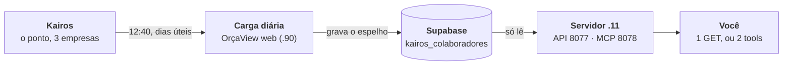

# 🪪 Colaboradores Kairos — guia de integração

> **Quem trabalha nas três empresas, por empresa e por setor, com cargo, matrícula e
> situação.** Uma chamada HTTP — ou uma pergunta em português, pelo assistente.
> Este documento foi escrito para você integrar **sem precisar perguntar nada**.

| | |
|---|---|
| **Endpoint** | `GET http://192.168.7.11:8077/rh/colaboradores` |
| **Autenticação** | `X-API-Key` (a mesma dos outros endpoints da 8077) |
| **Atualização** | 1× por dia útil, às **12:40** |
| **Hoje** | 85 pessoas ativas · 3 empresas · 251 linhas com histórico |
| **Escreve algo?** | Não. Somente leitura. |

**Índice** · [1. O que é](#1-o-que-é-e-o-que-não-é) · [2. Comece por aqui](#2-comece-por-aqui-30-segundos)
· [3. A chamada](#3-a-chamada) · [4. A resposta](#4-a-resposta)
· [5. Status](#5-o-contrato-do-status-a-linha-do-desligado-não-some)
· [6. Sem expediente](#6-sem-expediente--leia-antes-de-usar) · [7. Frescor](#7-frescor-saber-de-quando-é-o-dado)
· [8. Receitas](#8-receitas-prontas) · [9. MCP](#9-mcp--perguntar-em-português)
· [10. Erros](#10-erros-e-o-que-fazer) · [11. Armadilhas](#11-armadilhas)
· [12. Por dentro](#12-por-dentro-para-quem-mantém)

> Os endpoints de **Ordens de Serviço**, **Ordens de Produção** e **Situação dos Pedidos**
> são outra coisa: `API_OS_INTEGRACAO.md`, `API_ORDENS_PRODUCAO.md` e
> `API_SITUACAO_PEDIDOS.md`.

---

## 1. O que é (e o que **não** é)

**É um espelho diário do Kairos**, o sistema de ponto. Uma vez por dia útil, às 12:40, o
OrçaView web lê as três empresas no Kairos e grava o quadro no Supabase; esta API lê esse
espelho e serve para você.



**O que ele não é:**

- ❌ **Não é tempo real.** Uma admissão de hoje de manhã só aparece depois das 12:40.
- ❌ **Não é a folha.** Não há salário, CPF, endereço ou banco.
- ❌ **Não escreve nada.** Não existe verbo de escrita neste endpoint.
- ❌ **A API não fala com o Kairos.** Ela lê o espelho. Se o Kairos cair, você continua
  recebendo o último quadro bom — e o campo `desatualizado` avisa.

> [!IMPORTANT]
> **Você NÃO precisa de acesso ao Supabase** — nem ao banco, nem ao painel, nem a um
> conector do Supabase no Claude. Quem lê o banco é esta API; é exatamente para isso que
> ela existe. Você precisa de **uma coisa só**: a `X-API-Key` da 8077 (ou o token do MCP,
> se for usar pelo assistente).
>
> Pedir acesso ao banco abriria **122 tabelas dos três aplicativos** para resolver o que
> um endereço HTTP já resolve — e, com as proteções de linha que essas tabelas têm, o
> acesso só funcionaria com a chave que ignora todas elas. Não é o caminho.

---

## 2. Comece por aqui (30 segundos)

```bash
curl -s "http://192.168.7.11:8077/rh/colaboradores?empresa=tecnequip&somente_ativos=1" \
     -H "X-API-Key: SUA_CHAVE"
```

Se voltou um JSON com `"ok": true`, acabou a configuração — o resto deste documento é
sobre o que vem dentro.

> [!TIP]
> No navegador (que não envia cabeçalho), use `?key=SUA_CHAVE` na URL.
> `Authorization: Bearer SUA_CHAVE` também funciona.

---

## 3. A chamada

| Parâmetro | Valores | O que faz |
|---|---|---|
| `empresa` | `altamira` · `tecnequip` · `proalta` | Restringe a uma empresa. Ausente = as três. |
| `somente_ativos` | `1` | Só quem está na ativa. **Ausente = todos**, cada um com seu `status`. |

> [!WARNING]
> **Empresa desconhecida é recusada com `400`** — de propósito. Um erro de digitação
> devolveria o quadro de **outra empresa** com HTTP 200, e ninguém perceberia. A resposta
> do 400 traz `empresas_validas`.

---

## 4. A resposta

O aninhamento é **empresa → setor → colaboradores**. **Cargo é campo da pessoa**, não um
nível: aninhar por cargo criaria grupos de uma pessoa só na maioria dos casos.

```jsonc
{
  "ok": true,
  "atualizado_em":     "2026-09-01T10:41:43.115705+00:00",  // UTC — use para comparar
  "atualizado_em_br":  "2026-09-01T07:41:43-03:00",         // Brasília — use para mostrar
  "desatualizado":     false,
  "carga_esperada_em": "2026-08-31T12:40-03:00",            // slot usado na conta
  "total": 56,
  "somente_ativos": true,
  "empresas": [
    {
      "empresa": "tecnequip",
      "total": 56,
      "setores": [
        {
          "setor": "PRODUÇÃO",
          "total": 32,
          "colaboradores": [
            {
              "person_id": 123,                    // ← a chave estável
              "nome": "Fulano da Silva",
              "matricula": "100204",               // crachá — NÃO é o person_id
              "cargo": "Operador de Máquina",
              "status": "ativo",
              "em_ferias_ou_afastado": false,
              "sem_expediente_desde": null,
              "data_admissao": "2021-12-01",
              "data_desligamento": null
            }
          ]
        }
      ]
    }
  ]
}
```

| Campo | Tipo | O que é |
|---|---|---|
| `person_id` | inteiro | Id no Kairos. **Use como chave.** |
| `nome` | texto | Como está no cadastro. Há homônimos — não use como chave. |
| `matricula` | texto \| null | Número do crachá. É o que casa com os eventos de ponto. |
| `cargo` | texto \| null | Descrição do cargo. |
| `status` | texto | `ativo` · `desligado` · `ausente` — veja a §5. |
| `em_ferias_ou_afastado` | booleano | Sem expediente. **Leia a §6 antes de usar.** |
| `sem_expediente_desde` | data \| null | Início da ausência; `null` com a flag ligada = começou antes da janela. |
| `data_admissao` | data \| null | Admissão. |
| `data_desligamento` | data \| null | Preenchida quando o desligamento tem registro. |

Quem está sem setor no Kairos entra no grupo `"SEM SETOR"` — ninguém é escondido por
causa de um campo em branco. Os `total` de empresa e setor são **contagens prontas**: não
precisa somar o array.

---

## 5. O contrato do status: a linha do desligado **não some**

Esta é a regra mais importante daqui, e a razão de o campo existir.

| `status` | Significa | Quando aparece |
|---|---|---|
| ✅ `ativo` | Está no quadro. | Veio na carga e não tem desligamento. |
| ⬜ `desligado` | Saiu, com registro. | Desligamento conhecido — veja `data_desligamento`. |
| 🟠 `ausente` | Sumiu do cadastro. | Deixou de vir na carga sem registro de desligamento. |

> [!NOTE]
> **Por que isso importa para você:** se as linhas sumissem, todo programa que guarda
> `person_id` quebraria — ou perderia o histórico — no dia em que alguém fosse desligado.
> Aqui a linha permanece e muda de estado.
>
> Para o quadro atual, filtre por `status == "ativo"` ou peça `?somente_ativos=1`;
> para histórico, peça tudo.

---

## 6. Sem expediente — leia antes de usar

> [!CAUTION]
> **O Kairos não diz "férias".** A API dele **não tem** evento de férias nem de
> afastamento. O sinal aqui é indireto: a **ausência** do evento "Horas a Trabalhar" em
> dias que a empresa já fechou.
>
> Então `em_ferias_ou_afastado: true` quer dizer **"está sem expediente"** — pode ser
> férias, atestado, licença ou afastamento, e **o dado não distingue**. Se o seu uso
> exige separar férias de afastamento, este campo não serve: a informação não existe na
> origem.

- Liga com **3 ou mais dias úteis processados** sem expediente — feriado ou dia que o
  Kairos ainda não fechou **não** conta.
- `sem_expediente_desde: null` **com a flag ligada** = a ausência começou antes da janela
  de 30 dias: sabemos que está fora, não desde quando.
- Quem **nunca** bate ponto (isento de relógio) **não** é marcado.
- Hoje são **3 pessoas em 85 ativas** — é sinal raro, não estado comum.

---

## 7. Frescor: saber de quando é o dado

| Campo | Para que serve |
|---|---|
| `atualizado_em` | Carimbo da última carga, em **UTC**. É o campo para comparar em código. |
| `atualizado_em_br` | O mesmo instante em horário de Brasília. É o campo para **mostrar**. |
| `desatualizado` | `true` = a carga do último 12:40 de dia útil não chegou. |
| `carga_esperada_em` | Contra qual horário a conta acima foi feita. |

> [!NOTE]
> **Não é "mais velho que N horas".** Na segunda de manhã o dado **é** de sexta, e isso
> está certo — a carga só roda em dia útil, e a conta considera feriados nacionais. A
> pergunta que `desatualizado` responde é *"o último horário que já deveria ter rodado
> produziu carga?"*.
>
> Quando vier `true`, o dado continua sendo servido — é o último bom conhecido. **Avise a
> pessoa** em vez de apresentá-lo como de hoje.

---

## 8. Receitas prontas

### Quantas pessoas por setor, no terminal

```bash
curl -s "http://192.168.7.11:8077/rh/colaboradores?empresa=tecnequip&somente_ativos=1" \
     -H "X-API-Key: SUA_CHAVE" \
| jq -r '.empresas[].setores[] | "\(.total)\t\(.setor)"'
```

```text
7   DESENVOLVIMENTO DE PROJETOS
8   EXPEDIÇÃO
6   FERRAMENTARIA
1   LIMPEZA
32  PRODUÇÃO
1   QUALIDADE
1   T.I
```

### Python — quem está na produção

```python
import requests

BASE = "http://192.168.7.11:8077"
r = requests.get(
    f"{BASE}/rh/colaboradores",
    params={"empresa": "tecnequip", "somente_ativos": 1},
    headers={"X-API-Key": CHAVE},
    timeout=20,
)
r.raise_for_status()
dados = r.json()

# avise quando o dado envelheceu, em vez de mostrar como se fosse de agora
if dados["desatualizado"]:
    print(f"⚠ dado de {dados['atualizado_em_br']} — a carga do dia não chegou")

for empresa in dados["empresas"]:
    for setor in empresa["setores"]:
        if setor["setor"] == "PRODUÇÃO":
            for p in setor["colaboradores"]:
                print(p["matricula"], p["nome"], "—", p["cargo"])
```

### JavaScript — índice por `person_id`

```javascript
const resp = await fetch(
  "http://192.168.7.11:8077/rh/colaboradores",          // sem filtro = todos, com status
  { headers: { "X-API-Key": chave } }
);
const dados = await resp.json();

const porId = new Map();
for (const e of dados.empresas)
  for (const s of e.setores)
    for (const p of s.colaboradores)
      porId.set(p.person_id, { ...p, empresa: e.empresa, setor: s.setor });

// quem saiu continua aqui, com status — é isso que evita quebrar o seu cadastro
const desligados = [...porId.values()].filter(p => p.status !== "ativo");
```

---

## 9. MCP — perguntar em português

Duas *tools*, ambas somente leitura, sobre o mesmo endpoint:

| Tool | Use quando | Devolve |
|---|---|---|
| `listar_colaboradores(empresa, setor, somente_ativos, limite)` | "Quem está na produção da Tecnequip?" · "Fulano ainda trabalha aqui?" | Os nomes, agrupados por setor. |
| `resumo_colaboradores(empresa, somente_ativos)` | "Quantos na expedição?" · "Como o quadro se distribui?" | Só as contagens — cabe na conversa mesmo com o quadro inteiro. |

- **O default das tools é `somente_ativos=true`** (na REST é o contrário: sem o parâmetro
  vêm todos). Passe `false` para ver quem saiu.
- **`setor` casa sem acento e por pedaço**: `"producao"` acha `"PRODUÇÃO"`. Errar o nome
  não devolve lista vazia calada — vem `setores_disponiveis` para tentar de novo.
- **`limite` (padrão 200) corta os nomes, nunca as contagens**: vêm `truncado`,
  `mostrando` e `omitidos` por setor.
- Recurso anexável `sap-integracao://colaboradores` — o quadro ativo em contagens, de
  propósito sem nomes.

### Como registrar no seu cliente

É um **conector personalizado** apontando para a `.11` — **não** o conector "Supabase" do
diretório da Anthropic, que é outra coisa (SQL direto no banco) e não serve aqui.

```bash
claude mcp add --transport http servidor-integracao-sap \
  http://192.168.7.11:8078/mcp \
  --header "Authorization: Bearer SEU_TOKEN_MCP" --scope user
```

No Claude Desktop, o caminho é o mesmo endereço cadastrado como conector remoto.

> [!WARNING]
> **O MCP só responde de dentro da rede.** `192.168.7.11` é endereço interno: o Claude na
> web (claude.ai) **não alcança**. Funciona em cliente rodando numa máquina da empresa
> (Claude Code, Claude Desktop). Se o seu caso é usar pelo navegador, o caminho é a API
> REST chamada pelo seu próprio código.

O token do MCP é **diferente** da `X-API-Key` da REST — peça os dois ao Marcelo.

---

## 10. Erros e o que fazer

| Código | Quando | O que fazer |
|---|---|---|
| `200` | Sucesso — inclusive lista vazia. | Lista vazia é resposta válida. |
| `400` | `empresa` desconhecida. | A resposta traz `empresas_validas`. Corrija o valor. |
| `401` | Sem chave, ou chave errada. | Confira o cabeçalho `X-API-Key`. |
| `404` | Rota não encontrada. | O servidor está numa versão anterior ao endpoint. Avise — é `git pull` + restart na `.11`. |
| `502` | Falha ao ler o espelho. | Problema no Supabase. Tente de novo; se persistir, avise. |

---

## 11. Armadilhas

1. **`matricula` não é `person_id`.** O `person_id` é o Id do cadastro; a matrícula é o
   crachá (e pode vir `null`). Use `person_id` como chave.
2. **Nome não é chave.** Há homônimos, e a grafia muda com o tempo.
3. **A mesma pessoa pode aparecer em duas empresas.** A chave real é o par
   `empresa` + `person_id`.
4. **`total` conta linhas, não pessoas ativas.** Sem `?somente_ativos=1` ele inclui
   desligados e ausentes.
5. **Setor vem do Kairos.** Mudança de setor lá aparece aqui na carga seguinte — não há
   como forçar antes das 12:40.
6. **Não guarde cópia sem carimbo.** Se for armazenar do seu lado, guarde junto o
   `atualizado_em` — senão ninguém sabe de quando é.

---

## 12. Por dentro (para quem mantém)

- **Tabela:** `kairos_colaboradores` no Supabase (chave `empresa` + `person_id`), escrita
  **só** pelo `web_orcaview_V117` com a service key; esta API lê com a mesma chave.
- **Este repositório não tem credencial do Kairos** e não deve ganhar uma: quem fala com
  o Kairos é o `.90`, onde já vive o cliente com todas as armadilhas de tenant tratadas.
- **Leitura paginada** de 1000 em 1000 — o PostgREST corta em 1000 linhas com HTTP 200, e
  a tabela só cresce (linha nunca é deletada).
- **Plano e decisões:** `web_orcaview_V117/docs/PLANO_ESPELHO_COLABORADORES_KAIROS.md`.
- **Código:** rotas em `api.py` (`/rh/colaboradores`), tools em `mcp/mcp_server.py`,
  testes em `tests/test_api.py` e `tests/test_mcp_colaboradores.py`.
