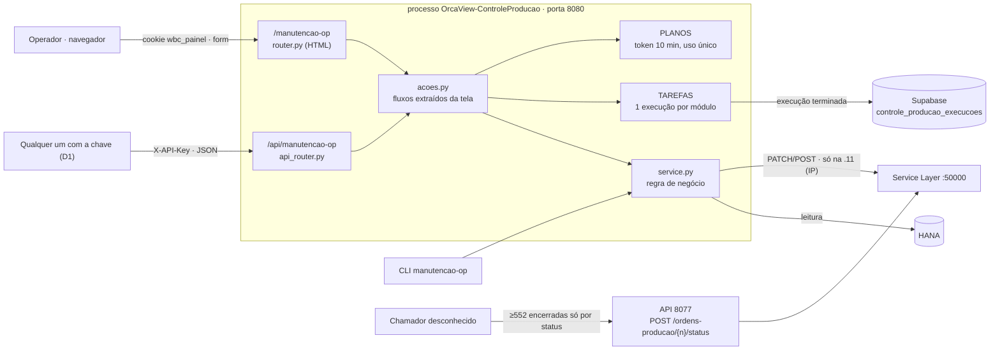

# Plano — API JSON da Manutenção de OP (Controle de Produção, porta 8080)

> **Status (29/09/2026, 15:33): D1 no ar na .11 (deploy ~15:15) e conferida, só leitura.**
> Preflight CORS sem chave → `200` com `access-control-allow-origin: *`, métodos `GET, POST` e
> cabeçalhos `x-api-key, content-type`; `GET` com origem de fora → `200` e o `401` sem chave
> também trazem o cabeçalho; a API responde `application/json; charset=utf-8`; as telas seguem
> sem CORS. No Windows PowerShell 5.1, o exemplo do guia, como está, lê "concluída" certo e trata
> o erro. ⚠️ Não deu para provar num navegador daqui: o navegador embutido barra o `fetch` da
> página para outro endereço antes de sair (`ERR_BLOCKED_BY_CLIENT`). Falta: F7 (quem chama a
> 8077) e as decisões D4 e D7.
>
> **Antes (29/09/2026, fim da tarde): D1 decidida — qualquer um com a chave; `8edcae3` pende
> deploy.** O Marcelo decidiu que a API não tem consumidor definido: basta a chave, de dentro da
> rede. Duas barreiras de transporte caíram, só em `/api/*`: **CORS** para qualquer origem, sem
> credenciais (uma página de outro servidor não conseguia chamar), e **`charset=utf-8`** no JSON
> (o PowerShell 5.1 lia "concluída" como "concluída" — conferido contra a .11). O
> `API_MANUTENCAO_OP.md` foi reescrito como guia: primeiros passos, conceitos, receitas com
> requisição e resposta, erros, FAQ, "como testar sem estragar nada" e exemplos em Python,
> PowerShell e JavaScript que pedem confirmação antes de gravar. Suíte 2.475 verde. Falta: o
> deploy, F7 (quem chama a 8077) e as decisões D4 e D7.
>
> **Antes (29/09/2026, 14:46): D6 no ar na .11 (deploy ~14:45), nunca exercitada em PROD.**
> Conferência só de leitura: `/health` ok; a busca do pedido 84080 (784 OPs Liberadas, nada
> baixado nem apontado) devolveu `acoes_possiveis` igual à regra calculada no HANA, OP a OP, com
> `replanejar` em todas; Replanejar sem `solicitante` → 400 e com OP inexistente → 404, nada
> gravado. A recusa `entrada_lancada` não tem como aparecer hoje: nenhuma OP Liberada tem entrada
> sem saída, e as 13 que têm as duas nem têm pedido de origem. Falta: F7 (quem chama a 8077) e as
> decisões D1, D4 e D7.
>
> **Antes (29/09/2026, fim da tarde): D6 decidida e codada (`3c4a315`), pende deploy.** O
> Marcelo decidiu: o Replanejar recusa também a OP com produto apontado — `409 entrada_lancada`
> na API, a mesma recusa na CLI. Em PROD hoje isso não muda nada (só leitura): das 9.376 OPs
> Liberadas, as 13 com saída lançada também têm entrada, e nenhuma tem só a entrada. Suíte 2.472
> verde, `ruff` 0. Segue igual: F0–F6 no ar, F6 testada; F5b nunca exercitada em PROD; falta a F7
> (espera saber quem chama a 8077) e as decisões D1, D4 e D7.
>
> **Antes (29/09/2026, 13:53): F0–F6 NO AR na .11; F6 testada de verdade.** Pela API, com o
> Marcelo como `solicitante`: Liberar 157426 (execução `60347ff18f0c`) → Replanejar 157426
> (`b0c759035779`) → a OP terminou Planejada, como começou; Replanejar 62702 (Liberada, 1.122
> baixados) → `409 saida_lancada`, nada gravado (62702 intocada no SAP). Conferido no HANA, na tela
> Execuções e no Supabase. ⚠️ **A F5b está no ar, mas nunca foi exercitada em PROD:** interromper
> um Encerrar real só quando houver um. O que falta do plano: F7 (espera saber quem chama a 8077)
> e as decisões abertas D1, D4, D6 e D7.
>
> **Antes (29/09/2026, tarde): F5b e F6 codadas (`464e781`), pendem deploy.** Replanejar pela
> API (e pela CLI) recusa OP com saída de insumo lançada — critério conferido em PROD: as duas
> leituras possíveis dão as mesmas 63.183 OPs. "Interromper" no Encerrar para depois da OP em
> curso. Suíte 2.465 verde, `ruff` 0. A OP 157426 **já voltou para Planejada** (o Marcelo rodou a
> CLI às 13:07:48); o teste real da F6 libera e replaneja de novo pela API.
>
> **Antes (29/09/2026, 13:05): F0–F5 ✅ — 1ª gravação real pela API feita e conferida.** A pedido
> do Marcelo: **OP 157426** (pedido 84433, `PAR000PADRA000000000`, 120 un.) liberada pela API,
> execução `86bcdf66137e`, `concluída`/`ok` em 1,5 s, `solicitante` `marcelo.miranda`. Conferido
> em três lugares: SAP (`OWOR.Status = R`, alterada por `orcaview`, nada baixado), tela Execuções
> ("por marcelo.miranda · API") e a linha no Supabase (`origem = api`). **A OP 157426 fica Liberada
> até o teste da F6**, que a devolve para Planejada. Próximo: F5b e F6 (código meu).
>
> **Antes (29/09, 13h): F0–F4 NO AR na .11 (deploy do Marcelo, conferido).** Smoke só
> leitura do notebook 7/7: `/health` da 8080 (`producao`, chave, `historico: supabase`); `/api` sem
> chave → 401 no formato novo; busca do 84433 (50 OPs Planejadas); chave errada → 401; Liberar
> sem `solicitante` → 400; conferir do 84433 → plano (token não usado); execução inexistente →
> 404; `GET :8077/ordens-producao/129850` → 200. Falta a **1ª gravação real** (F5 passo 4: OP
> escolhida pelo Marcelo). Decisões do Marcelo em 29/09: D2 (mesma `OS_API_KEY`), D3 (não
> aposentar a rota da 8077 agora) e D5 (Interromper só entre OPs → nova **F5b**).
>
> **Antes (29/09, noite): F0–F4 no GitHub, pendem deploy na .11.** F4 = contrato
> `API_MANUTENCAO_OP.md` na raiz (`8e38276`), com uma correção achada ao escrevê-lo: número de OP
> inexistente num lote era descartado em silêncio — agora recusa o lote (404). Próximo: F5
> (deploy + 1º teste real, dele).
>
> **Antes (29/09, fim do dia): F0–F3 codadas e no GitHub, pendem deploy na .11.**
> `4e238d0` (F0: log de quem chama a rota de OP da 8077) e `a3a217f` (F1–F3: `acoes.py`, quem
> pediu no histórico, API JSON com 6 rotas); SQL das 2 colunas do histórico **aplicado pelo
> Marcelo em 29/09**. Suíte 2.445 verde, `ruff` 0; lista e detalhe das Execuções conferidos na
> prévia com o CSS real. Próximo: F4 (contrato) e F5 (deploy + 1º teste real, dele).
>
> **Antes (29/09 à tarde):** a F0 mudou o quadro: a rota
> `POST /ordens-producao/{n}/status` da API 8077 **é usada**. Pelo menos **552 OPs** foram
> encerradas por ela **só pelo status**, sem nenhuma saída de insumo nem entrada de produto (23, 25
> e 28/09; a última às 13:30 de 28/09, cerca de 1 h 15 antes do deploy da D9). Quem chama é
> desconhecido: a 8077 não registra IP. Decisões do Marcelo em 29/09: D1 (quem consome) fica aberta
> por enquanto; D2 e D3 abertas; **Replanejar vira a última fase**, depois de o resto estar no ar e
> testado. Com o achado, a recomendação da D3 mudou: não aposentar a rota antes de saber quem a usa.
> Aprovado até a F3 no mesmo dia.

Artifact (mesma história, MESMA url): https://claude.ai/artifact/1Mt4xBk4bvuqv7oUuLuThf

---

## Tamanho da coisa

| | |
| --- | --- |
| **6 rotas JSON + Replanejar** | em `/api/manutencao-op`, no processo da tela (8080) — ✅ codadas (`a3a217f`); Replanejar é a F6 |
| **≥ 552 OPs** | encerradas pela rota da 8077 sem saída nem entrada (23, 25 e 28/09) |
| **0 regra duplicada** | tela e API chamam as mesmas funções (`acoes.py` → `service.py`) |
| **2 colunas** | `solicitante` e `origem` no histórico de Execuções (ALTER, sem tabela nova) |
| **10 min** | validade do token do Encerrar, uso único (o mesmo da tela) |
| **1 chamador desconhecido** | usa a rota de OP da 8077; identificar antes de mexer nela (D3, D7) |

## Onde está agora

- **No ar hoje (.11, porta 8080, desde 28/09):** a tela Manutenção de OP — Buscar; Liberar
  (grava no 1º POST, sem token); Encerrar (conferir → plano com token de 10 min → execução em
  segundo plano); tela Execuções com as 30 últimas guardadas no Supabase. Replanejar só pela CLI
  (D9 do `PLANO_CONTROLE_PRODUCAO_11.md`). Uma execução por módulo.
- **No ar na 8077:** `POST /ordens-producao/{n}/status` libera OP; desde a D9 (28/09 ~14:45)
  recusa `encerrada` com 400. **Tem um usuário real, que não conhecemos** (achado abaixo).
- **Não existe:** nenhuma rota JSON de escrita na 8080. O que a tela decide está dentro de
  `modules/manutencao_op/router.py`, misturado com o HTML.
- **No repo, falta subir (29/09):** F0–F3 (`4e238d0`, `a3a217f`). Depois do deploy, a 8077 passa
  a registrar IP e recusas no `logs/api.log` — é o que identifica o chamador (F0).
- D1 continua aberta e não trava as fases de código (o contrato sai genérico). A F7 (rota da 8077)
  depende de identificar o chamador.
- Commits ainda não deployados na .11 (`e4a1252` → `3692fe6`, se continuarem pendentes) sobem
  junto com o 1º deploy da API (F5).

### O que a F0 achou (29/09)

**Log da .11** (7 dias de `logs/api.log*`, bloco rodado pelo Marcelo): 2.219 linhas do módulo
`ordens_producao_sl`. As últimas escritas foram em 28/09, das 13:30:17 às 13:30:38: OPs
149312–149322, `boposReleased -> boposClosed`, uma a cada ~3,3 s. Depois disso, só um login no
Service Layer às 16:05 de 28/09, sem mudança de status em seguida.

**HANA de produção** (só leitura, do notebook, 29/09): OPs cuja última alteração foi do usuário
`orcaview`, o usuário de Service Layer da rota:

| Dia | Status | OPs | Pedidos | Com saída | Com entrada |
| --- | --- | --- | --- | --- | --- |
| 03/09 | Liberada | 10 | 1 | 0 | 0 |
| 16/09 | Liberada | 106 | 2 | 0 | 0 |
| 23/09 | Encerrada | 5 | 1 | 0 | 0 |
| **25/09** | **Encerrada** | **528** | **18** | **0** | **0** |
| 25/09 | Liberada | 5 | 1 | 0 | 0 |
| 28/09 | Encerrada | 19 | 2 | 0 | 0 |
| 28/09 | Liberada | 14 | 1 | 0 | 0 |

- Das 18 ordens de venda das OPs encerradas em 25/09, **17 estão Fechadas** no SAP (entregues,
  não canceladas), com data de julho a setembro. A **84278 está Aberta** e teve 14 OPs encerradas.
- Leitura: alguém fecha, só pelo status, as OPs que sobraram de pedidos já entregues — uma
  limpeza. ⚠️ **Não é o Encerrar da tela, que lança saída e entrada.** Se o consumidor fizer essa
  limpeza pela API nova, o SAP vai baixar insumo e dar entrada de produto hoje para peças
  entregues em agosto.
- "Última alteração" (`UserSign2`) conta só as OPs que ninguém mexeu depois, então 552 é o
  mínimo. As Liberadas de 28/09 podem ser da tela nova, que usa o mesmo usuário.
- Desde a D9 a rota responde 400 para `encerrada`, **e esse 400 não vai para o log** (é recusado
  antes da rede). O login das 16:05 sem mudança em seguida combina com "consultou a OP e levou
  400 no encerrar" — é hipótese; não dá para saber se o chamador tentou de novo.
- A memória do projeto e o plano do Controle de Produção diziam que a rota "nunca rodou em
  produção" — estava errado. O que nunca foi feito é o pré-voo planejado da OP 129850.

---

## §1 Arquitetura — dois adaptadores sobre as mesmas funções



A API **não é uma camada nova de regra**: o que hoje está dentro das rotas da tela (validar a
seleção, recusar status terminal, montar o plano do Encerrar, disparar a execução) sai para
`modules/manutencao_op/acoes.py`, e as duas rotas — HTML e JSON — viram adaptadores finos.
Mensagem de erro igual por construção: as duas mostram o mesmo texto, que vem do mesmo lugar.

### Fatos que travam o desenho

1. **A trava e os tokens são memória do processo 8080.** `TAREFAS` (uma execução por módulo) e
   `PLANOS` (token do Encerrar) vivem no processo da tela. Uma API em outro processo — por
   exemplo, dentro da 8077 — não veria nem a trava nem os tokens. Por isso a API mora na 8080.
   De graça: execução disparada pela API conta no `/health/ocupado`, e o `deploy_update.bat`
   **aborta** enquanto ela roda.
2. **Escrita em produção só na .11, pelo IP.** `guardas.aviso_de_escrita` recusa (503) antes de
   criar a tarefa, e o `ServiceLayerClient` recusa antes do login. Alvo homologação não é barrado
   em nenhuma máquina (regra do pacote desde 22/09) — a API herda igual. Na .11 o alvo é
   `SBOALTAMIRAPROD`.
3. **Sem `OS_API_KEY` configurada:** a 8080 fica aberta para leitura e toda gravação responde
   **503** (`core/web.avisa_escrita`, fail-closed). A API herda exatamente isso.
4. **Encerrar é irreversível e em cadeia:** por OP, filha antes da mãe — libera (se Planejada) e
   põe as linhas em `im_Manual` → saída de insumo (OIGE) → entrada de produto (OIGN) → Encerrada.
   Se uma OP falha, as que dependem dela são **puladas**; a liberação só é desfeita se nada foi
   lançado. ⚠️ **Não serve para limpar OP de pedido já entregue** (achado da F0; D7).
5. **Interromper corta no próximo `await` e não desfaz nada.** No Encerrar isso pode cair entre a
   saída e a entrada da mesma OP — é assim hoje, na tela e na API. A D5 (decidida em 29/09) troca
   isso por parada entre OPs: F5b.
6. **DocNum ≠ DocEntry** (a OP 125060 é o DocEntry 126599). A API só recebe DocNum — de OP e de
   pedido; o DocEntry só aparece na resposta.
7. **Buscar por pedido esconde OP Cancelada** (filtro `Status != 'C'` do legado); por número de
   OP, ela aparece e é recusada com motivo.
8. **`hdbcli` no Python 3.14 pode derrubar o processo** numa falha de conexão (medido no desktop
   em 24/09). API e tela caem juntas — é o preço do item 1.
9. **Rede:** `CP_HOST=0.0.0.0` + regra de firewall `192.168.0.0/16` — só a LAN alcança a 8080.
10. **Liberar não tem conferência** (a tela grava no 1º POST). A API segue a tela: Liberar e
    Replanejar gravam na primeira chamada; só o Encerrar tem token.
11. **A rota de OP da 8077 tem um chamador real e desconhecido**, e a 8077 não registra IP nem as
    recusas 400. Mexer nela sem saber quem é quebra alguém sem aviso.

---

## §2 Fases

Ordem decidida pelo Marcelo em 29/09: primeiro o que a tela já faz, testado de verdade na .11;
**Replanejar por último** (F6).

### F0 — Conferências — `✅ log conferido 29/09 · log de acesso no ar (4e238d0) · falta saber quem chama`

> **Objetivo:** saber se alguém usa a rota de OP da 8077 e quem é — antes de mexer nela.

- ✅ **Log da .11** (bloco rodado pelo Marcelo em 29/09) e ✅ **HANA de produção** (só leitura, do
  notebook): a rota é usada — ver "O que a F0 achou".
- **Falta: quem chama.** Dois caminhos, os dois valem:
  1. o Marcelo pergunta (PCP, Anderson, outra equipe que recebeu o `API_ORDENS_PRODUCAO.md`) —
     é quem, em 25/09, fechou 528 OPs de 18 pedidos em cerca de meia hora;
  2. **log de acesso nas duas rotas de OP da 8077** (código meu, pequeno, só `api.py` — o
     `ordens_producao_sl.py` é arquivo-irmão e não muda): IP de origem, método, OP, status
     pedido, código HTTP devolvido e `tipo` da recusa, **inclusive os 400** que hoje somem. Uma
     linha INFO por chamada no `logs/api.log`. ✅ No ar desde 29/09 (`4e238d0`, 2 testes); na tarde de
     29/09, nenhuma tentativa de `encerrada` desde o deploy. Um bloco PowerShell mostra IPs e
     tentativas:
     `Select-String -Path .\logs\api.log* -Pattern 'Rota de OP:'`.

### F1 — Uma regra, um lugar — `✅ no ar 29/09 · a3a217f`

> **Objetivo:** a tela continua idêntica para o operador, e tudo o que ela decide passa a estar
> numa função que a API pode chamar.

- **`modules/manutencao_op/acoes.py` (novo)** — os fluxos que hoje moram em `router.py`:
  `prepara_mudanca_status(numeros, acao)`, `monta_plano_encerramento(ops | pedido)`,
  `executa_mudanca_status(tarefa, ops, acao)`, `executa_encerramento(tarefa, plano)` e
  `dispara(nome, descricao, corrotina, solicitante, origem)`. Recusa vira exceção
  `Recusa(tipo, mensagem, titulo, detalhes, colunas)`: a tela a mostra em `erro.html` (400, como
  hoje), a API em JSON com o HTTP do `tipo`.
- **`router.py`** vira adaptador; os testes da tela passam **sem mudar nenhuma mensagem**.
- **`service.py`:** OP **já no destino** vai para `ignoradas` ("já estava Liberada") **sem
  PATCH** — a CLI e a rota 8077 já faziam isso, a tela gastava um PATCH sem efeito;
  `acoes_possiveis(op)` → `["liberar", "encerrar"]` filtrado pelo status e por apontada <
  planejada ("replanejar" entra na F6).
- **Encerrar:** a trava do módulo é conferida **antes** de consumir o token. Hoje, com o módulo
  ocupado, o token é queimado e o operador tem de reconferir — vale para a tela também.
- A D5 (parada só entre OPs) foi decidida depois desta fase, em 29/09: está na F5b.
- Testes: "já no destino", `acoes_possiveis`, cada `Recusa`; suíte inteira + `ruff` 0.

### F2 — Quem pediu — `✅ no ar 29/09 · a3a217f · SQL aplicado pelo Marcelo`

> **Objetivo:** toda gravação — da tela ou da API — aparece nas Execuções e no log com a origem,
> e as da API com o nome de quem pediu.

- `Tarefa` ganha `solicitante` (texto, `None` na tela) e `origem` (`tela` | `api`);
  `TAREFAS.criar(..., solicitante=None, origem="tela")`; `para_json` devolve os dois.
- `core/historico.py`: `registro_de`, `_tarefa`, `_resumo` e `_COLUNAS_DA_LISTA` com os dois
  campos.
- **SQL (Marcelo, no SQL Editor do Supabase, ANTES do deploy)** — estende a tabela existente
  (conferido: é a tabela do histórico; nenhuma tabela nova):

  ```sql
  alter table public.controle_producao_execucoes
    add column if not exists solicitante text,
    add column if not exists origem text not null default 'tela'
      check (origem in ('tela', 'api'));
  notify pgrst, 'reload schema';
  ```

  ⚠️ **Deploy antes do SQL = toda gravação do histórico falha (coluna desconhecida) e a lista da
  tela mostra "histórico indisponível".** A execução no SAP não é afetada, mas a linha se perde.
- Tela Execuções: "por *fulano* · API" na lista e no detalhe.
- Log (`logs/controleproducao.log`, WARNING, junto do aviso de escrita que já existe): uma linha
  por gravação e por cancelamento — ação, `solicitante`, IP de origem, OPs, id da execução.

### F3 — A API, sem o Replanejar — `✅ no ar 29/09 · a3a217f`

> **Objetivo:** o consumidor busca, libera, confere e encerra, acompanha e interrompe — pelo
> contrato do §3, com a mesma trava, o mesmo histórico e as mesmas mensagens da tela.

- **`modules/manutencao_op/api_router.py` (novo)**, prefixo `/api/manutencao-op`, as 6 rotas do
  §3 (todas menos `/replanejar`). Busca e conferência são `def` (threadpool, como a tela:
  consulta lenta no HANA não congela o loop); gravações são `async` (criam a tarefa).
- **`core/acesso.py`:** `/api/*` só por `X-API-Key` — sem cookie (sem superfície de CSRF) e sem
  `?key=` (chave na URL vai parar em log). Chave ausente ou errada → 401 JSON. Sem chave
  configurada: leitura aberta, gravação 503 (fato 3).
- **Corpo:** validação própria → 400 `invalido` com a mensagem em português (o 422 automático do
  FastAPI sairia em inglês).
- **`main.py`:** inclui o router; em `/api/*` todo erro sai no formato `{ok, tipo, motivo}` (o
  mesmo da rota de OP da 8077). `/docs` continua fechado — o contrato é o `API_MANUTENCAO_OP.md`.
- Estado e cancelamento só enxergam execuções do módulo `manutencao_op` (id de outro módulo →
  404).
- Testes (`tests/controleproducao/test_api_manutencao_op.py`): cada rota; cada `tipo` de erro;
  **paridade de mensagem com a tela** (a mesma `Recusa` nas duas); 401/503; 202 → estado →
  terminada; cancelar; `ocupado` com a execução em andamento. O teste de cobertura de
  `test_web_modulos.py` (toda rota POST que grava passa por `avisa_escrita`) passa a varrer
  `/api/*` também.

- **Como ficou (29/09):** `acoes.py` (fluxos + `Recusa`), `api_router.py` (6 rotas), `acesso.py`
  (`/api/*` só por `X-API-Key`), `main.py` (erro `{ok, tipo, motivo}` e corpo inválido → 400 em
  português), `tarefas.py`/`historico.py` (`solicitante`, `origem`), `tarefas.html`/`tarefa.html`
  ("por *fulano* · API"). Testes: 39 da API (paridade de mensagem com a tela, token que sobrevive
  ao módulo ocupado e à escrita recusada, tela e API dividindo a trava), 2 da tela, 4 do
  histórico/tarefas, 13 casos do serviço. Nenhum teste da tela mudou de mensagem; um teste do
  serviço mudou de dado (usava uma OP já Liberada para simular falha do SAP no Liberar).
- ⚠️ **O que a busca não devolve:** `doc_entry` (a grade da tela não lê o DocEntry, e acrescentá-lo
  mudaria a tabela da tela). Ele aparece no plano do Encerrar e no resultado das execuções.

### F4 — Contrato e documentação — `✅ no ar 29/09 · 8e38276 (com a correção do 404)`

> **Objetivo:** o consumidor integra lendo um arquivo só.

- **`API_MANUTENCAO_OP.md` na raiz**, no molde do `API_ORDENS_PRODUCAO.md`: DocNum ≠ DocEntry,
  base e chave, cada rota com `curl`, tabela de códigos, exemplos em Python e PowerShell, e as
  recomendações do §3 — com o aviso de que Encerrar lança estoque e não serve para limpar OP de
  pedido entregue.
- `CLAUDE.md` (Tarefa → o que ler), `README.md`, `CHANGELOG.md`,
  `docs/controleproducao/GUIA_OPERADOR.md` (Execuções mostram quem pediu).
- Commit nominal + push.

- **Como ficou (29/09):** `API_MANUTENCAO_OP.md` com as 6 rotas (`curl`), os quatro fatos que
  mudam a integração, `acoes_possiveis`, a `acao` por OP, estado × `desfecho`, erros por `tipo`,
  exemplos em Python (compila; conferido) e PowerShell 5.1, oito recomendações e a tabela 8077 ×
  8080. Os exemplos de resposta saíram do código com o SAP dublado. `API_ORDENS_PRODUCAO.md`
  aponta para ele; README, guia do operador e CLAUDE.md atualizados.
- ⚠️ **O que mordeu:** `levanta_ops` devolve só o que acha. Num Liberar com um número errado, as
  outras OPs eram liberadas e a execução dizia "concluída". A tela nunca sentiu (os números vêm da
  busca dela); a API aceita qualquer número. Agora o lote inteiro é recusado (`404`, números em
  `detalhes`), no Liberar e no conferir por OPs. Conferido em PROD (só leitura): nenhum DocNum de
  OP se repete (157.426 OPs, uma série) — o DocNum ambíguo que a 8077 recusa não existe hoje.

### F5 — Deploy e 1º teste real — `✅ fechada 29/09 13:05 · OP 157426 liberada pela API`

> **Objetivo:** a API responde na .11 e a primeira gravação real foi conferida no SAP. É o
> "tudo ok" que libera a F6.

1. SQL da F2 no Supabase (antes de tudo).
2. `.\deploy_update.bat` na .11 (aborta se houver execução em andamento).
3. Smoke **só leitura**, da estação (PowerShell: `curl.exe`, não o alias `curl`):
   - `GET /api/manutencao-op/pedidos/<pedido>/ops` com a chave → 200; sem a chave → 401;
   - `POST /api/manutencao-op/liberar` **sem** `solicitante` → 400 (nada grava);
   - `POST /api/manutencao-op/encerrar/conferir` com um pedido → plano (o token vence sozinho em
     10 min, sem executar);
   - `/health` → `ok`, `historico: supabase`.
4. **1ª gravação real:** um Liberar numa OP Planejada escolhida por você (ou pelo Anderson), sem
   saída lançada. Conferir no SAP e nas Execuções ("por *fulano* · API"). **Anotar o número: é
   essa OP que a F6 devolve para Planejada.**

- ✅ **Como foi (29/09):** deploy do Marcelo; smoke só leitura 7/7 do notebook (acima). 1ª gravação
  real às 13:05: `POST /liberar {"ops": [157426], "solicitante": "marcelo.miranda"}` → 202 →
  execução `86bcdf66137e` terminou `ok` em 1,5 s ("OP 157426 (item PAR000PADRA000000000):
  Planejada -> Liberada"). Conferido no HANA (`Status R`, `UserSign2` = `orcaview`, `IssuedQty` 0),
  na tela Execuções ("por marcelo.miranda · API") e na tabela `controle_producao_execucoes`
  (`origem api`, `solicitante marcelo.miranda`).
- **A OP 157426 fica Liberada até a F6.** Se precisar voltar antes, a CLI na .11 faz:
  `python -m controleproducao manutencao-op replanejar 157426` (nada foi baixado dela).

### F5b — Interromper o Encerrar só entre OPs (D5) — `✅ no ar 29/09 · 464e781 · nunca exercitada em PROD`

> **Objetivo:** "Interromper" nunca deixa uma OP com a saída de insumo lançada e a entrada de
> produto não: a OP em curso termina a cadeia (ou o próprio erro), e a parada vem antes da próxima.

- `finalizar_ops` confere um pedido de parada **no começo de cada OP**; a OP em andamento vai até
  o fim. As OPs que não começaram vão para uma lista nova do resultado (`interrompidas`), e a
  execução termina `cancelada`.
- `TAREFAS.cancelar` passa a pedir essa parada combinada nas execuções de Encerrar, em vez de
  cortar a corrotina no meio. Liberar fica como está: cada OP é um PATCH só, não há meio-termo.
- ⚠️ A conferir na implementação: se uma chamada ao SAP travar, a parada espera o timeout do
  cliente do Service Layer — é o limite de quanto o "Interromper" pode demorar.
- Tela: o texto ao lado de "Interromper" muda ("para depois da OP em curso"); contrato
  (`API_MANUTENCAO_OP.md` §6) idem.
- Testes: pedido de parada no meio de uma OP → ela termina a cadeia, as próximas não começam,
  `interrompidas` lista as que ficaram.
- Sobe junto com a F6 ou antes, num deploy só dela — escolha sua.
- ✅ **Como ficou (29/09):** `Tarefa.parada_combinada` (só o Encerrar usa) e `parada_pedida`;
  `TAREFAS.cancelar` pede a parada em vez de cortar; `finalizar_ops(deve_parar=...)` confere no
  começo de cada OP; resultado com `interrompidas`; a execução termina `cancelada` com o resultado
  guardado, ou `concluída` se o pedido chegou com a última OP já em andamento. Tela: "Para depois
  da OP em curso…" (conferida na prévia, desktop e celular); API e tela devolvem `entre_etapas`.
  6 testes novos.

### F6 — Replanejar, por último — `✅ fechada 29/09 13:53 · 464e781 · testada em PROD`

> **Objetivo:** o consumidor devolve uma OP Liberada para Planejada pela API, e a OP que já tem
> saída de insumo é recusada antes de chegar ao SAP — na API e na CLI.

- **Critério de "saída lançada"** (leitura em PROD, do notebook): **A** =
  `SUM(WOR1."IssuedQty") > 0` na OP; **B** = existe linha em `IGE1` com `BaseType = 202` e
  `BaseEntry` = DocEntry da OP, num `OIGE` com `CANCELED = 'N'`. Conferir nas OPs que tiveram
  saída cancelada se o `IssuedQty` volta a 0. A e B concordam → **A** (uma subconsulta na
  `WOR1`, que o módulo já lê); divergem → **B**. ⚠️ **Não sabemos se o SAP já recusa sozinho
  Liberada → Planejada com insumo baixado — nunca foi tentado.** A recusa fica no nosso código de
  qualquer jeito, antes da Service Layer, com mensagem legível.
- **`service.py`:** `levanta_ops` traz `baixada`; `queries.py` ganha a subconsulta em
  `OPS_POR_DOCNUM`, `OPS_POR_PEDIDO` e `OPS_MANUTENCAO`; `muda_status("p")` recusa OP com
  `baixada > 0` (vai para `ignoradas` com o motivo; `baixada` ausente = recusa); D6
  (aprovada em 29/09, `3c4a315`) recusa também `apontada > 0`; `acoes_possiveis` passa a oferecer "replanejar".
- **CLI `manutencao-op replanejar`:** a coluna Ação mostra "saída lançada — cancele no SAP antes"
  e a OP não entra; as OPs são **relidas logo antes de gravar** (o prompt de confirmação pode
  ficar minutos aberto).
- **API:** `POST /api/manutencao-op/replanejar` e o `tipo` `saida_lancada` (409, lote inteiro
  recusado). A tela continua sem Replanejar (D4).
- Contrato, `CLAUDE.md` (D9 passa a "Replanejar: CLI e API, não a tela"), nota na D9 do
  `PLANO_CONTROLE_PRODUCAO_11.md`, commit, deploy.
- **Teste final (depois do deploy, com o seu ok):** a OP 157426 já voltou para Planejada pela
  CLI (13:07:48), então o teste é o ciclo inteiro pela API — Liberar 157426 → conferir → Replanejar
  157426 → conferir, e ela termina como estava. E uma recusa: Replanejar uma das 13 OPs Liberadas
  com saída lançada → `409 saida_lancada`, nada grava.
- ✅ **Teste real (29/09, 13:53, pela API, `solicitante` marcelo.miranda):** Liberar 157426 →
  `60347ff18f0c`, `ok` em 1,2 s, a busca passou a oferecer `replanejar` → Replanejar 157426 →
  `b0c759035779`, `ok` em 1,2 s ("Liberada -> Planejada") → a OP terminou Planejada, com nada
  baixado. Replanejar 62702 (Liberada, 1.122 baixados, sem pedido de origem) → `409 saida_lancada`
  com `detalhes [{op 62702, baixado 1122}]`, nada gravado — no HANA a 62702 segue `R`, última
  alteração em 24/01/2025 por `manager`. As duas execuções aparecem nas Execuções e no Supabase com
  `origem api`.
- ✅ **Como ficou (29/09):** critério A (`SUM(WOR1.IssuedQty) > 0`) — A e B (linha de `IGE1` num
  `OIGE` não cancelado) selecionam as **mesmas 63.183 OPs** em PROD. ⚠️ Nenhuma saída de OP foi
  cancelada em PROD até hoje, então não dá para ver se o `IssuedQty` volta a zero depois de um
  cancelamento: se não voltar, o Replanejar recusa a mais (o lado seguro). Recusa em três lugares:
  `acoes.prepara_mudanca_status` (lote inteiro, 409), `service.muda_status` (última guarda,
  qualquer chamador) e a CLI (tabela + releitura antes de gravar). Busca da API ganhou `baixada`
  (consulta à parte, por pedido — a grade da tela não muda). 13 testes novos.

### F7 — O destino da rota da 8077 — `espera a F0 (quem chama), a D3 e a D7`

> **Objetivo:** liberar OP tem uma porta só, com uma regra só, e ninguém é quebrado sem aviso.

- Só depois de identificar o chamador e de ele ter um caminho na API nova (ou de a D7 dizer que a
  limpeza por status não é mais permitida).
- Aí: `POST /ordens-producao/{n}/status` → **410** `{"ok": false, "tipo": "movida", "motivo":
  "Liberar OP passou para a API da Manutenção de OP (porta 8080): POST
  /api/manutencao-op/liberar — ver API_MANUTENCAO_OP.md."}`, sem ler o corpo e sem Service Layer.
  `GET /ordens-producao/{n}` fica (é a única consulta de uma OP isolada pelo número);
  `transicoes_permitidas` passa a vir sempre `[]`.
- `ordens_producao_sl.py` **intocado** (arquivo-irmão do web); `API_ORDENS_PRODUCAO.md` com aviso
  datado; `CLAUDE.md` troca as três invariantes da rota; testes atualizados.

---

## §3 Contrato proposto (vira o `API_MANUTENCAO_OP.md` na F4; Replanejar entra na F6)

**Base:** `http://192.168.7.11:8080/api/manutencao-op` — só da LAN.
**Autenticação:** cabeçalho `X-API-Key: <chave>` (D2). Sem cabeçalho ou chave errada → 401.
**Números:** DocNum (de OP e de pedido), inteiros; texto só com dígitos também é aceito.
**`solicitante`:** obrigatório em toda gravação e no cancelamento; 1–80 caracteres; é o que
aparece no log e nas Execuções. ⚠️ **É declaração de quem chama, não identidade conferida** — a
chave é uma só.

| Rota | Corpo / parâmetros | Sucesso | Grava? |
| --- | --- | --- | --- |
| `GET /pedidos/{pedido}/ops` | `?op_de&op_ate&status_de&status_ate` (status P/R/L/C) | 200 lista de OPs, DocNum decrescente | não |
| `POST /liberar` | `{"ops": [125060], "solicitante": "…"}` | 202 + execução | sim, na hora |
| `POST /encerrar/conferir` | `{"ops": [...]}` **ou** `{"pedido": 84245}` | 200 plano + token | não |
| `POST /encerrar/executar` | `{"token": "…", "solicitante": "…"}` | 202 + execução | sim — irreversível, lança estoque |
| `GET /execucoes/{id}` | — | 200 estado | não |
| `POST /execucoes/{id}/cancelar` | `{"solicitante": "…"}` | 200 `{"cancelada": true\|false}` | interrompe |
| `POST /replanejar` **(F6)** | `{"ops": [125060], "solicitante": "…"}` | 202 + execução | sim, na hora |

Liberar e Replanejar recebem **lista de OPs** (como a tela); "todas do pedido" = buscar e mandar
os números. Encerrar aceita as duas formas, como a tela.

**Uma OP da busca:**

```json
{"op": 125060, "status": "P", "status_desc": "Planejada",
 "item": "PPLPRTGALVA175000000#0#0#1050", "produto": "…", "planejada": 12, "apontada": 0,
 "restante": 12, "data_pedido": "2026-09-25", "data_inicio": "2026-09-26",
 "data_vencimento": "2026-10-10", "cliente_codigo": "C0…", "cliente": "…",
 "acoes_possiveis": ["liberar", "encerrar"]}
```

(Na F6 entram `baixada` e "replanejar" em `acoes_possiveis`.)

**Plano do Encerrar** (ordem = filha antes da mãe, calculada pela estrutura; é a ordem que a
execução segue):

```json
{"ok": true, "plano": {"token": "…", "operacao": "Encerrar OPs do pedido 84245",
  "valido_ate": "2026-09-29T15:10:00",
  "resumo": {"a_encerrar": 3, "a_liberar_antes": 1, "listadas": 4},
  "itens": [{"ordem": 1, "op": 125062, "item": "…", "planejada": 4, "apontada": 0,
             "status_atual": "Planejada", "acao": "LIBERAR + saída + entrada + encerrar",
             "processar": true}]}}
```

**Gravação aceita (202)** e **estado** (o mesmo JSON que a tela Execuções consulta a cada 2 s,
mais `solicitante` e `origem`):

```json
{"ok": true, "execucao": {"id": "3f9c0a1b2d4e", "nome": "Liberar OPs", "descricao": "125060",
  "solicitante": "…", "origem": "api", "situacao": "executando", "terminada": false,
  "desfecho": "rodando", "passo": "…", "passos_feitos": 0, "passos_total": 1, "percentual": 0,
  "linhas": ["…"], "resultado": null, "erro": null,
  "estado": "/api/manutencao-op/execucoes/3f9c0a1b2d4e"}}
```

`desfecho` é o campo a ler (ASCII): `fila` · `rodando` · `ok` · **`falhas`** (terminou, mas o
`resultado.com_erro` tem OPs) · `erro` · `cancelada`. `resultado` é o da tela: Liberar/Replanejar
→ `alteradas`, `com_erro`, `ignoradas`; Encerrar → `finalizadas` (com `saida_docentry`,
`entrada_docentry`, `foi_liberada`), `com_erro` (com `etapa`, `motivo`, `liberacao`),
`ignoradas`, `puladas`.

**Erros** — sempre `{"ok": false, "tipo": "…", "motivo": "<texto da tela>"}`, com `detalhes` (as
OPs) quando a recusa é por OP:

| HTTP | `tipo` | Quando |
| --- | --- | --- |
| 400 | `invalido` | número ou faixa inválida, nada selecionado, OPs **e** pedido juntos, `solicitante` ausente |
| 401 | `sem_chave` | `X-API-Key` ausente ou errada |
| 404 | `nao_encontrada` | nenhuma OP com esses números; execução inexistente ou de outro módulo |
| 409 | `status_terminal` | Liberar/Replanejar com OP Encerrada ou Cancelada — **o lote inteiro** é recusado |
| 409 | `saida_lancada` **(F6)** | Replanejar com OP que já tem saída de insumo — **o lote inteiro** é recusado |
| 409 | `entrada_lancada` **(D6)** | Replanejar com OP que já tem produto apontado — **o lote inteiro** é recusado; a saída é conferida antes |
| 409 | `ciclo` | Encerrar: OPs com dependência circular |
| 409 | `nada_a_encerrar` | nenhuma OP em condição (vem com os itens e o motivo de cada um) |
| 409 | `confirmacao_invalida` | token vencido, já usado ou desconhecido — reconferir |
| 409 | `ocupado` | já há execução no módulo (da tela ou da API) — vem `execucao_em_andamento` |
| 502 | `sap_indisponivel` | o HANA não respondeu à leitura |
| 503 | `escrita_desabilitada` | sem `OS_API_KEY` no servidor, ou alvo produção fora da .11 |
| 503 | `historico_indisponivel` | estado de execução antiga com o Supabase fora |

Mensagens novas (não existem na tela): `saida_lancada` e `entrada_lancada` (valem também na CLI), `sem_chave` (a
tela redireciona para `/entrar`) e `sap_indisponivel` (a tela dá 500).

**Recomendações ao consumidor** (vão para o contrato): conferir → mostrar o plano à pessoa →
executar; ⚠️ **Encerrar lança saída de insumo e entrada de produto — não é para fechar OP de
pedido já entregue**; ler `desfecho`, nunca só `situacao`; consultar o estado a cada 2 s e parar
em `terminada`; repetir Liberar/Replanejar é seguro (OP já no destino é ignorada sem gravar),
repetir Encerrar não é possível (token de uso único); **interromper não desfaz** o que já foi
gravado; `409 ocupado` → acompanhar a execução que veio na resposta, não insistir.

---

## §4 Decisões

**Marcelo**

1. **Quem consome** — ✅ *decidida pelo Marcelo em 29/09: qualquer um com a chave.* Sem
   consumidor definido nem cadastro: a chave (`X-API-Key`, a `OS_API_KEY` — D2) e a rede interna
   bastam. Para isso valer para qualquer cliente, `8edcae3` (no ar desde ~15:15) abriu CORS em `/api/*` (qualquer
   origem, sem credenciais — a API nunca lê o cookie, então nada se abre a quem não tem a chave;
   as telas seguem sem CORS) e passou a declarar `charset=utf-8` no JSON (PowerShell 5.1). O
   guia `API_MANUTENCAO_OP.md` avisa que, numa página web, a chave fica visível a quem abre a
   página. O chamador desconhecido da rota da 8077 continua sendo candidato natural.
2. **Qual chave** — ✅ *decidida pelo Marcelo em 29/09: a mesma `OS_API_KEY`.* É a que a API já
   usa desde a F3 (no ar); nenhuma linha nova no `.env`. Motivo: zero linha nova no `.env`; "sem chave configurada → 503" já é o comportamento;
   uma chave própria seria uma linha no `.env` capaz de desligar a função — o padrão que a regra
   das funções de produção evita. Custo: quem tem a chave também entra nas telas e na API 8077, e
   trocar a chave derruba os cookies de todos.
3. **Rota `POST /ordens-producao/{n}/status` da 8077** — ✅ *decidida pelo Marcelo em 29/09: não
   aposentar agora.* Ela é usada. Primeiro identificar o chamador (o log da F0 está no ar desde
   29/09) e dar a ele um caminho; 410 só depois (F7), com aviso. Continua valendo o motivo de ter uma porta só: a da
   8077 não entra na trava do módulo, nem nas Execuções, nem registra quem pediu.
4. **Replanejar volta à tela?** — *aberta.* **Recomendado: não nesta entrega.** A regra da saída
   lançada remove o motivo da D9 (replanejar ao lado de um Encerrar que falhou no meio), mas a
   tela só muda se você pedir.
5. **Interromper o Encerrar só entre OPs** — ✅ *decidida pelo Marcelo em 29/09: sim.* Hoje o
   "Interromper" da tela pode cortar entre a saída e a entrada da mesma OP (insumo baixado,
   produto não entrado, OP Liberada). Com a parada entre OPs, a OP em curso termina a cadeia.
   Vale para a tela e a API. Vira a **F5b**.
6. **Replanejar com produto já apontado** (`apontada > 0`, entrada lançada sem saída) — ✅
   *decidida pelo Marcelo em 29/09: recusar também.* É o mesmo problema (estoque movimentado numa
   OP Planejada). **No ar desde 29/09 ~14:45 (`3c4a315`), nunca exercitada em PROD:** API `409 entrada_lancada` (lote inteiro,
   `apontado` em `detalhes`; a saída é conferida antes, então OP com as duas segue em
   `saida_lancada`), CLI ("produto apontado — cancele a entrada no SAP antes", e a releitura antes
   de gravar também pega a entrada) e `service.muda_status` como última guarda. 7 testes novos.
   **PROD em 29/09 (só leitura):** 9.376 Liberadas; as 13 com saída também têm entrada; nenhuma só
   com a entrada. Quantidade rejeitada sem completa (`RjctQty` > 0, `CmpltQty` = 0) nunca
   aconteceu em PROD, então fica fora da regra.
7. **Encerrar só pelo status (limpeza de OP de pedido entregue)** — *nova, aberta; negócio:
   Marcelo + Anderson/PCP.* É o que o chamador da 8077 fazia (≥ 552 OPs) e o que a D9 bloqueou
   em 28/09. **Recomendado:** saber quem e por quê antes de qualquer código. Enquanto isso a D9
   fica (a 8077 recusa `encerrada`), e o contrato da API nova avisa que Encerrar lança estoque.
   Se for uma operação legítima, o lugar dela é uma operação explícita na API nova ("encerrar sem
   movimentação", com conferir + token e restrita a OP de pedido Fechado) — regra a decidir com o
   Anderson e o PCP, não a inventar aqui. Também para eles: a **84278** está Aberta e teve 14 OPs
   encerradas assim.
8. **Ordem das fases** — ✅ *decidida pelo Marcelo em 29/09.* Replanejar é a última fase (F6),
   depois de o resto estar no ar e testado na .11; o 1º teste real do Replanejar devolve para
   Planejada a OP liberada no teste da F5.

---

Plano no repositório: `MCPs/ServidorIntegracaoSAP/docs/PLANO_API_MANUTENCAO_OP.md` · código de
referência: `controleproducao/modules/manutencao_op/{service,router}.py`, `core/{tarefas,confirmacao,
historico,acesso,web}.py`, `api.py` (rota de OP) · 29/09/2026, revisto na tarde do mesmo dia.
