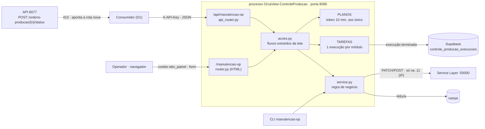

# Plano — API JSON da Manutenção de OP (Controle de Produção, porta 8080)

> **Status (29/09/2026): plano escrito, nada codado.** Aguarda a aprovação do Marcelo e a
> resposta da D1 (quem vai consumir). A tela Manutenção de OP está no ar na .11 desde 28/09
> (Buscar, Liberar, Encerrar; Replanejar só pela CLI — D9 do `PLANO_CONTROLE_PRODUCAO_11.md`).
> A rota `POST /ordens-producao/{n}/status` da API 8077 também libera OP, mas **nunca rodou em
> produção** (o pré-voo da OP 129850 nunca foi feito) e **não tem chamador** no web, no app nem
> na fachada MCP (grep de 29/09).

Artifact (mesma história, MESMA url): https://claude.ai/artifact/1Mt4xBk4bvuqv7oUuLuThf

---

## Tamanho da coisa

| | |
| --- | --- |
| **7 rotas JSON** | em `/api/manutencao-op`, no processo da tela (8080) |
| **1 regra nova** | Replanejar recusa OP com saída de insumo lançada — na API e na CLI |
| **0 regra duplicada** | tela e API chamam as mesmas funções (`acoes.py` → `service.py`) |
| **2 colunas** | `solicitante` e `origem` no histórico de Execuções (ALTER, sem tabela nova) |
| **10 min** | validade do token do Encerrar, uso único (o mesmo da tela) |
| **1 rota aposentada** | `POST /ordens-producao/{n}/status` da 8077 → 410 (D3) |

## Onde está agora

- **No ar hoje (.11, porta 8080, desde 28/09):** a tela Manutenção de OP — Buscar; Liberar
  (grava no 1º POST, sem token); Encerrar (conferir → plano com token de 10 min → execução em
  segundo plano); tela Execuções com as 30 últimas guardadas no Supabase. Replanejar só pela CLI
  (D9). Uma execução por módulo.
- **Não existe:** nenhuma rota JSON de escrita na 8080 — as rotas atuais devolvem HTML de
  formulário. O que a tela faz está dentro de `modules/manutencao_op/router.py`, misturado com
  o HTML.
- **Pende para começar:** aprovação deste plano, D1 (quem consome) e a F0 (duas conferências só
  leitura).
- Commits ainda não deployados na .11 (`e4a1252` → `3692fe6`, se continuarem pendentes) sobem
  junto com o deploy da API (F6).

---

## §1 Arquitetura — dois adaptadores sobre as mesmas funções



A API **não é uma camada nova de regra**: o que hoje está dentro das rotas da tela (validar a
seleção, recusar status terminal, montar o plano do Encerrar, disparar a execução) sai para
`modules/manutencao_op/acoes.py`, e as duas rotas — HTML e JSON — viram adaptadores finos.
Mensagem de erro igual por construção: as duas mostram o mesmo texto, que vem do mesmo lugar.

### Fatos que travam o desenho

1. **A trava e os tokens são memória do processo 8080.** `TAREFAS` (uma execução por módulo) e
   `PLANOS` (token do Encerrar) vivem no processo da tela. Uma API em outro processo — por
   exemplo, dentro da 8077 — não veria nem a trava nem os tokens. Por isso a API mora na 8080.
   De graça: execução disparada pela API conta no `/health/ocupado`, e o `deploy_update.bat`
   **aborta** enquanto ela roda.
2. **Escrita em produção só na .11, pelo IP.** `guardas.aviso_de_escrita` recusa (503) antes de
   criar a tarefa, e o `ServiceLayerClient` recusa antes do login. Alvo homologação não é barrado
   em nenhuma máquina (regra do pacote desde 22/09) — a API herda igual. Na .11 o alvo é
   `SBOALTAMIRAPROD`.
3. **Sem `OS_API_KEY` configurada:** a 8080 fica aberta para leitura e toda gravação responde
   **503** (`core/web.avisa_escrita`, fail-closed). A API herda exatamente isso.
4. **Encerrar é irreversível e em cadeia:** por OP, filha antes da mãe — libera (se Planejada) e
   põe as linhas em `im_Manual` → saída de insumo (OIGE) → entrada de produto (OIGN) → Encerrada.
   Se uma OP falha, as que dependem dela são **puladas**; a liberação só é desfeita se nada foi
   lançado.
5. **Interromper corta no próximo `await` e não desfaz nada.** No Encerrar isso pode cair entre a
   saída e a entrada da mesma OP — já é assim na tela hoje (D5).
6. **DocNum ≠ DocEntry** (a OP 125060 é o DocEntry 126599). A API só recebe DocNum — de OP e de
   pedido; o DocEntry só aparece na resposta.
7. **Buscar por pedido esconde OP Cancelada** (filtro `Status != 'C'` do legado); por número de
   OP, ela aparece e é recusada com motivo.
8. **`hdbcli` no Python 3.14 pode derrubar o processo** numa falha de conexão (medido no desktop
   em 24/09). API e tela caem juntas — é o preço do item 1.
9. **Rede:** `CP_HOST=0.0.0.0` + regra de firewall `192.168.0.0/16` — só a LAN alcança a 8080.
10. **Liberar não tem conferência** (a tela grava no 1º POST). A API segue a tela: Liberar e
    Replanejar gravam na primeira chamada; só o Encerrar tem token.

---

## §2 Fases

### F0 — Conferências só leitura — `aberta · Marcelo + eu`

> **Objetivo:** sabemos se alguém chama a rota de OP da 8077 e qual critério de "saída lançada"
> o SAP sustenta — antes de escrever uma linha.

- **Marcelo, na .11** — conta o que a rota de OP registrou no log da API (7 dias de
  `logs/api.log*`; a API não tem log de acesso, mas o módulo `ordens_producao_sl` registra cada
  consulta, mudança e recusa do SAP):

  ```powershell
  [Console]::OutputEncoding = [Text.Encoding]::UTF8
  cd C:\Python\ServidorIntegracaoSAP
  $linhas = Get-ChildItem .\logs\api.log* | Select-String -Pattern 'ordens_producao_sl|status da OP'
  "linhas: $($linhas.Count)"
  $linhas | Select-Object -Last 15 | ForEach-Object { $_.Line }
  ```

  Zero linhas → F4 aposenta direto (410). Alguma linha de `atualizada para` → alguém usa; D3
  passa a ter janela de aviso.
- **Eu, do notebook** (leitura em PROD, como o pré-voo de 28/09) — critério de "saída lançada":
  - **A:** `SUM(WOR1."IssuedQty") > 0` na OP;
  - **B:** existe linha em `IGE1` com `BaseType = 202` e `BaseEntry` = DocEntry da OP, num `OIGE`
    com `CANCELED = 'N'`.
  Conferir, nas OPs que tiveram saída **cancelada**, se o `IssuedQty` volta a 0. Se A e B
  concordam → **A** (uma subconsulta na `WOR1`, que o módulo já lê); se divergem → **B**.
  ⚠️ **Não sabemos se o SAP já recusa sozinho Liberada → Planejada com insumo
  baixado — nunca foi tentado.** A recusa fica no nosso código de qualquer jeito, antes da
  Service Layer, com mensagem legível.
- D1 respondida.

### F1 — Uma regra, um lugar — `aberta · eu`

> **Objetivo:** a tela continua idêntica para o operador, e tudo o que ela decide passa a estar
> numa função que a API e a CLI podem chamar.

- **`modules/manutencao_op/acoes.py` (novo)** — os fluxos que hoje moram em `router.py`:
  `prepara_mudanca_status(numeros, acao)`, `monta_plano_encerramento(ops | pedido)`,
  `executa_mudanca_status(tarefa, ops, acao)`, `executa_encerramento(tarefa, plano)` e
  `dispara(nome, descricao, corrotina, solicitante, origem)`. Recusa vira exceção
  `Recusa(tipo, mensagem, titulo, detalhes, colunas)`: a tela a mostra em `erro.html` (400, como
  hoje), a API em JSON com o HTTP do `tipo`.
- **`router.py`** vira adaptador; os testes da tela passam **sem mudar nenhuma mensagem**.
- **`service.py`:**
  - `levanta_ops` traz `baixada` (critério da F0); `queries.py` ganha a subconsulta em
    `OPS_POR_DOCNUM`, `OPS_POR_PEDIDO` e `OPS_MANUTENCAO`;
  - `muda_status("p")` recusa OP com `baixada > 0` (vai para `ignoradas` com o motivo; `baixada`
    ausente = recusa, fail-closed) — é a regra valendo também para quem chamar o serviço direto;
  - OP **já no destino** vai para `ignoradas` ("já estava Liberada") **sem PATCH**. A CLI e a
    rota 8077 já faziam isso; a tela gastava um PATCH sem efeito;
  - `acoes_possiveis(op)` → `["liberar", "replanejar", "encerrar"]` filtrado pelo status, pela
    saída lançada e por apontada < planejada. A API devolve isso em cada OP da busca.
- **Encerrar:** a trava do módulo é conferida **antes** de consumir o token. Hoje, com o módulo
  ocupado, o token é queimado e o operador tem de reconferir — vale para a tela também.
- **CLI `manutencao-op replanejar`:** a coluna Ação mostra "saída lançada — cancele no SAP antes"
  e a OP não entra; as OPs são **relidas logo antes de gravar** (o prompt de confirmação pode
  ficar minutos aberto).
- Se a D5 for aprovada: `finalizar_ops` para **só entre OPs** — a OP em curso termina a cadeia.
- Testes: regra da saída, "já no destino", `acoes_possiveis`, cada `Recusa`, CLI recusando;
  suíte inteira + `ruff` 0.

### F2 — Quem pediu — `aberta · eu (código) + Marcelo (SQL)`

> **Objetivo:** toda gravação — da tela ou da API — aparece nas Execuções e no log com a origem,
> e as da API com o nome de quem pediu.

- `Tarefa` ganha `solicitante` (texto, `None` na tela) e `origem` (`tela` | `api`);
  `TAREFAS.criar(..., solicitante=None, origem="tela")`; `para_json` devolve os dois.
- `core/historico.py`: `registro_de`, `_tarefa`, `_resumo` e `_COLUNAS_DA_LISTA` com os dois
  campos.
- **SQL (Marcelo, no SQL Editor do Supabase, ANTES do deploy)** — estende a tabela existente
  (conferido: é a tabela do histórico; nenhuma tabela nova):

  ```sql
  alter table public.controle_producao_execucoes
    add column if not exists solicitante text,
    add column if not exists origem text not null default 'tela'
      check (origem in ('tela', 'api'));
  notify pgrst, 'reload schema';
  ```

  ⚠️ **Deploy antes do SQL = toda gravação do histórico falha (coluna
  desconhecida) e a lista da tela mostra "histórico indisponível".** A execução no SAP não
  é afetada, mas a linha se perde.
- Tela Execuções: "por *fulano* · API" na lista e no detalhe.
- Log (`logs/controleproducao.log`, WARNING, junto do aviso de escrita que já existe): uma linha
  por gravação e por cancelamento — ação, `solicitante`, IP de origem, OPs, id da execução.

### F3 — A API — `aberta · eu`

> **Objetivo:** o consumidor busca, libera, replaneja, confere e encerra, acompanha e interrompe
> — pelo contrato do §3, com a mesma trava, o mesmo histórico e as mesmas mensagens da tela.

- **`modules/manutencao_op/api_router.py` (novo)**, prefixo `/api/manutencao-op`, as 7 rotas do
  §3. Busca e conferência são `def` (threadpool, como a tela: consulta lenta no HANA não congela
  o loop); gravações são `async` (criam a tarefa).
- **`core/acesso.py`:** `/api/*` só por `X-API-Key` — sem cookie (sem superfície de CSRF) e sem
  `?key=` (chave na URL vai parar em log). Chave ausente ou errada → 401 JSON. Sem chave
  configurada: leitura aberta, gravação 503 (fato 3).
- **Corpo:** validação própria → 400 `invalido` com a mensagem em português (o 422 automático do
  FastAPI sairia em inglês).
- **`main.py`:** inclui o router; em `/api/*` todo erro sai no formato `{ok, tipo, motivo}` (o
  mesmo da rota de OP da 8077). `/docs` continua fechado — o contrato é o `API_MANUTENCAO_OP.md`.
- Estado e cancelamento só enxergam execuções do módulo `manutencao_op` (id de outro módulo →
  404).
- Testes (`tests/controleproducao/test_api_manutencao_op.py`): cada rota; cada `tipo` de erro;
  **paridade de mensagem com a tela** (a mesma `Recusa` nas duas); 401/503; 202 → estado →
  terminada; cancelar; `ocupado` com a execução em andamento. O teste de cobertura de
  `test_web_modulos.py` (toda rota POST que grava passa por `avisa_escrita`) passa a varrer
  `/api/*` também.

### F4 — O destino da rota da 8077 — `depende da F0 e da D3`

> **Objetivo:** liberar OP tem uma porta só, com uma regra só.

- `POST /ordens-producao/{n}/status` → **410** `{"ok": false, "tipo": "movida", "motivo": "Liberar
  OP passou para a API da Manutenção de OP (porta 8080): POST /api/manutencao-op/liberar — ver
  API_MANUTENCAO_OP.md."}` — sem ler o corpo, sem Service Layer.
- `GET /ordens-producao/{n}` **fica** (é a única consulta de uma OP isolada pelo número; a API
  nova busca por pedido). `transicoes_permitidas` passa a vir sempre `[]` — o campo fica para não
  quebrar quem o lê.
- `ordens_producao_sl.py` **intocado** (arquivo-irmão do web): `atualizar_status` fica sem
  chamador; removê-lo é decisão separada. `OP_STATUS_PERMITIDOS` deixa de ter efeito (não é mais
  rollback de nada).
- `API_ORDENS_PRODUCAO.md` ganha aviso datado no topo; `CLAUDE.md` troca as três invariantes da
  rota de OP pela nova situação; testes da rota atualizados.

### F5 — Contrato e documentação — `aberta · eu`

> **Objetivo:** o consumidor integra lendo um arquivo só.

- **`API_MANUTENCAO_OP.md` na raiz**, no molde do `API_ORDENS_PRODUCAO.md`: DocNum ≠ DocEntry,
  base e chave, cada rota com `curl`, tabela de códigos, exemplos em Python e PowerShell, e as
  recomendações do §3.
- `CLAUDE.md` (Tarefa → o que ler; D9 passa a "Replanejar: CLI e API, não a tela"), `README.md`,
  `CHANGELOG.md`, `docs/controleproducao/GUIA_OPERADOR.md` (Execuções mostram quem pediu),
  nota na D9 do `PLANO_CONTROLE_PRODUCAO_11.md`.
- Commit nominal + push.

### F6 — Deploy e 1ª chamada real — `Marcelo`

> **Objetivo:** a API responde na .11 e a primeira gravação real foi conferida no SAP.

1. SQL da F2 no Supabase (antes de tudo).
2. `.\deploy_update.bat` na .11 (aborta se houver execução em andamento).
3. Smoke **só leitura**, da estação (PowerShell: `curl.exe`, não o alias `curl`):
   - `GET /api/manutencao-op/pedidos/<pedido>/ops` com a chave → 200; sem a chave → 401;
   - `POST /api/manutencao-op/liberar` **sem** `solicitante` → 400 (nada grava);
   - `POST /api/manutencao-op/encerrar/conferir` com um pedido → plano (o token vence sozinho em
     10 min, sem executar);
   - `POST :8077/ordens-producao/<n>/status` → 410 (se F4 entrou);
   - `/health` → `ok`, `historico: supabase`.
4. **1ª gravação real com o consumidor ao lado:** um Liberar numa OP escolhida por ele (ou pelo
   Anderson), conferida no SAP e nas Execuções ("por *fulano* · API").

---

## §3 Contrato proposto (vira o `API_MANUTENCAO_OP.md` na F5)

**Base:** `http://192.168.7.11:8080/api/manutencao-op` — só da LAN.
**Autenticação:** cabeçalho `X-API-Key: <chave>` (D2). Sem cabeçalho ou chave errada → 401.
**Números:** DocNum (de OP e de pedido), inteiros; texto só com dígitos também é aceito.
**`solicitante`:** obrigatório em toda gravação e no cancelamento; 1–80 caracteres; é o que
aparece no log e nas Execuções. ⚠️ **É declaração de quem chama, não identidade
conferida** — a chave é uma só.

| Rota | Corpo / parâmetros | Sucesso | Grava? |
| --- | --- | --- | --- |
| `GET /pedidos/{pedido}/ops` | `?op_de&op_ate&status_de&status_ate` (status P/R/L/C) | 200 lista de OPs, DocNum decrescente | não |
| `POST /liberar` | `{"ops": [125060], "solicitante": "…"}` | 202 + execução | sim, na hora |
| `POST /replanejar` | `{"ops": [125060], "solicitante": "…"}` | 202 + execução | sim, na hora |
| `POST /encerrar/conferir` | `{"ops": [...]}` **ou** `{"pedido": 84245}` | 200 plano + token | não |
| `POST /encerrar/executar` | `{"token": "…", "solicitante": "…"}` | 202 + execução | sim — irreversível |
| `GET /execucoes/{id}` | — | 200 estado | não |
| `POST /execucoes/{id}/cancelar` | `{"solicitante": "…"}` | 200 `{"cancelada": true\|false}` | interrompe |

Liberar e Replanejar recebem **lista de OPs** (como a tela); "todas do pedido" = buscar e mandar
os números. Encerrar aceita as duas formas, como a tela.

**Uma OP da busca:**

```json
{"op": 125060, "doc_entry": 126599, "status": "P", "status_desc": "Planejada",
 "item": "PPLPRTGALVA175000000#0#0#1050", "produto": "…", "planejada": 12.0, "apontada": 0.0,
 "restante": 12.0, "baixada": 0.0, "data_pedido": "2026-09-25", "data_inicio": "2026-09-26",
 "data_vencimento": "2026-10-10", "cliente_codigo": "C0…", "cliente": "…",
 "acoes_possiveis": ["liberar", "encerrar"]}
```

**Plano do Encerrar** (ordem = filha antes da mãe, calculada pela estrutura; é a ordem que a
execução segue):

```json
{"ok": true, "plano": {"token": "…", "operacao": "Encerrar OPs do pedido 84245",
  "valido_ate": "2026-09-29T15:10:00",
  "resumo": {"a_encerrar": 3, "a_liberar_antes": 1, "listadas": 4},
  "itens": [{"ordem": 1, "op": 125062, "item": "…", "planejada": 4, "apontada": 0,
             "status_atual": "Planejada", "acao": "LIBERAR + saída + entrada + encerrar",
             "processar": true}]}}
```

**Gravação aceita (202)** e **estado** (o mesmo JSON que a tela Execuções consulta a cada 2 s,
mais `solicitante` e `origem`):

```json
{"ok": true, "execucao": {"id": "3f9c0a1b2d4e", "nome": "Liberar OPs", "descricao": "125060",
  "solicitante": "…", "origem": "api", "situacao": "executando", "terminada": false,
  "desfecho": "rodando", "passo": "…", "passos_feitos": 0, "passos_total": 1, "percentual": 0,
  "linhas": ["…"], "resultado": null, "erro": null,
  "estado": "/api/manutencao-op/execucoes/3f9c0a1b2d4e"}}
```

`desfecho` é o campo a ler (ASCII): `fila` · `rodando` · `ok` · **`falhas`** (terminou, mas o
`resultado.com_erro` tem OPs) · `erro` · `cancelada`. `resultado` é o da tela: Liberar/Replanejar
→ `alteradas`, `com_erro`, `ignoradas`; Encerrar → `finalizadas` (com `saida_docentry`,
`entrada_docentry`, `foi_liberada`), `com_erro` (com `etapa`, `motivo`, `liberacao`),
`ignoradas`, `puladas`.

**Erros** — sempre `{"ok": false, "tipo": "…", "motivo": "<texto da tela>"}`, com `detalhes` (as
OPs) quando a recusa é por OP:

| HTTP | `tipo` | Quando |
| --- | --- | --- |
| 400 | `invalido` | número ou faixa inválida, nada selecionado, OPs **e** pedido juntos, `solicitante` ausente |
| 401 | `sem_chave` | `X-API-Key` ausente ou errada |
| 404 | `nao_encontrada` | nenhuma OP com esses números; execução inexistente ou de outro módulo |
| 409 | `status_terminal` | Liberar/Replanejar com OP Encerrada ou Cancelada — **o lote inteiro** é recusado |
| 409 | `saida_lancada` | Replanejar com OP que já tem saída de insumo — **o lote inteiro** é recusado |
| 409 | `ciclo` | Encerrar: OPs com dependência circular |
| 409 | `nada_a_encerrar` | nenhuma OP em condição (vem com os itens e o motivo de cada um) |
| 409 | `confirmacao_invalida` | token vencido, já usado ou desconhecido — reconferir |
| 409 | `ocupado` | já há execução no módulo (da tela ou da API) — vem `execucao_em_andamento` |
| 502 | `sap_indisponivel` | o HANA não respondeu à leitura |
| 503 | `escrita_desabilitada` | sem `OS_API_KEY` no servidor, ou alvo produção fora da .11 |
| 503 | `historico_indisponivel` | estado de execução antiga com o Supabase fora |

Mensagens novas (não existem na tela): `saida_lancada` (vale também na CLI), `sem_chave` (a
tela redireciona para `/entrar`) e `sap_indisponivel` (a tela dá 500).

**Recomendações ao consumidor** (vão para o contrato): conferir → mostrar o plano à pessoa →
executar; ler `desfecho`, nunca só `situacao`; consultar o estado a cada 2 s e parar em
`terminada`; repetir Liberar/Replanejar é seguro (OP já no destino é ignorada sem gravar),
repetir Encerrar não é possível (token de uso único); **interromper não desfaz** o que já foi
gravado; `409 ocupado` → acompanhar a execução que veio na resposta, não insistir.

---

## §4 Decisões

**Marcelo**

1. **Quem consome** — *aberta* (o pedido veio com `<quem vai consumir>` em branco). Muda o texto
   do contrato, a D2 e se a máquina do consumidor está na LAN (a 8080 só aceita
   `192.168.0.0/16`). **Recomendado:** dizer a equipe/sistema e de qual máquina chama; o contrato
   sai genérico até lá.
2. **Qual chave** — *aberta.* **Recomendado: a mesma `OS_API_KEY`.** Zero linha nova no `.env`;
   "sem chave configurada → 503" já é o comportamento; uma chave própria seria uma linha no `.env`
   capaz de desligar a função — o padrão que a regra das funções de produção evita. Custo: quem
   tem a chave também entra nas telas e na API 8077, e trocar a chave derruba os cookies de todos.
   Reavaliar se o consumidor for de fora da casa.
3. **Rota `POST /ordens-producao/{n}/status` da 8077** — *aberta.* **Recomendado: aposentar com
   410 (F4)** se a F0 mostrar zero uso; o `GET` fica. Motivo: duas portas para a mesma transição,
   com regras diferentes — a da 8077 não entra na trava do módulo, não entra nas Execuções e não
   registra quem pediu. Alternativas descartadas: manter as duas (a regra diverge com o tempo);
   fazer a 8077 chamar o serviço da 8080 (grava fora da trava e do histórico, que são memória da
   8080).
4. **Replanejar volta à tela?** — *aberta.* **Recomendado: não nesta entrega.** A regra da saída
   lançada remove o motivo da D9 (replanejar ao lado de um Encerrar que falhou no meio), mas a
   tela só muda se você pedir.
5. **Interromper o Encerrar só entre OPs** — *aberta.* **Recomendado: sim.** Hoje o "Interromper"
   da tela pode cortar entre a saída e a entrada da mesma OP (insumo baixado, produto não
   entrado, OP Liberada). Com a parada entre OPs, a OP em curso termina a cadeia. Vale para a
   tela e a API.
6. **Replanejar com produto já apontado** (`apontada > 0`, entrada lançada sem saída) —
   *aberta.* **Recomendado: recusar também**, com a mesma família de mensagem: é o mesmo problema
   (estoque movimentado numa OP Planejada). O pedido original fala só da saída de insumo.

---

Plano no repositório: `MCPs/ServidorIntegracaoSAP/docs/PLANO_API_MANUTENCAO_OP.md` · código de
referência: `controleproducao/modules/manutencao_op/{service,router}.py`, `core/{tarefas,confirmacao,
historico,acesso,web}.py`, `api.py` (rota de OP) · 29/09/2026.
