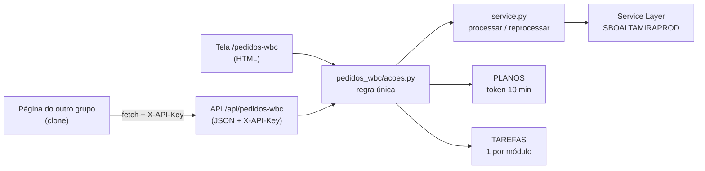

# Plano — API JSON dos Pedidos WBC (Controle de Produção, porta 8080)

> **Status (01/10/2026, 15:05): NO AR na .11 e conferida só leitura (33 de 33 itens: chave,
> CORS, lista igual à tela nos dois modos, conferência, recusas). Execução real ainda não
> exercitada — só num pedido escolhido pelo Marcelo.** Antes: F1–F5 codadas e conferidas localmente. A API `/api/pedidos-wbc` existe, com 41 testes de paridade com a
> tela; o guia `API_PEDIDOS_WBC.md` e a página pronta `docs/exemplos/pedidos_wbc_clone.html`
> foram conferidos contra a API de verdade com o SAP simulado — lista, paginação, conferência,
> execução concluída e com falha, tema claro e escuro, celular — e os exemplos de JavaScript,
> Python e PowerShell 5.1 do guia rodaram até o fim. **Nunca rodou contra o SAP.**

## Objetivo

Outro grupo quer uma página **igual** à tela *Integração de Pedidos (WBC)*
(`http://192.168.7.11:8080/pedidos-wbc`): mesma lista, mesmos botões, mesma conferência,
mesmo acompanhamento, mesmo resultado no SAP. Hoje a tela não tem API — o servidor devolve
HTML pronto — então ninguém de fora consegue nem ler a lista.

A API sai **desenhada a partir da tela**, não o contrário: cada coisa que a tela mostra tem
um campo com o mesmo nome e o mesmo valor, e cada texto que o servidor decide (aviso da
conferência, recusas, linhas do acompanhamento) chega pronto na resposta. Quem clona não
precisa reescrever regra nenhuma — só desenhar o que recebe.

## Fatos que travam o desenho

- **É a operação mais perigosa da .11.** Processar grava `U_INO_ProcessWBC='Y'` **antes** da
  primeira OP e não tem desfazer; Reprocessar cancela **todas** as OPs planejadas do pedido
  (de qualquer origem) e **não recria**.
- **Uma execução por vez no módulo**, e a trava é memória do processo (`core.tarefas.TAREFAS`).
  Por isso a API mora **no mesmo processo** da tela (porta 8080), como a da Manutenção de OP:
  uma execução da API bloqueia a da tela e vice-versa, aparece em *Execuções* e no histórico do
  Supabase, e o `deploy_update.bat` espera por ela.
- **Conferir → confirmar com token de uso único** (`core.confirmacao.PLANOS`, 10 min, preso à
  operação por `Plano.tipo`). A API usa o mesmo mecanismo — um token da tela não vale para
  outra operação, nem um da API.
- **"Forçar" fica fora da API** (decisão do Marcelo, 01/10): pela tela ele já duplica OP.

## Arquitetura

## Fases

### F0 — Ler a tela e o precedente — concluída
A tela tem 3 telas na prática: **lista** (novos/integrados, 15 por página, KPI, seleção),
**conferência** (aviso, resumo, tabela, validade, Confirmar/Cancelar) e **execução**
(pílula, barra, passo, log com linhas ⚠ em vermelho, Interromper, Resultado). O precedente é a
API da Manutenção de OP (`acoes.py` + `api_router.py` + `API_MANUTENCAO_OP.md`, 29/09).

### F1 — Uma regra só para tela e API — concluída (`9f6d33c`)
*Quando fechar: a tela e a API chamam as mesmas funções; os textos não têm como divergir.*
- `controleproducao/modules/pedidos_wbc/acoes.py`: paginação, plano de Processar/Reprocessar
  (relê a lista elegível e recusa o que saiu dela), consumo do token, corpo da execução
  (pedido a pedido, parada entre pedidos), disparo.
- `Recusa` sai de `manutencao_op/acoes.py` para `core/recusa.py` (os dois módulos usam; o
  antigo continua reexportando).
- A tela vira adaptador. **Comportamento da tela idêntico** — os testes atuais passam sem
  mudar o que verificam.

### F2 — A API `/api/pedidos-wbc` — concluída (`9f6d33c`)
*Quando fechar: um programa com a chave lista, confere, executa e acompanha, igual à tela.*

| Tela | API |
|---|---|
| Escolher "Pedidos novos"/"integrados" + paginação | `GET /api/pedidos-wbc/pedidos?modo=novos&pagina=1` |
| "Processar selecionados…" → conferência | `POST /api/pedidos-wbc/processar/conferir` |
| "Confirmar e executar" | `POST /api/pedidos-wbc/processar/executar` (202) |
| "Reprocessar selecionados…" → conferência | `POST /api/pedidos-wbc/reprocessar/conferir` |
| "Confirmar e executar" (reprocessar) | `POST /api/pedidos-wbc/reprocessar/executar` (202) |
| Tela de execução (atualiza a cada 2 s) | `GET /api/pedidos-wbc/execucoes/{id}` |
| "Interromper" | `POST /api/pedidos-wbc/execucoes/{id}/cancelar` |

- Mesmo transporte da Manutenção de OP: `X-API-Key` no cabeçalho, CORS para qualquer origem,
  JSON `charset=utf-8`, erro sempre `{"ok": false, "tipo", "motivo"}`.
- `solicitante` obrigatório em toda gravação e no Interromper (vai ao log e ao histórico).
- `force`/`forcar` no corpo → **400**, dizendo que não existe pela API.
- As respostas trazem os **textos da tela** que o servidor decide: aviso da conferência,
  rótulo do KPI, mensagem de lista vazia, recusas.

### F3 — Testes de paridade — concluída (41 testes)
*Quando fechar: um teste quebra se a API e a tela passarem a dizer coisas diferentes.*
- Mesma lista e mesma paginação (tela × API) sobre o mesmo HANA falso; mesmo plano; mesmas
  recusas (vazia, fora da lista, ocupado, token de outra operação, token usado).
- O token da conferência da tela não executa pela API com outro `tipo`, e vice-versa.
- `force` recusado; execução da API aparece como `origem: api` com o solicitante.

### F4 — Guia `API_PEDIDOS_WBC.md` (a documentação final) — concluída
*Quando fechar: o outro grupo constrói a página só com o guia.*
- Primeiros passos, conceitos (pedido × oportunidade × orçamento WBC; novos × integrados; o
  que Processar e Reprocessar gravam de fato; token; uma execução por vez), receitas com
  requisição e resposta reais, todos os erros, FAQ, "como testar sem estragar nada".
- **Como clonar a tela**: as três telas desenhadas, cada texto exato, cada estado (carregando,
  vazio, erro, ocupado), o comportamento do botão (habilita com 1+, conta "(n)", seleção vale
  só para a página), formatação de número e data.
- **Tema**: os tokens de cor claro/escuro da casa (`casa.css` + `style.css`), tipografia,
  raios, sombras, pílulas, barra de progresso, os ícones SVG usados.
- Exemplos em JavaScript, Python e PowerShell que pedem confirmação antes de gravar.

### F5 — Página de referência pronta — concluída
*Quando fechar: copiar um arquivo HTML e trocar endereço + chave já dá a tela funcionando.*
- `docs/exemplos/pedidos_wbc_clone.html`: um arquivo só, sem dependência, com as três telas,
  o tema claro/escuro e os mesmos textos, chamando só a API.
- Conferida contra uma API falsa local (lista, conferência, execução, erros), claro e escuro.
- **O que mordeu:** `replaceChildren(..., null)` escreve "null" na tela (só o `el()` filtrava);
  e a linha "ERRO" de um pedido chegava ao log **sem** a marca ⚠ — na tela original também.
  Corrigido na origem (`Tarefa.avanca(..., problema=True)`): vale para a tela e para a API.

### F6 — No ar (Marcelo) e conferência — no ar 01/10 ~14:58; conferência só leitura OK
- `deploy_update.bat` na .11 (reinicia o Controle de Produção).
- Conferência **só leitura** na .11: lista igual à tela nos dois modos; conferir devolve plano
  sem gravar; executar sem `solicitante` → 400; token inválido → 409. **Execução real só com
  um pedido escolhido por ele.**

## Decisões

1. **"Forçar" — ✅ fora da API** (Marcelo, 01/10). `force` no corpo é recusado com 400.
2. **Reprocessar — ✅ dentro, com conferência e token** (Marcelo, 01/10). O aviso completo vem
   na resposta da conferência para a página mostrar.
3. **Quem pode chamar — ✅ quem tem a chave, de dentro da rede**, igual à Manutenção de OP (D1
   de 29/09). A chave é a mesma `OS_API_KEY`.
4. **Página de referência no repositório (público)** — sem segredo: endereço e chave são
   preenchidos por quem usa. *Recomendado: sim* — é o que mais encurta o caminho do outro grupo.
5. **Cancelar OPs de um pedido** (mora na tela da Manutenção de OP desde 01/10) — *fora deste
   plano*; a API da Manutenção de OP é o lugar dela, se um dia for pedida.

## Arquivos

- `controleproducao/modules/pedidos_wbc/acoes.py` (novo) · `api_router.py` (novo) ·
  `router.py` (vira adaptador) · `core/recusa.py` (novo) · `main.py` (inclui o router)
- `tests/controleproducao/test_api_pedidos_wbc.py` (novo)
- `API_PEDIDOS_WBC.md` (novo, raiz) · `docs/exemplos/pedidos_wbc_clone.html` (novo)
