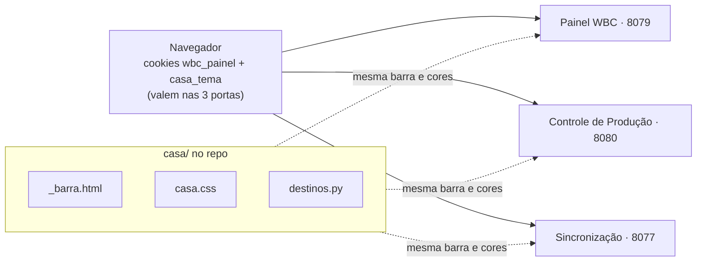

# Plano — Casa comum das telas da .11

> **Status (01/10/2026): F0–F5 NO AR na .11 e conferidas no navegador dele** (deploy 01/10 ~09:30;
> commits a032729 · 966c223 · fec8aca · d70c7f7 · ec16c18). As três telas com a mesma barra e o mesmo
> tema (cookie migrado do claro dele), login único entre as portas, `/inicio` com dados reais. Página publicada:
> https://claude.ai/artifact/Qim4SmTbstoyzgcoWG4UdQ (mesma url a cada atualização).

## O problema

As três telas da .11 funcionam, e funcionam bem. O que falta é parecerem a mesma coisa:

| Tela | Processo / porta | Cabeçalho | Paleta | Tema | Login |
| --- | --- | --- | --- | --- | --- |
| Integração WBC × SAP (painel) | `OrcaView-WBC-Painel` · 8079 · FastAPI+HTMX | título grande + botões contornados + abas | coral (OrçaView) | escuro padrão, chave `wbc-tema` (`data-tema="claro"`) | cookie `wbc_painel` |
| Controle de Produção | `OrcaView-ControleProducao` · 8080 · FastAPI | barra de navegação fina com links | coral (OrçaView) | escuro padrão, chave `orcaview-theme` (`data-theme="light"`) | mesmo cookie |
| Painel de Sincronização | `OrcaView-OS-API` · 8077 · Flask/waitress | logo "OS" azul + botão "Integração WBC" + cadeado | azul e branco, sem escuro | só claro | **chave colada na página** (`X-API-Key` no `localStorage`) |

Números: 3 telas, 3 portas, 3 cabeçalhos diferentes, 2 paletas, 2 chaves de tema (e uma
tela sem tema escuro), `sincronizar.html` com 523 linhas de HTML+CSS+JS próprios.

O detalhe que explica por que o tema "não pega" entre as telas: `localStorage` é separado
por porta, cookie não. O login já atravessa as portas (cookie `wbc_painel`); o tema não.

## A ideia em uma frase

**Mesma barra, mesma folha de cores, mesmo tema e mesmo login nas três telas — cada uma
continua no seu processo.** O usuário passa de uma para outra sem perceber que trocou de porta.

## Fatos que travam o desenho

- **Os três processos ficam separados.** É de propósito: `hdbcli` caindo derruba o processo
  (24/09), e uma execução pesada do Controle de Produção não pode derrubar o painel. Juntar
  tudo num processo só, ou pôr um proxy reverso na frente, está fora.
- **Sem CDN, sem fonte web:** a .11 roda na LAN. Tudo vendorizado, como hoje.
- **Contratos que não mudam:** `/health` e `/status` da 8077 (o watchdog do .90 lê sem
  credencial), `X-API-Key` para scripts, MCP e o .90, todas as rotas JSON.
- **Duas pilhas de template:** FastAPI (8079, 8080) e Flask (8077). As duas usam Jinja2 —
  é isso que permite um cabeçalho único.
- Repo público: nenhuma chave na página; a Sincronização para de guardar a chave no navegador.

## Arquitetura

Uma pasta comum no repo (`casa/`) com três peças, servidas pelos três processos:

- `casa/templates/_barra.html` — macro Jinja da barra: marca, links das telas, pílula do
  ambiente, tema e Sair. Recebe a tela ativa e os endereços das outras.
- `casa/static/casa.css` — tokens (a paleta coral que painel e Controle de Produção já
  dividem), barra, título de página, cartão, pílula, botão. Cada tela mantém o CSS próprio só
  para o que é dela.
- `casa/tema` — cookie `casa_tema` (`escuro`/`claro`, `path=/`), lido no servidor para
  escrever o `data-theme` no `<html>` antes da pintura, e gravado pelo botão. Cookie não
  separa porta: trocou numa tela, as outras abrem igual.
- `casa/destinos.py` — de onde sai o endereço de cada tela (configurado ou mesmo host na
  porta da tela). Hoje essa regra está copiada em três lugares (`api.py`, `wbcpython`,
  `controleproducao`).

## Fases

### F0 — Decisões (dele) — ✅ concluída 01/10/2026
As 6 decisões da seção Decisões, todas fechadas no mesmo dia.

### F1 — As peças comuns, estreando no Controle de Produção — ✅ codada 01/10/2026 · a032729
**O que passa a existir:** a barra e o tema compartilhados, na tela que já está mais perto.
- `casa/__init__.py` (`TELAS` = ordem e rótulos, `MARCA`, `tema()`, `instalar(env)`),
  `casa/templates/casa/_casa.html` (macros `cabeca()` e `barra()`), `casa/static/casa.css` e
  `casa.js`. `StaticFiles` em `/casa` no 8080 (aberto sem chave, como `/static`).
- `base.html` do Controle de Produção usa as macros; `style.css` aponta a paleta `--ov-*` para os
  tokens `--casa-*` (uma definição só); os 8 títulos de página viraram `.casa-titulo`.
- Testes: `tests/test_casa.py` (ordem do menu, tema do cookie, CSS sem `color-mix`, os dois temas
  com os mesmos tokens) e a barra/tema no `test_acesso.py`.
- Conferido na prévia com o CSS real: escuro e claro, produção e homologação, 1700/1366/1280 px e
  celular (375 px, sem rolagem lateral).
- **O que mordeu:** o script que migra o tema antigo forçava escuro quando não havia nada
  a migrar e sobrescrevia o `data-theme` do servidor — agora só mexe quando acha um "claro" antigo.
- `destinos.py` ficou para a F4 (feito lá).

### F2 — Painel WBC entra na casa — ✅ codada 01/10/2026 · 966c223
**O que passa a existir:** sair do painel para o Controle de Produção não muda o cabeçalho.
- `pagina.html`: a barra comum em cima; título "Integração WBC × SAP Business One" vira o
  título de página (mesmo bloco do Controle de Produção); "Incluir fora da janela" desce
  para a linha das abas; os três botões contornados somem (estão na barra); a tarja vermelha
  sai (decisão 3) e a aba "Execuções" passa a "Ciclos" (decisão 4).
- Tema: `wbc-tema`/`data-tema` passam a ler o cookie; quem já tinha escolhido "claro" no
  painel é migrado uma vez.
- HTMX continua igual: só a casca muda. As abas ficam numa linha presa sob a barra
  (`--casa-barra-altura`); o título usa `zoom: 1.125` para medir igual ao do Controle de Produção.
- Ganhou `/orcaview` (`ORCAVIEW_URL`, com teste de paridade) e `/controle-producao/tarefas`.
- No tema claro, o coral como texto passou a `#a94a2e` (5,7:1) nas duas telas — o ajuste do painel.

### F3 — Sincronização entra na casa — ✅ codada 01/10/2026 · fec8aca
**O que passa a existir:** a Sincronização com a mesma cara, tema escuro e sem chave colada.
- `sincronizar.html` vira template Jinja com a barra; CSS azul próprio sai, entram os
  tokens da casa (verde do "Forçar sincronismo" vira o botão de ação da casa; OK/FALHA
  viram as pílulas da casa).
- Login (decisão 6): sem o cookie `wbc_painel`, `/sincronizar` manda para a tela de entrada,
  como as outras duas; com ele, a página e as chamadas dela usam o cookie (mesmo HMAC). O
  campo da chave e o `localStorage` saem. `X-API-Key` continua valendo para quem chama por script.
- Escrita por cookie exige mesma origem (a regra de CSRF do Controle de Produção).
- A rota continua `/sincronizar` na 8077 — ninguém precisa mudar favorito.
- O cookie (nome, HMAC, comparação) mudou para `casa/acesso.py`; o painel reexporta. Rotas novas
  e abertas na 8077: `/entrar`, `/sair`, `/orcaview`, `/controle-producao/<tela>`, `/casa/<arquivo>`.
- **O que mordeu:** na prévia, a janela "Buscar na lista" abria sozinha — `display: grid` vencia o
  atributo `hidden`. A regra `[hidden] { display: none !important }` foi para o `casa.css` (vale nas três).

### F4 — Acabamento — ✅ codada 01/10/2026 · d70c7f7
- `casa/destinos.py`: a regra "configurado ou mesmo host na porta" é uma só (eram seis cópias).
- A entrada da 8077 (`GET /`) também na casca, com a mesma sonda de 3 s para o painel.
- Docs: `GUIA_OPERADOR`, `README`, `docs/wbc/README.md`, README do `controleproducao`, `CLAUDE.md`.
- Conferido na prévia: claro/escuro e 1700/1366/1280 px nas três; celular no Controle de Produção.

### F5 — Início com o estado — ✅ codada 01/10/2026 · ec16c18
**O que passa a existir:** um lugar para ver, de relance, se as três telas estão no ar.
- `/inicio` na 8077 (mesmo login): um cartão por tela com faixa e pílula de estado e os fatos
  que importam; embaixo, as conexões (HANA, SQL Server do WBC, Supabase, disco) e os avisos do
  monitor. Só lê o `/status` e os logs de sincronização — nenhum check novo. Atualiza a cada minuto.
- **A marca "Central Integração SAP" da barra é o link para o início**, nas três telas — a ordem
  do menu (decisão 2) não mudou e `/` continua indo para o painel (decisão de 08/09).

## Ideias consideradas e descartadas

| Ideia | Por que não |
| --- | --- |
| Um processo só (tudo na 8077 ou na 8080) | Desfaz o isolamento que protege o painel do `hdbcli` e das tarefas pesadas |
| Proxy reverso (uma porta, caminhos `/wbc`, `/producao`…) | Serviço novo na .11 (Caddy/nginx) para manter; resolve o que o cookie já resolve |
| Iframe de uma tela dentro da outra | Dois cabeçalhos empilhados, rolagem dupla, login confuso |
| Só trocar as cores da Sincronização | Resolve a paleta, não o desencontro dos cabeçalhos nem o tema |

## Decisões

1. ✅ **Nome da casa — "Central Integração SAP"** (Marcelo, 01/10/2026). Marca à esquerda da
   barra nas três telas; o nome de cada tela fica no título da página.
2. ✅ **Ordem do menu** (recomendação aceita, 01/10/2026): ← OrçaView · Integração WBC ·
   Pedidos WBC · Manutenção de OP · Sincronização · Execuções — o caminho do pedido
   (WBC → SAP → OPs), com a Sincronização, que é paralela, no fim.
3. ✅ **Faixa de produção** (recomendação aceita): nenhuma tarja; pílula com a company DB na
   barra, vermelha em produção, igual nas três; fora de produção a faixa cinza que já existe.
4. ✅ **Duas "Execuções"** (recomendação aceita): a aba do painel passa a se chamar "Ciclos" (F2);
   "Execuções" na barra é a do Controle de Produção.
5. ✅ **Tema — escuro por padrão nas três, com o botão para trocar para claro** (Marcelo,
   01/10/2026). A escolha fica no cookie `casa_tema` e vale nas três telas.
6. ✅ **Login — o mesmo nas três, e as três exigem a chave** (Marcelo, 01/10/2026). A
   Sincronização passa a abrir pela tela de entrada (cookie `wbc_painel`), como o painel e o
   Controle de Produção; o campo de colar a chave e o `localStorage` saem. `X-API-Key`
   continua para scripts, MCP e o .90.
