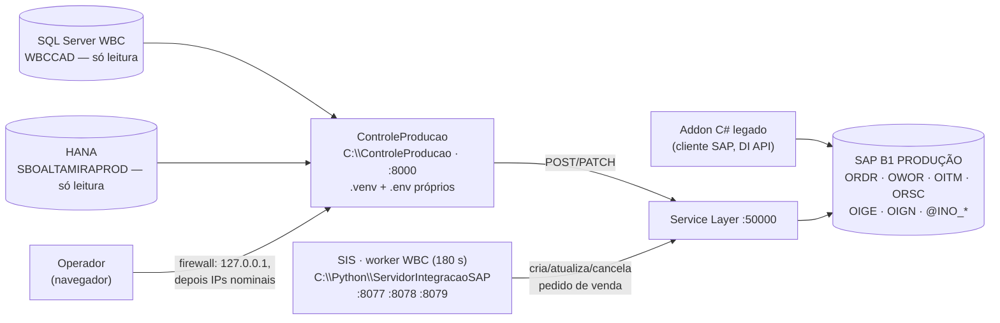

# Plano — Controle de Produção (WBC → OPs) na .11

> **Status (28/09/2026): PLANO ESCRITO, NADA INSTALADO NA .11.** O pacote foi analisado no
> notebook (7 leitores em paralelo + céticos + crítico; suíte rodada num venv descartável).
> Ele grava em `SBOALTAMIRAPROD` **sem login e sem trava**; o módulo 2 foi validado em
> homologação em 21/09 e já gravou em produção em 22–23/09 (com OP em dobro pelo addon);
> o módulo 3 está **pendente de reteste**; 8 correções de código depois da última execução
> validada. Antes de tocar a .11: decisões D1–D11 (Marcelo) e D12–D16 (Anderson).

Artifact (mesma história, MESMA url): https://claude.ai/artifact/3womT78TmCZHdaQVZ4nuYH

Pacote analisado: `IntegracaoPedido_CriacaoOP/ControleProducao/` (montado em 24/09/2026 na
máquina do Anderson, `anderson.marques@altamira.com.br`, dono da aplicação). Manifesto
conferido: 124/124 arquivos íntegros.

---

## Tamanho da coisa

| | |
|---|---|
| Módulos | **2** — *Pedidos WBC* (cria OPs, itens, estruturas, recursos) e *Manutenção de OP* (liberar, replanejar, encerrar com estoque). Módulo 4 é esqueleto; módulo 1 saiu do escopo em 22/09 |
| Código | 11.828 linhas Python (`pedidos_wbc/service.py` = 2.439; `cli.py` = 1.614) |
| Suíte | 244 testes: **243 verdes, 1–2 instáveis** a cada rodada (`test_web_modulos.py`, corrida em teste que lê o estado da tarefa em background; passam sozinhos) |
| Dependências | 38 wheels (10,3 MB) para Python 3.14 x64 — **num `.venv` próprio**, nunca no Python global |
| Escritas no SAP | Módulo 2: ≈ 3 + itens novos + grupos×(3–4) + semiacabados + logs chamadas SL por pedido. Módulo 3: ≈ 4 escritas por OP (68 OPs ≈ 270 chamadas) |
| Validado | Homolog 21/09: pedido 84263 (29 vs 29 OPs), 84348 (68 vs 68; 43/47 estruturas, 4 com ±0,01). `encerrar` numa OP (156209). **Produção:** 84425/84426 em 22–23/09 |
| Login / trava / CSRF | **0 / 0 / 0** — o único controle é a regra de firewall |

---

## Onde está agora

- **No notebook:** pacote íntegro em `MCPs/ServidorIntegracaoSAP/IntegracaoPedido_CriacaoOP/`
  — **dentro do clone do repo PÚBLICO do SIS**, não versionado. Um `git add .` publicaria
  38 wheels, código e docs internas. Linha `IntegracaoPedido_CriacaoOP/` entrou no
  `.gitignore` do SIS junto com este plano (proteção mínima até a decisão D2).
- **Na .11:** nada instalado. A máquina já tem o que o roteiro do pacote manda instalar:
  Python 3.14.7 "for all users" (`C:\Program Files\Python314`), `nssm` no PATH, porta 8000
  livre (sondada 28/09). Falta conferir o ODBC Driver 18 e o perfil do firewall.
- **O que funciona hoje, e onde:** o módulo 2 processa um pedido de venda **já criado pelo
  worker WBC do SIS** e cria por cima dele OrcDetalhe, itens, recursos `GGF_`, OPs (cascata
  de semiacabados) e carimba `U_INO_ProcessWBC`/`U_INO_Congelado`/`U_INO_OP`. Validado em
  homolog; gravou em produção em 22–23/09 — no mesmo dia o addon C# reprocessou o 84426 e
  as OPs saíram **em dobro**; 2 OPs saíram com quantidade errada (corrigidas à mão).
- **O que foi codado mas nunca rodou de verdade:** `liberar` como comando; qualquer clique
  de escrita na web; `encerrar --pedido`; `reprocessar-integrados` (usa nomes de campo
  "a confirmar"); e as 8 correções de 23–24/09 (4 no módulo 2: rateio com `VisCode`,
  contagem de OP por grupo, DocNum via DocEntry, quantidade da linha do grupo; 4 no módulo 3).
- **Sessões do Service Layer:** o pacote faz 1 login por tarefa/comando e **nunca `/Logout`**
  (admitido em `docs/SEGURANCA.md`). O SIS faz logout nos dois clientes dele. Na .11 os
  dois usariam o mesmo SL, que tem teto de sessões.

---

## §1 Arquitetura — quem escreve onde



Três escritores no mesmo pedido/OP de produção: o **worker WBC** (cria o pedido, refaz as
linhas a cada revisão do orçamento salvo `U_INO_Congelado='Y'`, cancela-e-recria na troca de
PN **sem olhar OWOR**), o **pacote** (grava `Congelado='Y'` ao processar — e nunca reverte —,
`U_INO_OP` nas linhas, OPs) e o **addon C#** (mesmas telas, sem a guarda de OP duplicada).
Produção já tem **2.581 pedidos** com `Congelado='Y'`.

### Fatos que travam o desenho

1. **Não há trava de produção nem gate por IP** (removida em 22/09 a pedido do Anderson):
   `is_production` só pinta a faixa vermelha. O `.env` da .11 copiado para qualquer máquina
   grava em produção.
2. **Sem login, sem CSRF, `/docs` aberto.** `Liberar`/`Replanejar` gravam **no primeiro
   POST**; a docstring do router diz que produção exige digitação — está desatualizada.
   O script 05 escuta `0.0.0.0` e libera `LocalSubnet` por padrão: na .11 isso é
   `192.168.7.0/24`, que inclui o terminal server RDP `.12` com todos os usuários do SAP.
3. **`.env` próprio em caminho fixo** (`python_app\.env`), mesmos nomes do bloco WBC do
   SIS, **mas**: sem o fallback `SL_USERNAME → OP_SL_USERNAME`; `HANA_SCHEMA` é o schema de
   ESCRITA lida (ORDR/OWOR), não só de views; e o bloco "RESERVADO" (`PAINEL_PORTA=8501`,
   `WORKER_*`, `TRACKING_DB_URL`) colide com variáveis vivas do painel/worker do SIS.
   **Nunca copiar nem mesclar o `.env` do SIS.** Nenhuma variável é obrigatória no código:
   senha faltando só aparece na hora de conectar.
4. **Pins incompatíveis com o SIS** (`hdbcli` 2.30.24 vs 2.29.23; `websockets` 17.1 vs
   15.0.1; `python-dotenv` 1.2.3 vs 1.2.2). O `.venv` que o script 02 cria é o que
   isola — exceção deliberada à regra "Python global sem venv". `pip` fora dele derruba os
   5 serviços.
5. **`U_INO_ProcessWBC='Y'` é gravado ANTES da primeira OP.** Queda no meio = pedido
   "processado" sem OP; retomar sem `--force` é barrado, com `--force` duplica. Único
   desfazer: `cancelar-ops` (não desfaz itens, recursos nem o congelamento).
6. **`reprocessar-integrados` cancela TODAS as OPs planejadas do pedido** (inclusive do
   addon), **não recria nada**, duplica OrcDetalhe e o estágio na Oportunidade, e reescreve
   `SalesOpportunities` que o worker governa. Fora da primeira entrega.
7. **Um processo só** (`--workers 1`), tarefas e tokens em memória: restart no meio de uma
   execução perde o histórico e deixa OPs pela metade. A .11 reinicia todo dia ~06:12 e tem
   reboot pendente.
8. **O ODBC é exato:** `WBC_SQL_DRIVER` sem fallback (o SIS cai 18→17; o worker usa
   `pymssql` — não prova que o 18 existe na .11).
9. **O SIS já tem "status de OP" via SL** (`ordens_producao_sl.py`: Liberar/Encerrar por
   PATCH puro, ligado pelo IP desde 28/09, nunca exercitado). O `encerrar` do pacote faz
   saída+entrada de estoque antes de fechar — fechar sem estoque é o que o pacote chama de
   apontamento inconsistente. Uma transição, um dono.
10. **Pré-requisito da lista "Pedidos Novos" é `ORDR.U_INO_Integrar='Y'`** — ninguém achou
    quem grava isso; pedidos criados pelo worker nascem sem ele. A lista pode vir vazia.

---

## §2 Fases

Regra geral: a .11 não tem Claude nem WinRM. Cada fase é um bloco PowerShell 5.1 que o
Marcelo cola e devolve **a saída inteira**; só avança com `[OK]` ou `[AVISO]` explicado.
Todo script do pacote roda da raiz: `powershell -ExecutionPolicy Bypass -File .\scripts\NN.ps1`.

### F0 — Arrumar a casa (notebook) — `em andamento`

*Ao fechar: o pacote não pode vazar para o GitHub, o plano tem endereço e o prompt de
implantação diz a verdade sobre a .11.*

- ✅ Plano em `docs/PLANO_CONTROLE_PRODUCAO_11.md` + artifact (mesma url).
- ✅ `IntegracaoPedido_CriacaoOP/` no `.gitignore` do SIS.
- ✅ Prompt de implantação reescrito (Anexo A).
- ✅ Suíte do pacote rodada num venv descartável do scratchpad (Python 3.14.7, mesmo da .11):
  wheels instalam, `pip check` limpo; 243/244, 1–2 instáveis por rodada em
  `test_web_modulos.py` — o script 03 vai acusar `[FALHA]`; aceitar com esta explicação.
- ✅ Sonda: `hdbcli` 2.30.24 **não** derrubou o processo na recusa de socket
  (127.0.0.1:9, timeout 2 s) — nem o 2.29.25. O crash da memória é outro modo de falha;
  continua a conferência na F5.
- Proposto (D2): mover a pasta para `D:\ProjetoAltamira\MCPs\ControleProducao` (irmã do SIS e
  do SAP_RDP) e criar repo **privado** `MarceloProjetos/ControleProducao` com o Anderson como
  autor. Apagar as cópias duplicadas `decisoes.md`/`migration_guide.md` da raiz de
  `IntegracaoPedido_CriacaoOP` (idênticas às de `docs/`, fora do manifesto).

### F1 — Decisões e pedidos ao Anderson — `aberta · gate`

*Ao fechar: sabe-se o que vai ao ar, quem opera, quem manda em cada campo do pedido e o que
o Anderson entrega antes do go-live.*

- Marcelo responde D1–D11; Anderson responde D12–D16 (§4).
- Pedido ao Anderson, com diff auditável (o CLAUDE.md do pacote proíbe mudar código na
  implantação — por isso é ANTES): **bloqueantes** = `POST /Logout` em `aclose()` (cópia do
  padrão do `wbcpython/infrastructure/service_layer/client.py` do SIS), gate de chave nas
  rotas de escrita **e em `POST /tarefas/{id}/cancelar`** (padrão `OS_API_KEY`/cookie HMAC
  do painel WBC) + `docs_url=None` + conferência de `Origin`, guarda `HANA_SCHEMA ==
  SL_COMPANY_DB` na subida. **Desejáveis** = corrigir os 2 testes instáveis, docstring do
  router (`manutencao_op/router.py:10-11`), `cancelar-ops` restaurar `U_INO_Congelado`,
  esconder `Reprocessar` e o módulo 3 do menu até o reteste, `VERSAO.txt` no manifesto,
  validar `doc_num`/`op_docnums` como dígitos (hoje colados no SQL por `str.format`).
- Anderson roda em PROD (só leitura) as consultas de levantamento
  `migration_guide.md:1659-1664` e `:1706-1711` e decide, pedido a pedido, o que corrigir à
  mão do que ficou em 22–23/09 (OPs do 84425 sem rateio, OPs em dobro do 84426, OrcDetalhe
  órfãos, itens no grupo 358). A guarda de OP duplicada conta OPs prévias por item: sujeira
  muda a decisão dela.

### F2 — Preparo da .11 (só leitura) — `aberta · Marcelo`

*Ao fechar: sabemos exatamente o que existe na .11 e nada foi instalado.*

Marcelo cola e devolve a saída inteira (nada aqui grava):

```powershell
[Console]::OutputEncoding = [Text.Encoding]::UTF8
& 'C:\Program Files\Python314\python.exe' --version
& 'C:\Program Files\Python314\python.exe' -m pip show hdbcli websockets python-dotenv | Select-String 'Name|Version'
(Get-Command nssm.exe).Source; nssm version
Get-OdbcDriver -Platform 64-bit | Select-Object Name
Get-NetConnectionProfile | Select-Object Name, NetworkCategory
Get-NetFirewallProfile | Select-Object Name, Enabled
Get-NetTCPConnection -LocalPort 8000 -ErrorAction SilentlyContinue
Test-NetConnection sapbusinessonehana-vm -Port 50000 -InformationLevel Quiet
```

- Esperado: Python 3.14.7; `hdbcli 2.29.23 / websockets 15.0.1 / python-dotenv 1.2.2`
  (**linha de base** — tem de continuar igual depois da F4); `nssm` ≥ 2.24-101 (senão
  `-Metodo Tarefa`, D-op); Driver 18 **ou** só 17 (aí `WBC_SQL_DRIVER=ODBC Driver 17 for SQL
  Server` no `.env`, sem instalar nada); perfil Domínio/Privado com firewall **ligado**
  (se desligado por GPO, a regra do 05 é inerte — parar).
- TLS (D6): exportar o certificado self-signed do SL em Base-64 para
  `C:\ControleProducao\config\ca-sl.pem` e apontar `SL_CA_BUNDLE`; ou `SL_VERIFY_SSL=false`
  como o SIS, registrado.
- Reboot pendente (D10): aplicar ANTES da F4, numa janela dele, com `state\wbc_worker.stop`
  gravado antes; conferir os 5 serviços `OrcaView-*` depois. O reboot das 06:12 é o teste
  de "volta sozinho" da F6 — nenhum reinício extra.

### F3 — Transferência e integridade — `aberta · Marcelo`

*Ao fechar: o pacote está em `C:\ControleProducao` e é bit a bit o que foi analisado.*

- Canal (D-op): compartilhamento SMB, pendrive ou clone do repo privado (o deploy vira
  `git pull`, como o SIS). Nunca dentro de `C:\Python\ServidorIntegracaoSAP` (o 02 remove a
  herança de ACL da raiz com `icacls /inheritance:r`).
- `Get-ChildItem C:\ControleProducao -Recurse | Unblock-File` → `00_verificar_manifesto.ps1`
  tem de dizer **"Pacote íntegro"** → `01_verificar_pre_requisitos.ps1` (esperado: Python OK,
  `.env` ausente, ODBC conforme F2).

### F4 — Instalação isolada — `aberta · Marcelo`

*Ao fechar: `.venv` criado, suíte rodada, e o SIS provadamente intocado.*

- `02_instalar.ps1` (offline; **nunca `-Online`**, nunca `pip` fora do `.venv`): cria
  `python_app\.venv`, instala as 38 wheels, `pip check`, copia `.env.example → .env` e
  restringe a ACL do `.env`.
- `03_testar.ps1` **antes** de preencher o `.env` (a suíte não tem conftest que trave
  drivers; com `.env` real presente, um mock esquecido alcança produção). Esperado:
  242–243 verdes e 1–2 `FAILED tests\test_web_modulos.py::…` — instabilidade conhecida
  (F0), não bloqueia.
- Prova de isolamento: repetir o `pip show` da F2 no Python global — **mesmas versões**;
  `Get-Service OrcaView-* | Select Name, Status` — os 5 `Running`;
  `Get-CimInstance Win32_Process -Filter "Name='python.exe'" | Select ProcessId, ExecutablePath`.

### F5 — Homologação na .11 — `aberta · Marcelo + Anderson`

*Ao fechar: cada operação que vai ao ar rodou de verdade, contra `SBOALTAMIRAHOMOLOG`, a
partir da .11, com DocEntry anotados — e o rollback do `encerrar` foi provado.*

Pré-condição (D7): o SL serve a company HOMOLOG e o usuário HANA tem SELECT nela;
homolog restaurada de PROD recentemente. Se não der, **não pular**: pedir credencial.

- Marcelo preenche `python_app\.env` no Bloco de Notas **como administrador**, à mão,
  **sem colar senha no chat**: `SL_COMPANY_DB=SBOALTAMIRAHOMOLOG`,
  `HANA_SCHEMA=SBOALTAMIRAHOMOLOG`, `HANA_SCHEMA_LEGADO=SBOALTAMIRAPROD`,
  `SL_BASE_URL=https://sapbusinessonehana-vm:50000/b1s/v1`, `SL_VERIFY_SSL`/`SL_CA_BUNDLE`
  (D6), `WBC_SQL_DRIVER` (F2), usuários (D5). Bloco RESERVADO fica como está no exemplo.
  Senha com ` #`, `$` ou aspas no início: entre aspas simples.
- `01` de novo (agora testa rede) → `03_testar.ps1 -Conexoes -PularSuite` (abre 1 sessão SL
  que **não é encerrada** — não repetir à toa) → `04_iniciar_manual.ps1` e Marcelo abre
  `http://127.0.0.1:8000/` na .11: menu, lista carregando, **faixa de produção ausente**.
- Reteste mínimo, janela conjunta de ~2 h (Anderson escolhe, Marcelo executa pela CLI com
  `$env:PYTHONUTF8='1'`):
  - Módulo 2: `processar-novos` num orçamento com ≥ 2 grupos do mesmo item e `GGF_` ainda
    inexistente; `comparar-ops <orc> --detalhes` contra PROD; conferir `ORSC` (rateio),
    `U_INO_OP` nas linhas, quantidade da linha do grupo. Depois `cancelar-ops` do mesmo
    pedido e conferir que só OWOR/ORDR voltam (itens, recursos e `Congelado` **não** voltam).
  - Módulo 3: `liberar` 1 OP; `encerrar` 1 Planejada e 1 Liberada com custo apurado
    (consulta da seção 7.33); `encerrar --pedido` num pedido pequeno (filha→mãe); 1 clique de
    cada ação pela web em 127.0.0.1.
  - Rollback provado: Anderson cancela no cliente SAP a entrada e a saída de um `encerrar`
    de teste (OIGN → OIGE) e registra o passo a passo e a permissão necessária. Testar
    também o caminho "saída lançada, entrada falhou": rodar `encerrar` de novo na mesma OP
    (inferido do código, não documentado) ou cancelar a saída — escolher um e escrever.
- Gate de saída: **0 divergências**, todos os DocEntry no checklist preenchido.

### F6 — Serviço em produção, fechado em 127.0.0.1 — `aberta · Marcelo`

*Ao fechar: a aplicação roda como serviço na .11 apontando para produção, alcançável só no
próprio servidor, e o `/status` do SIS enxerga o serviço.*

- Trocar no `.env`: `SL_COMPANY_DB=SBOALTAMIRAPROD` **e** `HANA_SCHEMA=SBOALTAMIRAPROD`
  (os dois; é o bug de 21/09 se divergirem). `01` → saída inteira com
  `[OK] Todas as variáveis obrigatórias…`, aviso "GRAVA EM PRODUÇÃO" e **sem** aviso de
  schema diferente. `03 -Conexoes -PularSuite`.
- `pedidos-wbc buscar` (só leitura): a lista tem de vir com pedidos e o primeiro DocNum
  conferido no SAP. Lista vazia = `U_INO_Integrar` (D16), não defeito da instalação.
- Antes do 05: abrir `/tarefas` à mão (os scripts consultam com timeout 5 s e tratam
  timeout como "nada a proteger").
- `05_instalar_servico.ps1 -Porta 8000 -Endereco 127.0.0.1` como Administrador (NSSM já no
  PATH; LocalSystem, igual aos 5 do SIS). Sem `-Permitir`. Conferir `Get-Service
  ControleProducaoWBC`, `logs\app.log` com "Application startup complete", faixa vermelha
  em `http://127.0.0.1:8000/`. Opcional, fora do manifesto: `nssm set ControleProducaoWBC
  AppRotateFiles 0` + `AppStdoutCreationDisposition 2` (o NSSM renomeia e nunca apaga — o
  SIS já pagou por isso).
- No dia seguinte, após as 06:12: serviço `Running` e os 5 do SIS também.
- **Claude (SIS):** check `controle_producao` em `monitoring.py` (GET
  `http://127.0.0.1:8000/` com timeout 3 s + `Get-Service`), sem alerta enquanto o serviço
  não existir; `SELECTABLE_CHECKS` + despacho + saída + `_CHECK_ALIASES` do `api.py` +
  teste. Deploy dele. Linha no CLAUDE.md do SIS: 6º serviço, porta, pasta, `.venv`/`.env`
  próprios, **fora do `deploy_update.bat`**.

### F7 — Piloto em produção — `aberta · Anderson + Marcelo`

*Ao fechar: três orçamentos reais processados pela web/CLI na .11 e conferidos OP a OP no SAP,
sem divergência, e o addon parou de tocar neles.*

- Anderson nomeia 3 orçamentos "da web", comunica ao PCP **antes** ("não processar nem
  atualizar esses pedidos no addon") e registra o envio no checklist.
- Para cada um, antes de processar: no painel WBC (8079) ou `python -m wbcpython pendentes`,
  o orçamento **não** tem ação `atualizar_pedido`/`cancelar_e_recriar_pedido` pendente; as
  duas consultas de localização do pedido (`ORDR.U_INO_COTWBC` e `OOPR.U_ORCNUM_WBC` via
  OPR1) devolvem o **mesmo** DocEntry; `U_INO_UpdateDetalhe='Y'` fica fora (esse ramo
  quebra em runtime); `U_INO_EntregaMultipla='Y'` fica fora até D15.
- Execução dentro do expediente, nunca depois das 17:30, nunca com reinício programado;
  `--force` e `--sim` proibidos; conferir e executar em sequência (token vale 10 min).
- Depois de cada um: OP a OP no cliente SAP (nº de OPs, quantidade da linha do grupo, `GGF_`
  em ORSC, `U_INO_OP` nas linhas); `@INO_LOG` dos últimos 7 dias por orçamento; `logs\app.log`
  sem `SEM OP` nem `rateio` (erros de semiacabado e rateio são engolidos de propósito);
  consulta de auditoria de OPs órfãs (`OWOR.Status<>'C'` com `OriginAbs` em pedido
  `CANCELED='Y'`), a repetir após cada troca de PN registrada no painel WBC.
- Retomada após queda no meio (procedimento único): `manutencao-op buscar <DocNum>` →
  `pedidos-wbc cancelar-ops <DocNum>` (barra se houver OP liberada) → `processar-novos`
  **sem** `--force`. Parar o serviço só por `06_remover_servico.ps1 -ManterFirewall`
  (confere `/tarefas`); nunca `Stop-Service`/services.msc; nunca `-Forcar`.
- Gate: 0 divergências nos 3 → addon "Integração de Pedidos (WBC)" desligado para pedidos
  novos (decisão do Anderson); 1º nível de suporte Anderson (negócio/SAP), 2º Marcelo.

### F8 — Abrir para a rede — `aberta · bloqueada por F1`

*Ao fechar: os operadores usam a tela das estações deles, com identidade, sem que a
sub-rede do SAP inteira alcance a escrita.*

- **Só depois** de o Anderson entregar os bloqueantes da F1 (Logout, gate de chave,
  `docs_url=None`, `Origin`). Então `05_instalar_servico.ps1 -Permitir <IPs nominais>`
  (nunca `LocalSubnet`, nunca a `.12`); testar acesso **negado** a partir da `.12`.
- Módulo 3 exposto só depois da F5. Quando for: `OP_STATUS_PERMITIDOS=boposReleased` no
  `.env` do SIS (allowlist já existente, não é flag `*_ENABLED`) — SIS/OrçaView fica só com
  Liberar; Encerrar com estoque é do pacote; Replanejar só pela CLI, na mão do Anderson (D9).

### F9 — Operação contínua e o futuro — `aberta`

- Versão: `VERSAO.txt` no manifesto (Anderson); o checklist registra
  `Get-FileHash MANIFESTO.sha256`. Atualização = roteiro §7 do CLAUDE.md do pacote, sempre
  `06 -ManterFirewall` antes de `02 -Recriar` (o `02 -Recriar` não olha `/tarefas`).
- Senhas: enquanto houver 2 `.env` (D5), rotação alcança `C:\Python\ServidorIntegracaoSAP\.env`
  **e** `C:\ControleProducao\python_app\.env`, conferida com `03 -Conexoes`.
- Trocar o Python da .11 exige `02_instalar.ps1 -Recriar` (o `.venv` guarda o caminho) — vai
  para o gotcha do CLAUDE.md do SIS junto com o do worker.
- Desinstalar: `06_remover_servico.ps1` (sem `-ManterFirewall`) → `Remove-Item
  C:\ControleProducao -Recurse -Force` → vazios: `Get-Service ControleProducaoWBC`,
  `Get-NetFirewallRule -DisplayName 'ControleProducao WBC*'`, `Get-NetTCPConnection
  -LocalPort 8000` → só os 5 `python.exe` do SIS.
- Guia do operador (1 página; Claude rascunha a partir das telas, Anderson valida) + 30 min
  com quem opera. Dois textos da tela mentem hoje ("antes de recriá-las" no Reprocessar).
- **Futuro (quando o Anderson decidir reconciliar — pergunta 7 aberta desde 15/09 no guia
  dele):** o pacote vira `controleproducao/` dentro do SIS como o `wbcpython/`: um Python,
  um `.env`, trava pelo IP (`safety.is_production_machine()`), gate `OS_API_KEY`, deploy
  pelo `deploy_update.bat`, check no `/status`. Só `typer` e `rich` entrariam no
  `requirements.txt` (o resto o SIS já tem, em faixas). É o desenho que respeita "reusar, não
  inchar" — não cabe agora porque muda código do Anderson e o repo público carregaria o
  código dele.

---

## §3 O que cada comando grava no SAP de produção

| Comando / botão | Escreve (Service Layer) | Desfaz? |
|---|---|---|
| `processar-novos` (módulo 2) | POST `OrcDetalhe` (@INO_ORCAM, **um novo a cada execução**); PATCH `Orders` cabeçalho (`U_INO_ProcessWBC`, `U_INO_Congelado='Y'`, `[U_INO_VERSAOWBC]`) ou **DocumentLines inteiras** (se `U_INO_UpdateDetalhe='Y'`); POST `Items` (grupos 333/332/358); PATCH `Items` (332 Solda); POST `Resources` (`GGF_…`); POST `ProductionOrders` (recursivo por nível); PATCH `Orders` linhas `U_INO_OP`; POST `INO_LOG` | Só OPs e vínculos (`cancelar-ops`). Itens, recursos, OrcDetalhe e `Congelado` **não** |
| `cancelar-ops` | PATCH `ProductionOrders` `boposCancelled` (só se todas em P/C); limpa `U_INO_OP`, `ProcessWBC='N'` | — |
| `reprocessar-integrados` | Cancela **toda** OP planejada do pedido (qualquer origem); PATCH `SalesOpportunities` (`sos_Open` → estágio → `sos_Sold`, sem `finally`); OrcDetalhe novo. **Não recria OPs** | Não. Fora da 1ª entrega |
| `liberar` / `replanejar` (módulo 3) | PATCH `ProductionOrders` status R/P — **na web, no 1º clique** | Reversíveis entre si; linhas ficam com `im_Manual` |
| `encerrar` | PATCH (libera se P; `im_Manual` em todas as linhas) → POST `InventoryGenExits` → POST `InventoryGenEntries` → PATCH `boposClosed` | Estoque: cancelar OIGN e OIGE no cliente SAP (a provar na F5) |

## §3b Riscos altos confirmados pelos céticos

| # | Risco | Mitigação no plano | Dono |
|---|---|---|---|
| 1 | Sem login/CSRF, `/docs` aberto, `0.0.0.0` + `LocalSubnet` (= .12 com todos os usuários) grava em PROD | F6 em 127.0.0.1; F8 só após gate de chave; IPs nominais | Marcelo / Anderson |
| 2 | Sem `/Logout` — sessões SL acumulam até o timeout (~30 min); mesmo SL do worker | Bloqueante da F1 (cópia do padrão do SIS); usuário SL próprio (D5); não repetir `-Conexoes` | Anderson / Marcelo |
| 3 | `ProcessWBC='Y'` antes da 1ª OP → queda = pedido "processado" sem OP; `--force` duplica (também na web) | Retomada única (F7); `--force` proibido; parar só pelo 06 | Marcelo |
| 4 | `reprocessar` cancela OPs de qualquer origem, não recria, reescreve a Oportunidade do worker | Fora da 1ª entrega; esconder do menu (F1) | Anderson |
| 5 | Módulo 3 pendente de reteste; `liberar`/web/`encerrar --pedido` nunca rodaram; 4 correções sem execução | F5 obrigatória; módulo 3 só na F8 | Anderson + Marcelo |
| 6 | Produção decidida só por `SL_COMPANY_DB`; `HANA_SCHEMA` não conferido (bug de 21/09) | `.env` à mão, os dois iguais; saída inteira do 01; guarda na subida (F1) | Marcelo / Anderson |
| 7 | Worker refaz linhas (`ReplaceCollectionsOnPatch`) e apaga `U_INO_OP`; troca de PN deixa OPs órfãs e o pacote recria no pedido novo | Conferir painel WBC antes de processar; auditoria de órfãs (F7); regra de propriedade (D13) | Anderson |
| 8 | Duas semânticas de "encerrar" na mesma máquina (SIS PATCH puro vs pacote com estoque) | `OP_STATUS_PERMITIDOS=boposReleased` no SIS quando o módulo 3 subir (D9) | Marcelo |
| 9 | Addon C# continua criando OPs (84426 em dobro) | Lista nominal do piloto; PCP avisado; addon desligado na saída (D14) | Anderson |
| 10 | Pacote dentro do repo público | `.gitignore` (feito); mover + repo privado (D2) | Marcelo |

Refutado pelos céticos: "instalar as rodas no Python global quebra o SIS" — o pacote **já**
instala só no `.venv` (02:104,127; 05:161). Vira regra, não risco: nunca `pip` fora dele.

## §3c A .11 depois

| Serviço NSSM | Porta | Pasta | Python | `.env` |
|---|---|---|---|---|
| OrcaView-OS-API · -MCP · -Scheduler · -WBC-Painel · -WBC-Worker | 8077 · 8078 · — · 8079 · — | `C:\Python\ServidorIntegracaoSAP` | global 3.14.7 | do SIS |
| **ControleProducaoWBC** (novo) | **8000** (127.0.0.1 → IPs nominais) | `C:\ControleProducao` | `python_app\.venv` | `python_app\.env` |

---

## §4 Decisões

**Marcelo**

1. **Onde e como na .11** — *aberta.* **Recomendado:** `C:\ControleProducao`, `.venv` próprio
   (exceção registrada à regra "sem venv": isola `hdbcli`/`websockets` do SIS), serviço
   `ControleProducaoWBC` como LocalSystem, porta 8000. Contraria "reusar, não inchar" (6º
   serviço, 2º `.env`, 2º Python) — aceito agora porque o código é do Anderson e a
   alternativa (F9, pacote dentro do SIS) muda código dele.
2. **Onde mora no notebook** — *aberta.* **Recomendado:** `D:\ProjetoAltamira\MCPs\ControleProducao`
   + repo privado `MarceloProjetos/ControleProducao` (Anderson autor; tag por data). Até lá,
   o `.gitignore` segura.
3. **Claude na .11?** — *aberta.* **Recomendado: não.** O roteiro do pacote assume Claude na
   máquina; na .11 o padrão é você colar blocos PowerShell e devolver a saída. Abrir o Claude
   Code na subpasta do SIS também carregaria os dois CLAUDE.md (regras conflitantes).
4. **Acesso** — *aberta.* **Recomendado:** 127.0.0.1 até existir gate de chave; depois IPs
   nominais das estações de quem opera; nunca `LocalSubnet`, nunca a `.12`.
5. **Usuários de banco** — *aberta.* **Recomendado:** próprios, ao menos o do Service Layer
   (rastro no `@INO_LOG` e sessões separadas do worker); HANA SELECT-only em PROD+HOMOLOG;
   SQL `db_datareader` em WBCCAD. Se a senha do SQL tiver `;` ou `}`, usuário próprio em vez
   de trocar a senha do SIS (o pacote concatena a connection string).
6. **TLS do SL** — *aberta.* **Recomendado:** exportar o certificado para
   `config\ca-sl.pem` + `SL_CA_BUNDLE`; `false` só se a cadeia falhar, registrado.
7. **Homologação na .11 antes de PROD** — *aberta.* **Recomendado: obrigatória.** Pré-condição:
   SL serve HOMOLOG e o usuário HANA lê o schema.
8. **Escopo da 1ª entrega** — *aberta.* **Recomendado:** web com Buscar + `processar-novos` +
   `cancelar-ops`; `reprocessar` fora; módulo 3 só após F5.
9. **Dono das transições de OP** — *aberta.* **Recomendado:** SIS só Liberar
   (`OP_STATUS_PERMITIDOS=boposReleased`); Encerrar com estoque = pacote; Replanejar só CLI.
10. **Reboot pendente** — *aberta.* **Recomendado:** antes da F4, com o worker parado por
    arquivo; o das 06:12 é o teste de volta.
11. **Check `controle_producao` no `/status` + linha no CLAUDE.md do SIS** — *aberta.*
    **Recomendado: sim** (é o único jeito de o vigia do .90 ver o serviço).

**Anderson**

12. **Mudanças de código antes do go-live** — *aberta.* **Recomendado:** mínimo bloqueante =
    `/Logout` + gate de chave (inclui `/tarefas/{id}/cancelar`) + `docs_url=None` + guarda de
    schema; o resto na 2ª versão com `VERSAO.txt` e diff.
13. **Quem manda em cada campo do pedido** (`U_INO_VERSAOWBC`, `U_INO_ORCAMENTO`,
    `U_INO_COTWBC`, `U_INO_Congelado`, linhas) entre worker e pacote — *aberta.*
    **Recomendado:** worker não toca pedido com `ProcessWBC='Y'`; `cancelar-ops` restaura
    `Congelado` ao valor lido antes (`VERIFICA_CONG`); até lá, descongelar é à mão no SAP.
14. **Addon legado × web** — *aberta.* **Recomendado:** lista nominal no piloto, addon
    proibido para ela, comunicado ao PCP, addon desligado para pedidos novos na saída.
15. **Regras que só ele conhece** — *aberta.* `U_INO_EntregaMultipla='Y'` pular a OP
    principal sem constar em `sem_op` é intencional? `U_INO_ORCAMENTO` nunca gravado
    (`tb_valdixson=0`, `Weight1` morto) — deixar (o worker grava) e registrar em
    `decisoes.md`? `im_Manual` que fica nas linhas após replanejar importa para quem aponta
    pelo cliente SAP?
16. **Quem grava `ORDR.U_INO_Integrar='Y'`** (pré-requisito da lista "Pedidos Novos") —
    *aberta.* Sem isso a lista da .11 vem vazia. Documentar no guia do operador.

---

## Anexo A — prompt de implantação (revisado)

Versão original: *"abra o Claude nessa pasta e peça 'leia o CLAUDE.md e implante a
aplicação'"* + instalar Python 3.14 "for all users" e ODBC 18 + preencher o `.env`.
Ambiguidades: (a) "Integração de Pedidos" e "Criação de OPs" são a mesma coisa no pacote —
o módulo 2 (menu "Integração de Pedidos (WBC)" do addon) **cria as OPs** a partir de um
pedido que **o worker WBC do SIS já criou**; o módulo 3 (Manutenção de OP) não foi citado;
(b) "abra o Claude nessa pasta" — em qual máquina? a .11 não tem Claude; no notebook a
pasta está dentro do repo do SIS e os dois CLAUDE.md se contradizem; (c) Python e NSSM já
existem na .11; ODBC não se sabe; (d) nada dito sobre quem usa, de onde, sem login, homolog,
convivência com o worker e o addon, usuário do SL, TLS, git.

Prompt revisado (para a sessão que vai implantar):

> Implantar o pacote **ControleProducao** (dono: Anderson) no servidor **.11** como 6º serviço
> NSSM, **isolado** em `C:\ControleProducao` com `.venv` e `.env` próprios, sem tocar no
> ServidorIntegracaoSAP. Escopo da 1ª entrega: módulo 2 "Pedidos WBC" (cria OPs, itens,
> estruturas e recursos no SAP a partir de pedidos de venda que o worker WBC já criou) com
> Buscar, processar-novos e cancelar-ops; módulo 3 (liberar/replanejar/encerrar) só depois do
> reteste em homologação. Siga `MCPs/ServidorIntegracaoSAP/docs/PLANO_CONTROLE_PRODUCAO_11.md`,
> fases F2–F9, que adapta o `CLAUDE.md` do pacote à .11. Regras: a .11 não tem Claude — gere
> um bloco PowerShell 5.1 por fase para o Marcelo colar e leia a saída inteira antes do
> próximo; não instale Python, NSSM nem ODBC (existem; se só houver o Driver 17, ajuste
> `WBC_SQL_DRIVER`); `pip` só dentro do `.venv` pelo script 02, nunca `-Online`; nunca copie
> nem mescle o `.env` do SIS — o Marcelo preenche o do pacote à mão, com `SL_COMPANY_DB` =
> `HANA_SCHEMA` (HOMOLOG primeiro, PROD depois), sem colar senha no chat; serviço em
> `127.0.0.1` até existir login; nenhum comando ou botão que grava no SAP sem autorização
> nominal por pedido; `--force`/`--sim`/`-Forcar` proibidos; parar o serviço só por
> `06_remover_servico.ps1 -ManterFirewall`. Antes de começar, confirme que as decisões
> D1–D11 (Marcelo) e D12–D16 (Anderson) do plano estão respondidas — as fases que dependem
> delas não começam sem isso.

---

Fontes: `ControleProducao/CLAUDE.md`, `docs/migration_guide.md` (§6–§9), `docs/decisoes.md`,
`docs/SEGURANCA.md`, `docs/OPERACAO.md`, `scripts/*.ps1`, `python_app/app/**`; SIS:
`wbcpython/`, `ordens_producao_sl.py`, `monitoring.py`, `.env.example`, `requirements.txt`.
Leitura feita em 28/09/2026 por workflow (7 leitores, 24 céticos, 1 crítico; 32 agentes).
