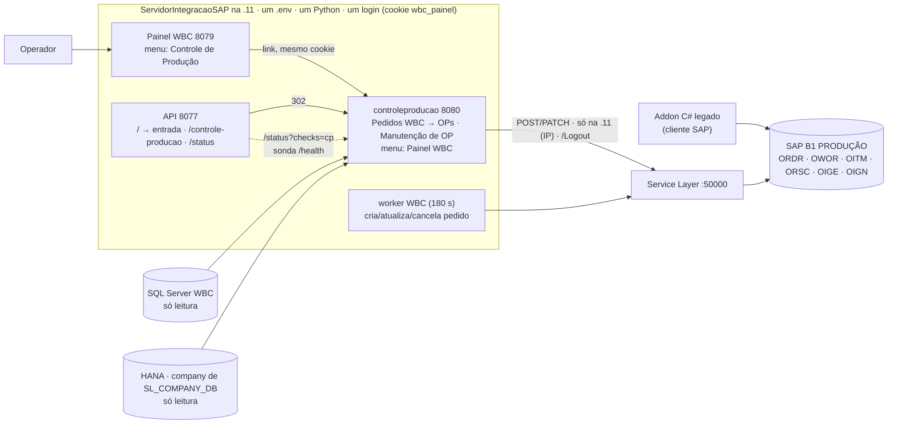

# Plano — Controle de Produção (WBC → OPs) como pacote do SIS, na .11

> **Status (28/09/2026, 2ª versão): DESENHO MUDOU — um projeto só.** Decisão do Marcelo
> às 12h: o pacote ControleProducao do Anderson vira `controleproducao/` dentro do
> ServidorIntegracaoSAP, como o `wbcpython/` virou em 08/09 — um Python, um `.env`, um login,
> um deploy, telas ligadas por menu. **F0 (importar e adaptar, no notebook) em andamento;
> NADA instalado na .11.** A 1ª versão deste plano (manhã de 28/09) recomendava instalar
> isolado em `C:\ControleProducao` — está superada; o que dela vale (riscos, fatos,
> reteste, piloto) foi incorporado aqui.

Artifact (mesma história, MESMA url): https://claude.ai/artifact/3womT78TmCZHdaQVZ4nuYH

Pacote de origem: `IntegracaoPedido_CriacaoOP/ControleProducao/` (montado em 24/09/2026 na
máquina do Anderson, `anderson.marques@altamira.com.br`, dono da aplicação; manifesto
124/124 íntegro). Fica no disco como referência, ignorado pelo git.

---

## Tamanho da coisa

| | |
|---|---|
| Serviços NSSM na .11 | **5 → 6** (`OrcaView-ControleProducao`, porta `CP_PORTA`=8080, processo próprio) |
| `.env` · Python · login · deploy | **1 · 1 · 1 · 1** — os do SIS. Nada de `.venv`, 2º `.env`, wheels ou scripts `.ps1` do pacote |
| Código importado | 11.828 linhas Python (`modules/pedidos_wbc/service.py` = 2.439; `cli.py` = 1.614); 124 imports e 53 alvos de `patch` renomeados |
| Suíte | 1.894 (SIS) + 244 (pacote, 2 instáveis corrigidos) + os novos da integração — tudo no pre-commit |
| `ruff` | 80 apontamentos no pacote → 0 (57 automáticos; `E501` liberado só para o SQL de `queries.py`) |
| Escritas no SAP | Módulo 2: ≈ 3 + itens novos + grupos×(3–4) + semiacabados + logs chamadas SL por pedido. Módulo 3: ≈ 4 escritas por OP (68 OPs ≈ 270 chamadas) |
| Validado pelo Anderson | Homolog 21/09: 84263 (29 vs 29 OPs), 84348 (68 vs 68). **Produção:** 84425/84426 em 22–23/09. Módulo 3: 1 `encerrar` (OP 156209) em homolog, **pendente de reteste** |

---

## Onde está agora

- **Notebook (F0):** lado do SIS pronto e verde — login compartilhado extraído para
  `wbcpython/dashboard/acesso.py`, links de menu (painel → "Controle de Produção", API 8077
  `GET /controle-producao`, `web/entrada.html`), check `controle_producao` no `/status`,
  `run_controleproducao.bat` + bloco no `install_wbc_services.bat`, `deploy_update.bat`
  (6 serviços; **aborta** se o pacote tiver tarefa em andamento), `.env.example`, CLAUDE.md,
  README, CHANGELOG. Lado do pacote em curso: cópia achatada, rename, `conftest`, `config.py`
  (fallbacks, `hana_schema` = `SL_COMPANY_DB`), `ruff`, `typer`/`rich`; depois entram a trava
  pelo IP + `/Logout` no cliente SL, o gate de cookie + `Origin` + `/docs` fechado, o comando
  `web` com log próprio, `/health`. Commit só com `ruff` em 0 e a suíte inteira verde.
- **Na .11:** nada. Já existe o que precisa: Python 3.14.7 global, `nssm` no PATH, porta 8080
  livre (8077/8078/8079 em uso), o `.env` com o bloco WBC. Falta conferir o ODBC Driver 18.
- **O que o pacote trazia e a integração resolve:** sem login → cookie do painel; sem trava
  → `wbcpython.safety` pelo IP; sem `/Logout` → logout ao fechar; `HANA_SCHEMA` ≠ company de
  escrita → derivado de `SL_COMPANY_DB`; pins incompatíveis → um Python, pins do SIS; 2º
  `.env` → o do SIS; sem monitoração → `/status`; deploy que parava no meio → aborta.
- **O que continua sendo do Anderson (negócio):** `U_INO_ProcessWBC='Y'` antes da 1ª OP e sem
  rollback; `reprocessar-integrados` que cancela OPs de qualquer origem e não recria; módulo 3
  sem reteste; três escritores no mesmo pedido (worker, pacote, addon C#); `U_INO_Integrar`;
  `EntregaMultipla`; o que ficou em produção em 22–23/09.

---

## §1 Arquitetura — um repo, seis processos, três telas



Processo separado do painel **de propósito**: o `hdbcli` pode derrubar o processo numa
falha de conexão e um `processar` bloqueia o loop do uvicorn com consultas síncronas — dentro
do painel, isso levaria o acompanhamento do worker junto. O que é compartilhado é o cookie
(navegador não separa cookie por porta), o `.env`, a trava, o deploy e o `/status`.

### Fatos que travam o desenho

1. **Três escritores no mesmo `ORDR`/`OWOR` de produção.** O worker refaz as linhas do
   pedido a cada revisão (salvo `U_INO_Congelado='Y'`) e cancela-e-recria na troca de PN
   **sem olhar OWOR**; o pacote grava `Congelado='Y'` ao processar (e nunca reverte),
   `U_INO_OP` nas linhas e as OPs; o addon C# usa as mesmas telas sem a guarda de OP
   duplicada. Produção já tem 2.581 pedidos com `Congelado='Y'`. Regra de propriedade é do
   Anderson (D13, D14).
2. **`U_INO_ProcessWBC='Y'` é gravado antes da primeira OP e nada tem rollback.** Queda no
   meio = pedido "processado" sem OP; retomada = `manutencao-op buscar` → `cancelar-ops` →
   `processar-novos` **sem `--force`** (`--force` duplica, na CLI e na web). `cancelar-ops`
   não desfaz itens, recursos, OrcDetalhe nem o congelamento.
3. **`reprocessar-integrados` cancela toda OP planejada do pedido** (de qualquer origem),
   **não recria**, duplica OrcDetalhe e o estágio da Oportunidade, e reescreve a Oportunidade
   que o worker governa. Fora da 1ª entrega (D8).
4. **Módulo 3 pendente de reteste:** `liberar` nunca rodou como comando, a web nunca gravou,
   `encerrar --pedido` nunca rodou; 4 correções depois da única execução validada. `encerrar`
   = OIGE + OIGN + fechar (irreversível). `Liberar`/`Replanejar` gravam no 1º POST.
5. **Um `.env` para o worker e o pacote:** `SL_COMPANY_DB` é a company dos dois. Por isso a
   homologação do pacote **não pode ser feita na .11** (apontaria o worker para HOMOLOG) —
   ela é feita **do notebook**, onde a trava pelo IP barra produção e libera HOMOLOG (F4).
6. **`HANA_SCHEMA` não é lido pelo pacote:** `hana_schema` = `SL_COMPANY_DB` (no SIS,
   `HANA_SCHEMA` é o schema de leitura do worker e pode diferir; o pacote lê ORDR/OWOR para
   decidir escritas — era o bug de 21/09). `HANA_SCHEMA_LEGADO` fica só para `comparar-ops`.
7. **O SIS já tem "status de OP" via SL** (`ordens_producao_sl.py`, PATCH puro, nunca
   exercitado). O `encerrar` do pacote faz estoque antes de fechar. Uma transição, um dono
   (D9): `OP_STATUS_PERMITIDOS=boposReleased` no SIS quando o módulo 3 subir.
8. **ODBC exato:** o pacote fala com o SQL Server por `pyodbc` + `WBC_SQL_DRIVER` (o resto do
   SIS usa `pymssql`); só aparece no 1º `pedidos-wbc buscar`. `Get-OdbcDriver` antes (F2).
9. **`hdbcli`:** fica o pin do SIS (2.29.23); o pacote foi empacotado com 2.30.24 e nenhum
   doc dele registra com qual versão as execuções validadas rodaram. A sonda de 28/09 não
   reproduziu o crash na recusa de socket (2.30.24 nem 2.29.25).
10. **A lista "Pedidos Novos" exige `ORDR.U_INO_Integrar='Y'`** — ninguém achou quem grava;
    pedidos do worker nascem sem ele. A lista pode vir vazia na .11 (D16).
11. **Fluxo de entrega do Anderson muda:** o código passa a morar no repo do SIS (público,
    como o `wbcpython` já é). Ele trabalha no clone (branch/PR, `ruff` + suíte no
    pre-commit) ou cada zip novo é migrado de novo (rename + ruff + trava) — D12.

---

## §2 Fases

Regra geral: a .11 não tem Claude nem WinRM. Cada passo lá é um bloco PowerShell 5.1 que o
Marcelo cola e devolve **a saída inteira**. `pip`, `nssm` e restart são dele.

### F0 — Importar e adaptar (notebook) — `em andamento · Claude`

*Ao fechar: `python -m controleproducao web` sobe no notebook com o `.env` local, pede a
mesma chave do painel, recusa escrita em produção (não é a .11), e `ruff` + suíte inteira
estão verdes no repo.*

- ✅ Lado do SIS: `wbcpython/dashboard/acesso.py` (cookie/HMAC/`destino_local` extraídos,
  `web.py` re-exporta); painel WBC com **dois botões no topo**, ao lado de "Sincronização SAP
  → Supabase" — "Pedidos WBC → OPs" (`/controle-producao/pedidos`) e "Manutenção de OP"
  (`/controle-producao/ops`), cada um caindo na tela certa, sem pedir a chave de novo (o
  painel continua a página principal — decisão do Marcelo, 28/09 13h); `wbcpython/config.py`
  `CP_URL`/`CP_PORTA`; API 8077 `GET /controle-producao` + aliases `cp`/`producao` do check;
  `config.py` raiz `CP_PORTA_DEFAULT`/`CP_LOG_FILE_DEFAULT` + paridade nos 3 configs;
  `monitoring.py` check `controle_producao` (3 níveis: nunca subiu = sem alerta; sonda
  `127.0.0.1:CP_PORTA/health`); `run_controleproducao.bat`; `install_wbc_services.bat`;
  `deploy_update.bat` (guarda `/health/ocupado` → aborta; para/religa; valida);
  `.env.example` bloco CP; `web/entrada.html`; CLAUDE.md; README; CHANGELOG;
  `docs/controleproducao/` (3 docs históricas com nota de contexto; sem segredo).
- Lado do pacote (agente + revisão): `python_app/app` → `controleproducao/` achatado;
  `python_app/tests` → `tests/controleproducao/`; rename `app.` → `controleproducao.`
  (imports, `patch("app…")`, literais de logger em `acompanha_log`, textos de help);
  `__main__.py`; `conftest.py` (isola `.env` e ambiente, `cache_clear`, fixture `como_a_11`);
  `config.py` (fallbacks `AliasChoices` + `env_ignore_empty`, bloco "reservado" apagado,
  `hana_schema` property, `CP_*`, `OS_API_KEY`); 2 testes instáveis corrigidos no teste
  (GET do estado dentro do `with patch`, polling de `terminada`); `ruff` 80 → 0;
  `requirements.txt` + `typer`/`rich`; `test_repo_layout.py` cobre o pacote novo.
- Depois, meu, no pacote: **trava pelo IP + `/Logout`** em `core/service_layer_client.py`
  (`_request` e `_via_batch` — cobre CLI e web com uma guarda; `guardas.aviso_de_escrita`
  levanta antes de criar tarefa → 503 na web, saída 2 na CLI); **gate** em `main.py`
  (`core/acesso.py`: middleware, `/entrar` + `/sair` próprios emitindo o MESMO cookie,
  `docs_url=None`, `Origin`/`Referer` == `Host` nos POST por cookie, rotas de escrita 503 sem
  `OS_API_KEY`, `/health` + `/health/ocupado` abertos, `/painel-wbc` 302); comando **`web`**
  no Typer (`wbcpython.logs.configurar` → `logs/controleproducao.log` 5 MB×3,
  `uvicorn.run(log_config=None)`); link "Painel WBC" no `base.html`; testes de tudo isso.
- Verificação final: `python -m ruff check .` = 0; `python -m pytest -q` inteira verde; smoke
  local `python -m controleproducao web` → `/health` responde, `/` pede a chave, um POST de
  escrita com `.env` apontando para PROD devolve **503** (trava pelo IP). Commit com `git add`
  **nominal** (nunca `git add .` enquanto a pasta original existir) e push.
- <span class="warn">O que mordeu:</span> `ruff --fix` do isort quebrava o import com alias em
  4 blocos — virou `from wbcpython.dashboard import acesso` + re-export. A suíte do pacote
  falhava 1–2 testes por rodada (corrida entre a tarefa em background e o `patch.__exit__`) —
  com `pytest -x` no pre-commit isso barraria todo commit do SIS.

### F1 — Anderson: casa nova do código e decisões de negócio — `documentos prontos · falta a conversa`

*Ao fechar: o Anderson sabe que o código dele mora no SIS, entrega por lá, e as regras de
propriedade do pedido estão escritas.*

- ✅ **`docs/controleproducao/PARA_O_ANDERSON.md`** — a entrega para ele: o que mudou em cada
  arquivo do código dele e por quê (tabela), o que ficou de fora, o fluxo de trabalho novo
  (clone do SIS, hooks, branch, `python -m controleproducao …`, `ruff`, suíte, deploy pelo
  Marcelo), as decisões D12–D16 com contexto e sugestão, as **duas consultas de limpeza** da
  produção prontas (`@INO_LOG` "Erro ao preencher recurso"; OPs com `PlannedQty` ≠ linha do
  pedido), o roteiro do reteste e um checklist do que devolver.
- ✅ **`docs/controleproducao/README.md`** — como o pacote vive no SIS: rodar, `.env` único
  (tabela de variáveis e fallbacks), trava pelo IP e login, testes/lint, homologação do
  notebook, deploy/serviço, mapa de arquivos, o que não veio do pacote.
- Marcelo: manda os dois documentos ao Anderson (ou o link do plano) e fecha D12 com ele. O
  repo do SIS é público, como já era com o `wbcpython`. `VERSAO` passa a ser o commit.
- Anderson: revisa o diff do commit de F0 (tabela do documento), responde D13–D16, roda as
  consultas de limpeza em PROD (só leitura) e escolhe os orçamentos/OPs do reteste.

### F2 — Preparo da .11 (só leitura) — `aberta · Marcelo`

*Ao fechar: sabemos o que existe na .11 e nada foi instalado.*

```powershell
[Console]::OutputEncoding = [Text.Encoding]::UTF8
& 'C:\Program Files\Python314\python.exe' -m pip show hdbcli websockets typer rich 2>$null | Select-String 'Name|Version'
Get-OdbcDriver -Platform 64-bit | Select-Object Name
Get-NetConnectionProfile | Select-Object Name, NetworkCategory
Get-NetFirewallProfile | Select-Object Name, Enabled
Get-NetFirewallRule -DisplayName '*8079*','*WBC*','*OrcaView*' -ErrorAction SilentlyContinue | Select-Object DisplayName, Enabled, Direction
Get-NetTCPConnection -LocalPort 8080 -ErrorAction SilentlyContinue
Select-String -Path .\.env -Pattern '^(SL_USERNAME|SL_COMPANY_DB|HANA_SCHEMA|SL_VERIFY_SSL|PAINEL_HOST|CP_)' | ForEach-Object { $_.Line -replace '=.*','=…' }
```

- Esperado: `typer`/`rich` ausentes (o deploy instala); Driver 18 **ou** só 17 (aí
  `WBC_SQL_DRIVER=ODBC Driver 17 for SQL Server`); firewall ligado; a regra que hoje libera
  a 8079 é o molde da regra da 8080 (F5); `SL_COMPANY_DB=SBOALTAMIRAPROD` (a company dos
  dois); `SL_USERNAME` vazio ou preenchido — tanto faz, o pacote cai no `OP_SL_*` como o
  worker. **Nada do `.env` vem para o chat além dos nomes.**
- Reboot pendente (D10): antes do F3, com `state\wbc_worker.stop` gravado; o das 06:12 é o
  teste de "volta sozinho" do serviço novo.

### F3 — Deploy na .11 — `aberta · Marcelo`

*Ao fechar: o 6º serviço está no ar em 127.0.0.1:8080, o `/status` o enxerga, e o painel
leva até ele sem pedir a chave de novo.*

1. Bloco CP no `.env` da .11 (Bloco de Notas, sem colar no chat): `CP_HOST=127.0.0.1`
   (D4: abre para a rede só depois do piloto), `CP_PORTA=8080`,
   `CP_LOG_FILE=logs/controleproducao.log`, `WBC_SQL_DRIVER=` conforme F2,
   `HANA_SCHEMA_LEGADO=SBOALTAMIRAPROD`, `SL_BUSINESS_PLACE_ID=0`,
   `WBC_SQL_TRUST_SERVER_CERTIFICATE=true`.
2. `.\deploy_update.bat` (Administrador): `git pull` traz o pacote; o hash do
   `requirements.txt` muda → `pip install` de `typer`/`rich` (+ transitivos) no Python
   global; os 5 serviços religam. Conferir na saída: `[pip] instalado`.
3. `.\install_wbc_services.bat` (Administrador): registra `OrcaView-ControleProducao`
   (idempotente; não mexe no painel/worker além de regravar os parâmetros).
4. `nssm start OrcaView-ControleProducao` → `curl http://127.0.0.1:8080/health` (JSON com
   `ok`, `ocupado`, `producao=true`) → `curl "http://127.0.0.1:8077/status?checks=cp" -H
   "X-API-Key: …"` (`controle_producao.healthy=true`) → `Get-Content .\logs\controleproducao.log
   -Tail 20 -Encoding utf8`.
5. No navegador **da .11** (RDP), abrir o painel por **`http://localhost:8079/`** — não pelo
   IP: com `CP_HOST=127.0.0.1` o serviço só escuta em loopback, e os botões montam o link com
   o host da página (`localhost:8080`); o cookie é por host, então só assim a tela abre **sem
   pedir a chave de novo**. Botões "Pedidos WBC → OPs" e "Manutenção de OP" → cada tela →
   "Painel WBC" volta. Só "Buscar" e links: nenhum botão que grava. Lista vazia =
   `U_INO_Integrar` (D16), não defeito. (Na F6, com `CP_HOST=0.0.0.0`, o IP passa a valer.)
6. Dia seguinte, após as 06:12: os 6 serviços `Running`.

### F4 — Homologação, a partir do notebook — `aberta · Claude + Anderson`

*Ao fechar: cada operação que vai ao ar rodou de verdade contra `SBOALTAMIRAHOMOLOG`, com
DocEntry anotados, e o rollback do `encerrar` foi provado — sem tocar na .11 nem em PROD.*

- Por que do notebook: o `.env` da .11 é o do worker; trocar `SL_COMPANY_DB` lá apontaria o
  worker para HOMOLOG. No notebook, `.env` local com `SL_COMPANY_DB=SBOALTAMIRAHOMOLOG`
  (+ credenciais que alcancem HOMOLOG — D5/D7); a trava pelo IP **garante** que nada vai para
  PROD daqui, e HOMOLOG não é produção para ela.
- `python -m controleproducao conexoes testar` → `pedidos-wbc buscar` → reteste mínimo
  (Anderson escolhe): módulo 2 `processar-novos` num orçamento com ≥ 2 grupos do mesmo item
  e `GGF_` inexistente; `comparar-ops <orc> --detalhes`; conferir ORSC, `U_INO_OP`,
  quantidade da linha do grupo; `cancelar-ops` e ver que itens/recursos/`Congelado` **não**
  voltam. Módulo 3: `liberar` 1 OP; `encerrar` 1 P e 1 R; `encerrar --pedido` pequeno; 1
  clique web de cada ação (`python -m controleproducao web` local).
- Rollback provado: Anderson cancela no cliente SAP a entrada e a saída de um `encerrar`
  de teste (OIGN → OIGE); decidir o caminho para "saída lançada, entrada falhou".
- Gate: **0 divergências**, DocEntry registrados no plano.

### F5 — Piloto em produção, na .11 — `aberta · Anderson + Marcelo`

*Ao fechar: três orçamentos reais processados pela tela (RDP na .11) ou pela CLI na .11,
conferidos OP a OP no SAP, sem divergência, e o addon parou de tocar neles.*

- Anderson nomeia 3 orçamentos "da web" e avisa o PCP antes ("não processar nem atualizar
  no addon"). <span class="warn">Em 23/09 o addon reprocessou o 84426 depois do porte: OPs em dobro.</span>
- Antes de cada um: no painel WBC, o orçamento não tem `atualizar_pedido`/
  `cancelar_e_recriar_pedido` pendente; as duas consultas de localização do pedido
  (`ORDR.U_INO_COTWBC` e `OOPR.U_ORCNUM_WBC` via OPR1) devolvem o mesmo DocEntry;
  `U_INO_UpdateDetalhe='Y'` e `U_INO_EntregaMultipla='Y'` ficam fora.
- Dentro do expediente, nunca depois das 17:30; `--force`/`--sim` proibidos; conferir e
  executar em sequência (token de 10 min). Depois: OP a OP no SAP; `@INO_LOG`;
  `logs\controleproducao.log` sem `SEM OP`/`rateio`; auditoria de OPs órfãs
  (`OWOR.Status<>'C'` com `OriginAbs` em pedido `CANCELED='Y'`).
- Retomada após queda: `manutencao-op buscar` → `cancelar-ops` → `processar-novos` sem
  `--force`. O `deploy_update.bat` já recusa parar com tarefa em andamento; `nssm stop` à
  mão, só depois de olhar `/tarefas`.
- Gate: 0 divergências nos 3 → addon desligado para pedidos novos (D14).

### F6 — Abrir para a rede e módulo 3 — `aberta · bloqueada por F4/F5`

- `CP_HOST=0.0.0.0` no `.env` da .11 + regra de firewall da 8080 igual à da 8079 (só a LAN)
  + `nssm restart OrcaView-ControleProducao`. A exposição passa a ser a mesma do painel: quem
  tem a `OS_API_KEY`. Testar de uma estação: entrar no painel → link → sem chave de novo.
- Módulo 3 só depois da F4: `OP_STATUS_PERMITIDOS=boposReleased` no `.env` do SIS (D9) e
  restart da API.

### F7 — Operação contínua — `aberta`

- Guia do operador (1 página; Claude rascunha, Anderson valida) + 30 min com quem opera.
- Portes futuros, com o Anderson: SQL de `manutencao_op/service.py` e `queries.py` para
  `sql_seguro` (hoje `str.format`); `WbcSqlServerClient` para `pymssql` (tira a dependência
  do ODBC); esconder `Reprocessar` do menu enquanto D8 valer.
- Pasta original `IntegracaoPedido_CriacaoOP/`: apagar quando o Marcelo quiser e tirar a
  linha do `.gitignore` (D2).

---

## §3 O que cada comando grava no SAP de produção

| Comando / botão | Escreve (Service Layer) | Desfaz? |
|---|---|---|
| `processar-novos` (módulo 2) | POST `OrcDetalhe` (um novo a cada execução); PATCH `Orders` cabeçalho (`U_INO_ProcessWBC`, `U_INO_Congelado='Y'`) ou **DocumentLines inteiras** (se `U_INO_UpdateDetalhe='Y'`); POST `Items` (333/332/358); PATCH `Items` (332 Solda); POST `Resources` (`GGF_…`); POST `ProductionOrders` (recursivo); PATCH linhas `U_INO_OP`; POST `INO_LOG` | Só OPs e vínculos (`cancelar-ops`). Itens, recursos, OrcDetalhe e `Congelado` **não** |
| `cancelar-ops` | PATCH `ProductionOrders` `boposCancelled` (só se todas em P/C); limpa `U_INO_OP`, `ProcessWBC='N'` | — |
| `reprocessar-integrados` | Cancela **toda** OP planejada do pedido; PATCH `SalesOpportunities` (`sos_Open` → estágio → `sos_Sold`, sem `finally`); OrcDetalhe novo. **Não recria** | Não. Fora da 1ª entrega |
| `liberar` / `replanejar` (módulo 3) | PATCH `ProductionOrders` status R/P — **na web, no 1º clique** | Reversíveis entre si; linhas ficam `im_Manual` |
| `encerrar` | PATCH (libera se P; `im_Manual`) → POST `InventoryGenExits` → POST `InventoryGenEntries` → PATCH `boposClosed` | Estoque: cancelar OIGN e OIGE no cliente SAP (a provar na F4) |

Tudo isso passa por **uma** guarda: `ServiceLayerClient._request`/`_via_batch` recusam
POST/PATCH em produção fora da .11 (`ProductionWriteBlocked`), e `guardas.aviso_de_escrita`
levanta antes de criar tarefa (503 na web, saída 2 na CLI). GET continua livre.

## §3b Riscos altos (11 confirmados por céticos) — o que a integração fecha

| # | Risco | Como fica |
|---|---|---|
| 1 | Sem login/CSRF, `/docs` aberto, `0.0.0.0` + sub-rede do SAP | **Fechado em F0:** cookie do painel, `Origin` nos POST, `/docs` off; `CP_HOST=127.0.0.1` até o piloto (D4) |
| 2 | Sem `/Logout` — sessões SL acumulam; mesmo SL do worker | **Fechado em F0:** `/Logout` em `aclose()`, molde do worker |
| 3 | `ProcessWBC='Y'` antes da 1ª OP; `--force` duplica | **Aberto (negócio):** procedimento de retomada (F5); pedir ao Anderson gravar depois da 1ª OP |
| 4 | `reprocessar` cancela OPs de qualquer origem, não recria | **Aberto:** fora da 1ª entrega (D8); esconder do menu (F7) |
| 5 | Módulo 3 pendente de reteste | **Aberto:** F4 obrigatória; módulo 3 só na F6 |
| 6 | Produção decidida só por `SL_COMPANY_DB`; `HANA_SCHEMA` divergente | **Fechado em F0:** `hana_schema` = `SL_COMPANY_DB`; trava pelo IP |
| 7 | Worker refaz linhas/recria pedido sem olhar OWOR; OPs órfãs | **Aberto (negócio):** conferir painel antes; auditoria de órfãs (F5); D13 |
| 8 | Duas semânticas de "encerrar" na mesma máquina | **Aberto:** D9 (`OP_STATUS_PERMITIDOS=boposReleased`) na F6 |
| 9 | Addon C# continua criando OPs | **Aberto (negócio):** lista nominal, PCP avisado, addon desligado na saída (D14) |
| 10 | Pacote dentro do repo público | **Resolvido pelo desenho:** o código entra no repo como o `wbcpython`; wheels/scripts ficam de fora; pasta original ignorada |
| 11 | Pins incompatíveis / 2º Python | **Resolvido pelo desenho:** um Python, pins do SIS, `typer`/`rich` no `requirements.txt` |

## §3c A .11 depois

| Serviço NSSM | Porta | Comando | Escreve no SAP? |
|---|---|---|---|
| OrcaView-OS-API | 8077 | `python api.py` | status de OP (rota, IP) |
| OrcaView-MCP | 8078 | `mcp/serve_http.py` | não |
| OrcaView-Scheduler | — | `python -m scripts.scheduled_execution` | não |
| OrcaView-WBC-Painel | 8079 | `python -m wbcpython dashboard` | não |
| OrcaView-WBC-Worker | — | `python -m wbcpython worker` | cotação/pedido (IP) |
| **OrcaView-ControleProducao** | **8080** | `python -m controleproducao web` | **OPs, itens, recursos, estoque (IP)** |

Um `.env`, um Python, uma `OS_API_KEY` (cookie válido nas três telas), `deploy_update.bat`
para os seis, `/status` vê os seis.

---

## §4 Decisões

**Marcelo**

1. **Um projeto só** — ✅ decidido 28/09 12h. Pacote do SIS, processo separado na 8080,
   cookie compartilhado, trava pelo IP, deploy único. Consequência: o código do Anderson
   passa a morar no repo do SIS (público, como o `wbcpython`).
2. **Pasta original `IntegracaoPedido_CriacaoOP/`** — *aberta.* **Recomendado:** apagar depois
   do commit de F0 (o histórico está em `docs/controleproducao/` e o zip com o Anderson) e
   tirar a linha do `.gitignore`.
3. **Claude na .11** — ✅ não. Você cola blocos PowerShell (F2/F3) e devolve a saída.
4. **Acesso** — *aberta.* **Recomendado:** `CP_HOST=127.0.0.1` no 1º deploy (uso por RDP na
   .11 durante o piloto); `0.0.0.0` + regra de firewall da LAN na F6, quando a exposição vira
   a mesma do painel.
5. **Usuários de banco** — *aberta.* Com o `.env` único o default virou "os mesmos do
   worker" (fallback `OP_SL_*`/`SAP_*`/`SQL_*`). **Recomendado:** manter no piloto (menos
   peças) e criar usuário SL próprio quando o módulo 3 subir, para separar o rastro no
   `@INO_LOG`.
6. **TLS do SL** — ✅ segue o worker: `SL_VERIFY_SSL` do `.env` único (hoje `false`, com aviso
   no log). Exportar o certificado para `SL_CA_BUNDLE` é melhoria comum aos dois, sem prazo.
7. **Homologação** — *aberta.* **Recomendado:** do notebook (F4), nunca na .11. Pré-condição:
   credenciais que alcancem `SBOALTAMIRAHOMOLOG` e homolog restaurada de PROD.
8. **Escopo da 1ª entrega** — *aberta.* **Recomendado:** Buscar + `processar-novos` +
   `cancelar-ops`; `reprocessar` fora; módulo 3 só depois da F4.
9. **Dono das transições de OP** — *aberta.* **Recomendado:** SIS só Liberar
   (`OP_STATUS_PERMITIDOS=boposReleased`); Encerrar com estoque = pacote; Replanejar só CLI.
10. **Reboot pendente** — *aberta.* **Recomendado:** antes do F3, com o worker parado por
    arquivo; o das 06:12 é o teste de volta.
11. **Check no `/status` + CLAUDE.md** — ✅ feito em F0.

**Anderson**

12. **Casa nova do código e fluxo de entrega** — *aberta, gate da F1.* **Recomendado:** clone
    do SIS, branch por entrega, pre-commit (`ruff` + suíte), PR revisado. Sem isso cada zip
    novo é uma migração.
13. **Quem manda em cada campo do pedido** (`U_INO_VERSAOWBC`, `U_INO_ORCAMENTO`,
    `U_INO_COTWBC`, `U_INO_Congelado`, linhas) entre worker e pacote — *aberta.*
    **Recomendado:** worker não toca pedido com `ProcessWBC='Y'`; `cancelar-ops` restaura
    `Congelado` ao valor lido antes; `ProcessWBC='Y'` só depois da 1ª OP.
14. **Addon legado × web** — *aberta.* **Recomendado:** lista nominal no piloto, addon
    proibido para ela, comunicado ao PCP, addon desligado para pedidos novos na saída.
15. **Regras que só ele conhece** — *aberta.* `EntregaMultipla='Y'` pular a OP principal sem
    constar em `sem_op`? `U_INO_ORCAMENTO` nunca gravado (`Weight1` morto) — deixar e registrar?
    `im_Manual` nas linhas após replanejar importa para quem aponta pelo SAP?
16. **Quem grava `ORDR.U_INO_Integrar='Y'`** — *aberta.* Sem isso a lista "Pedidos Novos" vem
    vazia na .11.

---

## Anexo A — prompt de implantação (revisado, 2ª versão)

> O **Controle de Produção** (pacote `controleproducao/` do ServidorIntegracaoSAP, código do
> Anderson: Pedidos WBC → Ordens de Produção e Manutenção de OP) sobe na **.11** como 6º
> serviço NSSM, `OrcaView-ControleProducao`, porta `CP_PORTA` (8080), pelo fluxo normal do SIS:
> `deploy_update.bat` + `install_wbc_services.bat`. Siga
> `docs/PLANO_CONTROLE_PRODUCAO_11.md`, fases F2–F6. Regras: a .11 não tem Claude — um bloco
> PowerShell 5.1 por passo para o Marcelo colar, e leia a saída inteira antes do próximo; não
> instale nada à mão (o deploy instala `typer`/`rich` pelo hash do `requirements.txt`); o
> `.env` é o do SIS — o Marcelo acrescenta o bloco `CP_*` no Bloco de Notas, sem colar valor
> no chat, e `SL_COMPANY_DB` é a company do worker também (homologação do pacote é do
> notebook, nunca na .11); `CP_HOST=127.0.0.1` até o piloto; nenhum comando ou botão que
> grava no SAP sem autorização nominal por pedido; `--force`/`--sim` proibidos; nunca `nssm
> stop` com tarefa em andamento (`/health/ocupado`). Antes de começar, confira D2, D4, D7,
> D8, D10 (Marcelo) e D12–D16 (Anderson) no §4 — as fases que dependem delas não começam
> sem resposta.

---

Fontes: `ControleProducao/CLAUDE.md`, `docs/controleproducao/migration_guide.md` (§6–§9),
`decisoes.md`, `SEGURANCA.md`/`OPERACAO.md` do pacote, `scripts/*.ps1`, `python_app/app/**`;
SIS: `wbcpython/`, `ordens_producao_sl.py`, `monitoring.py`, `deploy_update.bat`,
`install_wbc_services.bat`. Leituras de 28/09/2026 por dois workflows (7 + 3 leitores, 24
céticos, 1 crítico, 1 desenhista).
