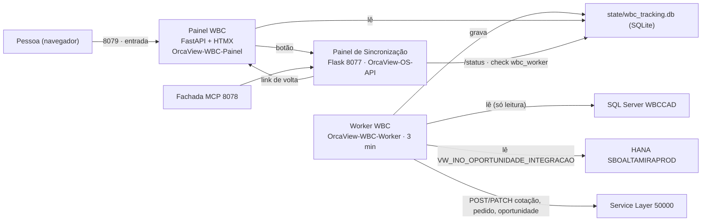

# Plano — Integração WBC (WBCPython) dentro do ServidorIntegracaoSAP

**Status (2026-09-08, 1ª versão):** nada codado. Levantamento medido nos dois repositórios
e na .11. **Dois fatos mandam no desenho:** (1) o worker novo já escreve em produção há 6
dias a partir de uma máquina Linux que monta esta pasta por SMB, **enquanto a tarefa legada
"Integração WBC" segue ligada na .11**; (2) o git do WBCPython versiona um `.env.bak` com
senha, e o repo de destino (`oportunidade_wbc`) é público — o histórico não pode entrar.

Artifact publicado com o mesmo conteúdo (atualizar na MESMA url):
https://claude.ai/code/artifact/0936772c-a2ff-4704-afab-5a417ad703dd

## Pedido (reescrito a partir do original)

O pedido original dizia "integrar o WBCPython ao ServidorIntegracaoSAP, interface do
WBCPython principal com link para a outra, mesmo script para atualizar tudo". Ficavam
abertos: o que é "principal" (porta própria ou a raiz da 8077), o destino do histórico git,
o que fazer com o legado C# e com o worker que hoje roda fora da .11, e como a .11 (Python
3.12 do sistema, sem venv, sem uv) instala um projeto feito com uv. Reescrito:

> Integre `D:\ProjetoAltamira\MCPs\WBCPython` (integração WBC → SAP: worker + painel
> FastAPI) ao repositório `D:\ProjetoAltamira\MCPs\ServidorIntegracaoSAP`, que continua
> rodando na 192.168.7.11 e no GitHub `oportunidade_wbc`, de modo que:
> 1. o WBCPython vire parte do mesmo repositório (código, testes, docs, SQL), instalado
>    pelo `requirements.txt` e executado com `python -m wbcpython`, sem uv nem venv;
> 2. o painel do WBCPython seja o endereço principal na .11, com um botão para o Painel de
>    Sincronização (8077) e link de volta;
> 3. worker e painel rodem na .11 como serviços NSSM ao lado dos três existentes;
> 4. o `deploy_update.bat` atualize os cinco serviços e instale dependência nova sozinho;
> 5. a migração leve o banco de acompanhamento atual e termine com **um** integrador só:
>    tarefa legada "Integração WBC" desligada e worker externo parado.
>
> Entregue um plano faseado com as decisões explícitas (porta, histórico git,
> visibilidade do repo, retenção) antes de codar.

## Do que se trata

O **WBCPython** é a reescrita em Python do `WBCServConsole` (C#): lê os orçamentos no SQL
Server do WBC, decide pela máquina de estados do `SitCode`, cria/atualiza/cancela cotação
e pedido no SAP pelo Service Layer, espelha o status na oportunidade e grava o snapshot do
`OrcDetalhe`. Tem um worker (APScheduler, ciclo a cada 3 min) e um painel (FastAPI + HTMX)
que lê só o banco de acompanhamento. 11.095 linhas em `src/wbcpython/`, 843 testes, 82
commits em `master`, **sem remote**.

O **ServidorIntegracaoSAP** (SIS) é o serviço SAP → Supabase da .11: API Flask na 8077
(com o Painel de Sincronização em `GET /`), agendador de oportunidades e fachada MCP na
8078 — 3 serviços NSSM, 468 testes, deploy por `deploy_update.bat` (pull de `master`).

Depois deste plano: um repositório, um `.env`, uma suíte, um `deploy_update.bat`, cinco
serviços; o painel WBC na 8079 é a porta de entrada e o Painel de Sincronização fica a um
clique.

## Onde está agora (medido em 2026-09-08 13:30)

| O quê | Medida | Consequência |
|---|---|---|
| Worker WBCPython | **em produção** (`SBOALTAMIRAPROD`, trava desligada), ciclo a cada 180 s, 07:00–20:00 seg–sex; 13:21 cancelou a cotação 102002 e criou a 102367 | já é o integrador de fato |
| Onde ele roda | **não** nesta máquina (TECINFO02) nem na .11: venv Linux (`home=/usr/bin`, Python 3.14.4, uv 0.12.5) e log/SQLite gravados nesta pasta via SMB (`D$`) | SQLite de 202 MB pela rede — o cenário que o `RISCOS_PRODUCAO.md` §5 manda evitar |
| Tarefa legada "Integração WBC" na .11 | `enabled=true`, `State=Running`, última execução 13:30, disparo a cada 4 min, `healthy` | **dois integradores** pela mesma chave `U_INO_COTWBC` — risco §1 (vermelho) do relatório de riscos; confirmar se ainda cria documento é o 1º passo |
| SIS | 3 serviços no ar; `deploy_update.bat` puxa `master` e **pula o pip** na .11 (não há venv) | deps novas exigem pip à mão — foi assim no deploy do status de OP |
| Este plano | 0 linhas codadas | — |

## Fatos que travam o desenho

1. **`oportunidade_wbc` é público** (auditoria de 19/08). O git do WBCPython versiona
   `.env.bak-20260827-151324` (desde `3aa7ef2`, 27/08) com a senha do Service Layer e a do
   SQL Server do WBC. Conferido: **nenhum outro arquivo versionado** (inclusive os `.md`)
   contém esses valores nem o usuário `financeiro04`. → O histórico entra **sem** os commits
   (`--squash`/cópia), e o `.env.bak` sai antes.
2. **`requirements.txt` é a fonte de instalação do SIS** (regra do `CLAUDE.md`); a .11 roda
   Python 3.12 do sistema, sem venv, sem uv. O WBCPython usa uv + hatchling + layout `src/`.
   → Vira pasta `wbcpython/` na raiz, executada com `python -m wbcpython`, sem instalação.
3. **Um só `.env`** na raiz: os dois projetos leem `.env` do cwd. Nomes não colidem — SIS usa
   `SAP_*`, `SQL_*`, `OP_SL_*`, `WBC_TASK_*`; WBCPython usa `SL_*`, `HANA_*`, `WBC_SQL_*`,
   `WBC_ENVIRONMENT`, `PAINEL_*`, `WORKER_*`. O `Settings` do WBC ignora variáveis extras.
4. **Pins compatíveis:** `hdbcli==2.29.23` e `apscheduler==3.10.4` (já na .11) atendem
   `>=2.20`/`>=3.10`; `httpx 0.28` já vem com `supabase 2.31`. Entram `pydantic-settings`,
   `sqlalchemy`, `pymssql`, `fastapi`, `uvicorn`, `jinja2`, `python-multipart`.
5. **Sem sintaxe 3.13+/3.14+** no código (varrido); `enum.StrEnum` pede 3.11+ — ok no 3.12.
6. **`tests/test_config.py` existe nos dois** → os testes do WBC vão para `tests/wbc/`
   (pacote), e a opção `--run-integration` do conftest deles entra no conftest do SIS.
7. **Deploy, restart, pip e serviço na .11 são do Marcelo**; eu não instalo pacote na máquina
   dele. O Python 3.14 local **não tem** `apscheduler`, `pymssql`, `flask`, `waitress` — a
   suíte unificada só fica verde depois de um `pip install -r requirements-dev.txt` dele.
8. **O painel WBC não tem autenticação** (`PAINEL_SENHA` só protege escrita, e em produção a
   escrita pela tela fica desabilitada de qualquer forma). Na .11: firewall por IP, o mesmo
   padrão da 8078.
9. **`ai_spec/`** (fonte das regras de negócio citada pelo README do WBC) não existe em
   `D:\ProjetoAltamira`.
10. **Parada limpa:** NSSM manda Ctrl+C; o worker trata SIGINT/SIGTERM e termina o ciclo
    (9–14 s medidos). O serviço do worker precisa de `AppStopMethodConsole 60000` para não
    ser morto no meio de um POST.

## §1 Arquitetura

Flask e FastAPI seguem **processos separados**; o que os une é o `.env`, o `deploy_update.bat`
e dois links.

## §2 Fases

### F0 — Estado de produção e pré-condições `[Marcelo]`
**Meta:** saber com certeza quem escreve em produção hoje, e ter um repositório em que o
WBCPython possa entrar sem vazar segredo.
- Confirmar pela consulta do §1 do `RISCOS_PRODUCAO.md` (cotações com `U_INO_COTWBC` criadas
  por dia) se o legado ainda produz documento. Se produz, **desabilitar a tarefa "Integração
  WBC" antes de qualquer outro passo** (D1).
- Tornar o `oportunidade_wbc` privado (D2).
- Dizer em que máquina o worker atual roda (para pará-lo na F5) e escolher a porta (D3).

### F1 — Importar o WBCPython no repositório `[minha]`
**Meta:** `git pull` na .11 traz o WBCPython; `python -m pytest` roda as duas suítes numa só.
- Importar **a árvore, sem o histórico** (D4): `git subtree add --squash` de um commit do
  WBCPython em que `.env.bak-*` foi removido (ou cópia + 1 commit). O repo antigo fica como
  arquivo local — o histórico com o vazamento nunca sai desta máquina.
- Layout: `wbcpython/` (ex-`src/wbcpython`, imports intactos) · `tests/wbc/` · `docs/wbc/`
  (DECISOES, APRENDIZADOS, PROGRESS, RISCOS_PRODUCAO, DEFEITOS_LEGADO,
  COMO_TESTAR_HOMOLOGACAO, RETOMADA; README + COMO_INICIAR fundidos num `docs/wbc/README.md`
  reescrito para `python -m`, sem uv) · `sql/hana/VW_INO_OPORTUNIDADE_INTEGRACAO.sql`.
- `requirements.txt` ganha as deps do WBC com pin; `uv.lock`, hatchling e `[project.scripts]`
  não entram; `pyproject.toml` ganha os `per-file-ignores` (DTZ) do WBC.
- `.env.example` ganha o bloco WBC com `TRACKING_DB_URL=sqlite:///./state/wbc_tracking.db`,
  `LOG_FILE=logs/wbcpython.log`, `PAINEL_HOST=0.0.0.0`, `PAINEL_PORTA=8079`; `.gitignore`
  ganha `state/*.db`.
- `CLAUDE.md` e README do SIS: pacote novo no mapa, 2 serviços, "tarefa → o que ler"
  (worker, painel, máquina de estados, tracking).
- **Gate:** 843 + 468 testes verdes e `ruff` em 0 no Python 3.12 (depende do item 7 dos fatos).
- **O que morde:** `git subtree add` **sem** `--squash` traria os 82 commits, com o `.env.bak`
  dentro — exatamente o que não pode acontecer num repo público.

### F2 — Interface: painel WBC como entrada, Painel de Sincronização a um clique `[minha]`
**Meta:** quem abre `http://192.168.7.11:8079` vê a integração WBC e chega ao painel de
OS/Oportunidades por um botão; de lá volta pelo mesmo caminho.
- `pagina.html` (topo): botão "Sincronização SAP → Supabase" para `SIS_PAINEL_URL` (novo no
  `.env`; default = mesmo host da requisição, porta `OS_API_PORT`).
- `web/sincronizar.html` (header): link "← Integração WBC" para `WBC_PAINEL_URL` (a API
  injeta a URL ao servir a página). `GET /` da 8077 **continua** servindo o Painel de
  Sincronização — nenhum bookmark nem consumidor quebra (D6).
- Prévia visual das duas páginas **antes** do commit (regra: mudança visual só com o olho).

### F3 — Operação na .11: serviços, deploy único, firewall, monitor `[código meu · execução dele]`
**Meta:** `deploy_update.bat` atualiza os cinco serviços e instala dependência nova sozinho;
o `/status` sabe se o worker WBC está vivo.
- `run_wbc_worker.bat` (`python -m wbcpython worker`) e `run_wbc_painel.bat`
  (`python -m wbcpython dashboard`), no padrão dos `run_*.bat` (cwd fixo, venv-ou-sistema,
  UTF-8).
- `install_services.bat`: `OrcaView-WBC-Painel` (auto) e `OrcaView-WBC-Worker` (**manual até
  a virada**, `AppStopMethodConsole 60000`), logs em `logs/`.
- `deploy_update.bat`: para/sobe os 5 na ordem certa (worker por último, e só se já estava
  rodando); **pip no Python do sistema quando não há venv** (hoje pula em silêncio); `curl` no
  `/health` da 8077 e no `/` da 8079.
- Firewall: `netsh advfirewall firewall add rule name="OrcaView WBC 8079" … remoteip=<LAN>`
  — mesmo padrão documentado para a 8078 em `mcp/README.md`.
- `monitoring.py`: check `wbc_worker` (lê `execucoes` do SQLite: última execução, `stale` se
  > 2 × `WORKER_INTERVAL_SECONDS` dentro do expediente do worker, `alerts`); alias
  `?checks=wbc`. O check `scheduled_task` (tarefa legada) fica até a F5.
- **Gate:** testes de `monitoring` + `deploy_update.bat` exercitado numa pasta local (ramo
  git/pip; NSSM só na .11).

### F4 — Migração do estado para a .11 `[Marcelo, com roteiro meu]`
**Meta:** o painel na .11 mostra o histórico real; o worker ainda parado.
- `git pull` + `deploy_update.bat` (instala as deps) → `python -m wbcpython doctor`,
  `check-sap`, `check-hana` na .11 (só leitura).
- Bloco WBC no `.env` da .11 — copiado do `.env` **atual**, nunca dos `.env.backup-*`.
- Copiar `wbcpython_tracking_prod.db` (202,6 MB) para `state/wbc_tracking.db` com o worker
  atual **parado** (SQLite em uso copia corrompido). `datas-de-abertura` não precisa rodar.
- `nssm start OrcaView-WBC-Painel` → conferir KPIs, lista, aba Log (arquivo novo, vazia) e
  aba "Próximo ciclo" depois de `pendentes --exportar` (só leitura).
- **O que morde:** o `.env` de produção tem `WORKER_INTERVAL_SECONDS=180` e expediente
  07:00–20:00; o `.env.example` diz 300 s e 06:30–19:00. Levar os valores de produção.

### F5 — Virada: um integrador só, na .11 `[Marcelo]`
**Meta:** o worker roda na .11 como serviço; legado e worker Linux parados; `/status` alarma
se ele cair.
1. Parar o worker Linux (o processo que grava por SMB).
2. Desabilitar a tarefa "Integração WBC" (se não foi na F0) e confirmar pela consulta de
   cotações/dia.
3. `nssm set OrcaView-WBC-Worker Start SERVICE_AUTO_START` + `nssm start`; observar 3
   ciclos na aba Log (esperado: "N orçamento(s) avaliado(s)…" a cada 3 min, ~10 s cada).
4. Remover `OrcaView-Monitor-WBC-Task` e o check `scheduled_task` (commit meu; ele executa).
5. Arquivar `MCPs\WBCPython` (renomear para `_ARQUIVO`; **não apagar** — é o único lugar com
   o histórico).
- **O que morde:** entre os passos 1 e 3 ninguém integra (minutos). Fazer no expediente,
  para ver o primeiro ciclo acontecer.

### F6 — Depois (sugestões; cada uma cabe num commit) `[abertas]`
- **Retenção de `eventos`:** 940.326 linhas em 6 dias (≈157 k/dia ≈ 33 MB/dia ≈ 1 GB/mês).
  Com 19,5 GB livres na .11 vira problema em meses, e a lista do painel fica lenta antes (D8).
- **2 tools MCP de leitura** (`estado_integracao_wbc`, `historico_orcamento_wbc(orcnum)`)
  sobre 2 rotas novas na 8077 (`GET /wbc/execucoes`, `GET /wbc/orcamentos/<n>`): o Claude e a
  Mira passam a responder "o orçamento X virou pedido?".
- **TLS:** `SL_VERIFY_SSL=false` hoje; `SL_CA_BUNDLE` quando houver certificado (pendência 5
  da `RETOMADA.md`).
- Trazer `ai_spec/` para `docs/wbc/ai_spec/` se existir em alguma máquina.
- Dois clientes de Service Layer no mesmo servidor (`ordens_producao_sl.py` com `requests` +
  sessão TTL 45 min; WBC com `httpx` + Login/Logout por ciclo ≈ 260 logins/dia): conviver
  está ok; unificar só se o SL reclamar de sessões.

## §3 Serviços e portas na .11 (depois do plano)

| Serviço | Porta | Entrada | Estado |
|---|---|---|---|
| OrcaView-OS-API | 8077 | `run_api.bat` | existente |
| OrcaView-MCP | 8078 | `run_mcp.bat` | existente |
| OrcaView-Scheduler | — | `run_scheduler.bat` | existente |
| **OrcaView-WBC-Painel** | **8079** | `run_wbc_painel.bat` | novo, auto |
| **OrcaView-WBC-Worker** | — | `run_wbc_worker.bat` | novo, manual → auto na F5 |
| Tarefa "Integração WBC" (C#) | — | Task Scheduler | desabilitada na F0/F5 |
| Tarefa OrcaView-Monitor-WBC-Task | — | `monitor_wbc_task.ps1` | removida na F5 |

## §4 Layout no repositório

| WBCPython (hoje) | ServidorIntegracaoSAP (depois) |
|---|---|
| `src/wbcpython/` | `wbcpython/` (imports absolutos intactos) |
| `tests/` (843) | `tests/wbc/` |
| `README.md`, `COMO_INICIAR.md` | `docs/wbc/README.md` (fundidos, sem uv) |
| `DECISOES`, `APRENDIZADOS`, `PROGRESS`, `RISCOS_PRODUCAO`, `DEFEITOS_LEGADO`, `COMO_TESTAR_HOMOLOGACAO`, `RETOMADA` | `docs/wbc/` |
| `sql/VW_INO_OPORTUNIDADE_INTEGRACAO.sql` | `sql/hana/` |
| `pyproject.toml` (hatchling, uv), `uv.lock` | não entram; `requirements.txt` + `per-file-ignores` no pyproject do SIS |
| `.env`, `.env.backup-*`, `.env.bak-*`, `*.db`, `*.log`, `previsao.json` | não entram |

## §5 Dependências novas no `requirements.txt`

| Pacote | Pin proposto | Na .11 hoje? |
|---|---|---|
| pydantic | `>=2.7,<3` | vem com supabase |
| pydantic-settings | `>=2.3,<3` | não |
| sqlalchemy | `>=2.0,<3` | não |
| pymssql | `>=2.3,<3` | não (wheel cp312 win_amd64 existe) |
| fastapi · uvicorn | `>=0.111,<1` · `>=0.30,<1` | não |
| jinja2 · python-multipart | `>=3.1,<4` · `>=0.0.9,<1` | jinja2 vem com flask |
| httpx | `>=0.27,<0.29` | sim (supabase) |
| hdbcli · apscheduler · python-dotenv | pins atuais do SIS | sim |

## §6 Números medidos (2026-09-08)

| O quê | Medida |
|---|---|
| Ciclo do worker, 1.681 oportunidades, sem escrita | 9 s (13:24:49 → 13:24:58, log) |
| Ciclo com 2 escritas | 14 s (13:21:49 → 13:22:03, log) |
| Login no Service Layer | 1 por ciclo (Login/Logout) ≈ 260/dia |
| Banco de acompanhamento | 202,6 MB · `acompanhamento` 1.680 · `eventos` 940.326 · `execucoes` 725 (02/09 16:50 → 08/09 13:24) |
| Log | 5.165 linhas hoje até 13:24; rotação 5 MB × 3 |
| Disco C: da .11 | 84,6 % usado, 19,5 GB livres |
| Suítes | WBC 843 · SIS 468 |

## §7 Decisões

1. **Legado × worker novo hoje — aberta, do Marcelo.** Recomendado: confirmar pela consulta
   do §1 do relatório de riscos e **desabilitar a tarefa legada agora**, sem esperar a
   migração. O relatório pede "desligar o legado antes de ligar o novo" — e o novo está ligado
   há 6 dias.
2. **Repo público — aberta.** Recomendado: tornar `oportunidade_wbc` privado antes da F1.
   Sem isso a F1 publica os docs do WBC (sem segredo, mas com DocNums, valores e nomes de
   cliente).
3. **Porta do painel — aberta.** Recomendado: **8079** (vizinha de 8077/8078, uma família de
   regras de firewall) em vez de 8501 (herança do Streamlit).
4. **Histórico do WBCPython — ✅ decidida por fato:** entra **sem histórico** (`--squash` ou
   cópia), porque o histórico versiona senha. O repo antigo fica arquivado local.
5. **Um processo ou dois — ✅ dois** (Flask 8077 + FastAPI 8079). Fundir exigiria reescrever o
   painel em Flask ou a API em FastAPI, sem ganho para quem usa.
6. **"Interface principal" — aberta (interpretação).** Recomendado: principal = o endereço
   que as pessoas abrem (8079), com link cruzado; `GET /` da 8077 segue servindo o Painel de
   Sincronização. Alternativa: `/` da 8077 redirecionar para 8079 — quebra o hábito de quem
   sincroniza OS.
7. **Nome do pacote e dos serviços — ✅** `wbcpython` (11 k linhas de imports absolutos;
   renomear é churn) e `OrcaView-WBC-*` (padrão da .11).
8. **Retenção de eventos — aberta.** Recomendado: parar de gravar evento por avaliação sem
   ação (é o que enche) e faxina de 90 dias; medir antes qual `tipo` domina.
9. **Instalação — ✅** `requirements.txt` + `python -m wbcpython`; sem uv/hatchling na .11
   (regra do SIS).
10. **Worker externo — aberta.** Onde roda hoje? Precisa ser parado na F5; o venv Linux nesta
    pasta sugere uma máquina que monta `\\TECINFO02\D$`.

---
Plano completo: `docs/PLANO_INTEGRACAO_WBCPYTHON.md` · ServidorIntegracaoSAP · 2026-09-08
