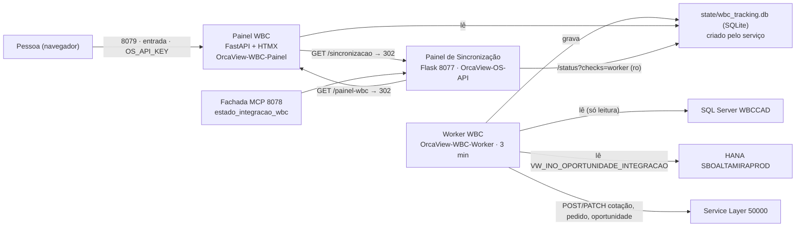

# Plano — Integração WBC (WBCPython) dentro do ServidorIntegracaoSAP

**Status (2026-09-09, 07:09): passou pelo primeiro boot sozinho.** A .11 reiniciou às ~06:13
(uptime da API 56 min), o agendador de oportunidades rodou às 06:13, e o worker WBC retomou às
07:00 dentro do expediente: 3 ciclos até 07:07 (#75: 1.688 avaliados, 0 escritas, 0 erros, 19 s),
`healthy=true`, sem alertas, painel 8079 no ar, raiz da 8077 levando a ele, tarefa legada
`retired`. Ontem entre 16:54 e 20:00 o worker fechou o dia em #72. O worker antigo segue parado
(log local parou 08/09 13:24). **09/09 07:20: `MCPs\WBCPython` apagada** (o único histórico do
standalone, com o `.env.bak`, deixou de existir; o arquivo local `.env.wbc-para-a-11` também foi
removido). **Restam só itens dele, sem pressa:** rotacionar as senhas que passaram pelo chat (com o worker antigo parado, `financeiro04` ficou
sem uso — pode ser desativado) e, num dia calmo, apagar a tarefa legada desabilitada.

**Status (2026-09-08, 8ª atualização, 16:40): tudo no ar na .11, com o código final.** Worker
religado às 16:39 já como `python.exe` direto (`install_wbc_services.bat`): ciclo #5 em 27 s,
1.683 avaliados, **3 escritas, 0 erros**. **Primeira escrita real da .11** foi no ciclo #4
(15:51): orçamento 00125273 — cotação 101295 cancelada, 102389 criada e vinculada à oportunidade
14803, status 55 — o `orcaview` tem permissão de escrita. **O que mordeu:** o deploy das 15:52
deixou o worker **parado por 48 min** no expediente (o `nssm start` do script chegou durante o
`STOP_PENDING` do `cmd.exe` e foi recusado em silêncio; só o `/status` alarmou). Correções no ar:
deploy espera `STOPPED` e roda de cópia em `%TEMP%` (`68b5954`, `40fca76`), serviço do worker sem
`.bat` no meio, retenção de 6 dias (`df68de5`), Service Layer só com escrita (`1ebb507`).
**Pende (dele, sem urgência):** apagar `MCPs\WBCPython`; rotacionar as senhas que passaram pelo
chat. **Boot de amanhã (~06:12): pronto** — às 16:55 os 5 serviços `OrcaView-*` estavam `Running` +
`Automatic` (o `install_wbc_services.bat` de hoje tinha rebaixado o worker para manual; corrigido
em `84b2770` e ajustado na .11 com `nssm set ... SERVICE_AUTO_START`). Fechamento do dia 16:56:
ciclo #10 (17 s, 0 erros), sem alertas, `healthy=true`. **Card do `.90`:** feito (web `V118.1`,
`4706801b`, pull no `.90` 16:50) — a seção lê `wbc_worker`; a legada só aparece sem `retired`.

**Status (2026-09-08, 7ª atualização, 15:55): VIRADA FEITA — um integrador só, na .11.**
Worker antigo parado (13:24), tarefa legada desabilitada (`Enabled=False` conferido 15:47),
`OrcaView-WBC-Worker` no ar com **3 ciclos limpos** (15:41, 15:45, 15:48 — 1.682 avaliados
cada, 0 erros, ~25 s por ciclo; `/status` `healthy=true`). Commit `8ca58f0` aposenta o monitor
da tarefa legada **sem tirar o bloco** `scheduled_task` (o card do `.90` e a tool
`estado_tarefa_wbc` continuam lendo; vem `retired=true` e nunca alarma; `WBC_TASK_MONITOR=true`
é o rollback). **`8ca58f0` no ar na .11 às 15:52** (deploy dele; `/status`: `scheduled_task.retired=true`,
`alerts=[]`, `healthy=true`; o deploy religou o worker). **Pende (dele, sem urgência):** remover
`OrcaView-Monitor-WBC-Task`; apagar `MCPs\WBCPython`; rotacionar as senhas que passaram pelo
chat. F6 segue aberta (retenção de `eventos`, card do `.90` →
`wbc_worker`).

**Status (2026-09-08, 6ª atualização, 15:45): F5 EM ANDAMENTO, com um passo errado no meio.**
O worker antigo (Linux/SMB) está parado desde 13:24 (último ciclo #725 no banco antigo, sem
trava). Às 15:41 o Marcelo ligou o `OrcaView-WBC-Worker` na .11: **1º ciclo limpo** (#1,
15:41:46 → 15:42:14, 1.682 avaliados, 0 com ação, 0 escritas, 0 erros; `/status` `healthy=true`).
**Mas a tarefa legada "Integração WBC" NÃO foi desabilitada**: o monitor da .11 às 15:42:28
mostrou `enabled=true`, execução às 15:40:40 e próxima às 15:45:45 — ou seja, os dois
integradores ficaram ativos ao mesmo tempo por alguns minutos (as 2 escritas que a prévia
previa saíram pelo legado às 15:40, por isso o ciclo novo teve 0). Pedi a ele, uma linha por
vez: `nssm stop OrcaView-WBC-Worker` → `Disable-ScheduledTask -TaskName "Integração WBC"` →
conferir `Settings.Enabled = False` → só então `nssm start`. **15:47: feito** — `nssm stop`
respondeu `STOP_PENDING` (parada limpa), `Disable-ScheduledTask` aplicado e conferido
(`Enabled = False`; `State = Running` só até a instância em curso terminar). **Falta:** `State =
Disabled` e então `nssm start OrcaView-WBC-Worker` — a partir daí, um integrador só.
Depois: observar 3 ciclos, remover o monitor da tarefa legada + check `scheduled_task` (commit
meu), apagar `MCPs\WBCPython` (dele), rotacionar as senhas que passaram pelo chat.

**Status (2026-09-08, 5ª atualização, 16:10): F4 CONCLUÍDA.** Na .11: `doctor` em
`PRODUÇÃO`/trava `DESATIVADA` com Service Layer, SQL Server e HANA configurados; `check-sap`
OK com o usuário `orcaview` (o do `.90`); `pendentes --exportar` leu **1.682 oportunidades** a
partir da .11 (HANA + WBC + SL, só leitura) e gravou o retrato — **2 escritas** aconteceriam num
ciclo; painel na 8079 apresentando `SBOALTAMIRAPROD` com a tarja de produção; raiz da 8077 leva a
ele; `/status?checks=worker` = `installed=true, last=null`, sem alerta. Worker registrado e
**parado**. O bloco no `.env` só entrou colado do chat (a colagem por RDP caiu no
`.env.example`, restaurado com `git checkout`). **Próximo: F5 (virada), inteira dele** — D1
(legado) e D10 (parar o worker externo) antes do `nssm start OrcaView-WBC-Worker`.

**Status (2026-09-08, 4ª atualização, 15:40):** **painel WBC no ar na .11** — `OrcaView-WBC-Painel`
responde `200` em `http://192.168.7.11:8079/entrar` pela rede (firewall ok), a raiz da 8077 leva a
ele, e o banco `state/wbc_tracking.db` foi **criado pelo próprio serviço** (`/status?checks=worker`:
`installed=true`, 4 tabelas, `last=null`). Deps instaladas (`pymssql 2.4.1`, `sqlalchemy 2.0.52`,
`fastapi 0.141.1`), `deploy_update.bat` agora decide o pip pelo hash (`4a6f77a`). O que mordeu na
subida: (1) comandos de cmd colados no PowerShell deixaram `%PROJ%` literal no NSSM →
`install_wbc_services.bat` (`a0fff9d`); (2) a regra `_*.py` do `.gitignore` deixou os 17
`__init__/__main__` fora do git (`8663080`); (3) o pip do deploy só olhava o pull. **Pende:** bloco
WBC no `.env` da .11 (o painel ainda se apresenta como `SBOALTAMIRAHOMOLOG`; bloco pronto em
`.env.wbc-para-a-11`, com o usuário `orcaview` do `.90` no Service Layer por decisão dele) +
`nssm restart OrcaView-WBC-Painel` + `pendentes --exportar`. Depois, F5. Histórico das
atualizações anteriores abaixo.

**Status (2026-09-08, 3ª atualização):** **F1, F2 e F3 no repositório** (`8be8e69` + `4f5bcde`,
master) e **F4 passo 1 feito às 14:56**: o Marcelo rodou o `deploy_update.bat` novo na .11 —
API, MCP e agendador religaram com o código novo (`/status?checks=worker` responde o bloco
`wbc_worker` com `installed=false`, a fachada 8078 serve `estado_integracao_wbc`, o
`sincronizar.html` da 8077 mostra o link "⇄ Integração WBC"; SAP/SQL/Supabase verdes; disco
em 73 % após a limpeza). Não conferido: se o pip instalou as 7 deps (a saída do `.bat` não
foi vista) — `python -m wbcpython doctor` na .11 responde isso. Pendem F4 passos 2–6 (bloco
WBC no `.env`, 2 serviços, firewall, painel) e a virada. Em produção nada mudou: o worker
antigo segue fora da .11 e a tarefa legada estava ligada (`Ready`, última 14:50, resultado 0).
D1 e D10 são o que falta para a virada.

Artifact publicado com o mesmo conteúdo (atualizar na MESMA url):
https://claude.ai/code/artifact/0936772c-a2ff-4704-afab-5a417ad703dd

## Pedido (reescrito a partir do original)

O pedido original dizia "integrar o WBCPython ao ServidorIntegracaoSAP, interface do
WBCPython principal com link para a outra, mesmo script para atualizar tudo". Ficavam
abertos: o que é "principal" (porta própria ou a raiz da 8077), o destino do histórico git,
o que fazer com o legado C# e com o worker que hoje roda fora da .11, e como a .11 (Python
3.12 do sistema, sem venv, sem uv) instala um projeto feito com uv. Reescrito, com as
respostas dele de 08/09 incorporadas:

> Integre `D:\ProjetoAltamira\MCPs\WBCPython` (integração WBC → SAP: worker + painel
> FastAPI) ao repositório `D:\ProjetoAltamira\MCPs\ServidorIntegracaoSAP`, que continua
> rodando na 192.168.7.11 e no GitHub `oportunidade_wbc`, de modo que:
> 1. exista **um projeto só**: o WBCPython vira parte deste repositório (código, testes,
>    docs, SQL), instalado pelo `requirements.txt` daqui e executado com
>    `python -m wbcpython`, sem uv nem venv — o repositório antigo deixa de existir;
> 2. o painel do WBCPython seja o endereço principal na .11, com um botão para o Painel de
>    Sincronização (8077) e link de volta, **com autenticação** reaproveitando o que os dois
>    projetos já têm (a `OS_API_KEY`);
> 3. worker e painel rodem na .11 (Python 3.12 do sistema) como serviços NSSM ao lado dos
>    três existentes, com **parada limpa** mantida;
> 4. o `deploy_update.bat` atualize os cinco serviços e instale dependência nova sozinho —
>    deploy, restart, pip e serviço continuam sendo do Marcelo;
> 5. o ServidorIntegracaoSAP **crie sozinho o banco e as tabelas** de acompanhamento, sem
>    perder compatibilidade com nada que a API e a fachada MCP já fazem;
> 6. os testes válidos migrem com capricho, e a especificação ausente (`ai_spec/`) seja
>    criada se necessário;
> 7. a migração termine com **um** integrador só: tarefa legada "Integração WBC" desligada e
>    worker externo parado.

## Do que se trata

O **WBCPython** é a reescrita em Python do `WBCServConsole` (C#): lê os orçamentos no SQL
Server do WBC, decide pela máquina de estados do `SitCode`, cria/atualiza/cancela cotação
e pedido no SAP pelo Service Layer, espelha o status na oportunidade e grava o snapshot do
`OrcDetalhe`. Tem um worker (APScheduler, ciclo a cada 3 min) e um painel (FastAPI + HTMX)
que lê só o banco de acompanhamento. 11.095 linhas, 843 testes.

O **ServidorIntegracaoSAP** (SIS) é o serviço SAP → Supabase da .11: API Flask na 8077
(com o Painel de Sincronização em `GET /`), agendador de oportunidades e fachada MCP na
8078 — 3 serviços NSSM, 468 testes, deploy por `deploy_update.bat`.

Depois deste plano: um repositório, um `.env`, uma suíte, um `deploy_update.bat`, cinco
serviços; o painel WBC na 8079 é a porta de entrada e o Painel de Sincronização fica a um
clique.

## Onde está agora (2026-09-08, fim do dia)

| O quê | Estado | Consequência |
|---|---|---|
| Repositório | `wbcpython/`, `tests/wbc/`, `docs/wbc/`, `sql/hana/`, deps no `requirements.txt`, bloco WBC no `.env.example`; **1.591 testes verdes, ruff 0** (`8be8e69`) | `git pull` na .11 já traz tudo; falta o pip (o `deploy_update.bat` novo faz) |
| Painel | entrada com `OS_API_KEY` (cookie HMAC), `X-API-Key`/`?key=` para script, botão "Sincronização SAP → Supabase"; `sincronizar.html` com "⇄ Integração WBC" (`GET /painel-wbc`) | prévia conferida no navegador com os 1.680 orçamentos de produção |
| Operação (.11) | `run_wbc_*.bat`, `install_services.bat` (worker **manual**, `AppStopMethodConsole 60000`), `deploy_update.bat` (5 serviços, pip no Python do sistema), `/status?checks=worker`, tool MCP `estado_integracao_wbc` (`4f5bcde`) | **codado, nunca exercitado na .11** — o primeiro `deploy_update.bat` é o teste real |
| Produção | worker WBCPython rodando **fora da .11** (máquina Linux, pasta por SMB) em `SBOALTAMIRAPROD`; tarefa legada "Integração WBC" **ligada** às 13:30 | dois integradores pela mesma chave `U_INO_COTWBC` (risco §1 do `RISCOS_PRODUCAO.md`) — D1 |

## Fatos que travam o desenho (e como cada um foi resolvido)

1. **`oportunidade_wbc` é público** e o git do WBCPython versionava `.env.bak-20260827-151324`
   com senha do Service Layer e do SQL Server. → Import **por cópia, sem histórico**; o
   `.env.bak` não entrou; os `.md` estão limpos (conferido). O repo antigo fica local até o
   Marcelo apagá-lo (decisão dele: "vai deixar de existir").
2. **`requirements.txt` é a fonte de instalação**; a .11 roda Python 3.12 do sistema, sem venv,
   sem uv. → Pacote na raiz, `python -m wbcpython`; hatchling/uv/`uv.lock` não entram;
   sintaxe varrida contra 3.12 (89 arquivos, 0 incompatíveis).
3. **Um só `.env`** — nomes não colidem (`SAP_*`/`SQL_*`/`OP_SL_*`/`WBC_TASK_*` × `SL_*`/`HANA_*`/
   `WBC_SQL_*`/`WORKER_*`/`PAINEL_*`). → Bloco WBC no `.env.example`; `OS_API_KEY` passa a valer
   para as duas telas.
4. **Pins compatíveis** (`hdbcli`, `apscheduler`, `httpx` já na .11). → 7 deps novas.
5. **`tests/test_config.py` existia nos dois.** → `tests/wbc/`; `--run-integration` migrou para o
   conftest da raiz (único lugar em que o pytest aceita `pytest_addoption`).
6. **O `load_dotenv()` do `config` da raiz vaza o `.env` para o `os.environ` da sessão.** →
   `tests/wbc/conftest.py` neutraliza (`OS_API_KEY=""`, apaga `SL_*` etc.) — sem isso o painel
   exigiria chave em todo teste na máquina do Marcelo.
7. **Deploy, pip, restart e serviço na .11 são do Marcelo** (confirmado em 08/09). O Python 3.14
   local não tem apscheduler/pymssql/flask/waitress: a suíte rodou num **venv descartável no
   scratchpad** (nada instalado no Python dele).
8. **O painel não tinha autenticação.** → Pede a `OS_API_KEY`; sem ela fica aberto, como a API
   (fail-open documentado, comportamento de hoje preservado).
9. **`ai_spec/` não existe.** → `docs/wbc/ai_spec/00_index.md` diz onde cada assunto mora hoje
   (código + DECISOES); não se reinventou a spec.
10. **Parada limpa** → `AppStopMethodConsole 60000` no worker; o NSSM manda Ctrl+C e o worker
    termina o ciclo (9–14 s medidos).
11. **"Criar os bancos e tabelas próprias sem perder compatibilidade"** → `state/wbc_tracking.db`
    e as 4 tabelas são criadas pelo próprio serviço na primeira subida (`create_all` +
    colunas novas em base existente); o check `wbc_worker` **não alarma** antes do 1º ciclo
    registrado; `?checks=wbc` continua sendo o SQL Server; toda rota e tool antiga intacta —
    a suíte anterior (468) segue verde dentro da nova.

## §1 Arquitetura

Flask e FastAPI seguem **processos separados**; o que os une é o `.env`, o `deploy_update.bat`
e dois redirecionamentos.

## §2 Fases

### F0 — Estado de produção e pré-condições `[Marcelo · em parte respondida em 08/09]`
**Meta:** saber com certeza quem escreve em produção hoje, e ter decidido o que trava.
- ✅ Respondido: um projeto só; repo antigo deixa de existir; `requirements.txt` único; Python
  3.12 do sistema; testes migrados; painel com autenticação dos dois projetos; parada limpa;
  ai_spec criado como índice; **banco e tabelas criados pelo próprio serviço**.
- ⏳ **D1:** confirmar pela consulta do §1 do `docs/wbc/RISCOS_PRODUCAO.md` (cotações com
  `U_INO_COTWBC` criadas por dia) se o legado ainda produz documento; se produz, desabilitar
  a tarefa "Integração WBC" **antes** da F5.
- ⏳ **D10:** em que máquina o worker atual roda (o venv Linux nesta pasta sugere alguém montando
  `\\TECINFO02\D$`) — precisa ser parado na F5.
- ⏳ **D2:** repo público — sem histórico importado o risco caiu para "docs do WBC públicos".

### F1 — Importar o WBCPython no repositório `[concluída · 8be8e69]`
**Meta:** `git pull` na .11 traz o WBCPython; `python -m pytest` roda as duas suítes numa só.
- `wbcpython/` (imports intactos) · `tests/wbc/` · `docs/wbc/` (7 históricos com banner +
  `README.md` novo sem uv + `ai_spec/00_index.md`) · `sql/hana/`. `uv run` → `python -m`;
  `uv sync` → `pip install -r requirements.txt` nas mensagens da CLI e templates.
- `requirements.txt` +7 deps; `pyproject.toml` com marker `integration` e uma isenção E501
  (fixture SQL); `.gitignore` com `state/*.db*`; `.env.example` com o bloco WBC e os valores de
  produção anotados (180 s, 07:00–20:00); retrato da prévia em `state/wbc_previsao.json`.
- `CLAUDE.md` (mapa, "tarefa → o que ler", 7 gotchas novos) e `README.md` (seção nova,
  operação, logs, monitoramento, estrutura).
- **Gate:** 1.591 verdes + 29 skipped (rede) + ruff 0, no venv descartável (Python 3.14 +
  apscheduler/flask/waitress/ruff/`mcp<2` só nele). Na .11 (3.12) o gate real é o pip do
  `deploy_update.bat`.
- **O que mordeu:** `pytest_addoption` em conftest aninhado é ignorado em silêncio (o
  `--run-integration` só funcionou no conftest da raiz); e `Settings()` do WBC lê o `.env` do
  cwd **além** do `os.environ` — variável vazia vence o `.env`, ausente não.

### F2 — Interface: painel WBC como entrada, Painel de Sincronização a um clique `[concluída · 8be8e69]`
**Meta:** quem abre `http://192.168.7.11:8079` dá a chave uma vez, vê a integração WBC e chega
ao painel de OS/Oportunidades por um botão; de lá volta pelo mesmo caminho.
- `web.py`: middleware de chave (cookie `wbc_painel` = HMAC da chave; `X-API-Key`/`?key=`;
  HTMX sem cookie → 401 + `HX-Redirect`), `GET/POST /entrar`, `POST /sair`, `GET /sincronizacao`
  (302 → `SIS_PAINEL_URL` ou mesmo host na `OS_API_PORT`); `entrar.html`; botões no topo do
  `pagina.html`. 23 testes (`test_entrada.py`), inclusive "sem chave nada muda".
- `api.py`: `GET /painel-wbc` (302 → `WBC_PAINEL_URL` ou mesmo host na `PAINEL_PORTA`), rota
  aberta declarada no teste-guarda; `sincronizar.html` com o link `⇄ Integração WBC`.
- Prévia conferida no navegador interno: tela de entrada (escuro), painel com os dados reais
  (1.680 avaliados, 45 cotações, 16 pedidos) e o botão ao lado de Tema/Sair; `sincronizar.html`
  com o link junto ao cadeado.

### F3 — Operação na .11: serviços, deploy único, firewall, monitor `[código concluído · 4f5bcde · nunca rodado na .11]`
**Meta:** `deploy_update.bat` atualiza os cinco serviços e instala dependência nova sozinho;
o `/status` sabe se o worker WBC está vivo.
- `run_wbc_worker.bat`, `run_wbc_painel.bat`; `install_services.bat` com `OrcaView-WBC-Painel`
  (auto) e `OrcaView-WBC-Worker` (**manual, não iniciado**, `AppStopMethodConsole 60000`).
- `deploy_update.bat`: para os 5 (worker por último), `git pull --ff-only`, pip no venv **ou no
  Python do sistema** se `requirements*` mudou, religa (worker **só se estava rodando**, via
  `sc query`), confere `/health` e `/entrar` na `PAINEL_PORTA` do `.env`.
- `monitoring.py`: check `wbc_worker` (17 testes) — três níveis: banco ausente = informação;
  tabelas sem ciclo = informação; a partir do 1º ciclo, `stale`/`stuck`/`falhou` viram alerta.
  Aliases `worker`, `integracao_wbc`; **`wbc` continua o SQL Server**.
- Fachada MCP: `estado_integracao_wbc` (17ª tool) + apresentação do servidor.
- ⏳ Firewall: `netsh advfirewall firewall add rule name="OrcaView WBC 8079" dir=in
  action=allow protocol=TCP localport=8079 remoteip=<LAN>` — na .11, pelo Marcelo (mesmo
  padrão da 8078 em `mcp/README.md`).

### F4 — Subida na .11, worker parado `[Marcelo · roteiro]`
**Meta:** o painel responde em `http://192.168.7.11:8079` com a chave da 8077, o banco de
acompanhamento novo existe, e o worker continua parado.
1. `deploy_update.bat` (como Administrador): puxa `4f5bcde`, **instala as deps no Python 3.12**
   (o `requirements.txt` mudou), religa API/MCP/Scheduler. Esperado no fim: `/health` ok, e
   "painel WBC → HTTP 000" (ainda não instalado) — normal neste passo.
2. Bloco WBC no `.env` da .11, copiado do `.env` **atual** do worker (nunca dos `.env.backup-*`),
   com `TRACKING_DB_URL=sqlite:///./state/wbc_tracking.db`, `LOG_FILE=logs/wbcpython.log`,
   `PAINEL_HOST=0.0.0.0`, `PAINEL_PORTA=8079`. A `OS_API_KEY` já existe lá.
3. Conferir sem escrever: `python -m wbcpython env` (deve dizer PRODUÇÃO, trava DESATIVADA),
   `doctor`, `check-sap`, `check-hana`.
4. Registrar **só os dois serviços novos** (as linhas dos existentes em `install_services.bat`
   falhariam com "already exists"; para não tocar neles, rodar apenas o trecho dos dois — o
   script está organizado por blocos) e abrir a porta no firewall.
5. `nssm start OrcaView-WBC-Painel` → `http://192.168.7.11:8079` → chave → painel **vazio**: o
   banco novo foi criado agora. `python -m wbcpython pendentes --exportar state/wbc_previsao.json`
   (só leitura) enche a aba "Próximo ciclo" e prova SL + HANA + WBC a partir da .11.
6. `/status?checks=worker` deve responder `installed=true, last=null`, sem alerta.
- Banco antigo (202 MB, `wbcpython_tracking_prod.db`): **não migra** por padrão (D11). Se
  quiser o histórico, copiar com o worker antigo parado para `state/wbc_tracking.db` antes do
  passo 5.

### F5 — Virada: um integrador só, na .11 `[concluída · 08/09 15:48 · monitor legado aposentado em 8ca58f0]`
**Meta:** o worker roda na .11 como serviço; legado e worker Linux parados; `/status` alarma
se ele cair.
1. Parar o worker Linux (D10).
2. Desabilitar a tarefa "Integração WBC" (se não foi na F0) e confirmar pela consulta de
   cotações/dia.
3. `nssm set OrcaView-WBC-Worker Start SERVICE_AUTO_START` + `nssm start OrcaView-WBC-Worker`;
   observar 3 ciclos na aba Log (esperado: "N orçamento(s) avaliado(s)…" a cada 3 min, ~10 s
   cada) e `/status?checks=worker` com `healthy=true`.
4. Depois (commit meu, execução dele): remover `OrcaView-Monitor-WBC-Task` e o check
   `scheduled_task`; apagar `MCPs\WBCPython` (é o único lugar com o histórico do standalone —
   decisão dele de que deixa de existir).
- **O que morde:** entre os passos 1 e 3 ninguém integra (minutos). Fazer no expediente.
- **O que mordeu em 08/09 (medido):** o passo 2 foi dado como feito sem estar — o retrato do
  monitor (15:42:28) mostrou a tarefa `enabled=true` rodando às 15:40:40 depois do "desliguei".
  E os três comandos do passo 3 foram colados juntos no PowerShell, então o `nssm start` rodou
  antes de alguém ler o `State` (que dizia `Running`). Regra que fica: **`Disable-ScheduledTask`
  explícito + conferir `Settings.Enabled = False` antes do `nssm start`, uma linha por vez.**
  O 1º ciclo do worker novo saiu limpo (1.682 avaliados, 0 escritas, 28 s); as 2 escritas
  previstas já tinham saído pelo legado às 15:40.

### F6 — Depois (sugestões; cada uma cabe num commit) `[abertas]`
- ✅ **Retenção de `eventos`** (D8): feita — ver decisão 8.
- **Deploy sem pausa do worker:** hoje o `deploy_update.bat` para o worker (parada limpa) e
  religa; com o `python.exe` direto no serviço isso leva segundos. Um dia: só reiniciar o
  worker quando `wbcpython/` mudou.
- **Card do `.90`** (`status.js`, `renderWbcTask`): apontar para `wbc_worker` em vez do bloco
  legado `scheduled_task` (que agora vem `retired`).
- **TLS:** `SL_VERIFY_SSL=false` hoje; `SL_CA_BUNDLE` quando houver certificado.
- ✅ Dois clientes de Service Layer no mesmo servidor: convivem. Desde 08/09 (`1ebb507`, decisão
  dele) o cliente do WBC só faz login **quando há escrita** — ciclo sem ação não toca o SL
  (antes eram ~260 Login/Logout por dia à toa); `ordens_producao_sl.py` segue com sessão TTL.

## §3 Serviços e portas na .11 (depois do plano)

| Serviço | Porta | Entrada | Estado |
|---|---|---|---|
| OrcaView-OS-API | 8077 | `run_api.bat` | existente |
| OrcaView-MCP | 8078 | `run_mcp.bat` | existente |
| OrcaView-Scheduler | — | `run_scheduler.bat` | existente |
| **OrcaView-WBC-Painel** | **8079** | `run_wbc_painel.bat` | novo, auto (F4) |
| **OrcaView-WBC-Worker** | — | `run_wbc_worker.bat` | novo, manual → auto na F5 |
| Tarefa "Integração WBC" (C#) | — | Task Scheduler | desabilitada na F0/F5 |
| Tarefa OrcaView-Monitor-WBC-Task | — | `monitor_wbc_task.ps1` | removida após a F5 |

## §4 Layout no repositório (feito)

| WBCPython (antes) | ServidorIntegracaoSAP (agora) |
|---|---|
| `src/wbcpython/` | `wbcpython/` (imports absolutos intactos) |
| `tests/` (843) | `tests/wbc/` (+ `conftest.py` de isolamento) |
| `README.md`, `COMO_INICIAR.md` | `docs/wbc/README.md` (fundidos, sem uv) |
| `DECISOES`, `APRENDIZADOS`, `PROGRESS`, `RISCOS_PRODUCAO`, `DEFEITOS_LEGADO`, `COMO_TESTAR_HOMOLOGACAO`, `RETOMADA` | `docs/wbc/` com banner de histórico |
| `../../ai_spec/` (inexistente) | `docs/wbc/ai_spec/00_index.md` |
| `sql/VW_INO_OPORTUNIDADE_INTEGRACAO.sql` | `sql/hana/` |
| `pyproject.toml` (hatchling, uv), `uv.lock` | não entraram; `requirements.txt` + marker/isenção no pyproject do SIS |
| `.env`, `.env.backup-*`, `.env.bak-*`, `*.db`, `*.log`, `previsao.json` | não entraram |

## §5 Dependências novas no `requirements.txt`

| Pacote | Pin | Na .11 antes? |
|---|---|---|
| pydantic | `>=2.7,<3` | vem com supabase |
| pydantic-settings | `>=2.3,<3` | não |
| sqlalchemy | `>=2.0,<3` | não |
| pymssql | `>=2.3,<3` | não (wheel cp312 win_amd64 existe) |
| fastapi · uvicorn | `>=0.111,<1` · `>=0.30,<1` | não |
| jinja2 · python-multipart | `>=3.1,<4` · `>=0.0.9,<1` | jinja2 vem com flask |
| httpx · hdbcli · apscheduler · python-dotenv | pins já existentes | sim |

## §6 Números medidos (2026-09-08)

| O quê | Medida |
|---|---|
| Suíte unificada | **1.591 passed · 29 skipped (rede) · ruff 0** — antes: 468 (SIS) + 843 (WBC) |
| Testes novos | 23 (entrada do painel) + 5 (API: `/painel-wbc`, alias) + 17 (check `wbc_worker`) + 4 (tool MCP) |
| Ciclo do worker, 1.681 oportunidades, sem escrita | 9 s (13:24:49 → 13:24:58, log) |
| Ciclo com 2 escritas | 14 s |
| Login no Service Layer | só em ciclo com escrita (antes: 1 por ciclo ≈ 260/dia) |
| Banco de acompanhamento antigo | 202,6 MB · `eventos` 940.326 · `execucoes` 725 (02/09 → 08/09) |
| Disco C: da .11 | 84,6 % usado · 19,5 GB livres |

## §7 Decisões

1. **Legado × worker novo, hoje — aberta, do Marcelo.** Recomendado: confirmar pela consulta
   do §1 do relatório de riscos e **desabilitar a tarefa legada agora**.
2. **Repo público — aberta.** Sem histórico importado o risco é só "docs do WBC públicos";
   recomendado continuar: tornar `oportunidade_wbc` privado.
3. **Porta do painel — ✅ 8079** (assumida em 08/09; ele não objetou; muda por `PAINEL_PORTA`).
4. **Histórico do WBCPython — ✅ sem histórico** (cópia); repo antigo deixa de existir (dele).
5. **Um processo ou dois — ✅ dois** (Flask 8077 + FastAPI 8079).
6. **"Interface principal" — ✅ revista em 08/09 (pedido dele ao ver a 8077 no ar):** a raiz
   da 8077, o endereço que todos usam, **leva ao painel WBC** (`web/entrada.html` sonda a porta
   e redireciona; se o painel está parado, mostra o aviso e o botão para o Painel de
   Sincronização); o Painel de Sincronização passa a `/sincronizar`. Consumidores REST não
   mudam (`.90` usa só `/health` e `/status`).
7. **Nome do pacote e dos serviços — ✅** `wbcpython` e `OrcaView-WBC-*`.
8. **Retenção de eventos — ✅ feita em 08/09 (decisão dele: 6 dias).** Medido: 934.634 dos
   940.326 eventos eram a mesma decisão regravada a cada ciclo (12.559 mudanças reais).
   `registrar_evento` não repete decisão igual à última; `faxina_de_eventos` apaga decisão
   mais velha que `EVENTOS_RETENCAO_DIAS` (6) e compacta; o worker faz 1×/dia; CLI `faxina`.
   Ação, erro e reprocessamento nunca são apagados. 19 testes.
9. **Instalação — ✅** `requirements.txt` + `python -m wbcpython`; sem uv/hatchling.
10. **Worker externo — ✅ parado** (confirmado pelo Marcelo em 08/09 às 17:00; o log e o banco
    antigos pararam às 13:24). A pasta `MCPs\WBCPython` desta máquina só espera ser apagada.
11. **Banco de acompanhamento — ✅ novo, criado pelo próprio serviço** (pedido dele em 08/09);
    o antigo não migra por padrão (copiar é opcional, com o worker antigo parado).
12. **Autenticação do painel — ✅ `OS_API_KEY` compartilhada** (interpretação de "usar os
    dados dos dois projetos"); `PAINEL_SENHA` segue só para escrita pela tela, que em produção
    fica desabilitada de qualquer forma.

---
Plano completo: `docs/PLANO_INTEGRACAO_WBCPYTHON.md` · ServidorIntegracaoSAP · 2026-09-08
