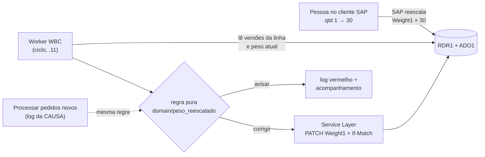

# Plano — Peso reescalado pelo SAP (a integração desfaz a multiplicação)

> **Status (05/10/2026): F1–F3 NO AR na .11 (deploy dele 10:55 e 11:44, `3c85225`); F4 ligada
> no código para começar em 06/10/2026 00:00** (`GRAVA_A_PARTIR_DE = datetime(2026, 10, 6)`,
> sim dele em 05/10, sem esperar a semana de simulação). **Falta:** deploy desse commit na .11
> (dele); avisar a pessoa de Projetos; conferir a 1ª correção real no log do worker. **O passado
> não se altera** (decisão dele, 05/10): nenhum pedido antigo é corrigido; a F4 só desfaz trocas
> de quantidade feitas a partir de 06/10.

Página: https://claude.ai/artifact/VQfngyuYjNALBpkXD5pF3o (mesma url a cada atualização).

## Objetivo

Quando uma pessoa muda a **quantidade** de uma linha de pedido no SAP, o próprio SAP refaz o
`Weight1` na mesma proporção. Com 1 → 30, o peso de 148,94 kg vira 4.468,20 kg. Isso acontece
no cliente SAP de quem edita, sem a integração no meio, e não conhecemos parâmetro do SAP que
desligue isso.

O peso que a integração grava é o **total da linha**: o nível 1 da árvore do WBC + 10%
(`domain.linhas.peso_da_linha`). Ele não muda quando a pessoa reescreve "1 lote" como
"30 unidades". O plano faz a integração **desfazer a multiplicação**: o worker acha a linha
reescalada e regrava o peso de antes, só o `Weight1`, só nas linhas que a integração criou.

## O que o WBC diz do 00125299 (pedido 84457)

Conferido em 05/10/2026, só leitura. A árvore tem **um nó por item**, com quantidade **30**
(item 1, protetor de coluna) e **50** (item 5, longarina). Os unitários da árvore são
exatamente os que a pessoa de Vendas digitou no SAP. O texto dos itens também diz
"30 Protetores" e "50 longarinas". Sem `ORCPRDQTD` e fora do porta-paletes, a integração cria a
linha com quantidade 1. O total ficou igual, e o peso da árvore (135,40 e 361,92 kg) já era o
da linha inteira. **A multiplicação estava errada.**

## Medição (F0) — o que acontece desde 01/09

Pedidos criados pela integração desde 01/09/2026 (versão 1 gravada pelo usuário da
integração). Fonte: `ADOC`/`ADO1` (ObjType 17), `RDR1` e a árvore do WBC, lidos em 05/10/2026.

- **99 pedidos, 226 linhas.** Uma pessoa mudou a quantidade em **27 linhas de 15 pedidos**,
  quase sempre a mesma pessoa de Vendas. A integração nunca mudou quantidade.
- Em **26 das 27** o SAP reescalou o peso. A exceção é o 84441: o peso ficou em 408.
- O sentido varia: 16 trocas de 1 para N e 11 de N para 1.
- **Total da linha:** igual em 14; mudou em 13. Destas, 12 mudaram menos de 5% (máximo −4,73%).
  Só no 84438 a mudança foi grande (−55%), e a linha está fechada.
- **Quem conserta:** uma pessoa de Projetos, à mão, em 17 das 26 linhas, sempre com número
  inteiro (148 em vez de 148,94). Entre a troca e o conserto passaram de 0,1 h a 88 h, com
  mediana de 1,9 h. A integração consertou 1 (84453, comando `wbcpython pesos`).
- **Ainda errado em 05/10:** 84420 L0, 84425 L1, 84429 L3 e 84454 L0. Ficam como estão (o
  passado não se altera).
- **Consertado sem histórico:** em 4 linhas (84368 L3, 84406, 84446 e 84447) o peso virou um
  inteiro **sem versão no `ADOC`**, minutos depois do último salvamento, no dia em que as OPs
  foram criadas. Ver os fatos abaixo.
- **Itens de 1 nó na árvore:** em 6 dos 7 casos, a quantidade digitada é a do nó.
- **Porta-paletes:** desde 15/09, 33 linhas nasceram com quantidade maior que 1 (regra dos
  "N Módulos"). Em 11 delas (33%) uma pessoa voltou a quantidade para 1.

## Fatos que travam o desenho

- **O SAP reescala no cliente de quem edita.** A integração não tem como impedir a conta. Só
  pode desfazê-la depois, lendo o histórico (`ADO1`).
- **Uma pessoa pode estar com o pedido aberto.** Se a integração grava enquanto alguém edita, o
  SAP recusa o salvamento dela ("outro usuário modificou", `-2039`). Por isso a correção só age
  quando o último salvamento tem pelo menos **3 minutos**. Antes do PATCH, o worker relê o
  pedido no Service Layer (linhas + ETag num GET só) e grava só as linhas que ainda estão como a
  decisão viu — **essa releitura é a proteção de verdade**. **Medido na .11 em 05/10:** o SL
  devolve a **mesma ETag para todo pedido** (`W/"356A…428AB"` = SHA-1 de "1", igual no 84454 e
  no 84457), então o `If-Match` nunca falha e não protege nada; ele continua sendo enviado, para
  o dia em que uma versão do SL calcular uma ETag de verdade. Fica descoberto só o intervalo de
  milissegundos entre a releitura e o PATCH. As linhas do SL bateram com as do HANA nos dois
  pedidos (premissa da F4 confirmada).
- **Escrita sob a trava de execução**: um ciclo do painel não recria as linhas do mesmo pedido
  enquanto o peso é gravado. **Nunca grava a mesma reescala duas vezes**: se o SAP não guardar,
  o ciclo seguinte só avisa. Um peso que já voltou (1 → 30 → 1) não é "corrigido".
- **Gravar só o `Weight1` de uma linha** já existe e já rodou em produção:
  `atualizar_pesos` faz um PATCH sem `B1S-ReplaceCollectionsOnPatch`, que mescla a linha. O
  usuário da integração tem `U_INO_AlteraPeso = 'S'`.
- **Um peso digitado por uma pessoa nunca é sobrescrito.** A correção só age quando o peso
  atual do `RDR1` ainda é o valor que o SAP calculou.
- **Existe outro escritor de peso sem histórico** (provável). O padrão das 4 linhas acima bate
  com o processamento antigo no cliente SAP (o addon C#), que criava as OPs. O Controle de
  Produção da .11, no ar desde 28/09, **não grava peso** (`_update_pedido` está fechado, F7).
  Isso explicaria por que o problema "apareceu" agora. A regra "o peso atual ainda é o
  calculado pelo SAP" também protege contra esse escritor.
- **O passado não se altera** (decisão dele, 05/10/2026). A escrita liga por uma data
  (`GRAVA_A_PARTIR_DE`); reescala que começou antes dela fica como está, e o comando manual só
  lê.
- **Função de produção não tem chave no `.env`.** Simulação e escrita se separam por uma
  constante no código, e ligar a escrita é um commit.

## Arquitetura

## A regra (o que corrige, o que só avisa)

Corrige uma linha quando **tudo** abaixo vale:

1. O pedido foi criado pela integração (`U_INO_COTWBC` preenchido, versão 1 do usuário da
   integração), está aberto e não cancelado, e a linha está aberta (`LineStatus = 'O'`). Pedido
   cuja versão 1 o SAP já apagou (guarda 99) também é lido, mas a linha que começa na versão mais
   antiga que sobrou só avisa — o autor do peso dela se perdeu.
2. Na última mudança de peso da linha, uma **pessoa** mudou a **quantidade**, e o peso novo é o
   anterior × qtd nova ÷ qtd anterior (tolerância de 0,5% ou 0,01 kg). Trocas seguidas
   (1 → 30 → 25) contam como uma: vale o peso de antes da primeira.
3. O peso de antes da troca foi gravado pela integração: na criação, ou depois, pelo
   `wbcpython pesos`.
4. O peso atual no `RDR1` ainda é o que o SAP calculou. Ninguém digitou outro depois.
5. O total da linha (`LineTotal`) mudou no máximo **5%**.
6. O último salvamento do pedido tem pelo menos **3 minutos**.
7. A troca de quantidade é posterior a `GRAVA_A_PARTIR_DE` (o passado não se altera).

Quando corrige, grava o **peso de antes da troca**, só no `Weight1` dessa linha, com
`If-Match`. Só avisa (uma linha vermelha no log, uma vez por versão, e nada é gravado) quando
falha a 3 ou a 5, quando o histórico da linha foi cortado, ou quando a mesma reescala já foi
restaurada uma vez e o SAP não guardou. Peso que já voltou sozinho (1 → 30 → 1) fica.

Aplicada às trocas medidas, a regra teria corrigido 25 das 26 reescalas e só avisado no 84438.
Rodada contra a produção em 05/10 (só leitura, 40 dias, 103 linhas em 47 pedidos), voltaria
84425 L1, 84429 L3 e 84454 L0, avisaria no 84420 (o total mudou −44,6% depois) e deixaria o
84457 (já digitado à mão) e o 84446/84447 (peso mexido sem histórico) como estão.

**Revisão independente (05/10/2026, subagente revisor):** 1ª rodada AJUSTAR (1 crítico — a
regra mandava "corrigir" um peso que já tinha voltado, o que viraria PATCH a cada ciclo —, 3
importantes e 6 menores), todos corrigidos com teste. 2ª rodada APROVADO, com 5 menores e 6
otimizações, todos aplicados: trava de execução e sessão do SL só quando há linha a gravar;
2 consultas ao HANA por ciclo em vez de 3; usuário da integração resolvido uma vez na consulta;
uma fábrica (`de_settings`) para worker e CLI; texto de log montado só quando sai; a mesma
tolerância na regra e na conferência antes do PATCH; o comando com o cliente do SL travado
contra escrita; histórico cortado decidido por linha; o log do Processar não promete correção
de troca com mais de 3 dias.

## Fases

### F0 — Medição, só leitura — concluída (05/10/2026)

O tamanho do problema e quem conserta hoje (seção "Medição").

### F1 — A regra como função pura — codada (05/10/2026)

- `wbcpython/domain/peso_reescalado.py`: `decidir(versoes, atual, agora, a_partir_de=...,
  historico_cortado=...)` →
  `CORRIGIR(peso)`, `AVISAR(motivo)` ou `NADA(motivo)`. Testes com os casos medidos em
  `tests/wbc/domain/test_peso_reescalado.py`.
- O log do "Processar pedidos novos" usa a mesma regra: depois da CAUSA, uma linha diz o que a
  integração faz com aquele peso (`_veredito_do_worker`, sem a espera de 3 min: é previsão, e o
  próprio Processar acabou de salvar o pedido). As consultas ganharam `LineTotal`, `LineStatus`
  e a primeira versão do pedido, e o autor da versão passou a ser `COALESCE(UserSign2, UserSign)`.

### F2 — Comando `python -m wbcpython pesos-reescalados` — codado, só leitura

- `--dias N` (padrão 30) e `--pedido N` (de qualquer data, dizendo por que cada linha fica).
- **Não grava nada**: o passado não se altera. É para analisar.
- Com `--pedido`, também lê o pedido no Service Layer (um GET, com o cliente travado contra
  escrita) e diz se a ETag veio (ou se é a fixa) e se cada linha do SL bate com a do HANA.
  **Rodado na .11 em 05/10** no 84454 e no 84457: as linhas batem; a ETag é a fixa.
- `atualizar_pesos` ganhou `If-Match`, e `estado_das_linhas()` lê a ETag e as linhas num GET só.
  Usados pelo worker na F4.

### F3 — No ciclo do worker, em simulação — codada

- Passo depois de cada ciclo agendado (`WorkerIntegracao._pesos_reescalados`), dentro do
  expediente. Lê os pedidos da integração com versão de pessoa nos últimos 3 dias
  (`DIAS_OLHADOS`). Na F4, a trava de execução e a sessão do Service Layer só abrem quando há
  linha a gravar (`_escrita_dos_pesos`).
- `wbcpython/application/pesos_reescalados.py`: `GRAVA_A_PARTIR_DE = None` → só registra
  "SIMULAÇÃO: voltaria a X kg" no log do worker e no acompanhamento, uma vez por versão da
  linha. Falha no passo vira aviso; o worker segue.
- No ar na .11 desde 05/10 10:55 (`44fbdb3`; `3c85225` às 11:44).

### F4 — Liga a escrita automática — ligada para 06/10/2026 00:00

- `GRAVA_A_PARTIR_DE = datetime(2026, 10, 6)` (sim dele em 05/10). Daí em diante, o worker
  desfaz só as trocas de quantidade feitas a partir desse momento. Rollback: voltar a `None`.
- O log do Processar diz "a integração volta este peso para X kg sozinha"; para troca anterior
  a 06/10, "a troca é anterior a 06/10/2026 00:00 (o passado não se altera); corrija à mão"
  (`f6d3493`).
- **Falta:** deploy na .11 (dele); avisar a pessoa de Projetos de que o conserto à mão deixa de
  ser preciso; conferir a 1ª correção real ("peso restaurado") no log do worker.

## Decisões

1. ✅ **Onde corrige:** no ciclo do worker.
2. ✅ **Para que valor volta:** o peso de antes da troca, quando foi a integração que gravou.
3. ✅ **Tolerância do total da linha:** 5%.
4. ✅ **Espera depois da troca:** **3 minutos** (ele, 05/10; a recomendação era 10) + `If-Match`.
5. ✅ **Simulação antes:** a recomendação era uma semana; ele ligou em 05/10 para começar em
   06/10 00:00, com a constante no código.
6. ✅ **Avisar a pessoa de Projetos quando ligar:** sim.
7. ✅ **Os 4 de 05/10:** **não** se corrigem. O passado não se altera (ele, 05/10); o comando
   manual ficou só leitura.

## Fora deste plano (achados da medição)

- **Nascer com a quantidade da árvore** quando o item tem um só nó no nível 1: teria evitado 6
  das 27 trocas. Mexe na quantidade da OP (a `PlannedQuantity` do cabeçalho vem da linha do
  pedido, `BUSCA_MAX_ITEM_LINHA`), no unitário e na NF. Precisa de Vendas e do fiscal.
- **Porta-paletes "N Módulos" (15/09):** 11 das 33 linhas que nasceram com N voltaram para 1. O
  porquê continua aberto; provavelmente é o pedido de compra do cliente.
- **O escritor sem histórico:** confirmar com quem mantém o addon C# se ele grava `Weight1`
  direto na tabela.

---
Página publicada: https://claude.ai/artifact/VQfngyuYjNALBpkXD5pF3o · ServidorIntegracaoSAP (.11) · 05/10/2026
