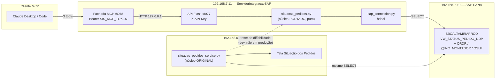

# PLANO — Situação dos Pedidos na API 8077 + fachada MCP (.11)

**Status (2026-08-24):** **F0 a F3 fechadas e NO AR na `.11`.** As 3 consultas já
respondem por HTTP em `192.168.7.11:8077` — conferidas contra o servidor de produção.
Falta a **F4** (as 3 tools MCP), que vai exigir um segundo deploy: a fachada é outro
processo (`OrcaView-MCP`).

Levar a **Situação dos Pedidos** (a mesma view que desenha a tela do `.90`) para o
servidor de integração `192.168.7.11`, como **2 rotas** na API 8077 e **3 tools** na
fachada MCP que já roda lá. Objetivo: perguntar *"o pedido 84260 está preso onde?"* em
linguagem natural, sem abrir o navegador nem entrar no SAP.

| Número | O quê |
|---|---|
| 3 | consultas pedidas (por pedido · só bloqueados · panorama) |
| 2 | rotas REST novas na API 8077 |
| 3 | tools MCP novas (fachada 8078 já no ar) |
| 1 | view HANA (`VW_STATUS_PEDIDO_DDP`) + 3 LEFT JOIN |
| 431 | linhas do núcleo puro a portar (`situacao_pedidos_service.py`) |
| 236 | pedidos no recorte hoje (eram 189 em 24/07/2026) |
| 10 | dias — o limite da liberação financeira |

---

## 1. Onde está agora

| Peça | Estado |
|---|---|
| View `VW_STATUS_PEDIDO_DDP` + joins (ORDR, @INO_MONTADOR, OSLP) | ✅ em produção, servindo a tela do `.90` |
| Núcleo puro (`normalizar`, `filtrar`, KPIs, regra dos 10 dias) | ✅ em produção no V117, com testes |
| API 8077 (`.11`) | ✅ no ar — e agora com **as 2 únicas rotas dela que leem o HANA ao vivo** |
| Fachada MCP (8078, serviço NSSM, Bearer) | ✅ no ar, 12 tools read-only |
| Núcleo portado na `.11` (`situacao_pedidos.py`) | ✅ F1 — 42 testes, ruff limpo |
| Leitura HANA na `.11` (`situacao_pedidos_hana.py`) | ✅ F2 — 237 linhas lidas de PROD |
| As 2 rotas na API 8077 | ✅ F3 — **no ar na `.11`**, conferidas em produção |
| As 3 tools MCP | ❌ F4, próxima |
| Deploy da fachada MCP (2º processo) | ❌ junto com a F4 |
| Consulta de situação de pedido pelo MCP | ❌ não existe |

---

## 2. Arquitetura



A `.11` **não** chama o `.90`. As duas leem o mesmo HANA e rodam o mesmo núcleo — a
cópia é mantida honesta por um teste, não por disciplina.

---

## 3. Fatos que travam o desenho

Cada um destes já custou caro em algum lugar do projeto. Nenhum é negociável.

1. **A API 8077 nunca leu o HANA ao vivo.** Todas as rotas de leitura hoje batem no
   Supabase; o `sap_connection` só é usado pelos pipelines e pelo *ping* do
   `/status`. Esta é a **primeira leitura HANA síncrona servida por request** — exige
   timeout curto, cache e um erro legível quando o HANA cai (não 500 cru).
2. **A view só tem o recorte corrente** (236 linhas hoje, 189 em 24/07). Pedido antigo
   não está lá. A resposta é **404 "fora do recorte da view"** — nunca "sem bloqueio",
   que seria uma mentira silenciosa.
3. **`DocEntry ≠ DocNum`.** A tela e o usuário falam **DocNum** (84260). O default das
   rotas é DocNum; `?chave=docentry` troca. Mesma armadilha já documentada nas rotas de
   Ordem de Produção deste repo.
4. **A view não tem montador, valor nem vendedor.** Vêm de `ORDR` (UDFs
   `U_INO_MONTADOR`, `U_INO_VL_MT`, `U_INO_TPO_MONTAGEM`), da UDT `@INO_MONTADOR` (o
   nome) e da `OSLP` (`SlpName`). Sempre **LEFT** JOIN: pedido sem montador não pode
   sumir da lista.
5. **`OSLP.U_INO_Vendedor` não existe em produção** — já quebrou um sync. O nome do
   vendedor é `OSLP.SlpName`.
6. **O gênero do status varia por coluna:** "Liberado" no Financeiro, "Liberad**a**" na
   Produção e na Entrega. O contrato canoniza tudo para `Liberado`/`Bloqueado`.
7. **`Atrasado` da view é histórico** — fica `S` em pedido fechado que foi entregue
   fora do prazo. A regra em produção (decisão do dono, 31/07/2026) é
   `atrasado = view AND não fechado`; o valor cru sobrevive em `atrasado_sap`.
8. **`Prazo_Entrega` é TEXTO e não tem ano** (`"21/09 A 25/09"`). O ano vem de
   `Data_Entrega`, com guarda de virada de ano (±1 ano se der mais de 180 dias de
   distância). Não reinventar: `prazo_fim()` já faz isso e tem teste.
9. **Duas cópias da mesma lógica divergem em silêncio.** É o padrão que este repo já
   usa (`ordens_producao_sl.py` ↔ `compras_sap_service.py`: *"mantenha os dois
   diffáveis"*). Aqui vira teste automático, não comentário.

---

## 4. Fases

### F0 — Contrato congelado ✅ **concluída (2026-08-24)**

**Objetivo:** ninguém escreve código antes dos nomes de campo, rota e tool estarem
fechados — mudar contrato depois de publicado é o que quebra cliente MCP.

- ✅ As 6 decisões do §6 estão fechadas.
- ✅ Contrato do §5 congelado em `mcp/README.md`, seção *"Tools — Situação dos Pedidos"*,
  marcada como **planejada** (as tools ainda não existem; o README não pode dar a
  entender que existem).

### F1 — Núcleo portado (puro, testável sem HANA) ✅ **concluída (2026-08-24)**

**Objetivo:** a `.11` sabe transformar linha crua da view em contrato, com exatamente a
mesma semântica da tela.

- Novo `situacao_pedidos.py` na raiz do repo: recorte **read-only** de
  `web_orcaview_V117/backend/services/situacao_pedidos_service.py` (`normalizar`,
  `filtrar`, `prazo_fim`, KPIs, `montadores_do_recorte`). Fora: nada de Excel, PDF,
  scheduler, alerta.
- Portar junto `sap_montagem_labels.py` (144 linhas) — é quem resolve o rótulo do tipo
  de montagem.
- Trocar as 2 dependências do V117: `exceptions.ValidationError` → exceção local;
  `utils.now_br` → helper local (a `.11` já tem `feriados_br`, mesma timezone).
- **`tests/test_situacao_pedidos_diffavel.py`**: compara as funções portadas com o
  original quando `../../web_orcaview_V117` existe (máquina de dev); `pytest.skip` na
  `.11`, que não tem o outro repo. É o único freio contra a divergência silenciosa.
- Portar os casos de `tests/test_situacao_pedidos_service.py` que cobrem o recorte.

**Entregue:** `situacao_pedidos.py` (502 linhas), `sap_montagem_labels.py`,
`tests/test_situacao_pedidos_diffavel.py` (19 comparações) e
`tests/test_situacao_pedidos.py` (23 testes de comportamento). Ruff limpo; suíte do
repo em **469 testes**.

> **O freio foi exercitado, não só escrito.** Trocar `startswith("liberad")` por
> `startswith("liberado")` no arquivo portado faz `test_..._diffavel[_status]` falhar —
> conferido. E numa cópia do repo **sem** o V117 ao lado, as 19 comparações fazem
> `skip` e os 23 testes de comportamento continuam rodando: é o que vai acontecer na
> `.11`.

> ⚠️ **O arquivo portado foi gerado, não digitado.** Transcrever 300 linhas à mão
> introduz erro silencioso — justamente o que este porte não pode ter. O script que
> extraiu os blocos do original é descartável (ficou no scratchpad); o que vale é o
> arquivo gerado, e o teste que o vigia.

> **Uma divergência a mais do que o previsto:** `sap_montagem_labels.get_labels()`
> consulta o SAP direto no V117. Aqui a busca virou um **gancho**
> (`registrar_fonte`) que a F2 liga; até lá vale o `FALLBACK_LABELS` medido em
> produção. `rotulo()` e o mapa de fallback continuam comparados pelo teste — só o
> I/O ficou de fora.

> ⚠️ **Não "melhorar" nada durante o porte.** Toda esquisitice do núcleo (o gênero do
> status, o `atrasado` histórico, o ano do prazo) é uma decisão de negócio com teste
> atrás. Refatorar aqui é reabrir um bug fechado.

**Campo novo desta fase — os 10 dias.** O núcleo já produz `dias_desde_pedido` (int) e
`fin_liberacao_atrasada` (bool). A `.11` acrescenta **um campo legível**, sem tocar no
contrato do V117:

| Campo | Tipo | Valor |
|---|---|---|
| `dias_desde_pedido` | int | 23 |
| `fin_liberacao_atrasada` | bool | `true` |
| **`alerta_liberacao`** | str \| null | `"Mais de 10 dias preso no financeiro (23 dias)"` |

`null` quando não há alerta — para o LLM, ausência de texto é sinal mais claro que
`false`.

### F2 — Leitura HANA + cache ✅ **concluída (2026-08-24)**

**Objetivo:** uma chamada à API 8077 devolve o recorte da view sem derrubar o HANA.

- `fetch_status_pedidos()` no módulo novo, usando `SAPExtractor`/`connect_sap_hana` já
  existentes: o mesmo `SELECT` de 23 colunas + 3 LEFT JOIN + `ORDER BY "Producao",
  "Data_Pedido"` do `sap_hana_client.py:1964`.
- **Guarda de volume** (`COUNT(*)` antes): acima de 20.000 linhas a view mudou de
  natureza → erro explícito, não 236 mil linhas na resposta.
- **Cache de 120 s, entrada única** (a consulta não tem parâmetro). É o que garante que
  as 3 tools respondam sobre o **mesmo** retrato — e o que evita que um LLM em loop
  martele o HANA.
- HANA fora do ar → `503 {"ok": false, "erro": "..."}` (o padrão de erro que o `_get`
  da fachada já repassa legível ao modelo).

**Entregue:** `situacao_pedidos_hana.py` + `tests/test_situacao_pedidos_hana.py`
(21 testes) + 1 comparação de SQL no teste de diffabilidade. Suíte do repo em **491**.

> **Dois guardas que a conexão de mentira NÃO pegaria** — e são os que evitam o erro
> caro: um confere que o SELECT entrega todas as colunas que o núcleo lê (um alias com
> erro de digitação vira campo vazio em produção, sem erro nenhum aparecer); o outro
> compara a lista de colunas com a do V117. Exercitei o primeiro trocando
> `MontadorCnpj` por `MontadorCNPJ`: falha como devia.

> **O SQL não estreou na F5.** Rodei um SELECT read-only contra o HANA de produção — a
> mesma view que o `.90` consulta a cada 2 min: **236 linhas**, 34 colunas, **nenhuma
> 100% nula** (é isso que denuncia alias errado), 6 valores válidos lidos da UDF,
> KPIs 42/3/9/9, 8 montadores, 1 pedido com o alerta dos 10 dias. A conferência **no
> mesmo minuto** contra a tela continua sendo a F5 — este número foi medido no dia, não
> lado a lado com a tela.

> ⚠️ **Uma conexão por leitura, aberta e fechada na hora.** Conexão `hdbcli` não é
> thread-safe e o waitress atende em várias threads; compartilhar uma pediria lock e
> reconexão. Com o cache, isso dá no pior caso **uma** conexão a cada 2 minutos.

### F3 — API 8077: 2 rotas ✅ **concluída (2026-08-24)**

**Objetivo:** as 3 consultas existem em HTTP, com `X-API-Key`, e dá para testar com
`curl` antes de qualquer tool.

Detalhe do contrato no §5.

- `GET /pedidos/<numero>/situacao` — consulta 1
- `GET /pedidos/situacao` — consultas 2 e 3 (é o mesmo recorte; o que muda é o filtro)
- Testes em `tests/test_api_situacao_pedidos.py` (24), com o HANA dublado no
  `fetch_status_pedidos` — dali para dentro roda o código de verdade.

**Entregue** com três decisões que ficam visíveis na resposta:

- **KPIs e montadores são sempre do recorte INTEIRO**, nunca do filtrado — igual à tela,
  onde o card diz quantos existem e o filtro diz quais aparecem. Quantos voltaram está em
  `total_filtrado`.
- **Filtro que não casa com nada é 200 com lista vazia**, nunca 404. "Não há nada
  bloqueado" é resposta legítima; 404 fica reservado a pedido fora do recorte — e a
  mensagem dele diz, com essas palavras, que **não** significa "sem bloqueio".
- **503 e 422 não se misturam:** HANA fora é 503 (tentar de novo adianta), parâmetro fora
  do domínio é 422 (não adianta). A mensagem vai inteira no corpo — é ela que o modelo lê.

> **Smoke ponta a ponta contra o HANA de produção, sem subir processo nenhum.** Pelo test
> client do Flask a rota roda inteira (auth, params, filtros, serialização), só não há
> socket — nada de porta ocupada nem serviço reiniciado. Resultado: **237** no recorte ·
> **10** bloqueados (4 financeiro · 10 produção · 10 entrega · 227 nenhum — 10+227 fecha
> em 237) · 8 montadores · **1** com alerta: `84260 — "Mais de 10 dias preso no financeiro
> (12 dias)"`, o pedido de 12/08 do print. DocEntry 16586 → DocNum 83832. Os quatro erros
> (400/404/422/503) com a mensagem certa.

> ⚠️ **Uma request = uma leitura.** KPIs, lista e montadores saem do mesmo retrato. É fácil
> escrever isso errado (dois `fetch` seguidos passariam despercebidos, porque o cache
> esconderia a segunda ida) — por isso há teste contando as idas, não só conferindo o
> corpo.

> ⚠️ **`ligar_rotulos_do_sap()` vai no `main()`, não no import** — mesmo motivo do
> `windows_update.iniciar_coletor` logo acima: no import, a suíte de testes acabaria
> falando com o HANA de verdade.

### F4 — Fachada MCP: 3 tools

**Objetivo:** perguntar em linguagem natural, com resposta enxuta o bastante para não
comer o contexto.

- `situacao_pedido(pedido, chave="docnum")`
- `pedidos_bloqueados(bloqueio="qualquer", status="aberto")`
- `panorama_pedidos(campos="resumo")`

Todas read-only (`ToolAnnotations(readOnlyHint=True)`), todas passando pelo `_get` que
já injeta a `X-API-Key` server-side. **Nenhuma toca banco** — a fachada continua fina,
como o `mcp/README.md` promete.

### F5 — Deploy e smoke na .11 · **parcialmente feita (2026-08-24)**

> **O deploy das rotas aconteceu antes da hora** — o Marcelo atualizou a `.11` logo
> depois da F3, e o serviço reiniciou junto (a rota nova responde, logo não é o processo
> antigo em memória). Conferido em `192.168.7.11:8077`, read-only: 237 no recorte · 10
> bloqueados · 8 montadores · KPIs 42/4/10/10 · o alerta em **84260 (12 dias)** · 400,
> 404 e 422 com a mensagem certa · **401 sem a chave**. As quatro primeiras linhas de
> `bloqueio=qualquer` são as mesmas da tela: 83832, 84260, 84281, 84293.
>
> **Falta desta fase:** o deploy da fachada MCP (outro processo, `OrcaView-MCP`) depois
> da F4, e a conferência **no mesmo minuto** contra a tela do `.90`.

**Objetivo:** funcionando em produção, com prova.

- `deploy_update.bat` (pull + restart dos serviços NSSM).
- Smoke: `curl` nas 2 rotas com um pedido do print (**84260** — bloqueado nas três
  etapas, sinal SIM, pagamento `30% SINAL / 20% ENTREGA / 30% 45DDL / 10% 65DDL /
  10% 85DDL`) e, no cliente MCP, as 3 perguntas em linguagem natural.
- Conferir contra a tela do `.90` **no mesmo minuto**: os dois números de bloqueados
  têm de bater. Divergência aqui = o porte errou.
- `CHANGELOG.md` + `mcp/README.md` atualizados.

---

## 5. Contrato

### `GET /pedidos/<numero>/situacao` — consulta 1

| Param | Valores | Default |
|---|---|---|
| `numero` (path) | número do pedido | — |
| `chave` | `docnum` \| `docentry` | `docnum` |
| `campos` | `resumo` \| `completo` | `completo` |

- **200** → `{"ok": true, "pedido": {...}, "gerado_em": "..."}`
- **404** → `{"ok": false, "erro": "pedido 84260 fora do recorte da view (só pedidos correntes)"}`
- **409** → DocNum casando com mais de um pedido (mesma regra das rotas de OP: recusar,
  nunca resolver por `[0]`)
- **503** → HANA indisponível

### `GET /pedidos/situacao` — consultas 2 e 3

| Param | Valores | Default | Serve a |
|---|---|---|---|
| `bloqueio` | `qualquer` \| `financeiro` \| `producao` \| `entrega` \| `nenhum` | ausente = todos | consulta 2 |
| `status` | `todos` \| `aberto` \| `fechado` | `todos` | ambas |
| `montador` | CNPJ \| `__sem__` | ausente = todos | consulta 3 |
| `busca` | texto (cliente, pedido, cotação WBC) | — | ambas |
| `campos` | `resumo` \| `completo` | `resumo` | ambas |
| `so_atrasados_fin` | `1` | — | o corte dos 10 dias |

Resposta:

```json
{
  "ok": true,
  "gerado_em": "2026-08-24T14:32:10-03:00",
  "kpis": {"total": 236, "atrasados": 91, "financeiro_bloqueado": 8,
           "producao_bloqueada": 17, "entrega_bloqueada": 17},
  "total_no_recorte": 236,
  "total_filtrado": 12,
  "pedidos": [ ... ],
  "montadores": [{"cnpj": "...", "nome": "...", "qtd": 7}]
}
```

`montadores` sempre presente — é o que faz a consulta 3 ser "todos os dados **incluindo
montadores**" numa chamada só.

### Campos — `resumo` (as 10 colunas do print + o alerta)

`data_pedido` · `card_name` · `doc_num` · `sinal` · `financeiro` · `producao` ·
`entrega` · `prazo_entrega` · `atrasado` · `pymnt_group` · **`alerta_liberacao`**

### Campos — `completo`

O resumo mais: `doc_entry`, `card_code`, `cotacao_wbc`, `versao_wbc`, `valor_total`,
`moeda`, `vendedor`, `integrar`, `ddo`, `peso`, `status_pedido`, `data_entrega`,
`prazo_fim`, `dias_atraso`, `atrasado_sap`, `dias_desde_pedido`,
`fin_liberacao_atrasada`, `data_lib_fin`, `data_lib_prod`, `data_pagto`, `total_os`,
`total_os_fechadas`, `montagem{tipo, valor, montador, montador_cnpj}`.

### Rótulos na resposta

O JSON entrega o canônico (`"Liberado"` / `"Bloqueado"`). O rótulo por coluna
("Liberad**a**" em Produção/Entrega) é da tela — a API não decora.

---

## 6. Decisões

Todas fechadas em **2026-08-24**. Reabrir qualquer uma antes de F4 é barato; depois de
F5, quebra cliente MCP.

### D1 — Onde mora a lógica de normalização · ✅ **C: portar o módulo puro**

| Opção | Prós | Contras |
|---|---|---|
| **A** — a `.11` reimplementa | independente | **duas verdades**; diverge em silêncio |
| **B** — a `.11` chama o `.90` | zero duplicação | rota é gated por sessão (cookie); rota de serviço em router gated já deu **401 calado** neste projeto; acopla a `.11` ao `.90` |
| **C** — portar o módulo puro + teste de diffabilidade | uma verdade, freio automático, sem acoplamento | exige o teste, que só roda na máquina de dev |

**Consequência:** F1 tem entregável obrigatório —
`tests/test_situacao_pedidos_diffavel.py`. Sem ele, a decisão vira a opção A por
omissão em três meses.

### D2 — O texto e a regra dos 10 dias · ✅ **regra mantida, rótulo "financeiro"**

A regra continua sendo **`Financeiro = Bloqueado` há mais de 10 dias da data do
pedido**, e pedido fechado nunca alarma — a mesma do alerta financeiro do V117. Uma
regra, uma implementação.

**Consequência:** `alerta_liberacao = "Mais de 10 dias preso no financeiro (N dias)"`.
Tela, e-mail de alerta e MCP passam a chamar a mesma coisa pelo mesmo nome.

### D3 — Default de `status` em `pedidos_bloqueados` · ✅ **`aberto`**

Quem pergunta "o que está travado?" quer o que trava **hoje**; pedido fechado que esteve
bloqueado é história. A tela usa `todos` porque espelha o Power BI — o uso aqui é outro.

**Consequência:** `pedidos_bloqueados()` sem argumento devolve só pedidos em aberto.
`status="todos"` e `status="fechado"` continuam disponíveis, e a divergência com a tela é
**deliberada** — não é bug, e há de estar escrito na docstring da tool.

### D4 — Tamanho do payload · ✅ **`resumo` na lista, `completo` no pedido único**

**Consequência:** a lista devolve as 10 colunas do print + `alerta_liberacao`;
`campos=completo` traz os ~40. O pedido único já nasce completo (é 1 registro).

### D5 — Chave de API na rota nova · ✅ **`@requer_chave`**

Como todas as rotas de leitura. A fachada MCP injeta a `X-API-Key` server-side — ela
nunca chega ao LLM.

**Consequência:** as rotas caem **abertas** se a `OS_API_KEY` não estiver configurada
(o padrão das rotas de leitura deste repo). O *fail-closed* é exclusividade da escrita
de Ordem de Produção e não se aplica aqui.

### D6 — Quem consome · ✅ **só Claude Desktop/Code, via 8078**

Decisão do Marcelo em 24/08/2026: **a Mira não assume isso por enquanto.**

**Consequência:** nada a fazer no roteador da Mira — **não** criar branch determinística
de pedidos lá. Se um dia entrar, é fase nova: sem branch própria a pergunta cai no RAG e
volta errada.

---

## 7. O que este plano **não** faz

- Não mexe na tela do `.90` nem no `situacao_pedidos_service.py` original.
- Não escreve nada no SAP. Todas as 3 tools são leitura.
- Não grava no Supabase — a situação é lida ao vivo do HANA, não espelhada.
- Não cria porta, serviço nem regra de firewall: a fachada MCP (8078) e a API (8077) já
  estão no ar.

---

**Fonte da verdade:** este arquivo. Origem da lógica:
`web_orcaview_V117/docs/PLANO_SITUACAO_PEDIDOS.md` e
`web_orcaview_V117/backend/services/situacao_pedidos_service.py`.
