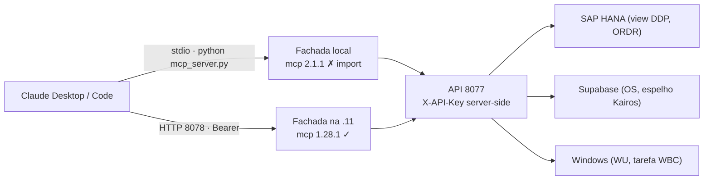

# Plano — Experiência do usuário na Fachada MCP

**Status (2026-09-07, 4ª atualização):** F0 e F3 **no ar na .11** (5a025ac, verificado por
handshake MCP). **F1 e F2 codadas e commitadas** — panorama com teto 40 + filtros (13 KB /
~3,4 k tokens em vez de 73 KB / ~18,7 k, medido contra a .11), `instructions` no servidor,
`dica` de 404 em todo `_get`/`_post`; 403 testes verdes. **Pendem:** pull + restart do
`OrcaView-MCP` na .11 (dele) e o local (reinstalar `mcp<2` ou trocar para HTTP). F4 aberta.

Estado em que o plano nasceu: nada no ar. A fachada **stdio local está morta**
(o `mcp` instalado no Python global é 2.1.1 e o código importa `FastMCP` do 1.x); a
fachada **HTTP da .11 está de pé** (8078 responde 401 sem token, como deve). F0 é
pré-requisito de tudo: sem ela, qualquer melhoria de descrição é invisível.

Artifact publicado com o mesmo conteúdo (atualizar na MESMA url):
https://claude.ai/code/artifact/b16c4ee5-ab72-4e5f-ae0d-0d6899d273c2

## Do que se trata

Quem usa a fachada é uma pessoa perguntando em linguagem natural, no Claude Desktop/Code,
"o pedido 84260 está preso onde?" ou "o servidor está saudável?". O que ela sente é a soma
de quatro coisas: **a fachada conecta?**, **a resposta cabe na conversa?**, **o modelo
entende o que cada tool devolve?** e **o modelo sabe em que máquina está?**. Este plano
mede cada uma e propõe a correção na ordem em que interfere.

## Onde está agora (medido em 2026-09-07, nesta máquina, contra a .11)

| O que | Medida | Efeito para quem pergunta |
|---|---|---|
| Fachada stdio local | `ModuleNotFoundError: mcp.server.fastmcp` (mcp 2.1.1 instalado; `mcp/requirements.txt` pede `mcp>=1.2.0` sem teto) | "Connection closed" no cliente; **zero tools** |
| Registro duplicado no `~/.claude.json` | mesmo nome `servidor-integracao-sap` em dois escopos: **stdio no projeto** (morto) e **HTTP no usuário** (vivo). Escopo de projeto vence. | O registro morto esconde o vivo |
| Suíte de testes da fachada | 26 ERROR locais (`test_mcp_*` importam o server) + `test_scheduler` sem `apscheduler` | Ninguém percebe regressão na fachada |
| `panorama_pedidos` (resumo) | 259 pedidos · 73,0 KB · ~18,7 k tokens · 56 ms | Uma chamada engole o contexto; o modelo resume mal |
| `panorama_pedidos` (completo) | 259 pedidos · 232,7 KB · ~59,6 k tokens | Estoura o que o cliente MCP aceita por resultado |
| `listar_colaboradores` (sem teto) | 251 pessoas · 20,5 KB · ~5,3 k tokens · 310 ms | Aceitável; o teto de 200 corta 51 nomes e avisa |
| `verificar_saude` (todas) | 2,0 KB · 3,9 s | Aceitável; abaixo do `SIS_HTTP_TIMEOUT` de 12 s |
| demais tools | 0,1–4,4 KB · 36–1245 ms | Sem atrito |
| Apresentação do servidor | `FastMCP("ServidorIntegracaoSAP")` sem `instructions` | O modelo não sabe que .11 ≠ .12 (sap-rdp) senão pela docstring de uma tool |
| Descrições | prompt-audit de 2026-09-07: 3 achados médios (registro alto em `estado_windows_update`, `info_oportunidades` e `ultimos_erros` sub-descritas) | Tom ansioso na resposta; tool subutilizada |

## Fatos que travam o desenho

- A fachada **não fala com banco**: só HTTP na API 8077. Teto, ordenação e filtro de
  conversa moram na fachada (é o padrão já adotado em colaboradores), regra de negócio
  mora na API.
- A .11 roda **mcp 1.28.1** (o `serve_http.py` depende do comportamento dele). Migrar para
  2.x é mudança de API do SDK, não um pin.
- O ambiente local é do Marcelo: **eu não instalo nem rebaixo pacote**. Eu deixo o pin no
  `requirements.txt`; instalar é dele.
- Deploy na .11 = `git pull` + restart do serviço `OrcaView-MCP` — dele.
- Três testes cravam **texto** da docstring (`'NÃO' in d`, `'DIVERGE' in d`): mexer no
  registro exige mexer no teste junto.

## Arquitetura (o caminho que a pergunta percorre)

## Fases

### F0 — Voltar a conectar `[no ar na .11 · 5a025ac · pende só o local]`
**Meta:** a pessoa abre o Claude e as 16 tools aparecem, todo dia, sem depender de qual
pip rodou por último.

- `mcp/requirements.txt`: `mcp>=1.2,<2` (com o motivo em comentário). Rollback trivial.
- `mcp/README.md`: seção "mcp 2.x quebra o import" + como conferir (`python -c "import mcp_server"`).
- **Dele:** escolher entre reinstalar `mcp<2` localmente **ou** apagar o registro stdio
  do escopo de projeto e ficar só no HTTP da .11 (ver Decisão 1).
- Critério de pronto: `pytest tests/test_mcp_*` verde local; cliente lista 16 tools.

### F1 — Respostas que cabem na conversa `[codada · pende deploy .11]`
**Meta:** "como está a carteira?" volta em um bloco que o modelo lê inteiro, com os
indicadores certos e os pedidos que importam primeiro.

- `panorama_pedidos`: teto na fachada (padrão de `_colab_aplicar_teto`): `limite`
  default **40**, ordenados por atraso/bloqueio; `kpis` e `montadores` sempre do recorte
  inteiro; `truncado`, `mostrando`, `total` e `aviso` dizendo como ver o resto.
- Filtros de conversa: `montador`, `vendedor`, `so_atrasados` (substring, sem acento,
  como o `setor` de colaboradores).
- `campos="completo"` só com filtro ou `limite` explícito ≤ 60; sem isso devolve o
  resumo e avisa. Hoje ele produz ~59,6 k tokens numa chamada.
- `listar_colaboradores`: manter o teto 200; documentar na docstring que o quadro ativo
  já passa de 200 e que `resumo_colaboradores` é o caminho para "quantos".
- Teste: resposta sintética com 300 pedidos → 40 na lista, `kpis.total == 300`. ✅
- **Medido ao vivo (259 pedidos):** default 13,2 KB (~3,4 k tok); `montador="barros"` 26
  pedidos, 13,6 KB; `so_atrasados` 25 pedidos, 8,4 KB; `completo, limite=10` 10,9 KB.
- **Decidido na execução:** `campos="completo"` não exige filtro — o `limite` (default 40)
  já o segura; a regra "≤ 60" virou desnecessária. `limite=0` sem filtro volta ao default.

### F2 — O servidor se apresenta `[codada · pende deploy .11]`
**Meta:** o modelo sabe, antes de escolher tool, de que máquina se trata, o que é
consulta e o que é escrita, e o que fazer quando a API está desatualizada.

- `FastMCP("ServidorIntegracaoSAP", instructions=...)`: 6–8 linhas — integração SAP→
  Supabase na **192.168.7.11**; o RDP do SAP (192.168.7.12) é o servidor `sap-rdp`, outro;
  tudo é leitura exceto `sincronizar_pedido_os` e `forcar_carga_oportunidades`, que
  exigem preview + confirmação; dado de pedidos tem cache de 2 min, colaboradores é carga
  das 12:40.
- Generalizar `_colab_dica_404` para o `_get`: qualquer 404 HTML de rota inexistente
  vira "a .11 ainda não tem esta rota (git pull + restart)", não só em colaboradores.
- Teste: `list_tools` continua 16; `instructions` presente; 404 HTML em `/historico`
  traz `dica`. ✅ (e 500 HTML **não** ganha dica — é outro problema)

### F3 — Descrições afinadas `[concluída · no ar na .11 · 5a025ac]`
**Meta:** o modelo responde no tom da pergunta, e usa `info_oportunidades` e
`ultimos_erros` quando são a resposta.

- Aplicar os 5 hunks do prompt-audit de 2026-09-07: `estado_windows_update` no volume
  normal (contrato tri-estado intacto), quando-usar em `info_oportunidades`, forma da
  resposta em `ultimos_erros`, e as duas contagens defasadas do `CLAUDE.md` (378→ "pytest",
  455→ "histórico longo").
- Testes de docstring passam a assertar **semântica** (`sem bloqueio`, `fora do recorte`,
  `status="todos"`), não caixa alta.
- **O que mordeu:** `'Não invente' in d` falhou porque a docstring quebra linha entre as
  duas palavras — a description preserva o `
`. Assertar por trecho que não cruza linha.

### F4 — Medir o que a pessoa sente `[aberta]`
**Meta:** saber, pelo log, qual tool está lenta ou gorda antes de alguém reclamar.

- No `_get`/`_post`: uma linha de log por chamada — tool, `ms`, `bytes`, status. Sem
  isso F1 não tem antes/depois.
- No `serve_http.py` o log já existe (`logs/mcp_service.log`); a linha entra nele.

## Tabela — o que interfere, em ordem

| # | Interferência | Onde | Gravidade | Fase |
|---|---|---|---|---|
| 1 | Fachada local não sobe (mcp 2.x) | `mcp/requirements.txt`, ambiente local | **Bloqueante** | F0 |
| 2 | Registro morto esconde o vivo | `~/.claude.json` (2 escopos, mesmo nome) | **Bloqueante** | F0 |
| 3 | Panorama de 18,7 k / 59,6 k tokens | `panorama_pedidos` | Alta | F1 |
| 4 | Servidor sem apresentação (.11 × .12) | `FastMCP(...)` | Média | F2 |
| 5 | 404 de rota só é traduzido em colaboradores | `_get` | Média | F2 |
| 6 | Registro alto em `estado_windows_update` | docstring | Média | F3 |
| 7 | `info_oportunidades` / `ultimos_erros` sub-descritas | docstrings | Média | F3 |
| 8 | Testes cravam caixa alta | `test_mcp_situacao_pedidos.py` | Baixa | F3 |
| 9 | Sem métrica por tool | fachada | Baixa | F4 |

## Decisões

1. **stdio local × HTTP da .11 — aberta.** Recomendado: **HTTP**. Já está no ar, a chave
   da API nunca sai da .11, e fica um só registro. Remover o bloco stdio do escopo de
   projeto no `~/.claude.json` é dele; eu não edito esse arquivo.
2. **Pin `mcp<2` × migrar para `MCPServer` (2.x) — aberta.** Recomendado: **pin agora**.
   A .11 já roda 1.28.1 e o `serve_http.py` foi escrito contra ele. A migração vira plano
   próprio quando a .11 for atualizada, com teste.
3. **Teto default do panorama — ✅ 40 pedidos**, atrasados e bloqueados primeiro. Medido:
   ~3,4 k tokens no default. `completo` fica sob o mesmo teto, sem exigir filtro.
4. **Aplicar o diff do prompt-audit — aberta.** Recomendado: **sim**, dentro da F3, com
   os testes ajustados no mesmo commit.
5. **Quem instala `mcp<2` na máquina local — dele.** Regra do projeto: eu não mexo no
   ambiente.

## Como este plano foi medido

`httpx.get` direto na API 8077 (chave lida do `mcp/.env`), 2026-09-07 ~17h, desta máquina.
Tokens ≈ bytes/4. Latências são de uma chamada, sem aquecimento controlado, exceto
`pedidos_bloqueados` (frio 36 ms, quente 38 ms — o cache de 2 min já estava quente).
